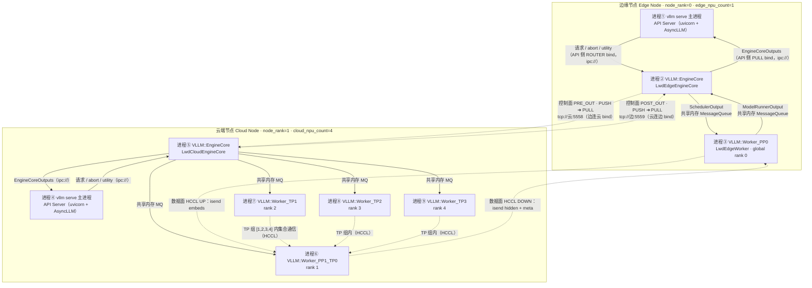
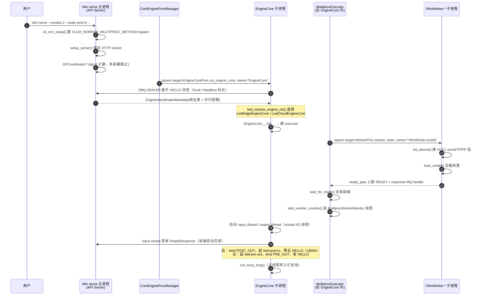
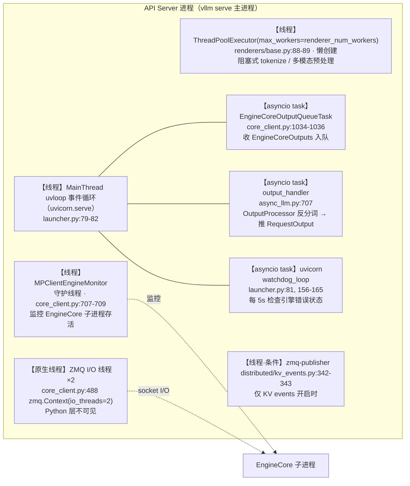
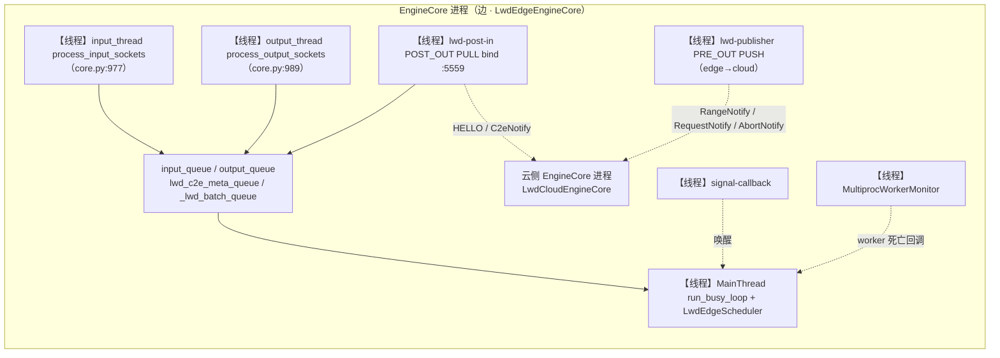
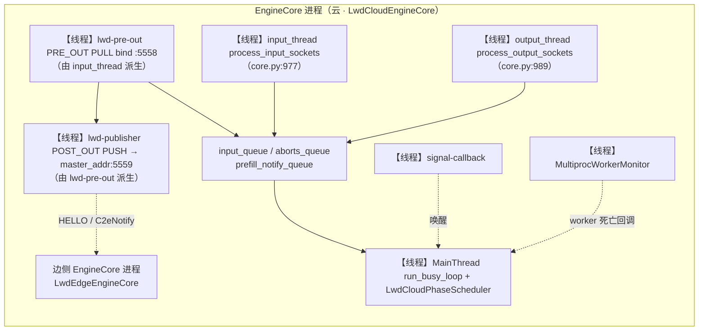
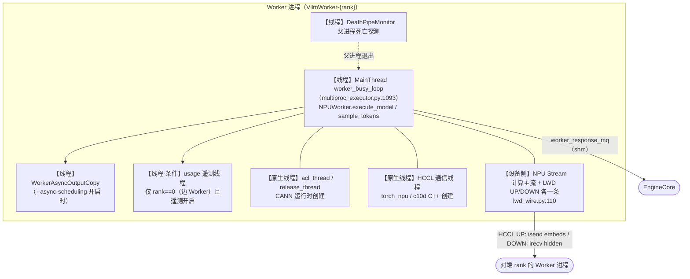
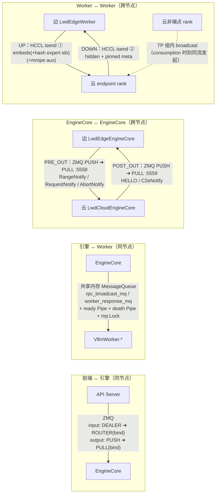
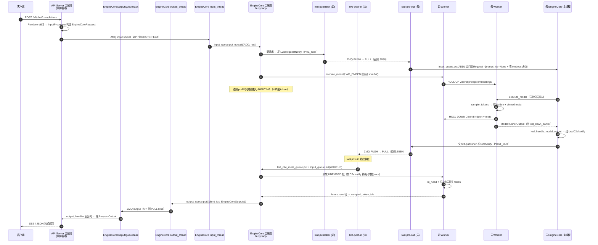
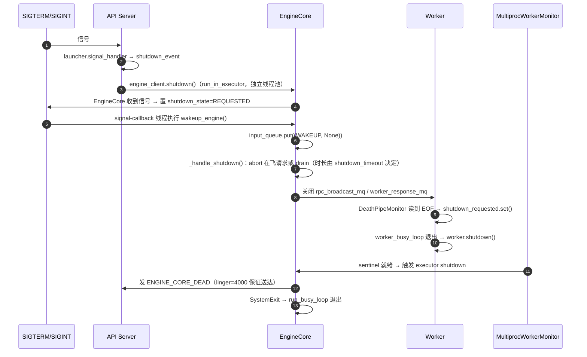

# vLLM 启动后的进程与线程全景（prefill_only_v0.1）

> 代码基线
>
> - `vllm-po` → 分支 `prefill_only_v0.1`，commit `68aee0158`
> - `vllm-ascend-po` → 分支 `prefill_only_v0.1`，commit `1667d9ba80`
>
> 说明：本文所有结论均来自上述两份源码的逐行核对（正文给出 `文件:行号`），
> 并用仓库内已有的运行日志（`private_home/abort.log`、`private_home/abort2.log`）
> 做交叉验证。凡属推断而非直接证据的，均以 **【推断】** 标注。
>
> 部署形态取自 `private_home/lauch.sh`：
> `--nnodes 2 --node-rank 0 --edge-npu-count 1 --cloud-npu-count 4`
> `--additional-config '{"enable_cpu_binding":true, ..., "lwd_config":{"enabled":true,"role":"edge","mode":"prefill_only","edge_head_tail_layers":[0,0]}}'`
> `--async-scheduling`

---

## 0. 结论速览（TL;DR）

1. **不是"一个进程一套引擎"，而是"每个节点各自一套 `vllm serve` 进程树"**。
   边节点（1 卡）与云节点（4 卡）各自跑一份 `vllm serve`，各自拥有
   `API Server → EngineCore → N×Worker` 三层进程。
2. **单节点内的进程模型固定为三层**：

   | 层 | 进程 | 数量 | 角色 |
   | --- | --- | --- | --- |
   | 前端 | `vllm serve` 主进程 | 1 | uvicorn/HTTP + `AsyncLLM`（分词、渲染、反分词）+ `AsyncMPClient` |
   | 引擎 | `VLLM::EngineCore` | 1 | 调度器 + KV 管理 + `MultiprocExecutor` + busy loop |
   | 执行 | `VllmWorker-{rank}` | = 本节点 NPU 数 | 单卡模型执行 |

   边节点 = `API Server + EngineCore + 1 Worker`；云节点 = `API Server + EngineCore + 4 Worker`。
3. **进程间只有两种 IPC**：
   - **同节点内**：前端 ↔ EngineCore 走 ZMQ（ipc://）；EngineCore ↔ Worker 走
     共享内存 `MessageQueue`（**不是 ZMQ**）+ ready/death 管道。
   - **跨节点**：EngineCore ↔ EngineCore 走 **ZMQ 控制面**
     （`PRE_OUT` 5558 / `POST_OUT` 5559，均为 PUSH/PULL）；Worker ↔ Worker 走
     **HCCL 数据面**（`UP`/`DOWN` 两个专用 `ProcessGroup` + 两条 NPU Stream）。
4. **线程分布高度不均**：frontend 进程几乎全是 asyncio task；EngineCore
   进程是"主 busy loop + 若干 socket/回调守护线程"；Worker 进程是"主 busy
   loop + 2~3 个 Python 线程 + CANN/torch_npu 原生线程"。
5. **LWD（prefill_only）不引入任何新进程**，只在 EngineCore 子进程内把
   `EngineCoreProc` 换成 `LwdEdgeEngineCore` / `LwdCloudEngineCore`
   （`vllm/v1/engine/core.py:1197-1202`），并新增 **3 个守护线程**
   （`lwd-publisher`、`lwd-post-in`、`lwd-pre-out`）。

---

## 1. 部署形态与角色

### 1.1 模型切分（决定"谁干什么"）

`prefill_only` 模式下 `edge_head_tail_layers` 必须是 `[0, 0]`
（`vllm/config/lwd.py:74-78`），即：

- **边（edge）**：持有 **0 个 decoder 层**。只做 `embed`（prompt token →
  embedding）与 `unembed`（拿到云侧 hidden 后跑 lm_head + 采样位次查表恢复 token）。
  `get_kv_cache_spec()` 直接返回 `{}`，不建 KV Cache
  （`vllm-ascend-po/vllm_ascend/worker/lwd_edge_worker.py:158-160`）。
- **云（cloud）**：持有 **全部 N 层**，同时承担 prefill 与 decode，
  自己采样并把 hidden 回传边侧
  （`vllm-ascend-po/vllm_ascend/platform.py:431-434` 注释：
  "边 embed/unembed，云全层+采样"）。

> 注意：这不是常见的 "PD 分离"（P 节点只算 prefill、D 节点只算 decode）。
> 这里 prefill 与 decode 的**全部前向都在云侧**，边侧只是"输入嵌入器 + 输出恢复器"。

### 1.2 全局 rank 布局

两侧共享 **一个** `torch.distributed` world，尺寸为
`edge_npu_count + cloud_npu_count = 5`
（`vllm/config/parallel.py:839-845`）。
并行组由 LWD 专用分支显式构造（`vllm/distributed/parallel_state.py:1749-1868`）：

```
world = [0, 1, 2, 3, 4]          # 0 = 边(1 卡)，1..4 = 云(4 卡)
TP   = [[0], [1,2,3,4]]          # 边单例；云 4 卡合切
PP   = [[0,1], [2], [3], [4]]    # 边 rank0 与云 rank1 组成两段流水线，其余单例
DCP  = PCP = DP = EP = 全单例/同侧一组
```

工作进程名的后缀即由这些组推导（`vllm/v1/executor/multiproc_executor.py:1150-1184`），
所以实际 `ps` 里看到的是：

- 边：`Worker_PP0`（rank 0，PP 组 `[0,1]` 的第 0 位，TP 组单例故无 `_TP` 后缀）
- 云：`Worker_PP1_TP0`（rank 1，PP 组第 1 位 + TP 组第 0 位）、
  `Worker_TP1` / `Worker_TP2` / `Worker_TP3`（rank 2/3/4，PP 组单例故无 `_PP` 后缀）

这与日志中实测到的进程前缀完全一致（见附录 A）。

### 1.3 边云如何互相发现

两侧各自启动，互不知道对方地址，靠 **控制面 HELLO 单向发现**
（`vllm/v1/lwd_control/control_communication/lwd_notify.py:61-66`）：

- 边侧 **bind POST_OUT**（`tcp://*:5559`，PULL）等待云来连；
- 云侧 **connect POST_OUT** 到 `tcp://{master_addr}:5559`（PUSH），
  连上后立刻首发一条 `LwdHelloNotify{pre_out_host, pre_out_port}`；
- 边侧收到 HELLO 后，把自己的 PRE_OUT PUSH 端点 retarget 到云通告的地址
  （`tcp://{pre_out_host}:5558`，云侧 bind PULL）。

因此 **边侧 EngineCore 启动时会阻塞等待云的 HELLO**，默认预算 600s
（`vllm/v1/lwd_control/control_edge_scheduler/lwd_edge_engine.py:110-117`，
`hello_timeout_s` 默认值见 `lwd_edge_assemble.py:34`）。云没起来，边就不对外可用。

---

## 2. 进程总览

### 2.1 进程清单

| # | 进程 | 创建者 / 代码位置 | 启动方式 | 数量 | 职责 |
| --- | --- | --- | --- | --- | --- |
| ① | `vllm serve` 主进程（**API Server**） | 用户直接启动 `vllm serve`；单 API Server 分支 `vllm/entrypoints/cli/serve.py:145-148` → `uvloop.run(run_server(args))` | — | 1 / 节点 | HTTP(uvicorn)、`AsyncLLM`（Tokenizer/Renderer/Detokenizer）、`AsyncMPClient`（ZMQ 前端） |
| ② | `VLLM::EngineCore` | `CoreEngineProcManager.__init__`，`vllm/v1/engine/utils.py:140,165-172,211` | `multiprocessing` **spawn** | 1 / 节点 | 调度、KV Cache、`MultiprocExecutor`、忙轮询主循环 |
| ③ | `VllmWorker-{rank}` | `WorkerProc.make_worker_process`，`vllm/v1/executor/multiproc_executor.py:735-779` | spawn | = 本节点 NPU 数（边 1 / 云 4） | 单卡模型前向、采样、HCCL 收发 |
| ④ | `VLLM::DPCoordinator` | `DPCoordinator.__init__`，`vllm/v1/engine/coordinator.py:99-125` | spawn | **0**（本部署 dp=1，不创建） | DP 队列统计与 wave 协调 |

> **启动方式说明**：`vllm` 控制台脚本会先执行 `cli_env_setup()`
> （`vllm/entrypoints/cli/main.py:39` → `vllm/entrypoints/serve/utils/api_utils.py:165-167`），
> 它在环境变量缺省时把 `VLLM_WORKER_MULTIPROC_METHOD` 设为 `spawn`。
> 因此 `vllm serve` 路径下实际用的是 **spawn**；库内直调（不经 CLI）才会落到
> `envs.py:68` 的 `fork` 默认值。

### 2.2 进程拓扑图



> 关于云节点是否带 API Server：日志中云节点同样出现了
> `(EngineCore pid=...)` 且输出 `[Lwd][cloud-ctrl]`（`private_home/abort.log`），
> 说明云侧确实是 `EngineCoreProc` 子类而非"裸 Executor"。而
> `run_headless()` 在 `node_rank_within_dp > 0` 时会走
> "只有 `MultiprocExecutor`、没有 EngineCore"的分支
> （`vllm/entrypoints/cli/serve.py:212-227`）；本部署 `nnodes=2` ⇒
> `nnodes_within_dp=2` ⇒ 云节点 `node_rank_within_dp=1 > 0`，
> 与观测到的 EngineCore 进程矛盾。**因此结论是：云节点跑的也是完整
> `vllm serve`（同样有 API Server，只是没有客户端去访问它）。【推断】**
> `--headless` 分支（含 `lwd_serve_guard`，`serve.py:184-188`）在本部署下不成立。

### 2.3 启动时序



---

## 3. 各进程详解

### 3.1 进程①/④：API Server（`vllm serve` 主进程）

**单 API Server 模式下，用户启动的那个进程就是 API Server 本身**，不是 launcher：
`serve.py:141-148` 在 `api_server_count == 1` 时设 `args.api_server_count = None`
并直接 `uvloop.run(run_server(args))`。

进程内主要构件：

| 构件 | 位置 | 说明 |
| --- | --- | --- |
| uvicorn / uvloop 事件循环 | `vllm/entrypoints/launcher.py:71-82` | 唯一的 asyncio 事件循环，跑在主线程 |
| `AsyncLLM` | `vllm/v1/engine/async_llm.py:110-160` | 前端门面 |
| `Renderer` + Tokenizer | `vllm/renderers/base.py:74-93` | tokenize / 多模态预处理 |
| `InputProcessor` / `OutputProcessor` | `async_llm.py:135-143` | 请求构造与反分词（**进程内**，无独立 detokenizer 进程） |
| `AsyncMPClient` | `vllm/v1/engine/core_client.py:935-1036` | ZMQ 前端；**bind** input ROUTER + output PULL |
| `EngineCoreProcManager` | 由 `MPClient.__init__` 触发 `launch_core_engines` | 负责 spawn EngineCore（本进程是 EngineCore 的父进程） |

### 3.2 进程②/⑤：EngineCore

- 进程标题：`VLLM::EngineCore`（`vllm/v1/engine/core.py:1168` +
  `vllm/utils/system_utils.py:184-198`；DP>1 时为 `VLLM::EngineCore_DP{n}`）。
- 类选择发生在**子进程内部**（`core.py:1197-1202`）：

  ```python
  from vllm.v1.lwd_control import lwd_resolve_engine_cls
  engine_cls = lwd_resolve_engine_cls(vllm_config) or EngineCoreProc
  engine_core = engine_cls(*args, engine_index=dp_rank, **kwargs)
  ```

  `lwd_resolve_engine_cls` 按 `role` 返回 `LwdEdgeEngineCore` 或
  `LwdCloudEngineCore`；非 LWD 模式返回 `None`，走原生 `EngineCoreProc`
  （`vllm/v1/lwd_control/__init__.py:7-36`）。

- 两级队列入队模型：所有 socket I/O 线程只做 `socket ⇄ queue`，
  真正的调度/执行在**主线程 busy loop** 里（`core.py:971-975, 1268-1276`）：

  ```
  input_thread  ─┐
  lwd-pre-out   ─┼─► self.input_queue ─► run_busy_loop()（主线程）─► executor
  lwd-post-in   ─┘                          │
                                            └─► self.output_queue ─► output_thread
  ```

### 3.3 进程③/⑥⑦⑧⑨：Worker

- 进程标题由 `setup_proc_title_and_log_prefix()` 生成
  （`multiproc_executor.py:1150-1184`）：`Worker[_DP][_PP][_PCP][_TP][_DCP][_EP]`，
  再拼上 `VLLM::` 前缀。
- 进程 `multiprocessing` 名为 `VllmWorker-{global_rank}`（`multiproc_executor.py:771`）。
- 主线程执行 `worker_busy_loop()`：从 `rpc_broadcast_mq` 取 RPC、
  `getattr(worker, method)(...)` 本地调用、把结果写回 `worker_response_mq`
  （`multiproc_executor.py:1093-1148`）。
- 与 EngineCore 之间的 RPC **不是 ZMQ**，而是共享内存 `MessageQueue`
  （`multiproc_executor.py:633-638, 1101, 1046`）+ 两条 `Pipe`（ready / death，
  `:748-750`）+ 一个跨进程 `Lock`（`:167`）。
- 设备绑定：`torch.npu.set_device()`（`vllm-ascend-po/vllm_ascend/worker/worker.py:451`），
  随后做 CPU 亲和性绑定（`worker.py:775-779` → `vllm_ascend/cpu_binding.py:801-806`）。

---

## 4. 线程全景

### 4.1 API Server 进程内的线程与任务



要点：

- **真正并行执行 Python 代码的只有 `MPClientEngineMonitor` 与（懒创建的）
  渲染线程池**；其余全是同一个事件循环上的协程任务，
  外加 2 个不做 Python 字节码的 libzmq I/O 原生线程。
- `zmq.Context(io_threads=2)` 显式要了 2 个 I/O 线程（`core_client.py:488`），
  这是 `ps -T` 里能看到、但 `threading.enumerate()` 里看不到的原生线程。
- 单 API Server 模式下**没有** `wait_for_completion_or_failure()` 的那个
  `monitor_engines` 线程（`vllm/v1/utils.py:530-539`）——那是
  `--api-server-count > 1` 的 launcher 进程才有。
- `cli_env_setup` 会把启动方式设为 spawn，所以**不存在 fork 继承的线程副本**。

### 4.2 EngineCore 进程内的线程

**原生 EngineCoreProc（两侧共有）**

| 线程 | 创建位置 | 名字 | daemon | 作用 |
| --- | --- | --- | --- | --- |
| MainThread | `core.py:1226` | — | — | `run_busy_loop()`：`_process_input_queue()` → `_process_engine_step()` 死循环 |
| input 线程 | `core.py:977-987` | 未命名 | ✅ | `process_input_sockets()`：多路 DEALER/XSUB `poll()` → msgpack 解码 → `input_queue` |
| output 线程 | `core.py:989-998` | 未命名 | ✅ | `process_output_sockets()`：`output_queue` → msgpack 编码 → PUSH 发送（含零拷贝缓冲复用） |
| `signal-callback` | `vllm/v1/engine/utils.py:264-269` | `signal-callback` | ✅ | 把信号处理器里的 `wakeup_engine()` 挪出信号上下文，避免 `input_queue.mutex` 死锁 |
| `MultiprocWorkerMonitor` | `multiproc_executor.py:324-326` | `MultiprocWorkerMonitor` | ✅ | `connection.wait()` 等 worker sentinel，任一 worker 异常退出即触发 executor shutdown |
| 结构化输出线程池（懒创建） | `vllm/v1/structured_output/__init__.py:69, 78` | 无名 | ✅ | 语法编译 / bitmask 填充；默认建对象（`max_num_seqs>128` 且未 `skip_tokenizer_init`），线程首次提交才真正拉起 |

> EngineCore 的 input/output 线程**都没有 `name=`**，在 `ps -T` 里只会显示
> Python 默认线程名。它们各自持有**独立的 `zmq.Context()`**
> （`core.py:1508`、`core.py:1606`），各带 1 个 libzmq I/O 线程。

**LWD 额外线程（本分支特有）**

| 线程 | 所在侧 | 创建位置 | 名字 | 作用 |
| --- | --- | --- | --- | --- |
| `lwd-publisher` | 边 + 云 | `lwd_control_publisher.py:56-60` | `lwd-publisher` | 从 1000 槽有界队列取消息 → 阻塞 `zmq send`；`retarget` 也由它执行（ZMQ 单线程亲和） |
| `lwd-post-in` | **仅边** | `lwd_edge_engine.py:103-109` | `lwd-post-in` | 阻塞收 POST_OUT：HELLO → retarget PRE_OUT；`LwdC2eNotify` → `lwd_c2e_meta_queue` + `input_queue.put(WAKEUP)` |
| `lwd-pre-out` | **仅云** | `lwd_cloud_engine.py:109-111` | `lwd-pre-out` | 阻塞收 PRE_OUT：`RangeNotify` → `prefill_notify_queue`；`AbortNotify` → `aborts_queue`+`input_queue`；`RequestNotify` → 过门后投 `input_queue`（ADD）。**由原生 input 线程派生**，所以云侧有两个 socket 读线程共用一个 `input_queue` |





### 4.3 Worker 进程内的线程

| 线程 | 创建位置 | 名字 | gating | 作用 |
| --- | --- | --- | --- | --- |
| MainThread | `multiproc_executor.py:967` | — | 常开 | `worker_busy_loop()`：阻塞等 RPC、执行、回写响应 |
| `DeathPipeMonitor` | `multiproc_executor.py:887-892` | `DeathPipeMonitor` | 常开 | 阻塞读 death pipe；父进程退出（EOF）即关闭 MQ 并置 shutdown 标志 |
| `WorkerAsyncOutputCopy` | `multiproc_executor.py:717-722` | `WorkerAsyncOutputCopy` | `--async-scheduling`（本部署**开启**） | 把 `AsyncModelRunnerOutput` 的 `get_output()` 搬出计算主路径 |
| usage 遥测线程 | `vllm/v1/utils.py:648` → `vllm/usage/usage_lib.py:154-165` | 无名 | **仅 `rank == 0`（即边 Worker）**，且遥测未被禁用（默认开，可用 `VLLM_NO_USAGE_STATS` / `DO_NOT_TRACK=1` 关闭） | 每 600s 上报一次匿名统计；调用点 `vllm_ascend/worker/worker.py:526-528` |
| `acl_thread` 等 CANN 线程 | CANN/torch_npu 运行时创建，本仓库不可见 | `acl_thread` | 常开 | ACL 运行时内部线程；证据：`vllm_ascend/cpu_binding.py:237-245` 用 `ps -Te` 抓取并按名绑定 CPU |
| `release_thread` | 同上 | `release_thread` | 常开 | CANN 资源回收线程；`cpu_binding.py:17` 注释 `1(main)+1(acl)+1(release)` |
| `uvb_poll_window_thread` | 同上 | `uvb_poll_window_thread` | 仅 Ascend 950（A5） | `cpu_binding.py:308-317, 338-372` |
| HCCL/ProcessGroup 通信线程 | torch_npu / c10d C++ 内部创建，本仓库不可见 | — | 常开（已建 world/TP/PP/MC2 组） | 异步集合通信与 P2P 落地 |
| OpenMP / torch intra-op 线程池 | 由 `OMP_NUM_THREADS` 决定；vLLM 会把它压到 1（`multiproc_executor.py:1194-1214`） | — | 常开 | torch CPU 算子并行 |
| ~~ubatch 线程~~ | `vllm/v1/worker/gpu_ubatch_wrapper.py:252, 315` | — | **Ascend 上被强制关闭** | `vllm_ascend/platform.py:1257-1270` 把 `enable_dbo` 重置为 `False`、`ubatch_size` 重置为 `0` |
| ~~`pynccl` abort 线程~~ | `vllm/distributed/device_communicators/pynccl.py:160` | — | **CUDA 专用，NPU 不可达** | vllm-ascend 中无 `pynccl` 引用 |



> **NPU Stream 不是线程**。它是同一线程内、由 CANN 调度的设备侧执行队列。
> LWD 给每条数据面通道各建一条（`vllm_ascend/distributed/lwd_wire.py:110`,
> `:185-186`），把通信从计算主流上摘出来；`lwd_comm` 明确说明自己是
> "无线程"设计（`lwd_comm/channel.py:9-17` 注释），靠 `poll_completions()`
> 在既有循环头部收割（`lwd_comm/service.py:65-74`）。

### 4.4 线程清单汇总

| 线程 / 原生线程 | 所属进程 | 数量 | daemon | 创建者（源码） |
| --- | --- | --- | --- | --- |
| MainThread（事件循环） | API Server | 1 | — | `uvloop.run` |
| `MPClientEngineMonitor` | API Server | 1 | ✅ | `core_client.py:707` |
| 渲染线程池（懒创建） | API Server | ≤`renderer_num_workers`（默认 1） | ✅ | `renderers/base.py:88` |
| ZMQ I/O 线程 | API Server | 2 | 原生 | `core_client.py:488` |
| MainThread（busy loop） | EngineCore | 1 | — | `core.py:1226` |
| input 线程 | EngineCore | 1 | ✅ | `core.py:977` |
| output 线程 | EngineCore | 1 | ✅ | `core.py:989` |
| `signal-callback` | EngineCore | 1 | ✅ | `engine/utils.py:264` |
| `MultiprocWorkerMonitor` | EngineCore | 1 | ✅ | `multiproc_executor.py:324` |
| `lwd-publisher` | EngineCore | 1 | ✅ | `lwd_control_publisher.py:56` |
| `lwd-post-in` | EngineCore（边） | 1 | ✅ | `lwd_edge_engine.py:103` |
| `lwd-pre-out` | EngineCore（云） | 1 | ✅ | `lwd_cloud_engine.py:109` |
| ZMQ I/O 线程 | EngineCore | 4（in / out / PRE_OUT / POST_OUT 各 1 个 Context） | 原生 | `core.py:1508,1606`；`lwd_control_communicator.py:17` |
| MainThread（busy loop） | Worker | 1 | — | `multiproc_executor.py:967` |
| `DeathPipeMonitor` | Worker | 1 | ✅ | `multiproc_executor.py:887` |
| `WorkerAsyncOutputCopy` | Worker | 1 | ✅ | `multiproc_executor.py:717` |
| usage 遥测线程 | Worker | 1（仅 rank 0 = 边） | ✅ | `usage/usage_lib.py:160` ← `worker.py:526-528` |
| `acl_thread` / `release_thread` / `uvb_poll_window_thread` | Worker | ≥2（A5 另加 1） | 原生 | CANN / torch_npu |
| HCCL / c10d 通信线程 | Worker | 若干 | 原生 | torch_npu ProcessGroup |
| OpenMP intra-op 线程池 | Worker | 由 `OMP_NUM_THREADS` 决定（vLLM 默认压到 1） | 原生 | `multiproc_executor.py:1201-1215` |
| 临时子进程（`npu-smi`/`lscpu`/`ps -Te`/`taskset`/`migratepages`） | Worker | 0（瞬时，启动期） | — | `vllm_ascend/cpu_binding.py:47-59` |

**容易被误认为"线程"的东西（实际不是）**

| 名称 | 实际身份 | 依据 |
| --- | --- | --- |
| `output_handler` | asyncio Task | `vllm/v1/engine/async_llm.py:707` |
| `EngineCoreOutputQueueTask` | asyncio Task | `vllm/v1/engine/core_client.py:1034-1036` |
| uvicorn `watchdog_loop` | asyncio Task | `vllm/entrypoints/launcher.py:81, 156-165` |
| `AsyncMicrobatchTokenizer` 的 batch 循环 | asyncio Task | `vllm/utils/async_utils.py:87, 90, 143` |
| `EngineCoreOutputQueueThread` | 线程，但属**离线 `LLM`** 的 `SyncMPClient`，`vllm serve` 不走 | `core_client.py:768-832` |
| `DPCoordinator` | **独立进程**（`VLLM_DP_Coordinator`） | `vllm/v1/engine/coordinator.py:101-114` |
| `VllmWorker-{rank}` | **独立进程** | `multiproc_executor.py:768-773` |
| `maybe_make_thread_pool` | 深拷贝 tokenizer **对象池**，无线程 | `vllm/tokenizers/hf.py:25-99` |
| `numa_utils.configure_subprocess` | 用 `numactl` 包裹子进程，无线程 | `vllm/utils/numa_utils.py:477` |
| `VLLM::DPCoordinator` 内的 `zmq.Context()` | libzmq I/O 线程，非 Python 线程 | `coordinator.py:153` |

---

## 5. 进程间通道矩阵



### 5.1 控制面（ZMQ，元数据，不含张量）

| 通道 | socket 类型 | bind 方 | connect 方 | 端口 | 承载消息 |
| --- | --- | --- | --- | --- | --- |
| `PRE_OUT`（边→云） | **PUSH / PULL** | 云（PULL，`tcp://host:5558`） | 边（PUSH，延迟 connect，地址来自 HELLO） | 5558 | `LwdRequestNotify`、`LwdRangeNotify`、`LwdAbortNotify` |
| `POST_OUT`（云→边） | **PUSH / PULL** | 边（PULL，`tcp://*:5559`） | 云（PUSH，`tcp://{master_addr}:5559`） | 5559 | `LwdHelloNotify`（首拍一次）、`LwdC2eNotify`（每步） |

- 端口与端点构造：`lwd_edge_assemble.py:29-30, 56-62`；
  可被 `VLLM_ASCEND_LWD_PRE_OUT_HOST/_PRE_OUT_PORT/_POST_OUT_PORT/_POST_OUT_BIND/_HELLO_TIMEOUT_S/_DEBUG`
  覆盖（`lwd_edge_assemble.py:112-133`）。
- 类名叫 Publisher/Subscriber，但**实际是 PUSH/PULL 而非 PUB/SUB**
  （`lwd_control_publisher.py:55`、`lwd_control_subscriber.py:36`）。
- 背压：publisher 内是有界队列（1000），队列满时 `publish()` 返回 `False`，
  由调用方决定重试或弃批（`lwd_control_publisher.py:37-42, 67-73`）。

### 5.2 数据面（HCCL，张量）

- 两条专用 `ProcessGroup`：`UP`（边→云）与 `DOWN`（云→边），
  在 PP 端点 rank 对 `(0, edge_npu_count)` 上 `dist.new_group()` 建立，
  各配一条 `torch.npu.Stream`，并在 init 期按固定顺序做 warmup 握手
  （`vllm-ascend-po/vllm_ascend/distributed/lwd_wire.py:53-124, 127-167`）。
- `UP`：边侧 `model.embed_input_ids()` 产出的 prompt embedding
  （DeepSeek-V4 还会附带哈希 MoE 的 expert id，可选 mrope aux 帧）
  → 云侧按精确尺寸 `irecv`，再在 TP 组内 `broadcast` 分发。
- `DOWN`：云侧 `sample_hidden_states` + packed int32 meta（ranks/counts/seg_lens）
  → 边侧 `irecv` → 边侧跑 lm_head 并按位次恢复 token。
- **KV Cache 不跨边界**：云侧持有全部 KV，边侧 `get_kv_cache_spec()` 返回 `{}`。
- 通道严格执行 per-(channel, op) 的 seqno FIFO，超号扣留、abort 打洞
  （`lwd_comm/channel.py`），因此控制面"不丢消息"是数据面正确性的前提
  （`lwd_edge_scheduler.py:246-256`）。

---

## 6. 一次请求的跨进程跨线程流转



---

## 7. 生命周期与关停



关停相关要点：

- EngineCore 的 output socket 显式设了 `linger=4000`，就是为了让
  `ENGINE_CORE_DEAD` 能发出去（`core.py:1604-1609`）。
- Worker 的 `DeathPipeMonitor` 依赖父进程退出导致的 EOF，
  所以父进程必须先关闭 `death_writer`（`multiproc_executor.py:873-878`）。
- LWD 侧额外关停顺序：先 `receiver.shutdown()`（close+term 打断阻塞 recv），
  再 `publisher.shutdown()`（关停令入队 → join 2s → `context.term()` 兜底），
  最后才走原生 `super().shutdown()`（`lwd_edge_engine.py:182-189, 438-441`；
  `lwd_cloud_engine.py:141-149`）。

---

## 8. 关键结论与注意事项

1. **进程数量公式**
   - 每节点进程数 = `1(API Server) + 1(EngineCore) + local_world_size(Worker)`
     （`local_world_size` 在 LWD 下 = 该侧 `*_npu_count`，
     `vllm/config/parallel.py:709-720`）。
   - 本部署：边 3 个进程，云 6 个进程，全集群 9 个。
   - 若 `world_size == 1` 且非 LWD，则会走 `UniProcExecutor`，
     **Worker 进程数为 0**（`vllm/v1/executor/uniproc_executor.py:46-69`）——
     但 LWD 下 `world_size = edge+cloud ≥ 2`，不会退化到此分支。
2. **线程数的"三个层次"**，排查 `top -H` 时要分清：
   - Python 层显式创建的（有名字，`threading.enumerate()` 可见）；
   - pyzmq 的原生 I/O 线程（每个 `zmq.Context` 1 个，Python 层不可见）；
   - CANN / torch_npu 的原生线程（`acl_thread`、`release_thread`、
     `uvb_poll_window_thread`、HCCL 通信线程），且它们**需要单独绑定 CPU**
     ——这正是 `vllm_ascend/cpu_binding.py` 存在的原因，
     每个 NPU 至少要预留 5 个 CPU（`cpu_binding.py:16`）。
3. **LWD 不新增进程**，只做了两件事：
   - 在 EngineCore 子进程里换类（`core.py:1197-1202`）；
   - 在 Worker 里多建 2 个 HCCL 组 + 2 条 NPU Stream（`lwd_wire.py`）。
4. **边侧启动会被云侧阻塞**：`LwdEdgeEngineCore.__init__` 等 HELLO，
   默认 600s 超时后 `fail-fast`（`lwd_edge_engine.py:110-117`）。
   排障时若看到 "edge engine init failed: no cloud HELLO within …s"
   应优先查 `master_addr` 连通性与 POST_OUT 端口。
5. **云侧 EngineCore 有两个 socket 读线程**（原生 `input_thread` +
   `lwd-pre-out`）共用同一个 `input_queue`，`aborts_queue` 也是双写
   （`lwd_cloud_engine.py:170-176`）。这是有意的设计（热路径 abort 立即生效 +
   保持 input_queue 顺序），但意味着**任何对 `input_queue` 顺序的假设都要同时
   考虑两个生产者**。
6. **进程标题只有 `setproctitle` 可用时才生效**
   （`vllm/utils/system_utils.py:190-193`）。顶层 API Server 进程
   **从不设置标题**，在 `ps` 里只显示为 `vllm`/`python … vllm serve …`；
   区分它要靠日志前缀 `(APIServer pid=…)`。
7. **要区分"启动即创建"与"首次提交才创建"**：

   | 时机 | 线程 |
   | --- | --- |
   | **进程启动期即创建** | `MPClientEngineMonitor`；API Server 的 2 个 libzmq I/O 线程；EngineCore 的 input/output/`signal-callback` 线程与各自 libzmq I/O 线程；`MultiprocWorkerMonitor`；Worker 的 `DeathPipeMonitor`；`--async-scheduling` 下的 `WorkerAsyncOutputCopy`；Worker rank 0 的 usage 遥测线程；LWD 的 `lwd-post-in` / `lwd-pre-out` / `lwd-publisher`；HCCL/c10d/ACL 原生线程 |
   | **首次提交才创建** | 渲染线程池（`renderers/base.py:89`）；EngineCore 结构化输出线程池（`structured_output/__init__.py:69, 78`）；uvicorn 默认 executor（关停路径）；多模态 media 线程池（`multimodal/media/connector.py:37`） |
   | **特性门控（本部署下不触发）** | `zmq-publisher`（KV events）、`RayWorkerMonitor`、各类 KV connector 线程、safetensors prefetch 线程、Mooncake/ascend-store 线程池 |

   因此 `top -H` 在不同时刻看到的线程数会不同：**空载启动后**与
   **跑过一批带结构化输出的请求后**，EngineCore 的线程数可以差十来个。
8. **LWD 的数据面完全不用线程**：`lwd_comm/channel.py:9-11` 的模块
   注释明确写了 "no background thread"，靠 `threading.Lock` + NPU event +
   在既有循环头部调用 `poll_completions()`（`lwd_comm/service.py:65-74`，
   调用点 `lwd_cloud_worker.py:151`）完成收割。所以排查 LWD 数据面卡顿
   不能只看线程栈，要看 NPU Stream 与 HCCL 通信域。

---

## 附录 A　进程名 / 日志前缀对照（实测日志印证）

`private_home/abort.log`、`private_home/abort2.log` 是 prefill_only 分支的实跑日志
（含 `lwd_edge_scheduler.py`、`lwd_cloud_engine.py`、`control_log.py` 等本分支专有模块）。

| 日志前缀（实测） | 对应进程 | 与源码推导的进程名对照 |
| --- | --- | --- |
| `(APIServer pid=5799)` | `vllm serve` 主进程 | 无进程标题，仅日志装饰名 `api_server.py:655` |
| `(EngineCore pid=5828)` | EngineCore 子进程 | `VLLM::EngineCore`（`core.py:1168`） |
| `(EngineCore pid=55261)` 输出 `[Lwd][cloud-ctrl] …` | 云侧 EngineCore | `LwdCloudEngineCore`（`lwd_cloud_engine.py:52`） |
| `(EngineCore pid=7243)` 输出 `[Lwd][edge-notify] …` / `[Lwd][edge-sched] …` | 边侧 EngineCore | `LwdEdgeEngineCore`（`lwd_edge_engine.py:74`） |
| `(Worker_PP0 pid=7269)` | 边侧唯一 Worker（rank 0） | `VLLM::Worker_PP0` |
| `(Worker_PP1_TP0 pid=…)` | 云侧 rank 1 | `VLLM::Worker_PP1_TP0` |
| `(Worker_TP1/TP2/TP3 pid=…)` | 云侧 rank 2/3/4 | `VLLM::Worker_TP1…3` |

对照验证（`abort.log` 中出现的全部 pid/前缀）：

```
APIServer=5799
EngineCore=5828            ⟵ 与 Worker 55287..55290 同批
Worker_PP1_TP0=55287  Worker_TP1=55288  Worker_TP2=55289  Worker_TP3=55290
EngineCore=55261           ⟵ 前一次运行的残留
```

```
abort2.log:
APIServer=7214  EngineCore=7243  Worker_PP0=7269        ⟵ 边节点这一批
EngineCore=6378  Worker_PP1_TP0=6404  Worker_TP1..TP3=6405..6407  ⟵ 云节点/前一批
```

（日志里同名前缀出现两个 pid，是因为两个节点的日志被拼到同一个文件里，
且混入了相邻两次运行的片段。）

### 日志标签 → 子系统 / 线程 对照

| 标签 | 由谁打印 | 所属线程 |
| --- | --- | --- |
| `[Lwd][zmq]` | `lwd_control_communicator.py:28-33, 47-49` | 建 socket 的线程（主线程或 `lwd-pre-out`） |
| `[Lwd] cloud discovered via HELLO` | `lwd_edge_engine.py:158-160` | `lwd-post-in`（边） |
| `[Lwd][cloud-ctrl]` | `lwd_cloud_engine.py:161-230, 325-384` | 前 4 条在 `lwd-pre-out`；`publish c2e` 在云主线程 |
| `[Lwd][edge-ctrl] C2eNotify` | `lwd_edge_engine.py:170-174` | `lwd-post-in`（边） |
| `[Lwd][edge-notify]` / `[Lwd][edge-sched]` | `lwd_edge_scheduler.py` | 边 EngineCore 主线程 |
| `[Lwd][cloud-sched]` / `[Lwd][sched]`（云） | `lwd_cloud_phase_scheduler.py` | 云 EngineCore 主线程 |
| `[Lwd][sched] edge harvest/dispatch` | `lwd_edge_engine.py:253-363` | 边 EngineCore 主线程 |
| `[Lwd][edge-worker]` | `lwd_edge_worker.py` | 边 Worker 主线程 |
| `[Lwd][cloud-worker]` | `lwd_cloud_worker.py` | 云 Worker 主线程 |
| `[Lwd][perf] rpc-dequeue / rpc-exec-done` | `multiproc_executor.py:1104-1126` | Worker 主线程 |
| `[Lwd][perf] response-enqueued / ready-event-sync` | `multiproc_executor.py:1014-1053` | Worker 输出线程（`WorkerAsyncOutputCopy` 或主线程） |
| `[Lwd][perf] engine got model_output` / `[Lwd][trace]` | `core.py`, `multiproc_executor.py` | EngineCore 主线程 / 输出线程 |
| `[Lwd][control-flight]` | `lwd_debug/control_log.py:27-32` | 边 EngineCore 主线程（限频水位） |
| `[lwd-wire]` / `[lwd-warmup]` | `lwd_wire.py:117-167` | Worker 主线程（init_device 期间） |
| `[lwd-edge]` / `[lwd-comm]` | `lwd_edge_worker.py`, `lwd_comm/service.py` | Worker 主线程 |

---

## 附录 B　核心源码索引

| 关注点 | 文件:行 |
| --- | --- |
| CLI 入口 / 单 API Server 分支 | `vllm/entrypoints/cli/serve.py:141-148` |
| spawn 方式设置 | `vllm/entrypoints/serve/utils/api_utils.py:165-167` |
| API Server 启动 | `vllm/entrypoints/openai/api_server.py:652-691` |
| uvicorn / watchdog | `vllm/entrypoints/launcher.py:71-82, 156-165` |
| AsyncLLM 前端 | `vllm/v1/engine/async_llm.py:110-160, 637-707` |
| ZMQ 前端 client | `vllm/v1/engine/core_client.py:477-575, 682-709, 935-1036` |
| EngineCore 子进程创建 | `vllm/v1/engine/utils.py:121-215` |
| 引擎启动编排 | `vllm/v1/engine/utils.py:1049-1199` |
| EngineCore 基类 | `vllm/v1/engine/core.py:95-230` |
| EngineCoreProc（线程/handshake/busy loop） | `vllm/v1/engine/core.py:893-1006, 1150-1276, 1493-1656` |
| LWD 引擎类选择点 | `vllm/v1/engine/core.py:1197-1202` |
| LWD 模式判定 / 配置 | `vllm/v1/lwd_control/__init__.py:7-36`；`control_edge_scheduler/lwd_edge_assemble.py:42-98` |
| 边侧引擎 | `vllm/v1/lwd_control/control_edge_scheduler/lwd_edge_engine.py:74-441` |
| 云侧引擎 | `vllm/v1/lwd_control/control_cloud_scheduler/lwd_cloud_engine.py:52-386` |
| 控制面通信原语 | `vllm/v1/lwd_control/control_communication/lwd_control_{communicator,publisher,subscriber,notify}.py` |
| Worker 进程创建 / busy loop | `vllm/v1/executor/multiproc_executor.py:110-269, 735-792, 1093-1184` |
| LWD 并行组布局 | `vllm/distributed/parallel_state.py:1749-1868` |
| Ascend Worker | `vllm-ascend-po/vllm_ascend/worker/worker.py:89-188, 399-478, 775-779, 984-997` |
| Ascend LWD Worker 类选择 | `vllm-ascend-po/vllm_ascend/platform.py:661-677` |
| 边侧 Worker | `vllm-ascend-po/vllm_ascend/worker/lwd_edge_worker.py:62-160, 205-300` |
| 云侧 Worker / Runner | `vllm-ascend-po/vllm_ascend/worker/lwd_cloud/lwd_cloud_worker.py:44-319` |
| 数据面通道（HCCL + Stream） | `vllm-ascend-po/vllm_ascend/distributed/lwd_wire.py:53-201` |
| 数据面服务 | `vllm-ascend-po/vllm_ascend/distributed/lwd_comm/{service,channel,future,types}.py` |
| Ascend 并行组初始化 | `vllm-ascend-po/vllm_ascend/distributed/lwd_comm/lwd_parallel_init.py` |
| CPU 绑定（原生线程名证据） | `vllm-ascend-po/vllm_ascend/cpu_binding.py:16-17, 229-257, 683-700` |
| Ascend 强制关闭 ubatch | `vllm-ascend-po/vllm_ascend/platform.py:1257-1270` |
| 结构化输出线程池 | `vllm/v1/structured_output/__init__.py:58-87` |
| usage 遥测线程 | `vllm/v1/utils.py:631-675` → `vllm/usage/usage_lib.py:51-69, 154-165` |
| OMP / torch 线程数收敛 | `vllm/v1/executor/multiproc_executor.py:1187-1215` |
| NPU 上不适用：pynccl abort 线程 | `vllm/distributed/device_communicators/pynccl.py:149-162`（CUDA only） |

---

## 附录 C　已知的不确定点与源码漂移

### C.1 不确定点

1. 云节点的启动命令行不在仓库内（只有边侧 `private_home/lauch.sh`）。
   本文据"云侧进程是 `EngineCoreProc`"推断它跑的是完整 `vllm serve`；
   若实际使用 `--headless`，需要确认 `node_rank_within_dp` 的取值。
2. `setproctitle` 未安装时所有 `VLLM::*` 标题都不存在。
3. pyzmq 的 I/O 线程数与 libzmq 版本相关（本文按 `io_threads=2`（API Server）
   与默认 1（其余 Context）计）；libzmq 的 reaper 线程是否出现取决于是否
   关过 socket。
4. CANN / torch_npu 内部线程数量与命名依赖驱动与 CANN 版本，
   本文只列出仓库中**有直接证据**的 `acl_thread`、`release_thread`、
   `uvb_poll_window_thread`。HCCL 是否额外起 watchdog 线程**无法从本仓库
   判定**（`torch_npu` 未安装、C++ 源码不在仓库内）；可确认的是
   vllm-ascend **没有**自己创建此类线程。
5. `VLLM_ASCEND_LWD_*` 系列环境变量是裸 `os.getenv` 读取，
   未在 `vllm/envs.py`、`vllm_ascend/envs.py`、`vllm_ascend/ascend_config.py`
   中声明，无法通过 vLLM 的环境变量检查看到
   （`lwd_edge_assemble.py:112-133`）。
6. `vllm/v1/engine/core.py:1039` 握手用的临时 `zmq.Context()` 何时被回收
   取决于 `_perform_handshakes` 生成器的 GC 时机，其 I/O 线程可能短暂
   存活过启动期。

### C.2 阅读源码时值得注意的漂移/缺口

1. **MoE + DP>1 会绕过 LWD 引擎选择**：`core.py:1197-1202` 位于
   `if data_parallel and model_config.is_moe:` 的 `else` 分支里
   （见 `core.py:1186-1189`）。也就是说 dp>1 的 MoE 部署会拿到
   `DPEngineCoreProc`，**永远不会**变成 `LwdEdgeEngineCore` /
   `LwdCloudEngineCore`。当前发布的 dp=1 配置不会命中，但代码没有断言保护。
2. `vllm-ascend-po/vllm_ascend/distributed/lwd_wire.py:16-17` 的文档字符串
   声称按 `LwdConfig.is_prefill_only` 门控，但该属性并不存在；
   实际门控在 `lwd_wire.py:78`（`lwd_cfg.enable_lwd and edge_npu_count > 0`）。
3. `lwd_wire.dump_tensor` 在同一文件里定义了两次
   （`lwd_wire.py:36-50` 与 `:204-215`），且当前无调用方。
4. `vllm/v1/lwd_control/__init__.py:1-2` 引用的设计文档
   `docs/refactor/prefill_only_migration.md` 在本 checkout 中不存在。
5. `patch_balance_schedule.py` 被无条件 import 并包装
   `EngineCoreProc.run_engine_core`，但未开启 balance scheduling 时会直接
   委托原实现（`patch/platform/__init__.py:48`，
   `patch_balance_schedule.py:34-46`），所以默认不改变调用链。
6. `patch_multiproc_executor.py`（会把 Worker 进程改为 `daemon=False`）
   只在 `DYNAMIC_EPLB` / `EXPERT_MAP_RECORD` 打开时才生效
   （`patch/platform/__init__.py:45-46`）；默认部署用的是 vLLM 原生
   `MultiprocExecutor`（`daemon=True`）。这会影响 `pkill`/进程树回收行为，
   排查时务必先确认这两个 env。
