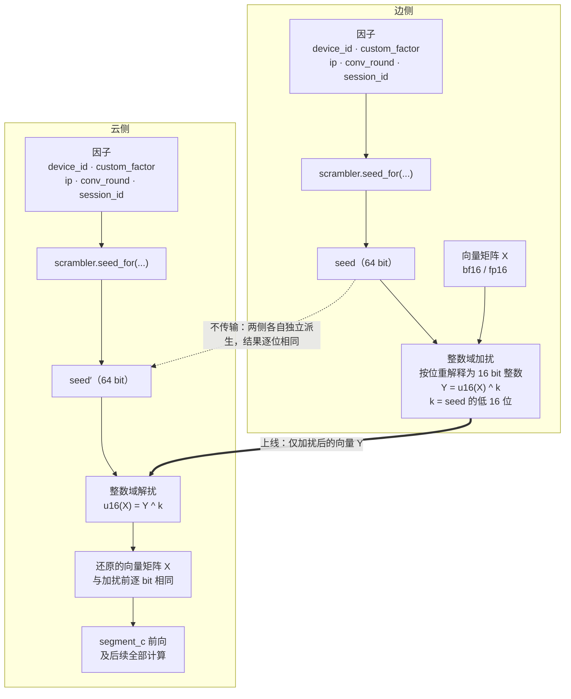
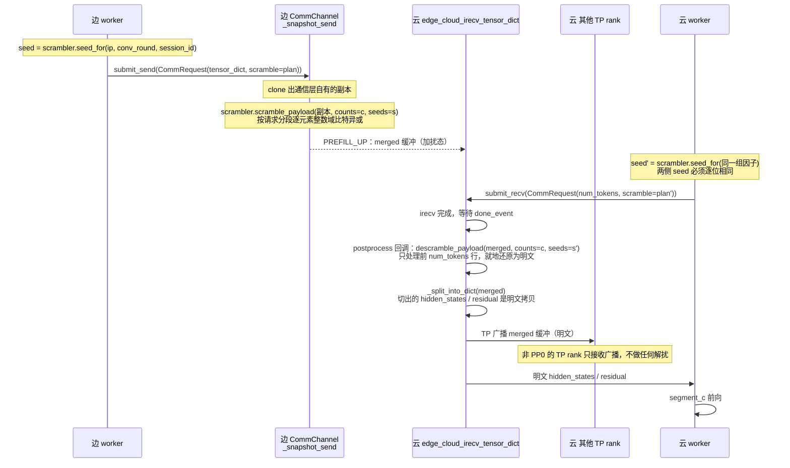
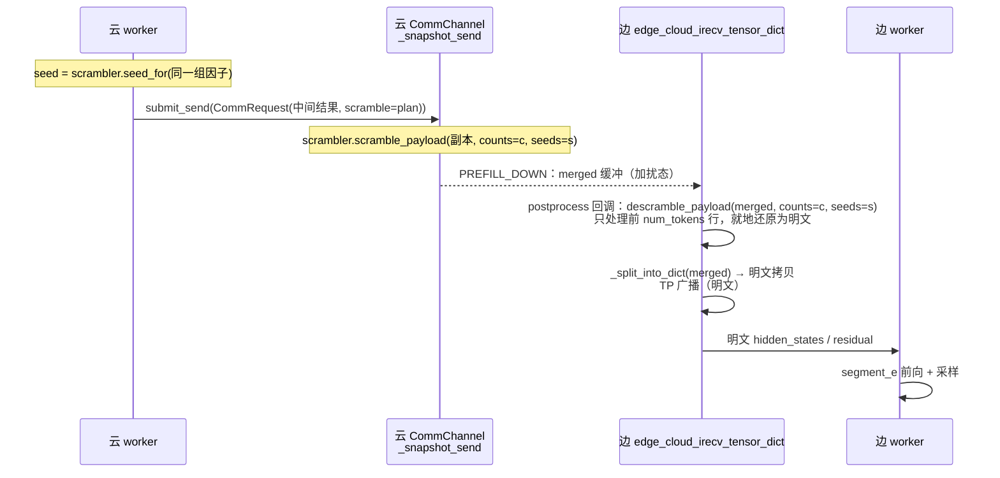

# 加扰与解扰

> 独立模块：**接收向量与各因子，做加扰 / 解扰**。不依赖 vLLM、边云、通信层、调度器的任何代码。

## 介绍

边云协同推理把一套大模型切成三段：边侧跑头部的若干层与尾部的若干层，云侧跑中间层。一次请求因此要在两个节点之间往返若干次，每次往返都要搬运一个矩阵——形状是 `[token 数, hidden 维度]` 的中间激活值，也就是层与层之间传递的那个向量矩阵。

这个矩阵不是统计量、不是索引、也不是元数据，而是**模型中间层的真实激活值**。它跨节点传输，存在被旁路采集、被落盘、被运维手段误读的可能。加扰与解扰处理的就是这一段暴露，做法很直接：

- 两侧**各自**用同一组因子算出一个相同的 seed；
- 发送前，用这个 seed 把向量矩阵里的**每个数**打乱（按位异或）；
- 接收后用同一个 seed 解回去，**逐 bit 还原**成原矩阵，再交给后续计算。

**先说清传输介质**（早期版本写成"经通用网络"，这不准确，而且会影响威胁模型的判断）：这一段载荷**不是**走普通 TCP 流的。实际是 HCCL 设备到设备 P2P，**原始 NPU 显存直传**——`torch.distributed.isend` 打在专用 HCCL communicator（每个方向一个）上，走独立的 NPU stream，且该路径**已经显式移除了 inter-node 的 pickle + Gloo 元数据交换**（`parallel_state.py:1120-1127` 的 docstring）。这条事实有两个推论：

- "中间设备落盘明文"这个场景基本不成立：中间盒不会重组 RDMA 写，线上根本没有应用层载荷可供落盘；
- "旁路抓包"的门槛比 TCP 高得多（需要 RDMA 级镜像 + 重组），但也**不是不可能**（RoCEv2 是 UDP 封装，可被镜像）。

所以本方案真正对症的场景是**节点内的误读与转储**：显存 dump、core dump、调试/Profiling 工具、误挂的采集脚本读到的都是 bf16 明文。定位与强度见 §8.8。

三件事决定了这个做法为什么可行、以及为什么必须这么写。

**第一，seed 不上线。** 派生所需的因子（设备 ID、企业定制因子、客户端 IP、对话轮次、会话 ID）在两侧都能拿到（静态的来自部署、动态的经控制面同步），双方各自跑同一个派生函数就能得到逐位相同的结果，不需要把 seed 本身发过去。因此"因子怎么同步"与"两侧派生结果是否一致"这两件事，成为落地时最关键的部分——它们不属于本模块，而是调用方的契约。

> **因子的时效必须先定清楚**：`ip` / `conv_round` / `session_id` 是**每请求**的，所以 seed 是**每请求**的；而载荷是**每批**的，一批含多个请求。这个粒度错配决定了算子必须按请求分段——见 §3.1.1 与 §4.5。这是本设计最核心的一处结构。

**第二，变换必须无损。** 最直观的写法是"把 seed 加到每个数上"，但这里有个陷阱：payload 是 bf16 / fp16，浮点加法在这两种精度下**不可逆**——加上一个稍大的 seed 就会抹掉有效低位，再减回来已经回不到原值，而且不会报任何错。所以实际做法是把 16 bit 浮点**按位重解释为整数**，与 seed 的低 16 位**逐位异或**。语义上仍然是"每个数被 seed 打乱"，但严格可逆：接收侧还原出的矩阵与发送前逐 bit 相同，后续 attention / MoE 看到的张量和没开启加扰时完全一样。

**第三，它是一个纯粹的模块。** 因子从哪来、怎么在两侧保持一致、在数据面的哪一步调用、什么时候开启——这些全部留在调用方；模块只做一件事：接收一个向量矩阵和一组因子，做加扰或解扰。因此它不 import 项目里任何代码，可以脱离边云环境单独测试。

需要明确的边界是：**这是传输态混淆，不是密码学加密。** 它挡的是"旁路直接读到明文激活值"与"中间设备落盘"，挡不住能读取控制面并掌握派生规则的攻击者——因子在控制面上是明文传输的，掌握因子与派生规则就能复算 seed。要做成真正意义上的加密，需要预共享密钥配合每次传输的 nonce，那是另一个量级的改动。

| 它是什么 | 它不是什么 |
|---|---|
| 对边云跨节点**中间向量载荷**的逐元素变换 | 不是对权重、KV cache、控制面消息的加密 |
| **严格无损**，开启与关闭时输出逐 bit 相同 | 不是"近似保护、允许精度损失"的方案 |
| 两侧**独立派生**同一个 seed，seed 不上线 | 不是密钥协商或密钥分发机制 |
| 一个**独立模块**：输入向量 + 因子，输出变换结果 | 不是通信层、调度器、某个模型的组成部分 |
| 传输态**混淆**，防旁路明文与误采集 | 不是密码学加密，挡不住掌握因子的攻击者 |

下文先给原理图，再依次说明模块边界、对外接口、因子规范化与 seed 派生、加解扰算子，最后是它在整个项目中的位置与调用关系。

---

| 项 | 内容 |
|---|---|
| 模块 | `vllm_ascend/distributed/edge_cloud_comm/payload_scramble.py`（**单文件**，~720 行含 docstring，叶子依赖） |
| 对外 | **只有一个类**：`PayloadScrambler`（+ 进程级工厂 `get_payload_scrambler`）。类方法：`seed_for` / `seed_digest_for` / `conformance_digest` / `scramble_payload` / `descramble_payload` |
| 开关 | **没有**——加解扰是必选路径（§5、§9）。没有 `enabled`，没有"部署 / 未部署"，没有方向开关。但**静态因子仍必须由部署配置提供**（§9.1） |
| 输入 | 一个向量矩阵（或张量字典）+ 各因子，**外加"哪个请求占哪些行"**（`counts`） |
| 输出 | 就地加扰 / 就地还原（返回实际处理的键，便于调用方断言） |
| 不负责 | 因子从哪来、怎么在两侧同步、在何处调用、何时开闭 |
| **位置与调用方** | 见 **§8**（目录位置、调用点与接线点计数、seed 计算时机、端到端流程） |

---

## 修订记录（本次评审）

本文档经过一轮代码级评审，改了七处**会导致静默损坏或使设计自相矛盾**的地方。逐条列出，便于回溯：

| # | 原来的写法 | 为什么错 | 现在的写法 |
|---|---|---|---|
| 1 | seed "每 flight 一个"，`seed_for` "每 flight 派生 2 次以上"，摘要 "每个 flight 一次" | 五个因子在一个请求内全都不变，而一个请求跨很多 flight → seed 实际是**每请求**的。粒度写错会把后面所有接线带偏 | **每请求**（§3.1.1） |
| 2 | `scramble_payload(d, seed=…)` —— 整批一个 seed | seed 是每请求的、payload 是每批的，一批多请求 → 整批一个 seed 等于"批内所有客户端共用 `k`"，且两侧一致地错、无校验可发现 | **按请求分段**：`scramble_payload(d, counts=…, seeds=…)`（§3.1.1 / §4.5） |
| 3 | 解扰写成 `edge_cloud_irecv_tensor_dict()` 函数体里的直接语句 | `irecv` 是异步的，那时 `merged` 还没有数据 → 对 `torch.empty` 异或后被线上数据覆盖，消费侧永远拿到加扰态数据 | **必须注册进 `comm_postprocess` 回调链**，且早于 `_split_into_dict`（§8.1 的警告 / §8.3） |
| 4 | 非 merge 分支"对整字典调 `descramble_payload`"；并断言"两侧按 dtype 跳过的集合天然相同" | 接收侧 `tensor_dict` 是发送侧的**真超集**：含本地零填充的 recv-only 键（`embedding_only` 的 `residual`）与 SP padding 尾巴，两者都不该被异或 | **只解扰 irecv 写过的键、且只处理前 `num_tokens` 行**（§8.3.1） |
| 5 | `X-Forwarded-For` 链式值降级成 `"0.0.0.0"` | 默认配置就直读该头，而 nginx 恰恰是它存在的原因 → 默认部署下每个客户端的 ip 因子都退化成同一常量，两侧一致地错 | **取最左一跳**（§3.1） |
| 6 | 原 §9 内部三处互相矛盾（`enabled` 有无默认值、关闭态要不要静态因子、`build_scrambler()` 关闭态抛错） | 同一节的三个地方各说一套，实现者会随机挑一种 | **已随原 §9 整节删除而消失**（见第 8 条） |
| 7 | 握手载荷在 §3.3 / §8.6 / §9.12 有三种写法；§9.10 撤销的"权威只在边侧"在 §9.2/§9.3 里还留着 | 同一文档前后打架 | **统一为 `(enabled, conformance_digest)`**，随后进一步简化为**只比 `conformance_digest`**（见第 8 条） |

另外补了三条**原本缺失**的：

| 8 | **整个「配置设计」节**（原 §9.1–§9.13）：`enabled` 开关、字段分组、三种"关掉"的力度、两侧各写一份的权威、"未部署"与"已关闭"的区分、敏感值日志 | 加解扰是**必选路径、不是可插拔特性**——这半节只在回答"这个功能要不要开、怎么开、怎么关"，而这个问题不存在了。它还是第 6、7 两条矛盾的来源 | **删掉"可插拔"那一半**。**握手载荷随之退化为只比 `conformance_digest`**；`CommRequest.scramble` 的 `None` 不再是开关，只剩"本 op 的 wire 类型未覆盖"一义（draft wire） |

| 9 | fail-loud 断言写成"**`scramble is None` 就抛**" | draft wire 是**合法的 `None`**（v1 不覆盖投机载荷）。开关取消后"本进程已启用加扰"恒为真，这条断言就变成**每个 draft 请求都抛**——直接把功能打挂 | 判据改为 **"wire 类型在覆盖范围内 ∧ 计划为 None"**（§8.2 给了代码）。这也是"`None` 不是开关"这句话的落地方式 |
| 10 | §8.5 的因子链路停在"范式见 `kv_transfer_params`"；§8.7 的改动清单里**一行 vLLM fork 都没有** | 实现者按 §8.7 只会动 vllm-ascend，而因子的链路上有两处**必须改 vLLM fork**：`Request.__init__` 目前只从 `extra_args` 取出 `kv_transfer_params` 一个键（`vllm/v1/request.py:115-118`），`SchedulerOutput` 也得加一个逐请求 dataclass 字段。不改这两处，因子根本到不了 worker | §8.5 把链路写成四步 ①–④，§8.7 补两行 🔴 跨仓库改动，并给出"不动 fork 就只能退回乙方案"的取舍说明 |

| 补充 | 说明 |
|---|---|
| 传输介质与威胁模型 | 载荷是 HCCL 显存直传、不是普通 TCP；并把 16 bit 密钥、已知明文、2¹⁶ 穷举这三个量化事实写进 §8.8 |
| 握手通道会被 env 关掉 | warmup 的唯一调用点被 `VLLM_ASCEND_EDGE_CLOUD_CHANNEL_WARMUP` 门控，一旦关掉"拒绝启动"的保证静默失效（§8.6） |
| 改动面被低估 | 原写"3 个函数 + 1 个字段"，实际还要加：形参透传链、hint 的 4 个生产点、API 层的因子提取、SO 的逐请求因子（§8.7） |
| 未定义的口径 | `conv_round` 与 `session_id` 是需求里没有、设计里也没定来源的两个因子。**已拍板**：`conv_round` = `messages` 里 `role == "user"` 的条数（首轮 = 1；非 chat 接口固定 1）；`session_id` = 引擎侧 `req_id`。§8.5 给了完整链路，并注明三条口径细节（`len(messages)` ≠ 用户提问次数、非 chat 路径、beam search 无 `extra_args`） |
| 11 | §3.2 整节的立论是「两侧有两条不同的取因子路径」（边侧从请求拿、云侧从控制面读），所以可能读岔 | 甲方案把运行期因子放到 `SchedulerOutput` 上之后，**两侧都是从同一个 SO 字段读**——同一份字节 + 同一个函数，因子错配**在结构上不可能**。于是这节呼吁的「每批交换 `seed_digest_for`」既没有必要，**也从来没有传输通道**（edge→cloud 只有 SO 这一条单向控制面，两侧比对要有回程） | §3.2 重写：区分「因子不一致（已消除）」「派生规则/版本不一致（启动摘要覆盖）」「行区间划分不一致（首次接通校验）」；把 `seed_digest_for` 定位为**首次接通的交叉校验与排障工具**，并写明要升级成每批护栏的**最省路径**（边侧调度器把 `(counts, seeds)` 摘要放进 SO） |
| 12 | §2 公开两个算子：`scramble_tensor(t, seed=…)` 与 `scramble_payload(d, seed=…)` | 两个都允许「一个 seed 打一整批」。虽然甲方案已把 payload 版改成 `counts`/`seeds`，但单张量版仍把同一个 footgun 留在 API 上——而它在生产路径上**零调用者**（merge 缓冲也是一个 batch 的多行块） | 单张量形式降为**私有原语** `_xor_in_place(t, k)`，公开算子只剩两个按请求分段的。理由与本文档删 `static_factors` / `factors=` / `from_config` 完全一致：**零调用者的公开方法就是猜测性通用性** |
| 14 | 第 8 条把配置**整节**删掉了，连带删掉了"静态因子从哪来" | 两个静态因子（`device_id` / `custom_factor`）**没有别的来源**，只能由部署配置提供。删掉开关语义不等于删掉因子来源——把两件事一起删是过度反应 | **恢复配置的"因子来源"这一半**（§9.1）：`edge_cloud_config.payload_scramble.{device_id, custom_factor \| custom_factor_file}`，`enabled=True` 时**必选**、缺失即拒绝启动；`ascend_config.py` 新增 `PayloadScrambleConfig`（4 条本机校验 + `resolve_custom_factor()` 读一次挂载文件 + `build_scrambler()` 唯一接缝）。**不恢复**：`enabled`、`ip_header_priority` / `trust_socket_peer` / `conv_round_source` / `conv_round_semantics`（那些"因子怎么提取"的口径已在代码里固定，§8.5） |
| 13 | 正文多处写「已在本机通过」「已实测（torch 2.13.0+cpu）」，读起来像这些结论挂在某份代码上 | 那些探针脚本**未提交、将作废**。结论本身有价值（尤其「必须用就地 `bitwise_xor_`」），但文档现在必须**独立成立** | 全部改为「开发期验证过、脚本已丢弃、实现后需重跑」的措辞，并在 §4.2 末尾明确标注 **NPU 未验证** |
| 注入点写错 | ① 原写"API 层 `entrypoints/openai/*/protocol.py`"。但 `ip` 需要 `raw_request`（headers / socket），**`protocol.py` 里的 Pydantic 模型拿不到**；正确位置是 `chat_completion/serving.py:300` 构建 `SamplingParams` 之后。而 `session_id`（= `req_id`）**根本不需要注入**——调度器手里就有，就地填即可（§8.5 的 ① 与 ③ 因此是两个不同的注入点） |

> **代码状态：无。** 本文档现在是**唯一的规格来源**——`payload_scramble.py` 与配套 UT 均未提交、已作废，实现范围与验收标准全部以本文档为准（§2 接口、§3 因子与派生、§4 算子、§7 测试清单、§8 落地接线）。开发期做过的一批实验（就地异或 vs 非就地、int16 全域往返、XFF 链式取最左一跳等）结论保留在正文，但**脚本已丢弃**，实现后需重跑，且 **NPU 上的算子可用性从未验证过**（§4.2 末尾已标注）。

---

## 原理图



**四条要点**（图里每一步的理由）：

| # | 要点 | 为什么这样设计 |
|---|---|---|
| 1 | 两侧**各有一份因子**，各自跑 `seed_for` | seed **不上线**；只要因子相同，派生结果就逐位相同 |
| 2 | 变换在**整数域**做（把 16 bit 浮点按位重解释为整数，再与 seed 低 16 位**逐位异或**） | 浮点域加法在 bf16/fp16 下**不可逆**（量化示例见 §2 中"为什么没有 `fadd`"一段）；比特异或逐位独立、无进位无溢出，逆元就是自身 → **与平台无关的严格无损**，不需要任何启动自检 |
| 3 | 上线的东西**只有加扰后的向量 Y** | seed、key 本体都不在线上（线上只有因子与校验摘要，见 §2） |
| 4 | 云侧**先还原再做 segment_c** | 下游 attention / MoE 看到的张量与不加扰时逐 bit 相同，因此开启加扰不影响输出 |

> 本方案是**传输态混淆 / 防误读**，不是密码学加密：因子在控制面明文传输，掌握因子与派生规则者可复算 seed。定位与边界见 §8.8。

---

## 1. 模块边界

| | 属于模块 | 属于调用方 |
|---|---|---|
| 因子取值 | 只做**规范化**（去端口、IPv6 压缩、缺失降级） | 从哪拿：`device_id`、`custom_factor`、`ip`、`conv_round`、`session_id` 全部由调用方传入 |
| seed | **派生**（`BLAKE2b`，两侧同因子 ⇒ 同 seed） | 保证两侧传入**相同**的因子 |
| 加扰 / 解扰 | **算子实现**（整数域、严格无损、就地） | 决定对哪些张量、在何处调用、何时调用 |
| 一致性 | 提供 `seed_digest_for()` / `conformance_digest()` 两个摘要方法供两侧比对 | 实际做交换与失败处理 |
| 开关 | **没有开关**（见 §5） | 也没有"是否调用"的决定：加解扰是**必选路径**，两个传输方向都必须做（§9 开头） |

模块内**不含**：配置读取、环境变量、单例、调度器 / 控制面交互、网络传输、vLLM import。

---

## 2. API

整个模块只有**一个公开类**和一个进程级工厂。模块级只有私有 helper，分两组：**因子规范化**与 **KDF**——它们都是纯函数，所以放在模块级而不是类里（理由见下）。

```python
# vllm_ascend/distributed/edge_cloud_comm/payload_scramble.py

__all__ = ["PayloadScrambler", "get_payload_scrambler"]

# ---- 模块级私有：因子规范化（纯函数，KDF 也要用）----
def _canonical_str(v: str | None) -> str: ...
def _canonical_ip(v: str | None) -> str: ...
def _canonical_round(v: int | None) -> int: ...

# ---- 模块级私有：KDF 与摘要 ----
def _derive_seed(*, device_id, custom_factor, ip, conv_round, session_id) -> int: ...
def _seed_digest(*, device_id, custom_factor, ip, conv_round, session_id) -> int: ...
def _conformance_digest(*, device_id, custom_factor) -> int: ...

# ---- 模块级私有：算子原语 ----
# 单张量 + 单个 16 bit key，就地逐位异或。两个 payload 算子都只是"按 counts 切行
# 区间、逐区间调它"。**私有**：见 §2 的说明（零调用者的公开方法 = 猜测性通用性）。
def _xor_in_place(t: Tensor, k: int) -> None: ...


@dataclass(frozen=True, slots=True)
class PayloadScrambler:
    """部署期因子绑定一次，运行期因子每次传。"""

    device_id: str          # 设备对的共享指纹（部署期下发，两侧同值）
    custom_factor: str      # 定制因子（部署期下发，两侧同值）

    # ---- 构造 ----
    def __post_init__(self) -> None: ...          # 规范化 + 非空校验

    # ---- 派生（运行期因子是参数，静态因子在实例上）----
    def seed_for(self, *, ip: str | None, conv_round: int | None,
                 session_id: str) -> int: ...
    def seed_digest_for(self, *, ip: str | None, conv_round: int | None,
                        session_id: str) -> int: ...
    def conformance_digest(self) -> int: ...

    # ---- 算子：只有两个，且都强制"按请求分段" ----
    # counts[i] / seeds[i] 描述第 i 个请求，按 payload 行序排列。
    # 没有"整张量 + 单个 seed"的公开入口——那正是本设计要消除的形态（见下）。
    def scramble_payload(self, d: Mapping[str, Tensor], *,
                         counts: Sequence[int], seeds: Sequence[int]) -> list[str]: ...
    def descramble_payload(self, d: Mapping[str, Tensor], *,
                           counts: Sequence[int], seeds: Sequence[int]) -> list[str]: ...

    # ---- 日志 ----
    def __repr__(self) -> str: ...      # 只报 set/unset，绝不打印因子值


def get_payload_scrambler(*, device_id: str | None = None,
                          custom_factor: str | None = None) -> PayloadScrambler:
    """进程级单例（对标既有的 get_comm_service()）。"""
```

**公开面统计**：`PayloadScrambler` 有 **7 个公开成员**（3 个派生 / **2 个**算子 / 2 个只读字段）+ `__repr__` + `get_payload_scrambler`。

**为什么因子规范化放在模块级，而不是类的 staticmethod**（这里改过一次，记录理由）：KDF（`_derive_seed`）必须做规范化，而它在模块级；若规范化是类的 staticmethod，就会出现"**模块级私有函数调用下面才定义的类**"这种依赖倒置。改成模块级私有后，依赖方向变成单向：**类 → helper**，helper 不依赖任何东西。顺带收敛了公开面（少 3 个 static 方法）。

**为什么删掉了 `static_factors` 属性**：它把"两个静态因子摊平成 dict"暴露成 API，而唯一的消费者 `_derive_seed` 就在本模块内——属于**猜测性通用性**，且会把"部分构造参数"这个内部形状泄露出去。删除后无人受影响（全项目与 UT 都没有调用方）。

**为什么收成一个类，而不是一组模块级函数**（这里改过一次，记录理由）：

| 理由 | 说明 |
|---|---|
| **静态因子只传一次** | `device_id` / `custom_factor` 是部署期确定的，每个调用点重复传没有意义；绑到实例上之后，调用点只写变化的部分 |
| **规范化只做一次** | `strip()` 在 `__post_init__` 里做掉，每 flight 不再重复；顺带让"因子为空"在构造时就报错 |
| **调用点自解释** | `scrambler.seed_for(ip=…, conv_round=…, session_id=…)` 一眼能看出"哪三个是运行期的"，不用对着五参数签名数 |
| **只有一处可看** | 12 个公开函数散在模块级时，读者要自己拼出"这几个是一组"；收进类后 `dir()` 一眼看全 |

**部署期因子 vs 运行期因子**（这是分界线，不能混）：

| | 因子 | 谁提供 | 为什么 |
|---|---|---|---|
| **构造时传入** | `device_id`、`custom_factor` | 部署配置 | 进程内恒定；同进程多个虚拟 worker 拿到的必然相同 |
| **每次调用传入** | `ip`、`conv_round`、`session_id` | 调用方按请求 | `ip` 是**本请求的客户端地址**（由 API 层从 HTTP 上下文提取，§3.1）；`conv_round` 是轮次；`session_id` 是作用域标识，**本设计取引擎侧 `req_id`**（§8.5），因此每请求唯一 |

> **不要把 `ip` 提到构造参数。** 只有在"单客户端固定 IP"的部署下它才恒定；一般部署下（尤其前面有 nginx 反向代理时）它是**每请求变化**的客户端地址。固定下来会让不同客户端共用同一个 seed——云侧照常解扰、解出错误明文，只能靠逐请求的 `seed_digest_for` 事后发现。

**为什么是单例，以及它为什么安全**

| 问题 | 答案 |
|---|---|
| 多个 worker 在**不同进程** | 各自一份实例，互不相干（单例的边界是**进程**） |
| 多个 worker 在**同一进程**（shared-model 边侧，同进程最多 `dp_size` 个虚拟 worker） | 共用同一实例。它们传的因子相同（配置是进程级的），所以不会冲突；真传了不同值 → 直接 `ValueError`，而不是静默取第一个 |
| comm 线程 + 主线程并发读 | 安全。实例 `frozen=True`，构造后**零写入**；seed 路径是五因子的纯函数，重复调用不可能不一致 |
| 首次调用的竞争 | `_PROCESS_SCRAMBLER is None` 判断与赋值没有加锁，极端并发下可能各建一个，但两者内容完全相同（同参数），**结果无差别** |
| 可以让它持有会话级缓存吗 | **不可以**。按 session/flight 建缓存就是设计里明确否决的"跨线程共享状态"（§8.2） |

> **`from_config()` 已删除**（随原 §9 的配置类一起）。它存在的唯一理由就是"唯一知道配置对象形状"，而配置类没有了，它就只剩猜测性通用性——正是本文档删除 `static_factors` 时用过的同一条理由。静态因子由调用方直接传两个字符串即可（§9.1）。

**调用点的写法**

```python
# 启动时一次（worker 进程内）：静态因子由部署提供，进程内只此一次
scrambler = get_payload_scrambler(device_id=DEVICE_ID,
                                  custom_factor=CUSTOM_FACTOR)

# 每个请求（一个 batch 里逐请求）
seed = scrambler.seed_for(ip=client_ip, conv_round=turn, session_id=sid)
scrambler.scramble_payload(send_dict, counts=counts, seeds=seeds)  # 就地
```

**两组算子的分工（一张表说清）**

| | `*_payload`（**唯一公开的算子**） | `_xor_in_place`（私有原语） |
|---|---|---|
| 输入 | **张量字典** `{key: tensor}` | 单个张量 |
| seed 形式 | **每请求一组**：`counts=`（各行区间的行数）+ `seeds=`（每段一个 seed） | **一个** `k`（已取低 16 位） |
| 覆盖范围 | 字典中**所有 16 bit 浮点**张量；其余键按 dtype 规则跳过。每张只处理**前 `sum(counts)` 行**（= 线上真正传过的行数），行尾的 padding 一律不碰 | 你给的那一个（整张） |
| 遇到不支持的 dtype | **跳过**，并在返回值里体现（不报错） | **抛 `ValueError`**（调用方已点名该张量，dtype 不对就是调用错误） |
| 遇到行数不足 | **抛 `ValueError`**（`shape[0] < sum(counts)`：说明分段与载荷配错了） | 不适用 |
| 返回 | **实际处理的键列表**（便于断言 / 日志） | 无 |

**为什么没有"整张量 + 单个 seed"的公开算子**（这是本设计最核心的一处修正，§3.2 详述）：

早期版本有两个公开算子：`scramble_tensor(t, seed=…)`（单个 seed）与 `scramble_payload(d, seed=…)`（整批一个 seed）。**两个都会有"一个 seed 打一整批"的用法**，而一个 batch 里有多个请求、各需要自己的 seed：

- seed 的五个因子里有三个（`ip` / `conv_round` / `session_id`）是**每请求**的；
- 而 payload 是**一个 batch**，一个 decode 批里通常有多个请求（多客户端、多会话）；
- 若整批发一个 seed，等于"批内所有客户端共用同一个 seed"——正是 §2 下面警告的那种失效，且两侧都会一致地算错，没有任何校验能发现。

所以 v1 **只保留按请求分段的算子**：`counts` / `seeds` 必须**一一对应**——`counts[i]` 是第 i 个请求贡献的行数，`seeds[i]` 是它的 seed，两者按 payload 行序排列；行偏移由模块内部累加得出，调用方**无法**把错误的行段配给错误的 seed。

> 单张量形式退化成**私有原语** `_xor_in_place(t, k)`：它没有"请求"这个概念，因此**不可能**被误用在多请求载荷上——把 footgun 从 API 上删掉，比在文档里警告它更可靠。顺带，早期版本说"`descramble_tensor` 没有生产调用者、但仍保持公开以维持命名对称"——那条理由不成立：**零调用者的公开方法就是猜测性通用性**，与本文档删除 `static_factors`、`factors=`、`from_config` 用的是同一条理由。

**为什么两者的"不支持的 dtype"处理不同**：字典版必须能处理混合载荷（`hidden_states` + `residual` + `mrope_positions`），而对 int64 张量做 16 bit 算子是无意义的——所以它的正确行为是**跳过**。单张量版没有"跳过"这个选项：调用方已经点名要加扰这个张量，dtype 不对就是调用错误，应当立即报错。

**为什么"跳过"不设参数**：跳过的集合**完全由 dtype 决定**，不需要调用方声明。早期版本有一个 `skip={"mrope_positions"}` 参数，它的问题和 `op` 一样——**是一个没有任何校验覆盖的自由度**：若两侧的 `skip` 不一致，被跳过的键是 16 bit 浮点时会出现"一侧加扰、另一侧不加扰"的**静默损坏**（`seed_digest_for` 不含 `skip`）。而 v1 唯一需要跳过的 `mrope_positions` 是 int64，dtype 规则天然推出同样结果。

**调用方如何确认"没有漏处理"**：`返回值` 是实际处理的键，跳过的键 = `set(d) - set(返回值)`。要强断言就写：

```python
processed = scrambler.scramble_payload(d, counts=counts, seeds=seeds)
assert set(d) - set(processed) == {"mrope_positions"}, "出现了预期之外的未处理键"
```

**签名读法：`*` 与 `seed` / `counts`·`seeds`**

```python
# 唯一的公开算子：一个 batch，按行区间分段
def scramble_payload(self,
                     d,                 # 位置参数：张量字典
                     *,
                     counts: Sequence[int],   # 必填：每请求贡献的行数，按行序
                     seeds:  Sequence[int])   # 必填：每请求的 seed，同序、等长
```

| 符号 | 是什么 | 为什么这么设计 |
|---|---|---|
| `*` | Python 的**关键字-only 分隔符**，不是参数。它右边的参数不能用位置传（`scrambler.scramble_payload(d, 12345)` → `TypeError`） | ① 防顺序写错——位置传参时把别的参数当成 seed，就是"用错的 seed 解扰"，属于本设计最怕的静默错误；② 调用点自解释（`seeds=seeds` 比裸整数清楚）；③ **`seed_for(**factors)` 能工作的前提**——字典展开只产生关键字参数，所以三个运行期因子必须关键字-only |
| `seed` | 必填、只能按关键字传（单块原语） | 算子只做"向量 + seed → 向量"这一步；"因子 → seed"由 `seed_for` 单独完成 |
| `counts` / `seeds` | 必填、等长、按 payload 行序一一对应 | 见上表。模块校验两者等长、行数非负、`sum(counts)` 不超过张量行数——**这四点是调用方无法用"配错"绕过静默损坏的全部入口** |

**算子只接受 `seed`：不提供 `factors`、`op`、`skip`**

三个曾经存在过的参数都已被删除，理由是同一个——**它们都是"没有任何校验覆盖的自由度"**：

| 曾有的参数 | 为什么删 |
|---|---|
| `factors={...}` | ① 两件事本该分开：`seed_for`（因子 → seed）与算子（向量 + seed → 向量）是独立两步，算子收 `factors` 等于把派生藏进内部，调用点上看不出"这批用的是哪个 seed"；② **生产路径零调用者**——通信层只从 `CommRequest.scramble` 拿到一份纯数据的分段计划，既没有 `SchedulerOutput` 也没有因子；③ 连带少两条校验规则（`factors`/`seed` 二选一、键集合校验） |
| `op="iadd"｜"xor"` | `op` 不参与 `seed_for`，所以 `seed_digest_for` / `conformance_digest` **都覆盖不到它**：一侧按加法加扰、另一侧按异或解扰 → 数据损坏，而两道校验全部通过。v1 固定**异或**（§4.1） |
| `skip={"mrope_positions"}` | 跳过的集合**完全由 dtype 决定**，不需要调用方声明。若两侧 `skip` 不一致，且被跳过的键恰好是 16 bit 浮点，就会出现"一侧加扰、另一侧不加扰"的**静默损坏**（`seed_digest_for` 不含 `skip`）。改为按 dtype 规则跳过（见上表） |

派生因此显式写在调用点上，而不是藏进算子：

```python
# 每请求一次：一个 batch 里每个请求各有自己的 seed
seeds = [
    scrambler.seed_for(ip=ip_of(req), conv_round=round_of(req), session_id=sid_of(req))
    for req in batch                       # 顺序 = payload 行序（§8.3.1）
]
scrambler.scramble_payload(send_dict, counts=counts, seeds=seeds)   # 就地
```

这一段换来的是**数据流在调用点上可见**——本设计反复强调"seed 必须两侧一致、且**与 payload 的请求分段一一对应**"，把派生写出来比藏进算子更贴合这一点。求值次数不是问题：`seed_for` 是纯方法，每请求算一次即可，重复算结果也必然相同（完整时机表见 §8.2）。

**输入校验（fail fast）**

| 校验 | 行为 |
|---|---|
| 构造期：`device_id` / `custom_factor` 非空 | `strip()` 后为空 → `ValueError`（构造时就报，不等第一个请求） |
| `seed` 必须是 `int` | `None` / 其他类型 / `bool` → `ValueError`（否则会在 `seed & 0xFFFF` 处抛出不直观的 `TypeError`；`bool` 会让 `True` 静默等于 `k=1`） |
| 单张量版：dtype 为 `bfloat16` / `float16` | 否则抛 `ValueError`，错误信息带上实际 dtype |
| 张量可按 16 bit 重解释 | 非连续张量 → `ValueError`，提示先 `.contiguous()` |
| 字典版：非 16 bit 浮点的键 | **跳过**（不报错），跳过的键 = `set(d) - set(返回值)` |
| **`counts` / `seeds` 非空** | 空 → `ValueError`（"零行的批"是调用错误，不能当成功返回） |
| **`counts` 与 `seeds` 等长** | 不等 → `ValueError`（一个请求一个 seed，配不上就是错的） |
| **`counts` 元素为非负 `int`** | `bool` / 浮点 / 字符串 / 负数 → `ValueError` |
| **载荷行数 ≥ `sum(counts)`** | 不足 → `ValueError`（说明分段与载荷配错，见 §8.3.1） |

> 后四条是甲方案新增的。它们把"分段配错"从**静默损坏**（一段行用错 seed，两侧摘要还照样匹配）变成**当场报错**。行偏移由模块内部累加得出，调用方**没有**手工指定区间的接口——这样"把第 3 个请求的行配上第 5 个请求的 seed"在 API 上无法表达。

> 两类"不支持的 dtype"处理不同，是有意的：字典版必须能处理混合载荷，而对 int64 做 16 bit 算子无意义，跳过是正确行为；单张量版调用方已点名该张量，dtype 不对就是调用错误。

**为什么没有 `fadd`（浮点域加法）**

需求字面是"每个数加上 seed"，但浮点域加法在 bf16/fp16 下**不可逆**，无法满足需求第 2 条"云侧还原出**原来的**向量矩阵"：

- bf16 有效精度 8 bit（相对精度 `2⁻⁸ ≈ 0.39%`）；`y = round_bf16(x + s)` 的误差上界是 `ulp(y)/2`。
- `|s| ≫ |x|` 时 `ulp(y) ≈ ulp(s)`，回减 `x' = round_bf16(y − s)` 落在以 `ulp(s)` 为步长的网格上，**一般 `x' ≠ x`**。

示例（hidden 量级 `|x| ~ O(1)`，`ulp(1) = 2⁻⁷ ≈ 0.0078`）：

| `s` | `ulp(s)` | 往返误差 | 相对误差 |
|---|---|---|---|
| 8 | 0.0625 | ±0.031 | ~3% |
| 1024 | 8 | ±4 | ~400%（彻底破坏） |

所以浮点加法不是"有损选项"，而是**不满足需求**，故不提供（避免被误用）。整数域比特异或在语义上同样是"每个数被 seed 打乱"，且逐位可逆。

---

## 3. 因子与 seed

### 3.1 因子

| 因子 | 类型 | 传入方 | 规范化（模块内做） |
|---|---|---|---|
| `device_id` | `str` | 调用方 | 去除首尾空白（`strip()`）；其余原样，不做大小写折叠 |
| `custom_factor` | `str` | 调用方 | 去除首尾空白（`strip()`）；其余原样 |
| `ip` | `str \| None` | 调用方 | 去端口（`a.b.c.d:port` / `[x::y]:port`）→ IPv6 压缩 + 小写 → 去前导零；非法 / `None` → 降级 `"0.0.0.0"` |
| `conv_round` | `int \| None` | 调用方 | 十进制无前导零；越界 / `None` → 降级 `-1` |
| `session_id` | **`str`（必填）** | 调用方 | 去除首尾空白（`strip()`）；其余原样。**本设计传入引擎侧 `req_id`**（§8.5），所以它是"每请求唯一"而非"每会话相同" |

**所有字符串因子统一 `strip()`**，是因为静态因子通常从**配置文件或挂载文件**读入，而文件内容的"边缘差异"极易造成两侧不一致：

| 差异 | 不 strip 的后果 |
|---|---|
| 尾随换行（`echo x > f` 就会产生） | 两侧字节不同 → seed 不同 → **静默垃圾** |
| CRLF vs LF | 同上 |
| 文件带 BOM | 同上 |
| 首尾多余空格 | 同上 |

两侧都做同样 `strip()` 仍然是确定性的，所以这类运维错误可以**从设计上消掉**，不必依赖"两次人工填写完全相同"。注意：`strip()` 只解决边缘空白，**因子内容本身仍必须逐字节相同**——这条由启动校验兜底（§3.3）。

**降级必须两侧一致**：`ip` 无效时统一取 `"0.0.0.0"`、`conv_round` 缺失时统一取 `-1`。若一侧降级、另一侧报错，就是 seed 错配（静默垃圾）。模块只提供**确定性**的降级规则，不因缺失抛错——是否允许缺失由调用方决定。

**`ip` 是"本次请求的客户端 IP"**，且链式取值取**最左一跳**：

| 输入形态 | 规范化结果 | 说明 |
|---|---|---|
| `"203.0.113.7:443"` | `"203.0.113.7"` | 去端口 |
| `"[2001:db8::1]:443"` | `"2001:db8::1"` | 去端口 + IPv6 压缩 |
| `"203.0.113.7, 10.0.0.5"`（原始 `X-Forwarded-For`） | `"203.0.113.7"` | **取最左一跳**：代理是追加写入的，最左就是原始客户端 |
| `"203.0.113.7,10.0.0.5,172.16.0.9"` | `"203.0.113.7"` | 同上 |
| `"010.001.002.003"` / `"not-an-ip"` / `None` / `""` | `"0.0.0.0"` | 降级 |

> **早期版本把链式值降级成 `0.0.0.0`，这是个必须修掉的坑。** 当时的理由是"调用方应当先拆分"——但 `X-Forwarded-For` 恰恰是 nginx 反向代理存在的原因，也就是**读这个头就是常规路径、不是异常路径**。结果是：**只要前面有反向代理，每个客户端的 ip 因子都退化成同一个常量**，而两侧会一致地算错，逐请求摘要校验也照样通过——没有任何机制能发现。取最左一跳是 XFF 的标准语义，把它放在模块里（唯一一处规范化）比指望每个调用点都记得拆更可靠。

**`session_id` 为必填（无默认值）**，理由是它属于"漏传就会让 seed 静默退化"的那类因子：给默认值 `""` 会让调用方少传一个参数时**不报错**、只是把作用域维度从 seed 里丢掉。设为必填后，漏传在开发期就是 `TypeError`。

> **本设计里它的值 = 引擎侧 `req_id`**（§8.5），也就是**每请求唯一**，而不是"同一个会话的多次请求相同"。取名 `session_id` 是沿用了早期设计的字段名，KDF 只按**位置**哈希、不看字段名，所以这个名字**纯属标注**：改名不影响派生结果、不需要动 `_KDF_DOMAIN`。若将来要换成真正的会话标识，那才是"输入值变了"，两侧必须同步升级。
>
> 空串仍是合法的"无作用域"取值，模块不对此抛错；但当前口径下 `req_id` 不可能是空串。

> 原先这里是一个可选参数 `context`（用途/轮次域分离）。改为 `session_id` 后它成为**实质因子**而非辅助域；若将来仍需要额外的域分离，改 `_KDF_DOMAIN` 的版本串即可（那会让两侧摘要显式不匹配，而不是无声错配）。

### 3.1.1 seed 的粒度：**每请求**，不是每 flight

这一条必须写在最前面，因为它决定了后面所有接口的形状，而早期版本把它写反了。

**五个因子在一个请求的生命周期内没有一个会变**：

| 因子 | 在一个请求内 |
|---|---|
| `device_id` / `custom_factor` | 部署常量 |
| `ip` | 这个客户端的地址 |
| `session_id` | 这个请求（本设计取 `req_id`） |
| `conv_round` | 这一轮 |

而**一个请求会产生很多次 flight**：一次 prefill（分块时多对）+ 每个 decode step 一对（e2c 一次、c2e 一次）。因此同一个请求的所有 flight 派生出的 seed **逐位相同**——是同一个值被反复使用。

| | 早期版本的说法 | 正确说法 |
|---|---|---|
| seed 的时效 | "每 flight 一个" | **每请求一个**，被该请求的所有 flight 复用 |
| `seed_for` 调用时机 | "每 flight 派生 2 次以上" | **每请求派生一次**（重复派生不会算错，因为它对五因子是纯函数，但语义写错会带偏后面所有接线） |
| 摘要校验时机 | "每个 flight 一次" | **每请求一次**：seed 在一次请求内不可能变，比这更频繁只是在比较同一对常量 |
| 早期版本的失效场景描述 | "进程级的 `get_seed()` 不知道是哪一轮" | 准确的描述是：**一个进程同时服务多个请求**（连续批处理下不同请求处于不同阶段），进程级可变状态回答不了"**这一批**该用谁的 seed" |

**但真正的问题不在这里，而在粒度错配**：

> **seed 是每请求的，payload 是每批的。**

一个 decode 批里通常有多个请求，`scheduler_output.num_scheduled_tokens` 是 `dict[req_id, int]`——多客户端、多会话、多轮次，于是有**多个不同的 seed**；而算子的输入是**一整块** `[num_tokens, hidden]`。

所以只有两条路：

| | 做法 | 评价 |
|---|---|---|
| **甲** | payload 按请求切行区间，**每段用该请求自己的 seed** | **采用**。`ip` / `session_id` 才有意义；seed 变成每请求轮换，比全局一个恒定 `k` 强得多 |
| 乙 | seed 降到批级（一个批一个 seed） | 放弃需求：批内所有客户端共用同一个 `k`，正是 §2 警告的失效。若只是为了"两侧一致"，那 `ip` / `conv_round` / `session_id` 三个因子就白写了 |

甲的实现地基本文已在 §8.3.1 说明（payload 行序 ≡ SO 的 `num_scheduled_tokens` key 顺序，两侧强制对齐），接口见 §2 与 §4.5。

### 3.2 派生

```python
_KDF_DOMAIN = b"vllm-ascend/payload-scramble/v1"
_US = b"\x1f"          # 分隔符：避免因子内容含歧义

def _derive_seed(*, device_id, custom_factor, ip, conv_round, session_id):
    h = hashlib.blake2b(digest_size=8, person=b"ec-scr01")
    h.update(_KDF_DOMAIN)
    for part in (_canonical_str(device_id),
                 _canonical_str(custom_factor),
                 _canonical_ip(ip),
                 str(_canonical_round(conv_round)),
                 _canonical_str(session_id)):
        h.update(_US); h.update(part.encode("utf-8"))
    return int.from_bytes(h.digest(), "big")      # 64 bit

def _seed_digest(*, device_id, custom_factor, ip, conv_round, session_id):
    seed = _derive_seed(device_id=device_id, custom_factor=custom_factor,
                        ip=ip, conv_round=conv_round, session_id=session_id)
    return int.from_bytes(hashlib.blake2b(
        seed.to_bytes(8, "big"), digest_size=4, person=b"ec-chk01").digest(), "big")
```

> 这两个是**模块级私有函数**（下划线开头），不是 API。公开入口是
> `PayloadScrambler.seed_for()` / `.seed_digest_for()`——它们只负责把实例上的
> 静态因子与调用传入的运行期因子拼起来再转调上面两个。
>
> 三个规范化函数是**模块级私有函数**（`_canonical_ip(...)`），不是类的方法——理由是依赖方向（见 §2）：KDF 在模块级要用它们。它们只被本模块调用，外部拿不到。

**因子顺序固定**为 `device_id → custom_factor → ip → conv_round → session_id`，各段以 `\x1f` 分隔（避免因子内容含分隔歧义）。**新增或重排因子一律视为破坏性变更**：两侧必须同步升级，否则摘要会立即不匹配（这是设计意图，不是缺陷）。

**必须用 `hashlib`，禁止内置 `hash()`**：CPython 对 `str` 的 `hash()` 受 `PYTHONHASHSEED` 逐进程随机化（SipHash 加盐），两侧进程必然得到不同值 → 功能失效且**表现为静默错误**。同理禁用 `id()` / `time.time()`。

`blake2b(person=...)` 与 `_KDF_DOMAIN` 提供域分离与版本域：换算法时改 domain，两侧摘要会**显式不匹配**，而不是无声错配。

**要解决的问题**：两侧各自算 seed。万一算出来不一样，云侧就会用**错的 seed** 去解——解出来的不是原矩阵，是垃圾；垃圾直接喂给中间层，最后输出乱码，而**全程不报错**。你只会看到"模型输出不对"，根本不知道是加扰引起的。

> **但甲方案把这件事的范围缩得很小了，必须写清。** 这是"不再参考未提交代码、重新分析设计"时发现的最大一处：本节原来的立论（"两侧有两条不同的取因子路径"）在甲方案下**已经不成立**。
>
> | 破坏形式 | 甲方案下还存在吗 | 由谁覆盖 |
> |---|---|---|
> | 两侧**因子**不一致 | ❌ **结构上不可能** | —— |
> | 两侧**派生规则 / 模块版本**不一致 | ✅ 存在 | 启动时的 `conformance_digest`（§3.3） |
> | 两侧**行区间划分**不一致 | ✅ 存在（低概率） | 首次接通的行区间交叉校验（见下） |
>
> **为什么"因子不一致"不可能了**：早期设计的因子来源是"边侧从请求里拿、云侧从控制面读"——**两条代码路径**，所以可能读岔（早期举的例子是"边侧写 `conv_round`、云侧读成 `round` → 读不到 → 走默认 `-1`"）。甲方案把运行期因子放到 `SchedulerOutput` 上之后，**两侧都是"从同一个 SO 字段读"**：边侧 worker 读它那份 SO 的 `scramble_factors`，云侧 worker 读它那份 SO 的同一个字段。**同一份字节 + 同一个函数 ⇒ 结果必然相同。**
>
> 而且"云侧读不到这个字段"也不再是一条静默路径：它是 dataclass 字段，名字不对就是 `AttributeError`；值为 `None` 则被 §8.2 的 fail-loud 断言当场拒绝（覆盖范围内的 wire 却没有计划）。**静默失效的入口被堵死了。**
>
> 一句话：**甲方案消掉了本设计里最贵的那类失效（两侧因子错配 → 静默垃圾）。**

**于是摘要机制只剩两个用途**：

| 函数 | 用途 | 时机 |
|---|---|---|
| `conformance_digest()` | 两侧**派生链路**一致：静态因子 + 规范化规则 + 因子顺序 + 模块版本 | **启动时**，经 warmup 的 rendezvous 交换（§8.6）；不等 → 拒绝启动 |
| `seed_digest_for(...)` | **首次接通的交叉校验与排障工具**：把两侧算出的逐请求摘要（按 payload 行序、与 `counts` 同序）放在一起比对 | **不是每批运行的机制**（理由见下） |

> **为什么不再要求"每批交换 `seed_digest_for`"**：早期把它当运行期护栏，是因为当时因子有两条读取路径；那条路已经没有了。更重要的是——**这个"每批两侧比对"从来没有传输通道**：edge 与 cloud 之间除数据面以外只有 SO 这一条**单向**控制面（edge → cloud），要"两侧比对"必须有回程。与其凭空要求一条不存在的通道，不如把它的定位写准：
>
> - **v1**：`seed_digest_for` 用于**首次接通**（两侧各打一行日志比对）与**排障**，不进数据面、不进关键路径；
> - **要升级成每批运行期护栏**：最省的路径是**边侧调度器把 `(counts, seeds)` 的摘要放进 SO**（一个 32 bit int），云侧算自己的、按批比对，不等即拒绝该批。这条路径**不需要新链路、不需要 RTT**，代价是调度器进程要 import 本模块（它是 torch-free 的叶子，见 §8.2）并读一次静态因子。**列为升级项，不在 v1 范围。**

**`seed_digest_for` 同时是行区间校验的载体**：§8.3.1 指出 `sum(counts) == num_tokens` 只能挡住"段数错"、挡不住"顺序错"。首次接通时把两侧的逐请求摘要列表**按行序**打出来比对即可——顺序一旦错位，第 i 项的摘要就属于另一个请求，立刻暴露。这是"行区间划分"那一行唯一的覆盖手段，也是甲方案**唯一风险点**（§8.3.1）的验收方法。

两者都在模块内、都不涉及传输（交换与失败处理是调用方的契约）。

### 3.3 启动一致性校验

**为什么需要**：静态因子错配会让**每一次** flight 都错，而错配的表现是"输出垃圾且不报错"。这一项**只能在启动时**发现：v1 不做每批运行期校验（§3.2），运行期没有任何机制会替你发现。

**启动时能校验什么、不能校验什么**：

| 因子 | 启动时可校验 | 说明 |
|---|---|---|
| `device_id` / `custom_factor`（静态） | ✅ 全量覆盖 | 启动时已确定，不一致则每次 flight 都错 |
| `ip` / `conv_round` / `session_id`（运行期） | ❌ | 启动时无请求。但甲方案下它们由 SO 携带、两侧读同一份字节，**不会不一致**（§3.2）——所以这里不校验并不构成缺口 |
| **派生规则 / 因子顺序 / 模块版本** | ✅ | 两侧版本不一致时（例如云侧不认识新增字段）会静默按明文处理 |

**做法**：不要只比对静态因子的原始字符串——要用一组**固定哨兵运行期因子**跑一遍完整派生，再比对摘要。这样校验的是"整条派生链路一致"，而不只是"配置一样"：

```python
# 模块内：哨兵 + 私有实现
_CONFORMANCE_PROBES = (
    ("192.0.2.1", 1, "probe"),            # 常规 IPv4（192.0.2.0/24 为文档用段，不会撞真实地址）
    ("[2001:db8::1]:8080", 2, "probe"),   # 去端口 + IPv6 压缩
    (None, 3, "probe"),                   # ip 缺失 → 降级 "0.0.0.0"
    ("192.0.2.1", None, "probe"),         # conv_round 缺失 → 降级 -1
)

def _conformance_digest(*, device_id: str, custom_factor: str) -> int:
    """启动一致性校验用：以固定哨兵因子跑完整派生，返回 32 bit 摘要。

    两侧 digest 相等 ⇒ 静态因子、规范化规则、因子顺序、模块版本四者都一致。
    不涉及任何传输；交换由调用方完成。
    """
    h = hashlib.blake2b(digest_size=4, person=b"ec-cfrm1")
    for ip, rnd, sid in _CONFORMANCE_PROBES:
        h.update(_derive_seed(device_id=device_id, custom_factor=custom_factor,
                             ip=ip, conv_round=rnd, session_id=sid).to_bytes(8, "big"))
    return int.from_bytes(h.digest(), "big")
```

调用方看到的是**无参方法**——静态因子已经在实例上：

```python
mine = scrambler.conformance_digest()
```

**位宽的选择**：两个校验都用 **32 bit**（碰撞 `2.3e-10`）。

> 这里曾写错过一次：早期版本给运行期校验选了 16 bit，理由是"逐批校验每批都跑，碰撞可忽略"。**这个理由是错的**——碰撞不是"每批一次独立抽奖"。若两侧 seed 持续不同（配置错、代码 bug 的典型形态），两个摘要值是**固定的**：要么一直撞、要么一直不撞，比一万次也不会把漏检概率从 `2⁻¹⁶` 降下来。持续性错配的漏检概率就是 `2⁻¹⁶ ≈ 1.5e-5`，与比较次数无关。
>
> v1 把运行期校验降级成"首次接通做一次"（§3.2）之后，这条理由**更重要**而不是更不重要：只做一次，就没有"多跑几批运气好能撞上"这回事——`2⁻¹⁶` 就是这一次的失手概率。所以摘要一律 32 bit，多出的 2 字节在启动期一次交换里不值一提。

**校验在启动时无条件执行**：加解扰是必选路径（§9），没有"这次要不要开"这种状态，所以这次交换没有任何前置条件——两侧一启动就交换一次 `conformance_digest`：

```
conformance_digest: int      # 32 bit
```

任一不等 → **拒绝启动**（而不是"警告后继续"，因为下游失效是静默的）。具体机制见 §8.6。

> 早期版本这里是一个二元组 `(enabled, conformance_digest)`，其中 `enabled` 用来发现"一侧以为关了、另一侧以为开着"。**开关取消后这个失效形态从设计上不存在了**，`enabled` 一并与载荷一起删掉——少一个必须两侧一致的字段。

---

## 4. 算子

### 4.1 整数域比特异或

把 16 bit 浮点按位解释为整数，与 seed 的低 16 位逐位异或：

```
加扰：Y    = u16(X) ^ k          k = seed & 0xFFFF
解扰：u16(X) = Y ^ k              （同一个 k）
```

`u16(·)` 表示"把 16 bit 浮点的位模式按位重解释为无符号 16 位数"，即 `float2int16(x) + 2¹⁶ for x < 0`——纯记号，实现里不出现。

实现只有三步，没有任何额外缓冲：

```python
v = t.view(torch.int16)      # 零拷贝位视角：reinterpret，同 storage、同 data_ptr
v.bitwise_xor_(signed_k)     # 就地逐位异或；逆运算同一个调用
return t                     # 写入落在共享 storage 上，t 已被就地改写
```

其中 `signed_k = k if k <= 0x7FFF else k - 0x10000`（`signed_k` 与 `k` 的位模式相同，`bitwise_xor_` 在 `int16` 上按位做、与符号无关）。

> **必须用 `bitwise_xor_` 就地版本，不能写成 `t.view(torch.int16) ^ signed_k`。** 这一点在开发期用 `torch 2.13.0+cpu` 实测过（**当时的探针代码已丢弃，结论保留**）：后者结果与入参**不同 storage**、入参**未被改写**，等于凭空多分配一份与输入同尺寸的缓冲——既违背"就地"契约，也让"零额外内存"这句话变成假的。就地版本往返后逐 bit 相等。**实现后需在新环境重跑这条。**

**为什么是异或而不是"加偏移"**（这里改过一次，记录理由）：

| 写法 | `u16` 域语义 | 严格无损 | 逆元 | 平台依赖 |
|---|---|---|---|---|
| `X ^ k`（**v1 采用**） | `u ^ k` | ✅ | 自身：`(u ^ k) ^ k = u` | **无** |
| `X + k`（曾采用） | `(u + k) mod 2¹⁶` | ✅ 若回绕 | `−k mod 2¹⁶` | **有**：需要平台在 int16 上做模回绕；C++ 有符号溢出属 UB、PyTorch 未文档化，实际是饱和还是回绕得在目标平台上实测 |

异或逐位独立，**不产生进位**，因此不存在溢出，也就没有"回绕语义"这个平台问题——与平台无关，不需要任何自检。位数、语义、零额外内存、单核全部相同，因此没有理由不选它。

> 这里曾按 `X + k` 设计，连"平台回绕自检探针 + `int32` 精确回退"一起写好了；换算子后这两样**一并删除**。留一条教训：那个探针自身写成 `torch.arange(65536, dtype=torch.int32).to(torch.int16)`，靠 int32→int16 的**收窄语义**去构造样本，而收窄正是它要验的那件事——构造一旦失败，探针会**假通过**。

### 4.2 无损性

设 `u = u16(x)`，`k = seed & 0xFFFF`：

- 加扰：`v = u ^ k`
- 解扰：`u' = v ^ k = (u ^ k) ^ k = u` ∎

逐位独立（异或的逆元就是自身），故**逐 bit 还原**——下游 attention / MoE 看到的张量与不加扰时完全相同，这是需求第 2 条"还原出原来的向量矩阵"的充分依据。穷举验证见 §7 第 6 条。

**开发期已在 `torch 2.13.0+cpu` 上验证过**（**验证脚本已丢弃，结论保留**）：对 int16 全域 65536 个位模式、`k ∈ {0x0001, 0x3D0F, 0x55AA, 0x7FFF, 0x8000, 0xFFFF}`，`X ^ k ^ k` 与 `X` 逐位相等；bf16 / fp16 走 `view(torch.int16)` 的往返同样逐位相等。**注意这是 CPU 结论**：NPU 上 `view(torch.int16)` + 就地 `bitwise_xor_` 是否可用、是否触发 format cast，**仍未验证**，是全设计唯一可能推翻本节实现方式的风险点。

**对 NaN / ±Inf / 次正规数同样成立**，因为它们的"位模式存在性"不因异或改变：NaN 异或后可能变成普通数，再异或回来仍是同一个 NaN 位模式——下游看到的就是原本的 NaN。

### 4.3 覆盖范围由调用方决定

模块按 **dtype** 决定能否处理（16 bit 浮点），**不按 key 名硬编码**：

- `hidden_states` / `residual` 等 bf16/fp16 张量 → 可处理
- `mrope_positions` 等 int64 张量 → **按 dtype 规则跳过**（位置索引是结构信息，且与 16 bit 算子不匹配）

覆盖范围与分段规则见 §2 与 §4.5；**单张量形式不是公开 API**（理由见 §2）。

> **但"哪些张量"只是第一半问题，"哪些行"是第二半**，而且第二半才是甲方案的核心。见 §4.5。

### 4.4 与合并缓冲的关系（调用方若把多个张量 `cat` 成单缓冲）

**标量异或与 `cat` 可交换**：`cat([x_i ^ k]) == cat([x_i]) ^ k`。因此：

- 先逐张量加扰再 `cat`，与先 `cat` 再整体加扰，结果**逐位相同**；
- 接收侧对 merged 缓冲整体解扰即可，切分（`narrow`）自然得到明文。

这条交换律在甲方案下**依然成立且更需要**：`cat` 是沿 **dim=-1** 做的，而按请求分段是切 **dim=0**（行/token 维），两个维度正交。所以：

- 发送侧对 `hidden_states` / `residual` 各自按行分段加扰，再被 wire 函数 `torch.cat(..., dim=-1)`（`parallel_state.py:1246`）合并 → 与"先合并再按行分段加扰"逐位相同；
- 接收侧对 merged 缓冲（`[recv_num_tokens, …, sum_hidden]`）按行分段解扰，切分后每个键自然得到明文。

**结论：分段只需要在 dim=0 上表达一次，与 merge / 非 merge、2D / 3D（`hc_mult`）都无关。**

### 4.5 按请求分段：`counts` / `seeds`（甲方案）

三个事实决定了算子必须有这一维：

1. seed 的五个因子中，`ip` / `conv_round` / `session_id` 是**每请求**的（§3.1）；
2. payload 是**一个 batch**，含多个请求（`so.num_scheduled_tokens` 是 `dict[req_id, int]`）；
3. payload 的第 0 维**就是** `num_scheduled_tokens` 的 key 顺序，两侧强制对齐（§8.3.1）。

于是逐请求分段的语义是：

```
payload 行区间：  [0, c₀)        [c₀, c₀+c₁)      [c₀+c₁, …)      ← c_i = counts[i]
对应 seed：        seeds[0]       seeds[1]          seeds[2]
```

实现上它不引入任何新原语：按 `counts` 累加出行区间，对每个区间做一次就地异或（§4.1 的那个三步实现，只是循环若干次）。**行区间只处理 `[0, sum(counts))`**，行尾留给调用方——这正是 §8.3.1 需要的"padding 一律不碰"。

```python
# 模块内：纯 Python，不依赖 torch，所以"哪段行配哪个 key"可以被无设备测试
def _block_spans(counts, seeds) -> list[tuple[slice, int]]:
    # 校验：非空、等长、counts 为非负 int、seed 为 int（非 bool）
    # 累加偏移；零行的请求跳过
    ...
```

**为什么偏移在模块内算，不给调用方传 `slice`**：调用方一旦能自由指定区间，就能表达"第 3 个请求的行配上第 5 个请求的 seed"——而这种错误**两侧会一致地犯**（同一份代码），摘要校验也照样通过，属于无法被发现的静默损坏。把区间从 `counts` 推出来之后，这个错误在 API 上不可表达。

**零行请求**：`counts` 里允许出现 `0`（调度器可能把一个请求放进批里但本轮不贡献 token），它会被跳过且不影响后续偏移。整批 `counts` 全为 0 视为调用错误并报错——"什么都没做"不能冒充成功。

---

## 5. 为什么哪里都没有开关

加解扰是**必选路径**：没有 enable / kill switch，没有"no-op 模式"，也没有"这次要不要做"的判断。原因不是偏好，而是**加扰与解扰必须严格配对**，任何"只在单侧生效"的状态都走向静默错误：

| 场景 | 结果 |
|---|---|
| 两侧都做 | ✅ 正确 |
| 仅发送侧做 | ❌ 接收侧把加扰数据当明文用 → 垃圾 |
| 仅接收侧做 | ❌ 明文被再异或一次 → 垃圾 |

**模块内没有开关**，这一点没有争议：开关位放在模块里，就等于允许两边各持一个不同的值。

**调用方层级也没有开关**（这是早期版本改过的地方）：早期方案允许靠"发送侧是否给 `CommRequest` 填 seed"来表达开关，于是必须额外保证两侧对开关的理解一致——先要两侧各配一份 `enabled` + 启动握手比对，后来又要区分"未部署"与"已部署但关闭"，再后来又要规定"两个方向同开同关"。**这些复杂度全部是开关本身带来的，而不是加解扰带来的。** 把功能定为必选路径之后，这一整类失效形态从设计上无法表达：

- 没有 `enabled` 字段 → 不存在"两侧取值不同"；
- 没有"未部署"状态 → 不存在"一侧摘除、另一侧仍启用"；
- 没有逐方向 / 逐请求开闭 → 不存在"一个方向开、另一个关"。

**唯一剩下的"不做"是覆盖范围问题，不是开关**：draft wire（投机解码那条载荷）v1 不覆盖，因为它的收发路径与主链路不同构（§8.7）。那是**代码覆盖范围**，由 `CommRequest.scramble is None`（= 本 op 的 wire 类型未覆盖）表达，而不是配置项。

于是两侧一致性的保障收敛成**两件事**：启动时**必须**交换一次 `conformance_digest`（§3.3 / §8.6），以及**首次接通时**做一次行区间交叉校验（§3.2 / §8.3.2）。此外没有别的机制——v1 不做每批运行期校验，这是刻意的取舍（§3.2）。

---

## 6. 使用示例（调用方视角）

> 下面是**模块的最小用法**；在本项目里落到具体文件、具体函数、具体传参见 **§8**。

```python
from vllm_ascend.distributed.edge_cloud_comm.payload_scramble import (
    PayloadScrambler,
    get_payload_scrambler,
)

# 启动时一次：绑定部署期因子（读文件 + strip + 缓存都在这一步）
scrambler = get_payload_scrambler(device_id=DEV_ID,
                                  custom_factor=cfg.resolve_custom_factor())

# 每请求一次（不是每 flight，见 §3.1.1）：一个 batch 里逐请求各算一个
# 顺序必须与 payload 行序一致 = so.num_scheduled_tokens 的 key 顺序（§8.3.1）
counts = list(so.num_scheduled_tokens.values())
seeds = [scrambler.seed_for(ip=ip_of(r), conv_round=round_of(r),
                            session_id=sid_of(r))
         for r in so.num_scheduled_tokens]
assert sum(counts) == num_tokens, "分段之和必须等于 total_num_scheduled_tokens"

# 发送侧
scrambler.scramble_payload(send_dict, counts=counts, seeds=seeds)  # 就地

# 接收侧（另一进程 / 另一节点，用同一组因子独立派生出同一组 seed）
scrambler.descramble_payload(recv_dict, counts=counts, seeds=seeds)  # 就地

# 启动一致性校验（进程启动时一次；不含运行期因子，故启动时也可执行）
assert scrambler.conformance_digest() == peer_conformance_digest, \
    "两侧静态因子/派生规则/版本不一致，拒绝启动"

# 行区间交叉校验（**首次接通做一次**，不是每批机制；两侧各打一行按行序的摘要比对）
mine = [scrambler.seed_digest_for(ip=ip_of(r), conv_round=round_of(r),
                                  session_id=sid_of(r))
        for r in so.num_scheduled_tokens]
# 与对端同一批的列表逐项比对：长度、每项、顺序都要一致。
# 顺序错会立刻暴露（第 i 项属于另一个请求）；这也是甲方案唯一风险点的验收手段。
```

调用方需要自己解决的四件事（模块不参与）：

1. **因子同步**：让两侧拿到相同的 `device_id` / `custom_factor` / `ip` / `conv_round` / `session_id`。
2. **调用位置**：发送前加扰；拿到后立即解扰，且解扰要早于任何下游使用。
3. **成对与顺序**：解扰必须用与加扰**完全相同**的 `counts` 与 `seeds`（逐位一致、同序）；同一 payload 不可重复加扰。
4. **一致性与验收**：启动时**必须**换 `conformance_digest`（覆盖静态因子 + 派生规则 + 版本）；**首次接通时**做一次行区间交叉校验（§8.3.2）。v1 **不做**每批运行期校验（§3.2），所以这两件都不能省。模块只算摘要，不负责交换与失败处理。

---

## 7. 失败模式与测试

| # | 失效形态 | 处理 |
|---|---|---|
| 两侧**派生规则 / 版本**不一致 | 解出"错误的明文"，输出垃圾且**无报错** | 启动换 `conformance_digest`，不等即拒绝启动（§3.3 / §8.6） |
| 两侧**运行期因子**不一致 | —— | **甲方案下不可能**：两侧读同一个 SO 字段，同一份字节 + 同一个函数（§3.2）。读不到就是 `AttributeError`，读到 `None` 被 §8.2 的 fail-loud 断言拒绝 |
| 两侧**行区间划分**不一致（同一总数、不同切分） | 逐段用错 seed → 静默垃圾 | 首次接通用 `seed_digest_for` 按行序比对（§3.2 / §8.3.1）。这也是甲方案**唯一**的风险点 |
| 单侧做了、另一侧没做 | 输出垃圾且无报错 | **已从设计上消除**：没有开关，两侧都必须做（§5）。接通/联调阶段的定位手段见 §8.3.2 |
| 用了 `hash()` | 同上 | §3.2；UT 用 AST 扫描禁止裸 `hash(` / `random` / `id(` |
| 用浮点加法 | 精度损失、无法还原 | §2 不提供 `fadd`；UT 断言 `scramble → descramble` 逐 bit 相等 |
| 处理了非 16 bit 张量 | 语义破坏 / dtype 不匹配 | §4.3 抛错；`scrambler.scramble_payload` 返回实际处理列表 |
| 平台 on int16 的运算语义 | **不适用**：异或按位独立、无进位无溢出，与平台无关 | §4.1 |
| 重复加扰 / 只解一次 | 垃圾 | 调用方契约（§6）；UT 覆盖"加扰两次后需解扰两次" |

**测试清单**（全部可脱离 NPU 与边云环境独立运行——这是纯模块的最大好处）：

1. `PayloadScrambler` 构造：`device_id` / `custom_factor` 为空（含只有空白）→ `ValueError`；`strip()` 在构造期完成
2. `seed_for` 确定性；跨进程（不同 `PYTHONHASHSEED`）一致
3. 任一因子变化 → seed 变化；`session_id` 首尾空白被 `strip()` 归一
4. `_canonical_ip`（私有）：v4 带端口 / v6 压缩 / 前导零 / `None` / 非法降级 / **代理链整串 → `0.0.0.0`**
5. `_canonical_round`（私有）：正常 / `None` / 负数 / **越界**
6. 穷举 65536 个 bit 模式往返（int16 全域 `arange(-32768, 32768)`；见 §4.2 的说明——CPU 上验过，**NPU 上必须重跑**）
7. bf16 / fp16，含 NaN / ±Inf / 次正规数；非连续张量应抛错并提示 `.contiguous()`
8. 3D 张量（`hc_mult > 1`）与 2D 张量同样正确
9. `scrambler.scramble_payload` 的返回值与"按 dtype 跳过"行为；跳过的键 = `set(d) - set(返回值)`
10. `scramble_payload → descramble_payload` 逐 bit 相等；两次加扰需两次解扰
11. **与 `cat` 可交换**：对单请求载荷，`scramble(cat([a,b])) == cat([scramble(a), scramble(b)])`（§4.4）
12. **等价性**：`scrambler.scramble_payload(d, counts=c, seeds=s)` 的结果与"按 `c` 切行区间、逐区间调私有原语 `_xor_in_place`" 逐 bit 相同，返回的键列表 == 被处理的键集
13. 非 16 bit dtype / 非连续张量 / `bool` seed → `ValueError`
14. 屏蔽 `torch` 后仍能 import 本模块（`seed_for` / `seed_digest_for` / `conformance_digest` 可脱离 torch 使用）
15. `conformance_digest`：确定性；`device_id` 或 `custom_factor` 改一位 → 变化；**改 `_KDF_DOMAIN` 版本串 → 变化**（这是它作为"模块版本一致性"校验的依据）；**4 个哨兵各自单独改动都能引起变化**
16. **实例语义**：`frozen=True`（赋值抛 `FrozenInstanceError`）；`ip` / `conv_round` / `session_id` 是**每调用**参数而不是实例状态（同一实例用四组不同取值 → 四个不同 seed）；`__repr__` 不含因子值
17. **单例语义**：同一进程内多次 `get_payload_scrambler()` 返回同一对象；传不同因子 → `ValueError`；首次调用不带参数 → `ValueError`；**多线程首次调用竞争仍得到单实例**
18. **分段（甲方案的核心）**：
     - 三段 `counts=[2,3,1]` → 每一行段用的是**该请求自己的** `k`（逐段与"参考值 `^ k_i`"比对，而不是整块一个 `k`）；
     - 零行请求（`counts` 含 `0`）不改变后续偏移；
     - **padding 尾巴不被触碰**：用一个 `[num_tokens:]` 已清零的缓冲，跑完后该区域仍全零；
     - 非法分段各自抛 `ValueError`：`counts`/`seeds` 为空、长度不等、`counts` 含负数 / 浮点 / 布尔、`sum(counts)` 超过张量行数、全零 `counts`；
     - `_block_spans`（私有，纯 Python）的偏移正确性可**脱离 torch** 断言
19. `__all__ == ["PayloadScrambler", "get_payload_scrambler"]`，且**模块级 `def` 全部以 `_` 开头**（公开面唯一；用 AST 扫描断言）
20. **禁用项扫描**：模块内不得出现裸 `hash(` / `random` / `id(` / `time`（AST 扫描）——`hash()` 受 `PYTHONHASHSEED` 加盐，会让两侧必然不同（§3.2）

---

## 8. 在本项目中的位置与调用关系

### 8.1 位置

```
vllm-ascend/vllm_ascend/distributed/
├── edge_cloud_comm/
│   ├── payload_scramble.py      ← 本模块（新增，单文件，叶子依赖）
│   ├── channel.py               ← 调用方 ①（发送侧加扰：scrambler.scramble_payload）
│   ├── types.py                 ← CommRequest + scramble 字段
│   └── service.py / future.py / mapping.py / __init__.py
├── parallel_state.py            ← 调用方 ②（接收侧解扰：scrambler.descramble_payload）
└── （其他）…

vllm-ascend/vllm_ascend/worker/
└── worker.py                    ← 建实例 + 提供 seed（scrambler.seed_for，只算一个 int）
```

**依赖方向（单向，无环）**：

```
channel.py         ──scrambler.scramble_payload──▶ payload_scramble
parallel_state.py  ──scrambler.descramble_*─────▶ payload_scramble
worker.py          ──建实例 + scrambler.seed_for─▶ payload_scramble
payload_scramble   ──▶ 只依赖 stdlib + hashlib（torch 延迟导入），不 import 项目内任何代码
```

模块**不 import 项目内任何代码**；项目内 import 它的只有上面 3 个文件。

**为什么放 `edge_cloud_comm/`**（而不是顶层 `vllm_ascend/`）：

1. **只有边云场景使用**。调用方 `channel.py` 同包、`parallel_state.py` 是父包、`worker.py` 的 seed 计算也是边云路径——放顶层会让一个纯边云特性的模块看起来像通用工具，对读者是误导。
2. **顶层是跨切面配置/工具的位置**（`ascend_config.py` / `envs.py` / `utils.py`），本模块是数据面实现细节。
3. **不需要为"将来可能复用"付代价**。顶层方案唯一的理由是可复用性，而那是猜测性的；真到需要复用那天再往上搬只需改 3 处 import。
4. `setup.py` 用 `find_packages`，放哪都无需改打包。

> 命名上仍避免 `transform.py` 这类泛化名：`payload_scramble.py` 明确说明它加扰的是"payload（跨节点载荷）"。

**由这个位置引出的一个实现细节**：`parallel_state.py` 是被全项目最早、最广泛 import 的模块之一，若在它的**模块级**写
`from vllm_ascend.distributed.edge_cloud_comm.payload_scramble import PayloadScrambler`，就会把 `edge_cloud_comm/__init__.py`（及其 `mapping` / `scheduler_api` / `types`）拉进所有进程的 import 图。虽然已核实该 `__init__` 是 import-light 且**无环**（它用 PEP 562 懒加载把 `future` / `service` 隔离在外），仍建议更保守的写法——**函数内导入、只取单例**：

```python
# parallel_state.py :: edge_cloud_irecv_tensor_dict() 内，仅在需要时导入
if scramble is not None:
    from vllm_ascend.distributed.edge_cloud_comm.payload_scramble import (
        get_payload_scrambler,
    )

    scrambler = get_payload_scrambler()      # 实例由 worker 启动时建好

    def _descramble() -> None:
        # 单键字典：merge 缓冲已经把 hidden_states + residual 沿 dim=-1 合在一起了，
        # 而分段切的是 dim=0，两者正交（§4.4）。键名用私有名，避免与真实键混淆。
        # 只解扰"线上真正传过的部分"：前 sum(counts) 行（模块内部保证，§8.3.1）。
        scrambler.descramble_payload(
            {"__merged__": merged},          # 只放 irecv 过的缓冲，见 §8.3.1
            counts=scramble.counts,
            seeds=scramble.seeds,
        )

    postprocess.append(_descramble)          # ← 必须进回调链，见下
```

> **⚠️ 上面这段代码的顺序是硬要求，不能挪。** `torch.distributed.irecv`（`:1454`）是**异步**的：它返回时 `merged` 里还没有数据，数据在 `wait_for_comm()` 里 `wait_event(done_event)` 之后才可用（`future.py:63-65`），而回调链正是在那一刻被逐个执行的。如果把解扰写在本函数体的**直接语句**里（而不是 `postprocess` 回调），它就在 irecv 之前跑完——对 `torch.empty` 的垃圾做一次异或，随后被线上数据覆盖，**消费侧拿到的仍是加扰态数据，输出垃圾且不报错**。
>
> 同理，`postprocess.append(_descramble)` 必须发生在 `_split_into_dict` 入链（`:1474`）**之前**：切分默认 `contiguous=True`（`:1340`），是**拷贝**，解扰晚一步就改不到已经拷出去的副本。
>
> 还要注意 `:1465-1466` 会**先把 `merged[num_tokens:]` 清零**，而解扰只处理前 `sum(counts)` 行——这个先后顺序是对的，不要为了"顺手"把解扰提到清零之前。

函数内导入只在边云接收路径、且确实带 `scramble` 时才付出导入代价，非边云部署的 import 图完全不变。这也与模块自身"torch 延迟导入"的风格一致。

> 另一种写法是在**模块级**导入 `get_payload_scrambler`，但那会让 `parallel_state.py` 的 import 图对所有部署都变大——运行时一律函数内导入，只有类型注解需要进 `TYPE_CHECKING` 块。

### 8.2 调用方与输入

这里要把三个不同的计数分开，否则很容易以为改动面比实际小：

| 计数对象 | 数量 | 说明 |
|---|---|---|
| **加扰 / 解扰算子的调用点** | **3 处**（集中在 2 个函数） | 位置由硬约束唯一决定（§8.3），是本设计成立的核心 |
| **构造 `PayloadScrambler` 的位置** | **1 处**（`NPUWorker.__init__`，**起通信线程之前**） | 5 个载入点与启动握手全都复用它。位置不能更晚——握手比 `init_device()` 更早（理由见「seed 在何时、何地计算」下的注） |
| **`seed_for` 的调用点** | **5 处**（载入点） | **每请求一次**（不是每 flight，见 §3.1.1）；纯方法，结果必然相同（时机表见下） |
| **需要携带分段信息的接线点** | **5 处**（`worker.py` 主链路）+ **6 处**（shared-model 拓扑，若在用） | 每处多一个 `scramble=…`（`counts` + `seeds`）。**hint 生产端必须一起改**——见下 |

| # | 调用方（文件 : 函数） | 调用 | 输入 | 说明 |
|---|---|---|---|---|
| ① | `edge_cloud_comm/channel.py:94`<br>`CommChannel._snapshot_send()` | `scrambler.scramble_payload(dict, counts=…, seeds=…)` | `request.tensor_dict`（**通信层已 clone 的字典**）+ `request.scramble` | 所有 send 路径的唯一漏斗。已 clone ⇒ 就地加扰零分配、不污染模型张量。注意 `_wire_send` 有 **4** 个分支（`:301`/`:309`/`:319`/`:323`），其中 `:319` 是 draft_dynamic——**v1 只覆盖 `hidden`/`plain` 两条**，见 §8.7 |
| ② | `distributed/parallel_state.py:1387`<br>`edge_cloud_irecv_tensor_dict()` **merge 分支** | `scrambler.descramble_payload({…}, counts=…, seeds=…)` | `merged` 接收缓冲 + `request.scramble` | 必须**注册为 `postprocess` 回调**（不是在函数体里直接调，见 §8.1 的警告），且入链早于 `_split_into_dict`（§8.3） |
| ③ | 同函数 **非 merge 分支** | `scrambler.descramble_payload(recv_owned, counts=…, seeds=…)` | **只含 irecv 写过的键**的字典（见 §8.3.1） | 同样进回调链、早于 TP 广播。**不能对整字典调用**——recv-only 的零填充键与 padding 尾巴都不该碰 |
| ④ | `worker/worker.py`<br>`_scramble_for(scheduler_output, req_ids)`（新增 helper） | `[scrambler.seed_for(**factors_of(r)) for r in req_ids]` → 存入 `CommRequest.scramble` | 每请求的 `ip` / `conv_round` / `session_id`（静态两个因子已在 `scrambler` 上） | 每请求一次，纯 Python 哈希，微秒级。**`seed_for` 的调用封装只在 worker 里出现一处**（同一个 helper 被两条路径复用：主线程从 SO 取因子、comm 线程从 hint 取因子），5 个载入点不各自派生。`counts` 直接取 `so.num_scheduled_tokens.values()`，与 `req_ids` 同源同序 |

> ①②③ 里的 `scrambler` 怎么拿到：`channel.py` 与 `parallel_state.py` 都在**同一个 worker 进程**内，所以三处都取进程级单例 `get_payload_scrambler()`——不带参数返回已绑定的实例，不会重复读文件。**只在 `scramble is not None` 的分支里取**——注意 `None` 的含义是"本 op 的 wire 类型未覆盖（draft）"，不是"开关关闭"（§5）。

**三点值得注意**

- **单张量算子已不公开**（§2）：发送侧拿到的永远是字典；接收侧 merge 分支拿到的虽然已是合并后的单缓冲，但**一个 batch 里仍有多个请求的分段**，所以同样走 `*_payload`（用单键字典 `{"__merged__": merged}`）。也就是说"整张量 + 单个 seed"在生产路径上**零调用者**——它已降为模块级私有原语 `_xor_in_place(t, k)`，`*_payload` 只是它的分段循环。
- **`descramble_payload` 的键集合与发送侧**（这里早期版本写错了）：接收侧的 `tensor_dict` 是发送侧的**真超集**，包含本地零填充的 recv-only 键。必须显式只取 irecv 写过的那些——详见 §8.3.1。
- **hint 必须携带分段信息**：早期版本写"hint 生产端不需要改"，这在甲方案下**不成立**。原因见下一条。

`CommRequest` 需要新增一个字段。**它不再是一个 `int`**——甲方案下每批有 N 个请求、N 个 seed、N 个行数：

```python
# edge_cloud_comm/types.py :: class CommRequest
@dataclass(frozen=True, slots=True)
class ScramblePlan:
    """本 op 的分段计划：与 payload 行序一一对应。"""
    counts: tuple[int, ...]      # 每个请求贡献的行数
    seeds: tuple[int, ...]       # 每个请求的 seed，同序等长

# class CommRequest
scramble: ScramblePlan | None = None    # None = 本 op 不加扰/不解扰
```

`ScramblePlan` 只放两个纯数据元组，仍不透传因子字典——因子只在 helper 里变成 seed，通信层不需要理解因子语义。**`None` 不是开关**（§5）：它只表示"本 op 的 wire 类型不在覆盖范围内"，目前仅 draft wire 会走到。

**为什么分段计划必须随 request 走，而不是"放在模块里、用的时候取一下"**

这个方案被认真考虑过并否决，理由有三条（都是静默错误级别）：

| # | 理由 |
|---|---|
| 1 | **seed 是每请求的，不是每进程的**。接收侧的 irecv 由 **comm 线程**在 hint 到达时抢先 post（`worker.py:996 start_early_irecv` → `:1050`），那一刻 worker 主线程还没拿到 `SchedulerOutput`——进程级的 `get_plan()` 不知道是哪一批、更不知道这一批有哪几个请求 |
| 2 | **多个批同时在飞**。`_submit_sequenced` 会把乱序 request 先扣住（`channel.py:133` `self._held[seqno] = …`），加上 early-post，同一时刻可能有两个 flight 的缓冲在通信层排队。全局值回答不了"**这个**缓冲该用哪组 seed" |
| 3 | **两个线程会写同一个变量**。计划会分别在 comm 线程（提前 post）与主线程（自己的 send）产生，**后写覆盖先写** → A 批的缓冲用 B 批的 seed 加扰。现有 `_submission_lock`（`channel.py:64`）保护的是 per-channel 的 `_held` / `_next_seqno` 重排缓冲，**不保护进程级全局值** |

> 第 2、3 条在甲方案下**更强**了：不只是"两个 flight 同时在飞"，而是"同一时刻可能有多个批、每批又各有多个请求"。

另外，数据面只看 `scramble` 是否为 `None`，**不回头查任何配置**——这与 `CommRequest` 的既有约定一致（`types.py:68`）：

> Everything the comm layer needs travels with the request — it **never reaches back into scheduler/model state**.

**hint 必须携带分段信息（这里早期版本的结论是错的）**

早期版本说"hint 只带原始因子，派生在 worker 做，生产端不用改"。问题出在**接收侧 seed 的真实来源**上：`worker.py::get_or_post_early_recv`（`:1089`）在 hint 命中时**直接返回 comm 线程缓存的 future，把主线程传入的 `CommRequest` 整个丢弃**（`:1124-1131`，`request` 只用来构造 `key`）。所以：

- 命中（常态）：生效的是 comm 线程按 hint 构造的那个 `CommRequest`；
- 未命中（兜底）：才用消费点传入的。

也就是说 **hint 生产端不改，常态路径上就没有分段计划**。而 hint 是**每个 batch 一条**（不是每个请求一条），它今天只带 `num_tokens` 总数，**没有逐请求的行数，也没有逐请求的因子**。所以 hint 的 schema 必须新增：

```python
{
    "batch_type": ..., "seqno": ..., "num_tokens": ..., "has_mrope": ..., "draft_step_idx": ...,
    # 新增：与 payload 行序一一对应（顺序 = so.num_scheduled_tokens 的 key 顺序）
    "scramble_counts": tuple[int, ...],          # 每请求行数
    "scramble_factors": tuple[tuple, ...],       # 每请求 (ip, conv_round, req_id)
}
```

**带原始因子而不是带 seed**，是为了让调度器进程完全不 import 本模块（§8.1 只列了 3 个 import 方）；派生仍在 worker 做。代价是 hint 消息变大：`len(num_scheduled_tokens)` 可达 1K 条，每条约几十字节 → 单条 hint 数十 KB，走本地 sideband MQ，可接受；若不可接受，替代方案是 hint 只带一个**批级摘要**（`counts` 的哈希）用于交叉校验，因子改由 SO 携带、消费点自己派生——但那样 hint 命中路径就取不到计划，必须让 comm 线程在 post 时**不写死计划、只 post 缓冲**，把计划的绑定推迟到消费点。这会让 `CommRequest` 与回调的耦合变复杂，**不建议**作为首选。

**漏填即报错（fail loud）——但必须按 wire 类型限定范围**

既然计划随 request 走，就存在"某一处忘了填"的风险，而它的后果是静默的。所以在两个变换点各加一条断言，把"靠人记住 5 处"换成"漏了就炸"：

```python
# 覆盖范围：只有 hidden / plain 两条 wire 走本模块（§8.7）。
_COVERED_WIRES = frozenset({"hidden", "plain"})

# 变换点（channel.py::_snapshot_send，以及 parallel_state.py 的两条解扰回调）
if request.scramble is None and wire_for_request(request) in _COVERED_WIRES:
    raise RuntimeError(
        f"payload_scramble: {request.op} on a covered wire has no scramble plan "
        f"(channel={request.channel}, seqno={request.seqno}); a missing plan "
        "would silently ship plaintext"
    )
```

> **⚠️ 这条断言不能写成"`scramble is None` 就抛"**（早期版本就是这么写的，取消开关后会变成每个 draft 请求都抛）。draft wire 是**合法的 `None`**：v1 不覆盖投机解码那条载荷（`channel.py::_wire_send` 的 `:309`/`:319` 两个分支，接收侧对应 `edge_cloud_broadcast_recv_scheduled_draft` / `edge_cloud_broadcast_recv_draft`）。所以判据必须是 **"wire 类型在覆盖范围内" ∧ "计划为 None"**，而不是"计划为 None"。
>
> 换句话说：`scramble is None` 有**两种**来源——(a) 本 op 的 wire 类型不在覆盖范围内（合法）；(b) 调用方漏填（错误）。只有断言能把它们区分开，这也是文档 §5 里"`None` 不是开关"这句话的落地方式。

**另外加一条长度断言**：`sum(scramble.counts) == request.num_tokens`。它挡住"分段与载荷配错"，但**挡不住顺序错**——顺序只能由 §8.3.1 的那条不变量保证，靠 §8.3.2 的首次接通校验验收。**v1 运行期没有这道防线**，所以 §8.3.2 不能省。

**seed 在何时、何地计算（含具体代码位置）**

**先记住粒度**：seed 是**每请求**的（§3.1.1），所以下表的"每批"一律读作"该批内的每个请求各算一次"。一个请求横跨多次 flight，但它的 seed 只算一次、被这些 flight 复用。

| 时机 | 触发点 | 具体位置 | 算什么 |
|---|---|---|---|
| **进程启动 · 最先**（建实例） | `NPUWorker.__init__`，**在 `_start_edge_cloud_comm_thread()` 之前** | `worker/worker.py:323` 之前（新增一处） | `get_payload_scrambler(device_id=DEVICE_ID, custom_factor=CUSTOM_FACTOR)`——静态因子由部署提供（§9.1），`strip()` 与缓存都在这一步，**进程内只此一次** |
| 进程启动 · P2P warmup | `init_ascend_model_parallel()` | `distributed/parallel_state.py:604` → `warmup_edge_cloud_hidden_channels()`（`:1005`） | `scrambler.conformance_digest()` 的两侧交换与比对（§8.6）。**注意该调用被 `VLLM_ASCEND_EDGE_CLOUD_CHANNEL_WARMUP` 门控（`:603`）** |
| **每批（逐请求）** · 提前 post 路径（**comm 线程**） | 调度器发 hint → worker comm 线程 | `worker/worker.py:996 start_early_irecv()` → 构造 `CommRequest` 在 `:1050` | 由 hint 里的 `scramble_factors` 逐请求 `scrambler.seed_for(...)`（此刻 worker 主线程还没拿到 SO，所以 hint **必须**带因子与行数，见 §8.2） |
| 每批 · 边侧发送（e2c） | `execute_model` → `_execute_model_edge_head` | `:1243` → `submit_send` `:1330` | 逐请求 `scrambler.seed_for(...)`，因子来自 SO |
| 每批 · 云侧发送（c2e） | `_execute_model_cloud` | `:1397` → `submit_send` `:1523` | 同上 |
| 每批 · 云侧接收（e2c 兜底） | `_execute_model_cloud`（hint miss 时才走） | `:1397` → recv `:1469` | 同上 |
| 每批 · 边侧接收（c2e） | `execute_model` → `_execute_model_edge_tail` | `:1348` → recv `:1371` | 同上 |
| ~~每批 · 两侧一致性校验~~ | —— | —— | **v1 没有这一项**（§3.2）：运行期因子两侧读同一份 SO 字段，错配不可能；行区间对齐由首次接通校验验收（§8.3.2） |
| **消费**（不再派生） | 发送/接收生效时 | `channel.py:94 _snapshot_send()`、`parallel_state.py:1387 edge_cloud_irecv_tensor_dict()` | 只读 `CommRequest.scramble`（一个 `(counts, seeds)` 计划） |

> **为什么建实例必须比"握手"更早，而不是放在 `init_device()` 里。** 真实的启动顺序是：
>
> ```
> NPUWorker.__init__            ① 起 comm 线程（闸门等 _edge_cloud_comm_ready）
> NPUWorker.init_device()
>   └─ _init_worker_distributed_environment()
>        └─ init_ascend_model_parallel()
>             └─ warmup_edge_cloud_hidden_channels()  ② 启动握手 ← 要 conformance_digest
>   └─ 构造 model runner                                ③
>   └─ _edge_cloud_comm_ready.set()                     ④ 放开闸门
> ```
>
> 握手（②）在 `init_device()` **内部**，比"读完定制因子"更早。若把 `resolve_custom_factor()` 放在 `init_device()`（早期版本的写法），握手那一刻因子还没解析出来。因此实例化落在 ① 之前，一处解决三件事：握手够用、错误在**主线程**抛出（不是在 daemon 线程里被吞）、文件只读一次。

### 8.3 为什么两处调用都必须在通信层（硬约束，非偏好）

**接收侧**：如果改在 worker 里对 `intermediate_tensors` 解扰（看起来更自然），会有两个必然的静默错误：

- **陷阱 1 —— 取不到缓冲**：`edge_cloud_broadcast_recv()` 在 **submit 时刻**（不是回调执行时刻）就急切执行
  `merged_buf = tensor_dict.pop("__merged_payload__")`（`parallel_state.py:1790`），把 merged 缓冲摘出并捕获进闭包。执行期经 `tensor_dict` 取该缓冲**拿不到东西**。
- **陷阱 2 —— 广播会覆盖 / 外泄**：
  - merge 路径：`broadcast_postprocess` 广播后执行 `tensor_dict.update(_split_merged_buffer_into_dict(merged_buf, ...))`（`:1806`）**又切一次**，会用 merged 缓冲**覆盖**先前切分的结果 → "先切分再解扰"被回滚成加扰态。
  - 非 merge 路径：它直接 `torch.distributed.broadcast(tensor, ...)` **原地广播 `tensor_dict` 里的 irecv 缓冲**（`:1838-1846`）→ 解扰必须早于广播，否则加扰数据被广播到所有 TP rank 且永不还原。

worker 拿到 `intermediate_tensors` 时，TP 广播**已经发生**，时机上不可能满足要求（TP=1 时侥幸可行，TP>1 必然错）。

**发送侧**：`_snapshot_send()` 是唯一漏斗且已完成 clone，放这里一次覆盖全部十余个 `submit_send`；放在各 worker 收发点则要重复十余遍。

**例外**：`warmup_edge_cloud_hidden_channels()`（`parallel_state.py:1005`）用 `pp_group.isend_tensor_dict_on_hidden_channel` 直接发 `zeros(8)` dummy，**绕过 `CommChannel`**；它只是建立 P2P rendezvous，不需要加扰，但要记得它绕过了本模块（别误以为"所有上线载荷都过模块"）。

### 8.3.1 接收侧解扰的范围：只碰 irecv 真正写过的缓冲

这是**必须单独说清、否则必然踩**的一条。接收侧的 `tensor_dict` **不等于**发送侧的张量集合，它包含三类东西，只有第一类该解扰：

| # | 内容 | 来源 | 能否解扰 |
|---|---|---|---|
| 1 | irecv 写过的缓冲（前 `num_tokens` 行） | `torch.distributed.irecv(recv_view, …)`（`:1454` / `:1507`） | ✅ **只有这些** |
| 2 | 行尾 padding（`[num_tokens:]`） | 本地 `zero_()`（`:1466` / `:1516`） | ❌ 见下 |
| 3 | recv-only 键（本地造的全零张量） | 本地 `empty` + `zero_()`（`:1517-1523`） | ❌ 见下 |

**为什么 2 不能碰**：`:1461-1464` 明说这片零值是 **TP 广播的正确性依赖**（"it must be zero before the broadcast reads it"）。异或会把零变成 `k` 的位模式，`0x0000 ^ k` 可能是 `±Inf`/`NaN`（例如 `k=0x7F80`）。模块已经用"只处理前 `sum(counts)` 行"把这条兜住——**前提是 `counts` 之和等于 `num_tokens`，而不是缓冲区的行数**。

**为什么 3 不能碰**：`embedding_only` 模式下边侧不发 `residual`（`:446` `e2c_send_has_residual = has_residual and (mode != "embedding_only")`），而接收侧仍然分配并**清零**它（`:1517-1523`，注释写明 "To keep the model layers unchanged"）。它是 bf16，会被 dtype 规则选中并整体异或成 `k` 的位模式 → 那个"精心造出来的零残差"变成一个常量（甚至 Inf/NaN）。

> **这推翻了早期版本的断言**："两侧的按 dtype 跳过集合天然相同，由 wire meta 保证"。接收侧的键集合是发送侧的**真超集**——`:1486-1487` 的注释自己就写着 "plus recv-only keys that the sender skips (zero residual in embedding_only)"。
>
> 而且这个配置下 merge 路径**必然关闭**（`:325` 要求 `send_tensor_keys` ≥ 2、`:359` 要求 `merge_keys` ≥ 2），所以恰好落在非 merge 分支——也就是早期设计里写 `descramble_payload(tensor_dict)` 的那条分支。

**因此非 merge 分支的正确写法**是逐键只取 irecv 过的缓冲，而不是对整字典调用：

```python
# 只收集"本函数真的 post 过 irecv"的键：就是 else 分支之外的那些。
# recv-only 键（本地零填充）与 mrope_positions（int64，dtype 规则跳过）都不进这个字典。
recv_owned = {key: tensor_dict[key] for key in recv_keys}
scrambler.descramble_payload(recv_owned, counts=counts, seeds=seeds)
```

**行区间从哪来**（甲方案的地基）：payload 第 0 维**就是** `SchedulerOutput.num_scheduled_tokens` 的 key 顺序，两侧在每个 batch 上都被强制对齐——`model_runner_v1.py:11388 _may_reorder_batch()` 在 `_edge_cloud_enabled` 时对**边侧和云侧都**执行 `_reorder_input_batch_to_so_order()`（`:786`），其 docstring 写明：

> Re-anchor **BOTH** sides to the SO's `num_scheduled_tokens` key order at every batch so the flat e2c/c2e wire layout always matches the consumer's batch layout. Without this… the edge sends hidden/mrope ordered `[A, Z1, Z2]` while the cloud reads `[Z1, Z2, A]` and every request decodes with another request's embeds/mrope.

所以两侧都能算出逐位相同的行区间：

```python
counts = list(scheduler_output.num_scheduled_tokens.values())   # 按行序
seeds  = [scrambler.seed_for(**factors_of(req_id)) for req_id in so.num_scheduled_tokens]
assert sum(counts) == num_tokens, "分段之和必须等于 total_num_scheduled_tokens"
```

> **这条不变量是甲方案的唯一地基，也是它唯一的风险点**：任何绕过 `_may_reorder_batch` 的路径（例如新的 batch 类型、或某条不走该函数的拓扑）都会让行区间与载荷错位。这个断言（`sum(counts) == num_tokens`）可以挡住"段数错"，但挡不住"顺序错"——顺序只能由上面那条不变量保证。**验收方法是首次接通时做一次行区间交叉校验**——具体步骤见 **§8.3.2**。v1 没有运行期护栏，所以这一次校验是**唯一**防线。若将来要把它升级成**每批**护栏，最省的路径是边侧调度器把 `(counts, seeds)` 的摘要放进 SO、云侧按批比对——不需要新链路，代价见 §3.2 的备注。

### 8.3.2 首次接通的验收：行区间交叉校验（必做）

**为什么单独列一节**：v1 不做每批运行期校验（§3.2），而 §8.3.1 那条"两侧行区间一致"的不变量**没有任何运行期检查**。一旦它被破坏，后果是**每个请求用别人的 key 解扰**——输出垃圾、全程不报错，且不同请求互相污染（比"两侧整体不一致"更难定位）。所以这一次校验不是"建议"，而是**上线前的验收项**。

**做法**（两侧同一个 batch 各打一行，人工或脚本比对）：

```python
# 临时插桩（联调期）：在两侧各自的 _scramble_for 里打一行
logger.warning(
    "[scramble-check] batch_type=%s seqno=%s counts=%s digests=%s",
    so.batch_type, so.comm_seqno, list(counts),
    [scrambler.seed_digest_for(ip=ip_of(r), conv_round=round_of(r),
                               session_id=r) for r in so.num_scheduled_tokens],
)
```

比对规则（**三项都要一致，缺一不可**）：

| # | 比对项 | 不一致意味着 |
|---|---|---|
| 1 | `seqno` / `batch_type` | 比的不是同一个批——先对齐样本，这一项不同说明比对方法错，不是实现错 |
| 2 | `counts` 逐项相等 | 两侧的 `num_scheduled_tokens` 不同（**总数相同也必须逐项比**，总数相同不能推出切分相同） |
| 3 | 摘要列表**逐项且同序**相等 | 顺序错 → 第 i 项属于另一个请求 → 行区间错位。这一项是核心 |

**必须覆盖的样本**（这几类各自都可能触发不同的行序行为，只验一类不够）：

| # | 样本 | 为什么必须覆盖 |
|---|---|---|
| 1 | 单请求 prefill | 基线 |
| 2 | **多请求混合批**（≥2 个请求，其中一个来自不同客户端） | 分段本身 |
| 3 | **PD 交错后的批**（一个请求的 PL/DL 与 decode 批交错过） | 这正是 `_reorder_input_batch_to_so_order` 存在的原因，也是最容易错位的场景 |
| 4 | chunked prefill（一个请求被切成多块） | 同一请求跨多批，`counts` 变化 |
| 5 | SP > 1 | 接收缓冲被 padding 到 TP 倍数，验证"只处理前 `sum(counts)` 行" |
| 6 | `embedding_only` 模式 | 非 merge 分支（recv-only 的零残差就在这条路径上，§8.3.1） |
| 7 | 带 `mrope_positions` 的 VL 批 | 混合 dtype 载荷 |

**校验通过之后**：把插桩降级为 `debug` 级日志（或删掉）。**不要**把它变成每批的 `assert`——那既没有必要的开销，也会在正常波动时误伤；v1 的选择就是"验一次、之后靠不变量"。

### 8.4 调用流程

主链路（非 draft）的收发点在 `worker/worker.py`，共 4 处；每次都在 `CommRequest` 上带 `scramble`（`counts` + `seeds`）：

| 角色 | 函数 | 行 | 通信 | 方向 |
|---|---|---|---|---|
| 边 | `_execute_model_edge_head` | `:1329` send | `PREFILL_UP` | e2c |
| 云 | `_execute_model_cloud` | `:1469` recv | `PREFILL_UP` | e2c |
| 云 | `_execute_model_cloud` | `:1522` send | `PREFILL_DOWN` | c2e（可选） |
| 边 | `_execute_model_edge_tail` | `:1371` recv | `PREFILL_DOWN` | c2e（可选） |
| 云 | `start_early_irecv` | `:1050/1071` recv | `PREFILL_UP` | e2c（**提前 post** 的同一次 recv） |

**方向一：边 → 云（加扰 → 解扰）**



**方向二：云 → 边（与方向一同构；两个方向都必须覆盖，没有方向开关，§5）**



**要点**：`wait_for_comm` 里的四个动作（等 `done_event` → 解扰 → 切分 → TP 广播）必须在同一个回调链里按序发生。这也是解扰必须写在 `parallel_state.py` 内部的原因——它是唯一同时能"等到 irecv 完成"和"赶在切分与广播之前"的位置。**"写在这里"指的是写进 `comm_postprocess` 回调链，不是写进函数体的直接语句**（见 §8.1 的警告）。

**为什么非 PP0 的 TP rank 不做解扰**

- **跨节点 P2P 只有"参与 PP 的那个 rank"会做**。分支判据是 `is_pp_npu0 = pp_group.world_size > 1`（`:1746`），注意它**不是** `rank_in_group == 0`：非 PP0 的 rank 其 `pp_group.world_size == 1`，而 `edge_cloud_irecv_tensor_dict` 开头就是 `if not torch.distributed.is_initialized() or pp_group.world_size == 1: return {}, [], []`（`:1416-1417`）——这些 rank 根本拿不到跨节点载荷。
- 它们走的是 `edge_cloud_broadcast_recv` 在 `if is_pp_npu0:` 提前返回之后的**落空路径**（`:1857` 起，注意它不是 `else:` 而是顺序落到这里）：自己分配 merged 缓冲，从 `tp_group.ranks[0]` 收 **TP 广播**（`:1897-1902`，是集合通信、且在 postprocess 回调里，不是 submit 时刻的 PP irecv），再本地切分。
- **广播线上传的已经是明文**：PP0 的解扰**就地**改的是同一个 `merged_buf` 对象——它在 `edge_cloud_irecv_tensor_dict` 里以 `tensor_dict["__merged_payload__"]` 暂存，被 `edge_cloud_broadcast_recv` pop 出来后作为默认参数绑定进 `broadcast_postprocess`（`:1790`），而解扰回调先于它执行。因此广播的源缓冲此刻已是明文。
- 所以非 PP0 的 rank **没有可解扰的东西**。反过来，如果它们也解扰，就是对明文再异或一次 → 垃圾。**"只在 PP0 解扰一次"是正确性要求，不是性能优化。**

**两个方向都要保护（没有方向开关）**

需求字面只要求保护边→云（边侧加扰、云侧解扰）；云→边回传的 segment_c 输出同等敏感，所以两个方向一律覆盖。这不需要一个"本方向是否加扰"的字段——**因为根本没有开关**（§5）：4 个收发点全部填 `scramble=`，没有"关"的那一档。

| # | 要求 |
|---|---|
| 1 | **4 个主链路收发点全部带上 `scramble=`**（边 `_execute_model_edge_head` / 云 `_execute_model_cloud` recv / 云 `_execute_model_cloud` send / 边 `_execute_model_edge_tail`），**外加 comm 线程按 hint 构造的那一处**。没有"只对其中一处生效"这种配置，因为没有任何配置 |
| 2 | 启动时交换一次 `conformance_digest`，**无条件执行**。覆盖静态因子 + 派生规则 + 模块版本；任一不等即拒绝启动。具体机制见 §8.6，**并注意该通道被 `VLLM_ASCEND_EDGE_CLOUD_CHANNEL_WARMUP` 门控**（那里给了一条必须补的硬校验） |
| 3 | 首次接通时用 `seed_digest_for` 做**行区间交叉校验**（§3.2 / §8.3.1）：两侧各打一行按行序排列的摘要，比对。**不是每批机制**——甲方案下两侧读同一份 SO 字段，运行期因子错配已不可能 |

> **早期方案在这三处之外还要额外做一件事**：保证两侧对"开关取值"的理解一致（先是两侧各配一份 `enabled` + 握手比对，后来还要区分"未部署 / 已关闭"，再后来还要规定"两个方向同开同关"）。取消开关后，这一整类要求**不再存在**——它们全部是开关的衍生复杂度，不是加解扰的（§5 有完整梳理）。

**接收侧的分段计划从哪来（一个会间歇性失效的坑）**

发送侧简单：worker 构造 `CommRequest` 时填 `scramble=`，`_snapshot_send` 直接读，没有复用与竞态。**接收侧不能只在消费点填**——因为消费 recv 时会先查 comm 线程提前 post 的缓存（`worker.py::get_or_post_early_recv`，`:1089`）：

```python
key = (request.channel, request.seqno)
future = self._early_recv_futures.get(key)
if future is not None:
    ...
    return future                                   # ← 直接返回缓存，传入的 request 被整个丢弃
future = get_comm_service().submit_recv(request)     # ← 只有 miss 才用传入的
```

由此得出每个路径上分段计划的真实来源：

| 路径 | 实际生效的计划来源 | 必须做什么 |
|---|---|---|
| 接收 · 常态（hint 命中） | comm 线程按 hint 构造的那个 `CommRequest`（`:1050`） | **hint 里必须带 `scramble_counts` + `scramble_factors`**（逐请求、与行序同序），comm 线程读出后派生并存进 request |
| 接收 · 兜底（hint miss，`:1132` 自行 submit） | 消费点传入的请求 | 消费点（`:1371` 边 tail / `:1469` 云）也要填 `scramble=`（从 SO 派生，与 hint 路径同源同序） |
| 接收 · 非 PP-first rank（`:1119`，`seqno` 置 `None` 后直接 submit） | 同上 | 同上 |
| 发送（`:1330` / `:1523`） | worker 构造时填 | 直接填，无缓存复用 |

> 注意 `:1119` 的 `seqno=None` 只在 `get_pp_group().world_size <= 1` 时才置（`:1114-1118`）；若 `_early_recv_comm_active` 为假但 `world_size > 1`，请求会保留 `seqno`。另外，命中路径下消费点传入的 `sp_chunk` / `include_mrope` / `src_dst` / `num_tokens` **同样会被静默忽略**（只有 `(channel, seqno)` 参与 `key`）——这不是本功能引入的，但值得一并记住。

**只填消费点会得到一个间歇性 bug**：comm 线程先 post 时（常态）你填的字段被静默忽略 → 加扰数据被当明文 → 垃圾；未命中时又正确。行为取决于 comm 线程与 busy_loop 的竞态，是最难定位的一类错误。

**不要用"worker 里存一个 current seed"绕开 hint 改动**：shared-model 拓扑下多个虚拟 worker 共处一个进程，进程级可变状态会互相串；且 comm 线程与 busy_loop 并发，先后顺序没有保证。坚持逐请求显式携带。

### 8.5 谁提供因子（调用方契约）

模块不传因子、不做同步。两侧要拿到相同因子，调用方需自己解决。这一节把链路**写全**，因为它是本设计里唯一"三处因子没有现成来源"的地方。

**静态因子**（`device_id` / `custom_factor`）：部署期共享，两侧同值，来源要求见 §9.1。

**运行期因子**（`ip` / `conv_round` / `session_id`）：**每请求一次**。三者来源不同，链路如下（**注意 ① 与 ③ 是两个不同的注入点**）：

```
① API 层注入 —— entrypoints/openai/chat_completion/serving.py（不是 protocol.py！）
     位置：构建 SamplingParams 之后（chat_completion/serving.py:300）
     为什么是这里：ip 需要 raw_request（headers / socket 对端），
                   而 protocol.py 里的 Pydantic 模型拿不到它
     算什么：
        ip          ← 连接对端，或 X-Forwarded-For（模块内部取最左一跳，§3.1）
        conv_round  ← messages 里 role == "user" 的条数（首轮 = 1）
     写进 sampling_params.extra_args（服务端写，不读客户端自报的同名字段）

② vllm/v1/request.py::Request.__init__        ← 【vLLM fork 改动】
     与 kv_transfer_params（:115-118）同构地多读一组：
        self.ec_scramble_factors = extra_args.get("ec_scramble_factors")
     （只装 ip 与 conv_round 两个值）

③ 调度器就地填 session_id —— 不需要任何注入
     session_id = 本请求的引擎侧 req_id
     它就在调度器手里（就是 num_scheduled_tokens 的 key），
     所以既不经过 ①②，也不需要 API 层知道它

④ vllm/v1/core/sched/output.py::SchedulerOutput ← 【vLLM fork 改动】
     与 comm_seqno（:431）/ draft_seqno_base（:447）同构地加一个 dataclass 字段：
        scramble_factors: dict[str, tuple[str, int, str]] | None = None
     调度器组批时按 num_scheduled_tokens 的 key 顺序填好 (ip, conv_round, req_id)

⑤ worker.py::_scramble_for(scheduler_output, req_ids)
     逐请求 scrambler.seed_for(ip=…, conv_round=…, session_id=req_id)
```

| 因子 | 口径（**在代码里固定一种，不做成配置项**） |
|---|---|
| `ip` | 优先取连接对端；有反向代理时取 `X-Forwarded-For` 的**最左一跳**（模块内部完成，§3.1）。取到的必须是**单个**地址 |
| `conv_round` | **`messages` 里 `role == "user"` 的条数**（首轮 = 1，每多问一次 +1）。选它的理由：正是"用户提问几次"的语义、对 system prompt 增删不敏感、可从请求体纯函数推出 |
| `session_id` | **本设计取引擎侧 `req_id`**（形如 `chatcmpl-<base>[_i]`）。留作将来换成真正的会话标识的口子 |

**三条必须一起写下的口径细节**（缺一条就会出现"两条路径各写一套"）：

| # | 细节 | 处理 |
|---|---|---|
| 1 | `len(messages)` **不等于**"用户提问次数" | 典型多轮 `[system, user, assistant, user]`：前者 = 4，后者 = 2。**取后者** |
| 2 | 非 chat 接口没有 `messages` | `/v1/completions` 只有 `prompt`、`/v1/responses` 只有 `input` → 这两个路径 `conv_round` **固定取 1**（等价于"首轮"）。三处必须一致，否则同一客户端走不同接口会得到不同 seed |
| 3 | `use_beam_search=True` 走 `BeamSearchParams`，**没有 `extra_args`** | 与 draft wire 一样**明确列为不覆盖**（`serving.py:296`）。负载侧若被误开，会退化成一侧加扰一侧不解 —— 所以要么在 beam search 路径上直接拒绝加解扰配置，要么接受"该路径不带因子"并让 §8.2 的 fail-loud 断言覆盖它 |

> **`req_id` 是客户端可控的**：`_base_request_id`（`entrypoints/openai/engine/serving.py:387-396`）优先取 **`X-Request-Id` 请求头**，其次请求体的 `request_id` 字段，最后才 `random_uuid()`。影响有两点，都不涉及正确性（两侧都从同一个 SO 读），但要知道：
>
> - **"seed 每请求唯一"会退化**：客户端固定复用同一个 `X-Request-Id` 时，`session_id` 不再变化；
> - 客户端可以自选 `session_id` 的值。它**不能**造成跨客户端碰撞（`ip` 与 `conv_round` 不受它控制，五个字段全同才会撞），但也**不能**把它当成服务端可信值。
>
> **`conv_round` 在当前组合下基本不干活**：`req_id` 每请求不同 → seed 已经天然每请求轮换，`conv_round` 只在"客户端复用 `X-Request-Id`"时才重新提供区分度。留着它没有成本，且**需求里本来就有这个因子**、将来 `session_id` 换回真正的会话标识时它会重新变成 load-bearing —— 保留，但不要以为它现在在起作用。

**为什么值走 SO 而不是走数据面**：两侧从同一个 SO 复算，一致性是**构造性的**，不需要额外同步机制。代价是 SO 需要新增一个逐请求字段，而 `SchedulerOutput` 是 vLLM fork 里的类——这是**跨仓库改动**，见 §8.7。

**一致性校验**（模块只算摘要，交换与失败处理属于调用方）：**启动时**必须换一次 `conformance_digest`（覆盖静态因子 / 派生规则 / 版本）。`seed_digest_for` 则是**首次接通的行区间交叉校验与排障工具**，不是每批机制——因为两侧的运行期因子都来自同一个 SO 字段，错配在结构上已不可能（§3.2）。

### 8.6 启动一致性握手的交换机制

模块只算摘要，交换与失败处理属于调用方。交换的载荷就是**一个数**：

```
conformance_digest: int      # 32 bit
```

> **这个 schema 必须全文统一**。早期版本是一个二元组 `(enabled, conformance_digest)`，而且三处写法还不一致（§3.3 写成 `conformance_digest: int | None`，原 §9.12 写成"未部署时交换 `(None)`"——而 `(None)` 在 Python 里就是 `None`，不是二元组）。**开关取消后 `enabled` 一并不需要了**（§5）：两侧都必须做加解扰，不存在"一侧以为关了"这种状态，因此没有第二个字段要同步、也没有"未部署 vs 已关闭"要区分。

**时机与通道：搭在 init 期已有的 P2P rendezvous 上**

`warmup_edge_cloud_hidden_channels()`（`parallel_state.py:1005`，由 `:604` 在 parallel_state 初始化时调用）本来就要在两个 PP peer 之间交换 payload——它用 `pp_group.isend_tensor_dict_on_hidden_channel` / `irecv_tensor_dict_on_hidden_channel`，其中包含一次 Gloo metadata exchange；而且它**双向**各 warm 一次（`:1069-1072` 对 `(0, peer)` 与 `(peer, 0)`），因此两侧都能拿到对端的值。把 `ec_conformance` 这一个非张量条目加进那个 payload 即可，不需要新通道（warmup 的 payload 里已经有一个非张量条目 `warmup_channel`，接收端还会断言它，`:1093-1099`）。

需要留意的**三点**（第二条是本次评审补的，也是最要紧的一条）：

| 注意 | 说明 |
|---|---|
| warmup 会跳过 | 拓扑不匹配时它打 warning 直接 `return`（`:1040-1055` 对 `pp_group.world_size` 的两处判断），此时握手不会发生 |
| **warmup 被环境变量门控（取消开关后这条更严重）** | **它的唯一调用点是 `parallel_state.py:603` 的 `if envs.VLLM_ASCEND_EDGE_CLOUD_CHANNEL_WARMUP:`**，默认 `1`（`envs.py:135-136`）。**一旦该 env 被设为 0，warmup 整个不执行 → 握手静默不发生 → "两侧静态因子/派生规则一致"这条唯一的启动期保证完全失效**。而加扰现在是必选路径（§5）：没有开关可以关掉它，也就是说**没有任何退路**——不一致会一路变成静默垃圾。因此必须补一条硬校验：**加解扰已启用（它是必选项）且 `VLLM_ASCEND_EDGE_CLOUD_CHANNEL_WARMUP=0` → 拒绝启动**。早期版本写的是"`payload_scramble` 已部署且 env=0 → 拒绝启动"，那个条件现在恒为真，校验变成无条件 |
| 配置可达性 | 它当前只接收 `parallel_config`（`:1005-1007` 的真实签名），而 `device_id` / `custom_factor` 的来源在调用方——需要扩参或从全局取，是一处调用方改动 |

**兜底：挂在首个 `SchedulerOutput` 上**

边侧调度器把 `conformance_digest` 写进 SO，云侧在首个 batch 比对。代价是失败发生在**第一个用户请求**上，而不是启动时——比没有强，但不如 warmup 方案。建议以 warmup 为主、SO 为兜底。注意兜底路径**同样受 SO 的传输影响**：如果"两侧都从 SO 读"的假设不成立（例如某侧 SO 不完整），这条兜底也会静默失效，所以它不能替代 warmup 那条硬校验。

**失败处理：拒绝启动**，**绝不"警告后继续"**。下游失效是静默的、且污染每一次 flight，继续运行只会把配置错误变成数据错误。开关取消后这一点更没有余地：**没有"拒绝启用加扰、退回明文"这个选项**（那等于让两侧对是否加扰产生分歧，正是 §5 那张表的静默垃圾）。

### 8.7 改动清单

| 文件 | 改动 |
|---|---|
| `distributed/edge_cloud_comm/payload_scramble.py` | **新增**（模块本体，~720 行含 docstring） |
| **`ascend_config.py`（新增 `PayloadScrambleConfig`）** | 两个**静态因子**的来源：`edge_cloud_config.payload_scramble.{device_id, custom_factor \| custom_factor_file}`。**没有 `enabled`**；`edge_cloud_config.enabled=True` 时该块**必选**，缺失即拒绝启动。`resolve_custom_factor()` 在 worker 启动时读一次挂载文件（`utf-8-sig`，吃掉 BOM）并缓存，失败即 fail fast；`build_scrambler()` 是配置层与模块层之间唯一的接缝（函数内 import，避免把 comm 包拉进每个进程的 import 图）。详见 §9.1 |
| `distributed/edge_cloud_comm/types.py` | `CommRequest` + `scramble: ScramblePlan \| None = None`；新增 `ScramblePlan`（`counts` + `seeds`） |
| `distributed/edge_cloud_comm/channel.py` | `_snapshot_send` 调 `scramble_payload(dict, counts=…, seeds=…)`；`_wire_recv` 把 `scramble` 透传给 `edge_cloud_broadcast_recv` |
| `distributed/parallel_state.py` | `edge_cloud_irecv_tensor_dict` 两条路径各**追加一个 `postprocess` 回调**（进回调链、早于 `_split_into_dict`），调 `descramble_payload`（非 merge 分支只传 irecv 过的键，§8.3.1）；`edge_cloud_broadcast_recv` / `..._on_hidden_channel` 新增并透传 `scramble` 形参 |
| `worker/worker.py` | 主链路 **5 处**构造 `CommRequest` 的收发点加 `scramble=`：`:1330`（边 head send）/ `:1523`（云 send）/ `:1371`（边 tail recv）/ `:1469`（云 recv，hint-miss 兜底）/ `:1050`（`start_early_irecv`，early-recv 常态路径）。另加一个 helper `_scramble_for(scheduler_output, req_ids)` 承载唯一的 `scrambler.seed_for` 批量调用 |
| **`v1/engine/passive_core.py`** | `_post_irecv_hints_for_arrivals()` 的两处 `post_irecv_hint({...})`（`:754` / `:772`）加 `scramble_counts` + `scramble_factors` |
| **`patch/platform/patch_engine_core.py`** | `_post_irecv_hints_for_first_batch()` 的两处 `post_irecv_hint({...})`（`:327` / `:349`）同上 |
| `worker/edge_cloud/shared_model_edge_worker.py` | **6 处**构造 `CommRequest` 的收发点同上（`:332` / `:602` / `:933` send，`:647` / `:963` / `:1126` recv；仅该拓扑在用才需要） |
| **API 层（entrypoints，新增）** | 在 `chat_completion/serving.py:300` 构建 `SamplingParams` **之后**注入两个值：从 HTTP 上下文提取**单个**客户端 ip（读 `X-Forwarded-For` 并取最左一跳，或 socket 对端），以及 `conv_round`（= `messages` 里 `role == "user"` 的条数，首轮 1），写进 `sampling_params.extra_args`。**`session_id` 不走这里**（= `req_id`，调度器就地填）。`completion` / `responses` 两个入口同样处理，且非 chat 路径 `conv_round` 固定取 1。**口径在代码里固定一种，不再做成配置项**（原 `ip_header_priority` / `trust_socket_peer` / `conv_round_source` / `conv_round_semantics` 四个字段随 §9 的配置设计一并取消）。链路全貌见 §8.5 |
| **调度器（`core/pd_separated_scheduler.py` 等，新增）** | 组批时按 `num_scheduled_tokens` 的 key 顺序，把每请求的 `(ip, conv_round, req_id)` 填进 `SchedulerOutput.scramble_factors`。`req_id` 本来就在手里，`ip` / `conv_round` 从 ② 传进来的请求字段读 |
| 🔴 **`vllm/v1/request.py`（vLLM fork，改动）** | `Request.__init__` 里与 `kv_transfer_params`（`:115-118`）同构地多读一组：`self.ec_scramble_factors = extra_args.get("ec_scramble_factors")`。**这一处早期版本漏了**——`extra_args` 目前只被取出 `kv_transfer_params` 一个键，`Request` 不保留 `extra_args` 本身，所以不加这一处，因子在 ② 就断了 |
| 🔴 **`vllm/v1/core/sched/output.py`（vLLM fork，改动）** | `SchedulerOutput` 加一个 dataclass 字段：`scramble_factors: dict[str, tuple[str, int, str]] \| None = None`。同文件已有同构先例（`batch_type` `:401`、`head_token` `:408`、`hidden_channel` `:414`、`comm_seqno` `:431`、`draft_seqno_base` `:447`），照抄注释风格即可。**这也是早期版本漏掉的一处** |
| **`scheduler_conflicts.py`（可选）** | `_vllm_pd_scheduler_schema_available()` 校验的"必需 SO dataclass 字段"列表（`:48-61`）里可加 `scramble_factors`，让 fork 版本不对时**启动即失败**，而不是运行到第一个 batch 才 `AttributeError` |

> **前两行是跨仓库改动**：`payload_scramble` 本身只依赖 stdlib，但**因子要到达 worker，必须动 vLLM fork 的两处**。这决定了实现顺序——先落 ①，否则 worker 侧拿不到因子，整条链路无法端到端自测。
>
> **排期提示**：如果暂时不想动 vLLM fork，替代方案是让 worker 侧不要因子（退化成"每批一个 seed"= 乙方案），但那就放弃了需求里的 `ip` / `session_id` 语义（§3.1.1）。**没有"只改 vllm-ascend 就能拿全五因子"的路**。

> `worker.py` 另有 4 处 `CommRequest` 构造点（`:1640` / `:1673` / `:1806` / `:1857`）属 **draft wire**，v1 不覆盖，不加 `scramble=`。注意 `channel.py::_wire_send` 有 **4** 个分支（`:301`/`:309`/`:319`/`:323`），其中 `:319` 是 live 的 `draft_dynamic`——它走 `pp_group.isend_tensor_dict`，接收侧走 `edge_cloud_broadcast_recv_draft`，**不在本模块覆盖范围内**。第 3 列表（"从代码里移除"）里的"3 个函数 + 1 个字段"是**旧数字**，按本表应为 **7 个文件 + 1 个新增（API 层）+ 1 个新增（调度器侧 SO 字段）**。

**不改**：`edge_cloud_comm/__init__.py`（子模块直接 import，与本包既有的 `types` / `mapping` 一样不进 `__all__`，保持它 "intentionally minimal" 的公开面）、`setup.py`（`find_packages` 自动收录）。

**关于 early-irecv 的 hint（一处需要修正的认知）**：`edge_cloud_comm/scheduler_api.py::make_recv_hint`（`:81`）与 `recv_request_from_hint`（`:107`）是**已退役的 CHER dispatch-time producer 遗留 schema——全仓库没有调用方**（见该文件 `:12-15` 的说明）。**真正的 live producer 是两个 engine-core 文件**：云侧 `v1/engine/passive_core.py::_post_irecv_hints_for_arrivals()` 与边侧 `patch/platform/patch_engine_core.py::_post_irecv_hints_for_first_batch()`。所以新增字段必须加在这 4 处 `post_irecv_hint({...})`。

> **补充一条核实结果：`make_recv_hint` 不只是没人用，它的 schema 已经过期**——它产出 `head_token` / `hidden_channel` / `num_tokens` / `has_mrope`，而 live 消费者 `start_early_irecv` 要求 `batch_type` / `seqno` / `num_tokens`（缺了会 warn + 丢弃，`worker.py:1012-1015`）；`recv_request_from_hint` 则硬编码 `PREFILL_UP` / `PREFILL` 且不带 `seqno`。**所以不要再"顺手同步"它**：按现状它是死代码 + 过期 schema，改它只会制造"这个 schema 有人维护"的错觉。要么留着不动，要么单独清理，**不要**把它算进本次改动面。

> **由此引出一个建议**：这两个 producer 分别在**云侧与边侧的 engine-core（调度器）进程**里。如果让它们填 seed，就得在那两个进程里 import 本模块并调用 `scrambler.seed_for`（模块的 torch 延迟导入正是为此留的口子）。**推荐让 hint 只携带原始因子与逐请求行数**（`ip` / `conv_round` / `session_id` 本就在 SO 上），由 worker 在构造 `CommRequest` 时统一做规范化与派生——这样模块的 import 方保持 §8.1 的 3 个文件，调度器进程完全不碰它。
>
> **但"hint 只带原始因子"并不等于"hint 不用改"**（早期版本把这两件事混为一谈）：甲方案下分段是**逐请求**的，而今天的 hint 只有**批级**的 `num_tokens`。所以 hint schema 必须新增逐请求的行数与因子，否则常态路径（hint 命中）根本拿不到分段计划——详见 §8.2 的「hint 必须携带分段信息」。

### 8.8 定位与强度（必须如实写明）

本方案是**传输态混淆 / 防误读**，不是密码学加密。若因子与派生规则对观测者可推断，seed 可被复算。

但只写这一句**不够**，因为它会让读者以为"挡不住控制面攻击者、但挡得住纯数据面的旁路者"。**事实是后者也挡不住。** 三个量化事实必须一起写明：

| # | 事实 | 后果 |
|---|---|---|
| 1 | 算子的有效密钥只有 **16 bit**：`k = seed & 0xFFFF`，而且**整块载荷共用同一个常量 `k`**（甲方案下是每请求一个 `k`，仍是 16 bit 常量） | 穷举 2¹⁶ = 65536 个候选是**毫秒级**的；用"解出来是不是合理的 bf16 激活分布"就能判别。单个请求一个 `k` 只把这件事从"一次穷举破全批"变成"每请求各破一次"，不改变量级 |
| 2 | **常量异或保结构**：逐位异或保持相等关系与指数分布形状（指数域被一个常量"重排"） | 统计特征不消失，可用来快速筛掉错误候选 |
| 3 | **单个已知明文即可直接读出 `k`**：任何一处 bf16 `+0.0`（`0x0000`）异或后就是 `k` 本身 | 而载荷里零值有真实来源：P2P warmup 的 `torch.zeros(8)` 会直接上线（`parallel_state.py:1076-1085`）、draft 全零载荷（`worker.py:1715`）、`torch.zeros_like` 造的残差、以及激活里天然存在的 0 |

**因此本方案真正能挡住的是**：无意的、字节级的明文读取——显存 dump / core dump / 调试工具 / 误挂的采集脚本把这堆字节当 bf16 直接读出来。配合 §介绍 里"这是 HCCL 显存直传、中间盒不重组 RDMA"的事实，这类场景恰好是最现实的。

**它挡不住的**：任何有动机、会做基本分析的观测者。数据面上他只需 2¹⁶ 次尝试或一个零值；控制面上因子本来就是明文同步的。

**结论**：定位必须与调用方真实的合规要求对齐。如果合规要求的是"数据不可被未授权方还原"，那本方案**不满足**，需要的是预共享密钥 + 每次传输 nonce（乃至 AEAD）——那是另一个量级的改动，且必须先解决密钥分发。请勿把它当作合规意义上的加密上报。

> 这一节是本次评审后补充的。早期版本只写了"挡不住掌握因子的攻击者"，读起来像是"不掌握因子就能挡住"，与事实不符。

---

## 9. 部署契约（无开关，但有配置）

> **本节原为"配置设计"（9.1–9.13），其中"可插拔"那一半已整节删除。**
>
> 删除的是**开关语义**：`enabled` 字段、三种"关掉"的力度、两侧各写一份的权威问题、"未部署 vs 已关闭"的区分。原节全部内容都在回答"这个功能要不要开、怎么开、怎么关"——**这个问题不存在了**（§5）。
>
> 连带简化（比"删掉一节"更重要）：
>
> - **没有开关**：模块内没有（§5），调用方层级也没有。没有 `enabled` 字段，没有"未部署"状态，没有逐方向/逐请求的开闭。
> - **启动握手退化成只比一个摘要**：载荷从 `(enabled, conformance_digest)` 变成 **`conformance_digest`**（§3.3 / §8.6）。原方案要用 `enabled` 去发现"一侧以为关了、另一侧以为开着"——现在两侧都必须开，这个失效形态从设计上消失。
> - **`CommRequest.scramble` 的 `None` 不再是开关**：它的唯一含义变成"**本 op 的 wire 类型不在覆盖范围内**"（draft wire，§8.7）。数据面不再有任何"要不要做"的判断。
> - 之前评审发现的 §9 内部矛盾（`enabled` 有无默认值、关闭态要不要静态因子、握手载荷三种写法、"权威只在边侧"口径撤销后 §9.2/§9.3 没跟上）**随该半节一并消失**。
>
> **但"因子从哪来"这一半必须保留并且要写实**：两个**静态因子**（`device_id` / `custom_factor`）没有别的来源，只能由部署配置提供。恢复的只是这一半：一个必选的配置块 + 一个配置类 + 读文件的规则；**不恢复** `enabled`、不恢复任何"因子怎么提取"的配置项（那些口径已在代码里固定，§8.5）。

### 9.1 静态因子的来源：配置（必选）

模块**不读配置、不读文件、不认环境变量**：它只接收字符串与整数（§1 的边界表）。配置层负责"取到并校验"，模块负责"用"。

```python
# additional_config
"edge_cloud_config": {
    "enabled": True,
    "role": "edge",                       # 云侧同配置，只有 role 不同
    # …既有字段…

    "payload_scramble": {                 # enabled=True 时**必选**，缺失即拒绝启动
        "device_id": "ECPAIR-SN-8A3F91",  # 设备对的共享指纹，两侧同值
        "custom_factor_file": "/etc/ec/custom_factor",   # 与下一项二选一（推荐）
        # "custom_factor": "biz-2024-q3",                # 二选一（仅调试）
    },
}
```

| 项 | 设计 |
|---|---|
| 解析方 | `ascend_config.py` 新增 `PayloadScrambleConfig`（与既有 `pd_separation` / `PDSeparationConfig` 同构） |
| 挂载点 | `EdgeCloudConfig.__init__` 里 `user_config.get("payload_scramble")`。**`edge_cloud_config.enabled=True` 时该键必选**，缺失直接报错——加解扰没有开关，因此不存在"可以不配因子"的部署 |
| 访问方式 | `cfg = get_ascend_config().edge_cloud_config.payload_scramble`（配置是进程级单例，`ascend_config.py:1094`） |
| 谁读 | **模块不读配置**——它只接收 `custom_factor: str`。读文件、解析、校验全部由配置层完成 |
| 与模块的接缝 | 只有一处：`cfg.build_scrambler()` → 返回进程级 `PayloadScrambler`（函数内 import，避免把 comm 包拉进每个进程的 import 图） |
| 无开关 | 该子块里**没有** `enabled`。要停用加解扰只能改代码（那不是本设计支持的形态，§5） |

**为什么仍要一个配置类**（不是"两边配一样就行"）：

| # | 理由 |
|---|---|
| 1 | **校验集中且发生在启动时**——而不是拖到第一个 flight。缺 `device_id`、路径是相对路径、内联值为空、把运行期因子写进来，都在构造时报错 |
| 2 | **派生值可缓存**：`custom_factor_file` 只读一次，`strip()` 只做一次 |
| 3 | `__repr__` 可控——日志打印配置对象时**绝不外泄因子值**（只报 `set/unset` 与 `file/inline`） |
| 4 | 与既有模式一致（`PDSeparationConfig`），评审时不需要额外解释 |

**四条本机校验规则**（构造时执行，不碰文件系统）：

| # | 规则 | 为什么 |
|---|---|---|
| 1 | `device_id` 非空（`strip()` 后） | 它是**设备对的共享指纹**，不是本机 `machine-id` / NPU 序列号——后者必然让两侧不同 |
| 2 | `custom_factor` 与 `custom_factor_file` **恰好给一个** | 配置歧义不该由代码猜；猜错就是两侧字节不同 |
| 3 | `custom_factor_file` 必须是**绝对路径** | 相对路径随各进程的 CWD 变化，而边云两侧的 CWD 不同 |
| 4 | 配置里**不得出现** `ip` / `conv_round` / `session_id` | 它们是运行期因子（§8.5），写进配置即为误用 |

> **"文件可读性"与"两侧取值相同"都不在本表里**：
> - 文件的**存在性与内容**在 `resolve_custom_factor()` 首次调用时检查。该调用必须发生在 **worker 进程启动时、主线程上、起通信线程之前**（§8.2 的时机表），把"文件不可读 / 内容为空"变成启动期 fail fast，而不是从后台线程里冒出来；
> - "两侧取值相同"本层看不到，由启动握手判定（§3.3 / §8.6）。

**`custom_factor` 的两种提供方式**：

| 方式 | 字段 | 适用场景 |
|---|---|---|
| **挂载文件（推荐）** | `custom_factor_file` | 定制因子通常带商务 / 授权含义，不应进入 `additional_config`——它可能出现在启动日志、命令行、甚至版本库 |
| 内联 | `custom_factor` | 仅调试与测试 |

两者**同时给出 → 直接报错**，不做"优先用其一"的猜测。

### 9.2 会造成静默 seed 错配的操作要求

这几条本来散在原 §9.5 / §9.6 / §9.13 里。它们的后果都是"两侧算出的 seed 不同、解出垃圾、且全程不报错"，所以必须留在文档里：

| 要求 | 违反的后果 |
|---|---|
| 因子文件用 `encoding="utf-8-sig"` 读 | `strip()` **不处理 BOM**（U+FEFF 不是空白字符），带 BOM 与不带 BOM 是两份不同的字节 → seed 不同 |
| 把"取静态因子"做成**一处可替换的取值函数**，配置文件只是其默认实现 | 真实部署里因子常来自授权文件 / 配置中心 / KMS；散在多处取值必然漂移 |
| **进程启动时读一次并缓存**，不要每请求重读 | 运行中被改动 → 两侧不一致；且有 IO 开销 |
| 改因子必须**两侧同时重启** | 只重启一侧 → 运行期不一致。**由 §3.2 的逐请求摘要兜住**（这是它除了"防派生规则漂移"之外的第二个用处） |
| 敏感值不进日志 | 只打印 `conformance_digest` 与逐请求摘要，**从不打印 `device_id` / `custom_factor` / seed 原值**（模块的 `__repr__` 已经只报 set/unset） |

**关于"算法选择"**：v1 固定**异或**，配置层与 API 层都不开放这个选择（§4.1 / §2）。理由是 `op` 不参与 `seed_for`，因此 `seed_digest_for` 与 `conformance_digest` **都覆盖不到它**——一侧按加法加扰、另一侧按异或解扰时数据损坏，而两道校验全部通过。要重新开放算法选择，必须**连同启动握手的载荷一起加回**（交换内容变成 `(算法标识, conformance_digest)`）。
