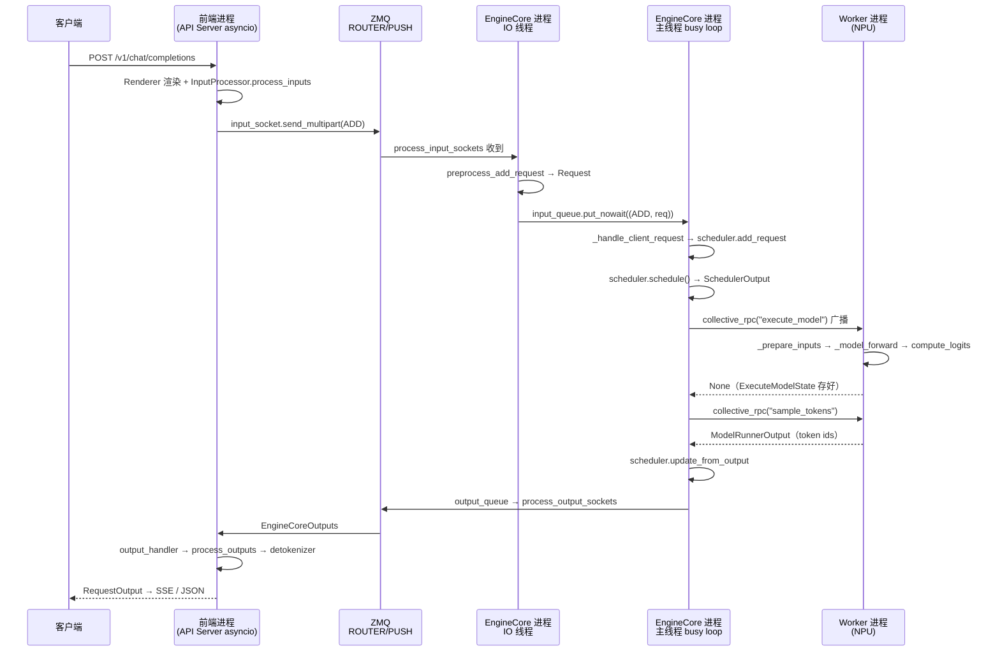
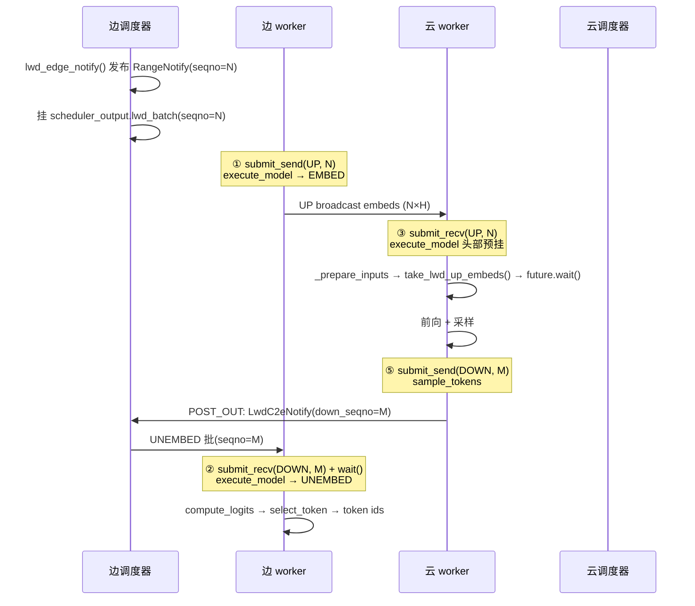
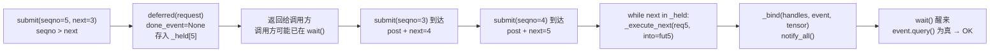

# 请求全链路 · 调用栈

## 0. 范围与前提

本文记录**一个请求从 HTTP 进入到前向结束、最终返回结果**的完整调用栈，精确到文件与函数。

| 项 | 值 |
|---|---|
| 代码基线 | `vllm/vllm/`（已含 LWD prefill_only 补丁）、`vllm-ascend/vllm_ascend/` |
| 行号 | 以本文写作时的基线为准；补丁改动会使行号漂移，符号名是稳定的锚点 |
| 入口 | OpenAI 兼容 API 的 `/v1/chat/completions`（`/v1/completions`、`/v1/responses` 同构） |
| 路径 | 非 LWD 原生路径为主线；LWD 差异见 §7 |

**进程/线程模型**（不变量，后文所有阶段都落在这张表里）：

| 角色 | 进程 | 线程 / 协程 | 主函数 |
|---|---|---|---|
| 前端（API Server） | 前端进程 | asyncio 事件循环 | `create_chat_completion` → `AsyncLLM.generate` |
| 前端 | 前端进程 | `EngineCoreOutputQueueTask` | `core_client.py` `process_outputs_socket()` |
| 前端 | 前端进程 | `output_handler` 协程 | `async_llm.py` `output_handler()` |
| 前端 | 前端进程 | `MPClientEngineMonitor` | `start_engine_core_monitor()` |
| 引擎 | EngineCore 进程 | `process_input_sockets`（daemon） | `core.py` |
| 引擎 | EngineCore 进程 | 主线程 busy loop | `core.py` `run_busy_loop()` |
| 引擎 | EngineCore 进程 | `process_output_sockets`（daemon） | `core.py` |
| 引擎 | EngineCore 进程 | `lwd-pre-out`（仅 LWD 云侧） | `lwd_cloud_engine.py` |
| Worker ×N | Worker 进程 | 主线程 `worker_busy_loop` | `multiproc_executor.py` |
| Worker | Worker 进程 | `WorkerAsyncOutputCopy`（仅 async scheduling） | `async_output_busy_loop()` |

**跨进程边界只有 3 处**：

1. ZMQ 去程（前端 → 引擎）：`input_socket.send_multipart`
2. ZMQ 回程（引擎 → 前端）：`output_socket.send_multipart`
3. 共享内存 MQ（引擎 ↔ worker）：`rpc_broadcast_mq.enqueue` / `worker_response_mq.enqueue`

其余全是同进程 queue。

---

## 1. 全景时序



---

## 2. 阶段 A：前端进程 —— 请求进入并转成 `EngineCoreRequest`

```
vllm/entrypoints/openai/chat_completion/api_router.py
└─ create_chat_completion()                                  # FastAPI 路由入口
   └─ vllm/entrypoints/openai/chat_completion/serving.py
      └─ OpenAIServingChat.create_chat_completion()
         ├─ await self._preprocess_chat(...)                 # Renderer: chat template → engine_input
         ├─ request.to_sampling_params(max_tokens, ...)      # → SamplingParams
         ├─ self._log_inputs(sub_request_id, engine_input, ...)
         └─ serving.py:341  generator = self.engine_client.generate(...)     ★ 进入引擎
            └─ vllm/v1/engine/async_llm.py:524   AsyncLLM.generate()
               └─ async_llm.py:280   AsyncLLM.add_request()
                  ├─ input_processor.process_inputs(...)            ★ 输入预处理
                  │   └─ vllm/v1/engine/input_processor.py:242   InputProcessor.process_inputs()
                  │      ├─ self._validate_params(params, supported_tasks)
                  │      ├─ self._validate_lora(lora_request)
                  │      ├─ self.input_preprocessor.preprocess(prompt, tokenization_kwargs)
                  │      │   └─ vllm/inputs/preprocess.py:274   InputPreprocessor.preprocess()
                  │      │      ├─ _tokenize_prompt() → tokenizer.encode(...)     # 文本 → token id
                  │      │      ├─ _process_multimodal() / _process_embeds()
                  │      │      ├─ _prompt_to_llm_inputs() → _process_decoder_only_prompt()
                  │      │      └─ _truncate_inputs() → _validate_prompt_len()
                  │      ├─ current_platform.validate_request(processed_inputs, params)
                  │      ├─ self._validate_model_inputs(encoder_inputs, decoder_inputs)
                  │      ├─ sampling_params.clone()
                  │      │  ├─ sampling_params.update_from_generation_config(...)
                  │      │  └─ sampling_params.update_from_tokenizer(self.tokenizer)
                  │      └─ return EngineCoreRequest(...)     # 纯数据，可 msgspec 序列化
                  ├─ input_processor.assign_request_id(request)
                  ├─ self._run_output_handler()                     ★ 起输出消费协程（仅首个请求时）
                  │   └─ async_llm.py:637 → asyncio.create_task(output_handler())
                  ├─ queue = RequestOutputCollector(params.output_kind, request.request_id)
                  └─ await self._add_request(request, prompt_text, None, 0, queue)
                     ├─ output_processor.add_request(...)           # output_processor.py:512
                     │   └─ 建 RequestState：detokenizer / logprobs_processor / queue
                     └─ await self.engine_core.add_request_async(request)     ★ 跨进程
                        └─ vllm/v1/engine/core_client.py:1106   AsyncMPClient.add_request_async()
                           ├─ request.client_index = self.client_index
                           ├─ self._ensure_output_queue_task()
                           └─ await self._send_input(ADD, request)
                              └─ core_client.py:1049   _send_input()
                                 └─ core_client.py:1061   _send_input_message()
                                    └─ self.input_socket.send_multipart((engine,) + message)
                                                                  # ZMQ ROUTER(bind) → DEALER(connect)
```

**注意**：

- `Renderer` 渲染 chat template 在 `serving.py` 内完成；`InputProcessor` 只做 **tokenize + 校验 + 打包**。
- `n > 1` 时 `add_request` 会 fan-out 成多个 child request（`ParentRequest.get_child_info`），每个 child 一个独立 `request_id`，共用同一个 `RequestOutputCollector`。
- 帧格式为 `(engine_identity, request_type.value, *encoder.encode(request))`，`engine_identity = engine_index.to_bytes(2, "little")`，DP 场景下前端靠它路由到具体 engine。
- 引用保留：请求里若含 pytorch 张量（多模态），`pending_messages` 会持有引用直到 ZMQ 发完（`add_pending_message` / `free_pending_messages`）。

---

## 3. 阶段 B：跨进程 ZMQ（去程）

```
前端进程 : input_socket  (zmq.ROUTER, bind=True)
                    │  第 1 帧 = engine_identity
                    │  第 2 帧 = request_type.value
                    │  第 3+ 帧 = msgpack(request)（张量走 oob 辅助 buffer，零拷贝）
                    ▼
引擎进程 : input_sockets (zmq.DEALER, connect, identity=identity)
```

引擎启动时会在每个 input socket 上先发一条 `EngineCoreReadyResponse`——**前端必须先收到这条 READY，ROUTER 才能向该 DEALER 回发消息**（ZMQ ROUTER 的连接建立语义）。前端在 `MPClient.__init__` 里用 `while identities:` 阻塞等待，超时抛 `Timed out waiting for engine core processes to start`（受 `VLLM_ENGINE_READY_TIMEOUT_S` 控制）。

---

## 4. 阶段 C：EngineCore 进程 —— IO 线程收帧

```
vllm/v1/engine/core.py
└─ EngineCoreProc.process_input_sockets()                    # 常驻死循环（LWD 云侧有覆写）
   ├─ add_request_decoder = MsgpackDecoder(EngineCoreRequest, oob_tensor_provider=...)
   ├─ generic_decoder     = MsgpackDecoder(oob_tensor_provider=...)
   ├─ input_sockets[i].send(ready_payload)                   # 首次 READY
   └─ while True:
      ├─ poller.poll()
      ├─ type_frame, *data_frames = input_socket.recv_multipart(copy=False)
      ├─ request_type = EngineCoreRequestType(bytes(type_frame.buffer))
      │                 # ADD / ABORT / UTILITY / WAKEUP / EXECUTOR_FAILED
      ├─ if request_type == ADD:
      │   ├─ req = add_request_decoder.decode(data_frames)   # msgpack 反序列化
      │   ├─ request = self.preprocess_add_request(req)      ★ core.py:859
      │   │   └─ EngineCore.preprocess_add_request()
      │   │      ├─ mm_receiver_cache.get_and_update_features(...)      # 多模态
      │   │      ├─ Request.from_engine_core_request(request, self.request_block_hasher)
      │   │      │                                            # → Request（引擎内部对象）
      │   │      └─ if req.use_structured_output:
      │   │           structured_output_manager.grammar_init(req)       # 语法编译（异步）
      │   │   └─ 失败 → self._handle_request_preproc_error(req)         # 回 request-scoped 错误
      │   ├─ if request_type == ABORT: self.aborts_queue.put_nowait(request)
      │   └─ self.input_queue.put_nowait((request_type, request))       ★ 交给主线程
```

**关键设计**：`preprocess_add_request` 在 **IO 线程**里跑，其 docstring 明确写道 *"allow request initialization running in parallel with Model forward"*。所以 tokenize / `Request` 构造 / 语法编译与 GPU 前向重叠，不占主线程时间。

线程安全说明（代码注释原文）：`mm_receiver_cache` 只在输入线程访问；`grammar_init` 只在输入线程调用，且每个请求独立、编译异步，调度器会在排程前检查编译状态。

---

## 5. 阶段 D：EngineCore 主线程 busy loop —— 入队与调度

### 5.1 循环骨架

```
vllm/v1/engine/core.py
└─ EngineCoreProc.run_busy_loop()
   └─ while self._handle_shutdown():
      ├─ self._process_input_queue()                                # ① 等活 & 排干
      │  ├─ while not self.has_work() and self.is_running():
      │  │   ├─ self._notify_idle_state_callbacks()
      │  │   ├─ (input_queue 空 → 清 abort 队列)
      │  │   └─ req = self.input_queue.get(block=...)                # ← 阻塞在这
      │  │      └─ self._handle_client_request(*req)                 ★ core.py:1388
      │  │         └─ ADD 分支:
      │  │            ├─ self._reject_add_in_shutdown(req)           # 关停期拒绝新请求
      │  │            └─ self.add_request(req, request_wave)         ★ core.py:342
      │  │               ├─ 校验 pooling task / kv_transfer_params
      │  │               ├─ self.scheduler.add_request(request)      ★ scheduler.py:1806
      │  │               │   ├─ self._enqueue_waiting_request(request)
      │  │               │   │   └─ self.waiting.add_request(...)     # 进等待队列
      │  │               │   ├─ self.requests[request.request_id] = request
      │  │               │   ├─ if self.connector: self.connector.on_new_request(request)
      │  │               │   └─ if self.log_stats: request.record_event(QUEUED)
      │  │               │   # 重复 request_id → StreamingUpdate / _update_request_as_session
      │  │               └─ if request.abort_immediately: self.abort_requests([...])
      │  └─ while not self.input_queue.empty():                       # 把剩余的一次排干
      │        self._handle_client_request(*self.input_queue.get_nowait())
      └─ self._process_engine_step()                                  # ② 步进
         ├─ outputs, model_executed = self.step_fn()
         ├─ for output in outputs.items(): self.output_queue.put_nowait(output)
         └─ self.post_step(model_executed)
            └─ 非 async scheduling 且 use_spec_decode: take_draft_token_ids()
```

### 5.2 `step_fn` 的选择

```python
# vllm/v1/engine/core.py:192-217
self.batch_queue_size = vllm_config.max_concurrent_batches
self.batch_queue = None
if self.batch_queue_size > 1:
    self.batch_queue = deque(maxlen=self.batch_queue_size)
...
self.step_fn = self.step if self.batch_queue is None else self.step_with_batch_queue
```

即：**`batch_queue_size > 1` 时走流水路径**（`max_concurrent_batches` 由 executor 决定：`MultiprocExecutor` 在 `pp_size > 1` 或 `async_scheduling` 时返回 2）。单卡同步调度走 `step()`。

### 5.3 `step()` 内部（同步路径）

```
vllm/v1/engine/core.py
└─ EngineCore.step()
   ├─ if not self.scheduler.has_requests(): return {}, False
   ├─ scheduler_output = self.scheduler.schedule()                 ★ 核心调度
   │  └─ vllm/v1/core/sched/scheduler.py:340   Scheduler.schedule()
   │     ├─ self.current_step += 1
   │     ├─ self.kv_cache_manager.new_step_starts()
   │     ├─ [RUNNING 循环] while req_index < len(self.running) and token_budget > 0:
   │     │   ├─ async 保护：num_output_placeholders / next_decode_eligible_step
   │     │   ├─ num_new_tokens = num_tokens_with_spec + num_output_placeholders
   │     │   │                  - num_computed_tokens
   │     │   ├─ 截断：long_prefill_token_threshold / token_budget / max_model_len-1-computed
   │     │   ├─ self._try_schedule_encoder_inputs(...)              # 多模态 encoder
   │     │   ├─ self._mamba_block_aligned_split(...)                # 混合模型对齐
   │     │   ├─ self.kv_cache_manager.allocate_slots(...)           # 分配 KV block
   │     │   └─ 分配失败 → self._preempt_request(request, now)      # 抢占
   │     ├─ [WAITING 循环] self._select_waiting_queue_for_scheduling()
   │     │   → 用 running 空位准入 waiting 请求
   │     ├─ self._update_after_schedule(scheduler_output)            # scheduler.py:1002
   │     │   # 乐观推进 num_computed_tokens（LWD 边侧 offset 回退依据）
   │     ├─ self._build_kv_connector_meta(scheduler_output)          # KV 传输元数据
   │     └─ return SchedulerOutput(...)   # num_scheduled_tokens / block_ids / lwd_batch / ...
   ├─ future = self.model_executor.execute_model(scheduler_output, non_block=True)    ★ 派发前向
   ├─ grammar_output = self.scheduler.get_grammar_bitmask(scheduler_output)          # :1310
   ├─ with self.log_error_detail(scheduler_output), self.log_iteration_details(...):
   │   ├─ model_output = future.result()                        ← ★ 等 worker 前向结束
   │   └─ if model_output is None:                              # ← 正常情况必进这里
   │        model_output = self.model_executor.sample_tokens(grammar_output)  ★ 采样
   ├─ self._process_aborts_queue()
   └─ engine_core_outputs = self.scheduler.update_from_output(scheduler_output, model_output)
                                                                    # scheduler.py:1334
```

调度算法注释（`scheduler.py` 原文）值得记住：

> There's no "decoding phase" nor "prefill phase" in the scheduler. Each request just has `num_computed_tokens` and `num_tokens_with_spec`. At each step, the scheduler tries to assign tokens to the requests so that each request's `num_computed_tokens` can catch up its `num_tokens_with_spec`. This is general enough to cover chunked prefills, prefix caching, speculative decoding, and the "jump decoding" optimization in the future.

### 5.4 `step_with_batch_queue()` 内部（流水路径）

与 `step()` 语义相同，差别只在**发射与收割解耦**：

1. `scheduler.schedule()` → `execute_model(non_block=True)` 立即返回 future
2. 若不需要 deferred：`get_grammar_bitmask` → `sample_tokens(non_block=True)`，两个 future 一起 `batch_queue.appendleft((future, scheduler_output, exec_future))`
3. 若 `scheduler_output.pending_structured_output_tokens` 非空 → **deferred 分支**：本轮先不采样，等下一拍先 `take_draft_token_ids()` 再算 bitmask，然后才发 `sample_tokens`
4. 队列满或没活时 `batch_queue.pop()`（最老的一个）→ `future.result()` → `update_from_output`

池化/空步时 `model_output` 直接取 `exec_future`，不发采样。

---

## 6. 阶段 E/F/G：executor 广播 → worker 前向 → 采样

### 6.1 executor 广播

```
vllm/v1/executor/multiproc_executor.py
└─ MultiprocExecutor.execute_model()
   └─ collective_rpc("execute_model",
                     args=(scheduler_output,),
                     unique_reply_rank=self.output_rank,
                     non_block=True,
                     timeout=envs.VLLM_EXECUTE_MODEL_TIMEOUT_SECONDS,
                     kv_output_aggregator=self.kv_output_aggregator)
      ├─ deadline = time.monotonic() + timeout
      ├─ 若 kv_output_aggregator 非 None → output_rank = None（所有 rank 都要回包）
      ├─ send_method = "execute_model" 或 cloudpickle.dumps(callable)
      ├─ self.rpc_broadcast_mq.enqueue((send_method, args, kwargs, output_rank))   ★ 共享内存广播
      └─ return future if non_block else future.result()
```

`output_rank` 由 `_get_output_rank()` 给出：`world_size - tp_size × pcp_size`，即**最后一个 PP stage 的 TP0**。LWD 下硬编码为 `0`（只有边侧 head rank 通过 response mq 回包）。

`FutureWrapper.result()` 会按 FIFO 顺序 drain 前面的 future（`futures_queue.pop()` → `_wait_for_response()`），**保证回包顺序与广播顺序严格一致**——这是 response MQ 单队列的前提。

### 6.2 worker 前向（Key Section）

```
[Worker 进程] vllm/v1/executor/multiproc_executor.py
└─ WorkerProc.worker_busy_loop()
   └─ method, args, kwargs, output_rank = self.rpc_broadcast_mq.dequeue(indefinite=True)
      ├─ func = getattr(self.worker, method)     # 反射取 "execute_model"
      └─ output = func(*args, **kwargs)
         └─ vllm-ascend/vllm_ascend/worker/worker.py:603
            └─ NPUWorker.execute_model(scheduler_output)
               ├─ if self._pp_send_work: 等上一步 PP isend 完成
               ├─ if forward_pass and not pp.is_first_rank and not self.enable_lwd:
               │      intermediate_tensors = get_pp_group().irecv_tensor_dict(...)   # PP 收上游
               └─ self.model_runner.execute_model(scheduler_output, intermediate_tensors)
                  └─ vllm-ascend/vllm_ascend/worker/model_runner_v1.py:1897
                     └─ NPUModelRunner.execute_model()
                        ├─ [LWD] 按 lwd_config 分流到边/云执行路径
                        ├─ if has_kv_transfer_group():
                        │     get_kv_transfer_group().handle_preemptions(kv_connector_metadata)
                        ├─ with self.synchronize_input_prep():
                        │   ├─ deferred_state_corrections_fn = self._update_states(scheduler_output)
                        │   │     # 更新 input_batch：增删请求、block table、sampling metadata
                        │   ├─ with self.maybe_get_ec_connector_output(...):
                        │   │     self._execute_mm_encoder(scheduler_output)        # 多模态 encoder
                        │   ├─ if not num_scheduled_tokens:
                        │   │     → EMPTY_MODEL_RUNNER_OUTPUT 或 kv_connector_no_forward(...)
                        │   └─ self._prepare_inputs(scheduler_output, num_scheduled_tokens)
                        │        ★ model_runner_v1.py:794
                        │        ├─ input_ids / positions / slot_mapping / attn_metadata 组装
                        │        ├─ [LWD 云] LwdCloudModelRunner._prepare_inputs
                        │        │     ├─ _lwd_release_consumed_prompt_embeds()   # 释放已消费缓冲
                        │        │     ├─ _lwd_inject_remote_embeds()             # UP embeds 写入
                        │        │     └─ super()._prepare_inputs(...)
                        │        └─ → logits_indices, spec_decode_metadata, total_num_scheduled_tokens
                        ├─ hidden_states = self._model_forward(...)      ★ model_runner_v1.py:2787
                        │  └─ hidden_states = run_model()
                        │     # = self.model(input_ids, positions, intermediate_tensors, inputs_embeds, ...)
                        │     └─ [各层 Transformer]
                        │        embedding → attention(KV cache 读写) → MoE → ... → final norm
                        ├─ if not pp_group.is_last_rank:
                        │     get_pp_group().send_tensor_dict(...)       # 发下游，返回 IntermediateTensors
                        ├─ logits = self.model.compute_logits(sample_hidden_states)   ★ :2307 / :2318
                        │     └─ ParallelLMHead → lm_head GEMM → [num_reqs, vocab_size] float
                        ├─ self.execute_model_state = ExecuteModelState(...)          ★ :2330
                        │     # (scheduler_output, logits, spec_decode_metadata,
                        │     #  spec_decode_common_attn_metadata, hidden_states,
                        │     #  sample_hidden_states, aux_hidden_states, attn_metadata,
                        │     #  positions, ec_connector_output, cudagraph_stats, batch_desc)
                        ├─ self.kv_connector_output = kv_connector_output
                        ├─ if deferred_state_corrections_fn: deferred_state_corrections_fn()
                        └─ return None       ★★★ 前向结束，但"没有结果"
```

> **这是"前向结束"的精确边界**：`execute_model` 返回 `None` 而不是 `ModelRunnerOutput`。`logits`（`num_reqs × vocab_size` 个 float）留在显存，**没有任何 token id 产生**。

### 6.3 采样 —— 真正的"产出 token"

```
[Worker 进程] WorkerProc.worker_busy_loop() 第二轮 dequeue
└─ func = getattr(self.worker, "sample_tokens")
   └─ vllm-ascend/vllm_ascend/worker/worker.py:674
      └─ NPUWorker.sample_tokens(grammar_output)
         └─ model_runner_v1.py:2353
            └─ NPUModelRunner.sample_tokens(grammar_output)
               ├─ if self.execute_model_state is None:
               │     # PP 非末级 / 上一步没前向
               │     → if not kv_connector_output: return None
               │     → 否则 return EMPTY_MODEL_RUNNER_OUTPUT（带 kv_connector_output）
               ├─ 解包 ExecuteModelState（12 元组）
               ├─ self.execute_model_state = None                ★ 清空，解除状态机锁定
               ├─ if grammar_output is not None:
               │     apply_grammar_bitmask(scheduler_output, grammar_output, input_batch, logits)
               ├─ sampler_output = self._sample(logits, spec_decode_metadata)     ★ :2569
               │     ├─ spec_decode_metadata is None:
               │     │     self.sampler(logits=logits, sampling_metadata=...)
               │     │     └─ vllm/v1/sample/sampler.py:235   Sampler.sample()
               │     │        ├─ greedy_sample(logits)                    # argmax
               │     │        ├─ apply_temperature(logits, ...)
               │     │        ├─ logitsprocs.argmax_invariant 处理器
               │     │        └─ topk_topp_sampler(logits, generators, top_k, top_p)
               │     └─ 否则: self.rejection_sampler(spec_decode_metadata, None, logits, ...)
               │     → sampled_token_ids: [num_reqs, 1] int
               ├─ if self.need_accepted_tokens: self.sampling_done_event.record()
               ├─ self._bookkeeping_sync(...)                     ★ :2599
               │     ├─ sampled_token_ids → CPU（_to_list）→ list[list[int]]
               │     ├─ logprobs_tensors.tolists()
               │     ├─ discard_sampled_tokens_req_indices 屏蔽（chunked prefill 非末块）
               │     └─ req_ids_output_copy / req_id_to_index_output_copy
               ├─ with record_function_or_nullcontext("draft_token"):
               │     └─ propose_draft_token_ids(...)              ★ :1611（EAGLE / MTP / ngram）
               │        ├─ self.drafter.model(...) 或 MTP 层
               │        └─ self._copy_draft_token_ids_to_cpu(scheduler_output)
               ├─ if self.speculative_config: self.finalize_kv_connector()
               ├─ model_runner_output = ModelRunnerOutput(
               │     req_ids=..., req_id_to_index=..., sampled_token_ids=valid_sampled_token_ids,
               │     logprobs=..., prompt_logprobs_dict=..., kv_connector_output=..., ...)
               ├─ [LWD 云] target.lwd_c2e_meta = meta（挂在 _model_runner_output 内层）
               ├─ async 路径 → AsyncGPUModelRunnerOutput(...)（D2H 走 copy stream）
               └─ return model_runner_output / async_output
```

**前向 vs 采样的语义分工**：

| | `execute_model` | `sample_tokens` |
|---|---|---|
| 语义 | 模型前向：embedding/attention/MoE → logits、hidden | 采样与后处理：bitmask → sampler → draft → bookkeeping → 打包 |
| 输入 | `scheduler_output`（大对象） | `grammar_output`（小对象，可为 `None`） |
| 返回 | 正常路径 `None`；无活干 `EMPTY_MODEL_RUNNER_OUTPUT`；PP 非末级 `IntermediateTensors` | `ModelRunnerOutput` / `AsyncModelRunnerOutput` |
| 数据量 | `num_reqs × vocab_size` 个 float（如 8×152064 ≈ 1.2M） | `num_reqs` 个 int（如 8） |
| 副作用 | 写 `execute_model_state` / `kv_connector_output` | 消费并清空该状态；写 `input_batch`；跑 draft；可能 `finalize_kv_connector()` |

**状态机契约**（`model_runner_v1.py:1917`）：

```python
if self.execute_model_state is not None:
    raise RuntimeError("State error: sample_tokens() must be called after execute_model() returns None.")
```

即 `execute_model` → `sample_tokens` 必须**严格配对、中间不可插入第二发前向**。

**为什么必须拆成两发**：

1. **grammar bitmask 依赖上一轮信息**：结构化输出要算合法 token，而它依赖上一轮 draft token ids。若在 `execute_model` 内直接采样，无法插入"等 `take_draft_token_ids`"这一步。
2. **异步调度 / PP 流水的错位需要**：前向是百毫秒级重计算，采样是毫秒级短控制。拆开后 `batch_queue`（`maxlen = max_concurrent_batches`）可以一边收结果一边调度下一步，填 PP 气泡。
3. **PP 非末级 rank 没有 logits**：拆开后这些 rank 的 `sample_tokens` 可早退（`execute_model_state is None`）。

---

## 7. 阶段 H/I：回程 —— 结果回到客户端

### 7.1 worker → EngineCore

```
[Worker] WorkerProc.handle_output(output)          multiproc_executor.py:999 enqueue_output()
├─ if isinstance(output, AsyncModelRunnerOutput): output = output.get_output()
├─ result = (ResponseStatus.SUCCESS, output)  或 (FAILURE, str(e))
└─ self.worker_response_mq.enqueue(result)          # 共享内存 MQ，单写者
   ↓（只有 _owns_rpc_reply(output_rank) 的 rank 会回包）
[EngineCore] FutureWrapper._wait_for_response() → get_response()
├─ status, result = mq.dequeue(timeout=deadline - now)
├─ if status != SUCCESS: raise RuntimeError("Worker failed with error '...'")
└─ set_result(self.aggregate(responses))
   ↓
core.py    model_output = future.result()
core.py    if model_output is None: model_output = sample_tokens(...)     # 若走 step()
core.py    self._process_aborts_queue()
core.py    engine_core_outputs = self.scheduler.update_from_output(scheduler_output, model_output)
           └─ vllm/v1/core/sched/scheduler.py:1334   Scheduler.update_from_output()
              ├─ 逐请求 _update_request_with_output(request, new_token_ids)
              │   ├─ request.append_output_token_ids(...)
              │   ├─ self._check_stop(request, max_model_len)
              │   │     # EOS / stop_token_ids / max_tokens / max_model_len → RequestStatus
              │   └─ FINISHED_STOPPED / FINISHED_LENGTH_CAPPED / ...
              ├─ self._handle_stopped_request(request) → self._free_request(...) → 释放 blocks
              ├─ 构造 EngineCoreOutput(request_id, new_token_ids, finish_reason, stop_reason, ...)
              ├─ self._connector_finished(request)      # KV connector 收尾
              └─ return {client_index: EngineCoreOutputs(outputs=[...], finished_requests=...)}
   ↓
core.py    for output in outputs.items(): self.output_queue.put_nowait(output)    # 同进程跨线程
core.py    self.post_step(model_executed)
```

超时错误文案可以直接区分是哪一发挂住：

- `RPC call to execute_model timed out.` → 前向段
- `RPC call to sample_tokens timed out.` → 采样/后处理段

### 7.2 EngineCore → 前端

```
[EngineCore 进程] vllm/v1/engine/core.py
└─ EngineCoreProc.process_output_sockets()
   ├─ output = self.output_queue.get()                    # ← 阻塞
   ├─ if output == ENGINE_CORE_DEAD: 广播哨兵帧后 break
   ├─ client_index, outputs = output
   ├─ if client_index == -1: coord_socket.send_multipart(...)   # DP coordinator，不复用 buffer
   ├─ buffers = encoder.encode_into(outputs, buffer)       # MsgpackEncoder，零拷贝复用 buffer
   └─ sockets[client_index].send_multipart(buffers, copy=False, track=True)   # ZMQ PUSH
      # linger=4000，保证 ENGINE_CORE_DEAD 能发出
   ↓
[前端进程] vllm/v1/engine/core_client.py
└─ AsyncMPClient._ensure_output_queue_task() → process_outputs_socket()
   ├─ frames = await output_socket.recv_multipart(copy=False)
   ├─ resources.validate_alive(frames)                     # 单帧 ENGINE_CORE_DEAD → EngineDeadError
   ├─ outputs = decoder.decode(frames)                     # MsgpackDecoder(EngineCoreOutputs)
   ├─ if outputs.utility_output:
   │     ├─ EEP_NOTIFICATION_CALL_ID → notification_callback_handler(...)
   │     └─ 否则 _process_utility_output(...)              # 直接 resolve future，不入 outputs_queue
   │     → continue
   ├─ if output_handler: await output_handler(_self, outputs)   # DP 负载均衡钩子
   └─ if outputs.outputs or outputs.scheduler_stats:
         outputs_queue.put_nowait(outputs)
```

### 7.3 前端 —— 解流、detokenize、返回

```
[前端进程] vllm/v1/engine/async_llm.py
└─ output_handler()                                          # :656，首个请求时 create_task，之后常驻
   ├─ outputs = await engine_core.get_output_async()          # core_client.py:1038
   ├─ 按 VLLM_V1_OUTPUT_PROC_CHUNK_SIZE 切片（避免长占事件循环）
   └─ output_processor.process_outputs(outputs_slice, outputs.timestamp, iteration_stats)
      └─ vllm/v1/engine/output_processor.py:576   OutputProcessor.process_outputs()
         ├─ req_state = self.request_states.get(req_id)     # 已被 abort 的输出直接忽略
         ├─ self._update_stats_from_output(...)             # 计时统计
         ├─ stop_string = req_state.detokenizer.update(new_token_ids, finish_reason==STOP)
         │     # ★ 增量 detokenize；命中 stop string 时改写 finish_reason / stop_reason
         ├─ req_state.logprobs_processor.update_from_output(engine_core_output)
         ├─ request_output = req_state.make_request_output(...)     # → RequestOutput
         ├─ req_state.queue.put(request_output)             # ★ 推入 RequestOutputCollector
         ├─ if finish_reason:
         │     ├─ self._finish_request(req_state)           # 释放 detokenizer / logprobs
         │     ├─ if not engine_core_output.finished: reqs_to_abort.append(req_id)
         │     └─ self._update_stats_from_finished(...) / do_tracing(...)
         └─ return OutputProcessorOutput(request_outputs=[], reqs_to_abort=[...])
   ↓
async_llm.py   generate() 的消费循环
├─ out = q.get_nowait() or await q.get()
├─ finished = out.finished
└─ yield out          → 回到 serving.py 的 full_generator / stream_generator
   ↓
vllm/entrypoints/openai/chat_completion/serving.py
├─ chat_completion_full_generator()      # 非流式：组装 ChatCompletionResponse
└─ 流式：yield SSE chunk（`data: {...}\n\n`，末尾 `data: [DONE]`）
   ↓
FastAPI → 客户端
```

**唯一的反向控制流**：`reqs_to_abort`。如果 detokenizer 检测到 stop string，但 EngineCore 并不知情（引擎只认 token 级停止条件），前端会回头 `engine_core.abort_requests_async(...)` 通知引擎终止。这是"前端 → 引擎"的第二条命令通道。

---

## 8. 排障锚点

| 症状 | 卡点 | 定位手段 |
|---|---|---|
| 请求刚进来就 5xx | `InputProcessor` / `_validate_*` | 前端日志，`ValueError` 文案明确 |
| `Timed out waiting for engine core processes to start` | 引擎进程启动失败 | `VLLM_ENGINE_READY_TIMEOUT_S`；看引擎进程栈 |
| `RPC call to execute_model timed out` | worker 前向卡住 | `VLLM_EXECUTE_MODEL_TIMEOUT_SECONDS`；worker 进程栈 |
| `RPC call to sample_tokens timed out` | sampler / draft / KV connector 收尾卡住 | 同上，但看采样段 |
| `State error: sample_tokens() must be called after execute_model() returns None` | 前向/采样配对被打乱 | `model_runner_v1.py`；通常是异常路径吞掉了 `sample_tokens` |
| 前端 `poller.poll()` 无产出 | 引擎主线程卡在 `step_fn()` | `py-spy dump` 引擎进程主线程 |
| `EngineDeadError` | 引擎进程死了 | `validate_alive` 收到 `ENGINE_CORE_DEAD`；引擎进程栈有 fatal |
| token 出但文本不对 | detokenizer / logprobs 阶段 | 前端 `OutputProcessor.process_outputs` |
| worker 进程莫名消失 | `MultiprocWorkerMonitor` 报 `Worker proc %s died` | `multiproc_executor.py start_worker_monitor` |
| LWD 下边侧一直 awaiting | 云没发 `C2eNotify` 或 DOWN 通道失配 | `[Lwd][cloud-ctrl] publish C2eNotify` vs `[Lwd][edge-deliver]` |
| LWD 数据面卡住（两侧都不动） | 某条 FIFO 出现 seqno 空洞，后续全被 `_held` 扣留 | `[lwd-comm] held out-of-order ...` warning；对照 `[lwd-comm] SEND/RECV post` 的 seqno 与 `dist.get_rank()`（见 §10） |
| `seqno N was skipped (aborted)` | abort 竞态：已被 `skip_seqno` 的号又到达 | 见 §10.5 分支表；当前 `skip_seqno` 无调用方，出现即表示有人接上了它 |

---

## 9. LWD prefill_only 的差异

LWD 模式复用上述全部骨架，只在**类选择点**、**调度语义**、**前向/采样内容**上替换。

| 环节 | 原生 | LWD |
|---|---|---|
| 引擎类 | `EngineCoreProc` | `lwd_resolve_engine_cls()` 分流：`LwdEdgeEngineCore` / `LwdCloudEngineCore`（`vllm/v1/lwd_control/__init__.py`） |
| 调度器 | `Scheduler` | 边：`LwdEdgeScheduler`（单请求组批 + 控云水位）；云：`LwdCloudPhaseScheduler`（相位 prefill/decode 交替） |
| step | `step()` / `step_with_batch_queue()` | 边侧两者都覆写为 `_lwd_edge_step()`（同步路径，不用 batch_queue） |
| IO 线程 | 原生 `process_input_sockets` | 云侧覆写：先起 `lwd-pre-out` 线程（PRE_OUT 收边 + 首拍 HELLO），再走原生 |
| 前向 | `execute_model` → 全模型 → `compute_logits` | 边：`_execute_lwd_embed`（**只有 embedding**，0 层拓扑、无 KV、无 attention）；云：`LwdCloudModelRunner` 注入 UP embeds 后跑全模型 |
| 采样 | `sample_tokens` → token id | 云算出 `top_id_th`（降序秩）而非 token id；边 `_execute_lwd_unembed` 收 DOWN hidden → `compute_logits` → 按 `top_id_th` 恢复 token id |
| 输出 | `update_from_output` → `OutputProcessor` | 云经 POST_OUT 发 `LwdC2eNotify`（携 `down_seqno` / `finish_reasons`）；边引擎 `_lwd_edge_consume_c2e` 组 `UNEMBED` 批，出 `EngineCoreOutput` |
| `sample_tokens` 附加动作 | 无 | **云侧在此发 DOWN hidden**（`lwd_cloud_worker.py`），并挂 `lwd_c2e_meta` 到 `_model_runner_output` 内层 |
| 边侧 `sample_tokens` | 有 | **不用**——边 worker 的 `execute_model` 直接返回 `ModelRunnerOutput`（劫持契约） |

**数据面与控制面**：

| 面 | 通道 | 载体 |
|---|---|---|
| 控制面 | POST_OUT（边 bind / 云 connect）+ PRE_OUT（云 bind / 边 connect） | ZMQ，`LwdRangeNotify` / `LwdRequestNotify` / `LwdAbortNotify` / `LwdC2eNotify` / `LwdHelloNotify` |
| 数据面 | UP（边 → 云，embeds）/ DOWN（云 → 边，hidden） | HCCL P2P，**无 tag，按 seqno 严格配对**；submit 调用点见 **§10** |

**LWD 下"前向结束"这个边界跨两台机器**：

```
边的前向（embed）→ UP → 云的前向 → 云采样 → DOWN → 边的 unembed
```

链路比原生长一倍，但**每个进程内部的调用栈结构完全不变**——排障时先按 §8 定位到进程与线程，再按 LWD 表判断是哪一跳。

---

## 10. LWD 数据面 · `submit` 调用点

数据面（UP/DOWN 两条 HCCL 通道）的**唯一入口**是 `LwdChannel.submit`，上游只有 `LwdCommService._submit` 一个调用者，再上游只有 5 个业务调用点。全仓库搜 `submit_send` / `submit_recv` 只会命中这些。

### 10.1 调用链与唯一上游

```
LwdCommService.submit_send(request)      # vllm_ascend/distributed/lwd_comm/service.py:51
LwdCommService.submit_recv(request)      # 同上 :55
└─ LwdCommService._submit(request)       # 同上 :111
   ├─ key = (request.channel, request.op)          ★ FIFO 按 (通道, 方向) 分桶
   ├─ channel = self._channels.get(key) or LwdChannel(request.channel, request.op)
   └─ return channel.submit(request)               # channel.py:98  ★ 唯一调用者
      ├─ if request.op != self.op: raise RuntimeError("op mismatch ...")
      ├─ finalized = self._reap(); self._finalize_many(finalized)   # 惰性回收 keepalive
      ├─ if op == "send": request = self._snapshot_send(request)    # detach().clone()
      └─ with self._submission_lock:
         ├─ if request.seqno is not None: return self._submit_sequenced(request)  # channel.py:125
         └─ else:                          return self._execute_next(request)     # channel.py:173
```

`service.py` 的模块 docstring 界定了职责边界：

> Compute side only ever calls `submit_send` / `submit_recv` and consumes `LwdCommFuture` notifications. `poll_completions` is meant to be invoked from an existing host loop head (worker busy loop).

**FIFO 的键是 `(channel, op)` 而非 `channel`** —— 这点很关键，两侧各只有 2 条 FIFO，且 `_next_seqno` 是每条 FIFO 独立一份：

```python
# service.py 注释原文
# HCCL ordering is per physical (channel, direction): send and recv have
# INDEPENDENT seqno streams (each peer's send order must match the other
# side's recv-post order), so the FIFO key is (channel, op) — merging them
# would make a process's sends and recvs on one channel collide on a shared
# seqno counter.
```

因此边侧的 `(UP, send)` 与云侧的 `(UP, recv)` 是**两个独立计数器**，靠控制面下发的同一个 seqno 值保证语义对齐（不是共享状态）。

### 10.2 5 个调用点全表

| # | 侧 | 文件:行 | 所在方法 | `(channel, op)` | seqno 来源 |
|---|---|---|---|---|---|
| ① | **边** | `worker/lwd_edge_worker.py:173` | `_execute_lwd_embed` ← `execute_model` | `(UP, send)` | `LwdBatch.seqno` |
| ② | **边** | `worker/lwd_edge_worker.py:182` | `_execute_lwd_unembed` ← `execute_model` | `(DOWN, recv)` | `LwdBatch.seqno` |
| ③ | **云** | `worker/lwd_cloud/lwd_cloud_worker.py:183` | `_lwd_up_post_recvs` ← `execute_model` | `(UP, recv)` | `LwdBatch.seqno` |
| ④ | **云** | `worker/lwd_cloud/lwd_cloud_worker.py:218` | `_lwd_up_drain` ← `execute_model` | `(UP, recv)` | drain 条目 `(seqno, num_tokens)` |
| ⑤ | **云** | `worker/lwd_cloud/lwd_cloud_worker.py:274` | `sample_tokens` | `(DOWN, send)` | `self._lwd_next_down_seqno()` |

外加一个**非 submit 的服务调用**：`poll_completions()`（`service.py:65`），云侧在 `execute_model` 开头调一次（`lwd_cloud_worker.py:153`，注释 `lazy keepalive reap`），内部对每条 channel 调 `reap()`（`channel.py:190`），**不经过 `submit`**。

### 10.3 五个点的代码形态

```python
# ① 边 UP send —— execute_model → LWD_EMBED 分支，不阻塞
embeds = model.embed_input_ids(token_ids_tensor)      # (total_N, H)
self.comm_service.submit_send(LwdCommRequest(
    channel=LwdChannelType.UP, op="send",
    num_elements=embeds.numel(), tensor=embeds, seqno=seqno))

# ② 边 DOWN recv —— execute_model → LWD_UNEMBED 分支，后面紧接 wait()
recv_future = self.comm_service.submit_recv(LwdCommRequest(
    channel=LwdChannelType.DOWN, op="recv",
    num_elements=batch_meta.recv_num_elements, seqno=seqno))
result = recv_future.wait()                           # ★ 阻塞在这（future.py:110）

# ③ 云 UP recv —— execute_model 头部预挂，不等待
future = get_lwd_comm_service().submit_recv(LwdCommRequest(
    channel=LwdChannelType.UP, op="recv",
    num_elements=num_tokens * hidden_size, seqno=batch.seqno))
self._lwd_up_recv_futures[batch.seqno] = (future, meta)   # 存起来，稍后 wait

# ④ 云 UP drain —— execute_model 内，只收不消费 future
service.submit_recv(LwdCommRequest(
    channel=LwdChannelType.UP, op="recv",
    num_elements=num_tokens * hidden_size, seqno=seqno))

# ⑤ 云 DOWN send —— sample_tokens 内，不阻塞
hidden = self.model_runner.take_lwd_pending_down_packet()
seqno = self._lwd_next_down_seqno()
get_lwd_comm_service().submit_send(LwdCommRequest(
    channel=LwdChannelType.DOWN, op="send",
    num_elements=hidden.numel(), tensor=hidden, seqno=seqno))
```

### 10.4 边 vs 云：镜像对称

```
              UP  (edge → cloud)             DOWN (cloud → edge)
              ────────────────────           ──────────────────────
边侧 worker   ① submit_send                  ② submit_recv + wait()
              execute_model                  execute_model
              「产出 embeds」                 「消费 hidden，做 lm_head」

云侧 worker   ③④ submit_recv                ⑤ submit_send
              execute_model 头部              sample_tokens
              「消费 embeds 注入前向」         「采样后收集 hidden」
```

| 维度 | 边 | 云 |
|---|---|---|
| 拥有的 FIFO | `(UP, send)`、`(DOWN, recv)` | `(UP, recv)`、`(DOWN, send)` |
| 触发时机 | 都在 `execute_model`（EMBED 批 / UNEMBED 批） | UP 在 `execute_model` 头部；**DOWN 在 `sample_tokens`** |
| 是否阻塞当前步 | UP 发不阻塞；DOWN 收**阻塞**（`future.wait()`） | UP 预挂不阻塞（存 `_lwd_up_recv_futures`，真正 wait 在 `_prepare_inputs` 的 `take_lwd_up_embeds`）；DOWN 发不阻塞 |
| seqno 来源 | 调度器挂的 `lwd_batch.seqno`（UP/DOWN 各自独立计数器） | UP 同左；**DOWN 用 worker 自己的 `_lwd_next_down_seqno()`** |
| 物理原语 | UP: `dist.broadcast(src=0, async_op=True)`；DOWN: `dist.irecv` | UP: `dist.broadcast(src=0, async_op=True)`；DOWN: `dist.isend` |
| 参与集合 | UP 只有 rank 0 真正 submit（集合操作的一部分） | UP **每个 TP rank** 都 submit recv |
| FIFO 条数 | 2 | 2 |

**UP 通道不是点对点**，`channel.py` 的 `_wire_send` / `_wire_recv` 里有明确注释：

```python
# UP(边→云)用全 world 广播:embeds 对云侧每个 TP rank 都必须
# 可见,广播免去"leader 收完再组内分发",不存在内部 rank 的特殊
# 路径;DOWN(云 leader→边)保持点对点。
```

`async_op=True` 也是必需的（`_wire_send` 注释）：

> `async_op=True`: 通道靠 `handle.wait()` 做流式桥接；不带此参时 `broadcast` 同步阻塞执行并返回 `None`，通道拿到 `None` 必崩。

### 10.5 `submit` 内部的四个分支

| 分支 | 条件 | 行为 | 何时走 |
|---|---|---|---|
| op 校验失败 | `request.op != self.op` | 立即 `raise RuntimeError(...)` | 防 `_channels` 键被误用 |
| `seqno is None` | — | `_execute_next(request)` 直接发 | **当前 LWD 部署永不发生**（5 个点都传了 seqno），demo 分支遗留能力 |
| `seqno == _next_seqno` | 顺序到达 | `_execute_next()`，然后 `while _next_seqno in _held` 消化乱序项 | 正常路径 |
| `seqno > _next_seqno` | 上游乱序 | 存进 `_held`，返回 `LwdCommFuture.deferred(request)`（`future.py:58`），**不 post HCCL** | 罕见 |
| `seqno < _next_seqno` 或在 `_skipped` | 重复 / 已 abort | 打 warning，返回已 `_finalize(error)` 的 future，**不崩进程** | abort 竞态 |

**为什么必须有重排缓冲**（`channel.py` 模块 docstring）：

> per-channel seqno reorder buffer: ops are posted to HCCL only once all lower seqnos have been submitted, so the send order and the peer's recv-post order always agree (HCCL P2P has no tags)

即 HCCL P2P **没有 tag**，配对完全靠"投递顺序"。所以真正 post 是按 **seqno 顺序**，而非调用顺序。

**`_snapshot_send` 的必要性**（docstring：*graph replay / staging buffer reuse safety*）：`execute_model` 里 `embed_input_ids` 的输出可能落在会被复用的 staging buffer 上，所以 submit 入口立即 `detach().clone()` 夺走所有权。

### 10.6 时序：submit 在请求生命周期中的位置



注意 ② 的 seqno `M` 来自**云侧自增** `_lwd_next_down_seqno()`，经控制面 `LwdC2eNotify.down_seqno` 通告给边，边据此预挂 irecv（`lwd_cloud_worker.py` 注释：*"Carry the DOWN seqno back so the edge can post its matching irecv (tag-less HCCL pairing)"*）。而 UP 的 seqno `N` 由**边侧调度器**分配（`lwd_edge_scheduler.lwd_edge_notify` 的 peek-then-advance），经 `LwdRangeNotify` 通告给云。

### 10.7 容易踩的点

1. **`submit` 的调用线程 = worker busy loop 主线程**。5 个点全部落在 `execute_model` / `sample_tokens` 内，即 `MultiprocExecutor.WorkerProc.worker_busy_loop` 的单线程循环里。`_submission_lock` / `_lock` 是为 demo 分支的多线程场景保留的，当前部署实际串行。

2. **两侧 recv 的等待时机不对称**。边侧 `submit_recv(DOWN)` 后**立刻** `wait()`（阻塞 worker 直到对端真的发来）；云侧 `submit_recv(UP)` 是**预挂、稍后才 wait**。边侧这个阻塞点正是死锁排查的常见落点（`Receive intermediate tensors from cloud after` 一带）。

3. **drain 路径（④）的 future 无人消费**。`_lwd_up_drain` 丢弃返回值，靠 `poll_completions` 惰性回收（注释：*"The futures are never consumed; completion is reaped by poll_completions"*）。

4. **`skip_seqno` 目前无调用方**。`channel.py:60` 实现了 `skip_seqno` / `_advance_past_skipped`（`:84`），`service.py:76` 也暴露了 `skip_seqno(channel_type, seqno, op)`，但全仓库搜不到调用点。这与 `assets/vllm-ascend/请求abort-设计.md` §2.4 的结论一致：语义不成立（send 已在途不可收回），abort 只能用 recv-and-drop 排空。

5. **`_reap()` 在 `submit` 里被调用**，keepalive 的释放点不是独立 GC，而是"下一次 submit 顺手回收"。若一条 channel 长时间无新 submit，已完成的 future 会一直持有 tensor 引用 —— 这就是云侧要在 `execute_model` 开头显式 `poll_completions()` 的原因。

6. **`stop` 时的失败语义**。`shutdown`（`channel.py:201`）会先把 `_held` 里"永不会被 post"的 deferred future 全部 `_finalize(error)` 再等 `_pending`，注释说明动机：*"their waiters must not hang until the readiness-gate timeout"*。

### 10.8 乱序暂扣：`deferred` future 机制

`_submit_sequenced` 里唯一"不 post HCCL 却要返回一个 future"的分支（`channel.py:158`）：

```python
future = LwdCommFuture.deferred(request)
self._held[seqno] = (request, future)
```

#### 它构造出了什么

```python
# future.py:58
@classmethod
def deferred(cls, request: LwdCommRequest) -> "LwdCommFuture":
    return cls(request, [], None)
#              └────┬───┘ └┬┘
#              handles=[]  done_event=None      ← 两个成员都是"空"
```

| 字段 | 正常 future | deferred future |
|---|---|---|
| `handles` | `[<HCCL async handle>]` | `[]` |
| `done_event` | `torch.npu.Event`（已 record） | `None` |
| `tensor`（recv） | 已分配的输出 buffer | `None` |
| `keepalive`（send） | 快照张量 | `None` |
| `_status` | `PENDING` | `PENDING` |

即这个 future 目前**指向"空气"**，没有任何设备侧对象可查。

#### 为什么必须这样做

模块 docstring 的核心约束：

> per-channel seqno reorder buffer: ops are posted to HCCL only once all lower seqnos have been submitted, so the send order and the peer's recv-post order always agree (HCCL P2P has no tags)

HCCL P2P 靠投递顺序配对、**没有 tag**。若 `seqno=5` 先到而 `seqno=3` 未到，直接把 5 post 出去，对端 `3,4,5` 就会错配到 `5,x,x` —— 整条通道数据全错。所以规则是**只按 seqno 顺序 post**。

注意 `_held` 与 `_pending` 是两个不同的容器：

| | 含义 | 参与 `_reap()` 顺序完成判定 |
|---|---|---|
| `_pending` | 已 post 出去的 FIFO 尾巴链 | 是 |
| `_held` | 尚未 post 的暂存区（按 seqno 索引） | 否 |

#### 后续如何"填实"：原地 `_bind`

轮到它时（`seqno == _next_seqno`），由 `_execute_next(held_request, into=held_future)` 把设备事件**原地注入**这个占位对象：

```python
# channel.py — _submit_sequenced 尾部
future = self._execute_next(request)
self._next_seqno += 1
while self._next_seqno in self._held:
    held_request, held_future = self._held.pop(self._next_seqno)
    self._execute_next(held_request, into=held_future)     # ★ into= 走 _bind 分支
    self._next_seqno += 1
```

```python
# channel.py — _execute 末尾
if into is None:
    return LwdCommFuture(...)        # 新建对象
into._bind(                          # ★ 复用占位对象，不新建
    handles=handles, done_event=done_event, tensor=tensor, keepalive=keepalive)
return into
```

```python
# future.py:63
def _bind(self, *, handles, done_event, tensor=None, keepalive=None):
    with self._done_cond:
        self._handles = handles
        self._done_event = done_event
        self._tensor = tensor
        self._keepalive = keepalive
        self._done_cond.notify_all()      # ★ 唤醒已在 wait() 上睡着的人
```

**"同一对象原地绑定"是整个设计的关键** —— 调用方手里拿的就是这个对象，若换成新建对象，它那份永远 PENDING。



#### 对调用方的意义：API 统一

`submit_recv` 永远返回一个可 `wait()` 的 future，调用方**不需要知道 op 是立刻 post 还是被暂扣**。`wait()` 里专门有 unbound 分支：

```python
# future.py:110 附近
while self._status is LwdCommStatus.PENDING:
    if self._done_event is None:
        # Deferred future not yet bound; wait for _bind.
        ...
        self._done_cond.wait(timeout=remaining or 0.05)   # ← 等条件变量，非忙轮询
        continue
    if self._done_event.query(): ...
```

超时抛 `lwd-comm wait timed out (unbound) on {channel} seqno={N}`。

`done()` 对 deferred 也安全：`event is None` → 直接 `return False`（*"Pure CPU query; never blocks, never touches the device"*），所以 `_reap()` 不会误把它当完成。

#### 三个相关边角

**① 重复提交保护**（就在 `deferred` 的上一行）

```python
if seqno in self._held:
    return self._held[seqno][1]     # 返回已有的 deferred future
```

若不做此检查直接覆盖 `_held[seqno]`，第一次返回给调用方的对象**永远等不到 `_bind`**，其 `wait()` 会挂到超时。

**② 异常终结路径**：`skip_seqno` / `shutdown` 对 `_held` 里的 deferred future 调 `_finalize(error=...)`，直接置 ERROR + `notify_all`，让等待方**立刻失败**而非干等超时。

**③ `_finalize()` 无 error 时不误判**：

```python
self._status = (LwdCommStatus.OK
                if (self._done_event is not None and self._done_event.query())
                else self._status)     # done_event 为 None → 保持 PENDING
```

#### 实际会不会走到这里

按 §10.2 的 5 个调用点，**seqno 全是有序产生的**：

| 调用点 | seqno 生成方式 | 顺序性 |
|---|---|---|
| 边 `(UP, send)` | 调度器 peek-then-advance | 有序 |
| 云 `(UP, recv)` | `prefill_notify_queue` popleft（ZMQ FIFO 入队） | 有序 |
| 云 drain `(UP, recv)` | 同上，逐条 pop | 有序 |
| 云 `(DOWN, send)` | `_lwd_next_down_seqno()` 自增 | 有序 |
| 边 `(DOWN, recv)` | 云通告的 `down_seqno` | 有序 |

所以**当前部署下这是防御性代码**。反过来说：

- 若看到 `[lwd-comm] held out-of-order ... seqno=N (next=M)`（**DEBUG 级别**，默认不可见），说明某调用点破坏了"按序提交"前提；
- 若持续 held 且 `next` 不推进 → **通道队头阻塞**，后续请求在 `_held` 越积越多、`_pending` 不增长，两侧都不动（对应 §8 那条排障锚点）。

---

## 11. `submit_send` / `submit_recv` 完整调用链

`service.py:51` / `:55` 这两个薄封装是整个数据面的**唯一业务入口**。它们本身只做 op 断言 + 转发 `_submit`，但调用它们的四条链跨越**两台机器、四个进程角色、四类线程**。下面逐条从引擎步进一直追到 HCCL 原语。

```
            ┌────────────────── 边侧 ──────────────────┐   ┌────────────────── 云侧 ──────────────────┐
            │                                          │   │                                          │
  链①  UP   │  调度器 lwd_edge_notify                  │   │  调度器 _schedule_pure_prefill            │  链③
            │    ↓ 挂 lwd_batch(seqno=N)               │   │    ↓ 取 notify.seqno / 挂 lwd_batch       │
            │  引擎 _lwd_dispatch_embed                │   │  引擎 step → execute_model               │
            │    ↓ execute_model(non_block)            │   │    ↓ execute_model                        │
            │  worker _execute_lwd_embed               │   │  worker _lwd_up_post_recvs               │
            │    ↓ **submit_send(UP, N)**              │   │    ↓ **submit_recv(UP, N)**              │
            │    ↓ embed_input_ids → broadcast         │   │    ↓ (预挂，稍后 take_lwd_up_embeds wait)│
            │                                          │   │                                          │
            │  worker _execute_lwd_unembed             │   │  worker sample_tokens                     │  链④
            │    ↑ **submit_recv(DOWN, M) + wait()**   │   │    ↑ **submit_send(DOWN, M)**            │
            │  引擎 _lwd_dispatch_unembed              │   │  引擎 sample_tokens → c2e_meta            │
            │    ↑ _lwd_deliver_notify                 │   │    ↑ lwd_process_model_output             │
  链②  DOWN │    ↑ _lwd_edge_consume_c2e               │   │    ↑ publish C2eNotify(down_seqno=M)      │
            └──────────────────────────────────────────┘   └──────────────────────────────────────────┘
```

### 11.1 链 ①：边 UP send（EMBED 批）

**触发时机**：边引擎每个有 prefill 工作的 step，且 `lwd_edge_notify` 发布成功。

```
[边 EngineCore 主线程] LwdEdgeEngineCore._lwd_edge_step()          lwd_edge_engine.py:205
├─ outputs, finished_reqs = self._lwd_edge_consume_c2e()           # 链②，见 11.2
├─ executed = {}
└─ if self.scheduler.has_requests():
   ├─ scheduler_output = self.scheduler.schedule()                 # → LwdEdgeScheduler._lwd_schedule_single
   ├─ future = self._lwd_dispatch_embed(scheduler_output)          ★ :328
   │  └─ if not self.scheduler.lwd_edge_notify(scheduler_output):  # lwd_edge_scheduler.py:171
   │     │   # 发布 LwdRangeNotify(seqno=N) + 挂 SO.lwd_batch(LWD_EMBED, seqno=N)
   │     └─ return None                                            # 发布失败 → 本步不派发
   │  └─ return self.model_executor.execute_model(scheduler_output, non_block=True)
   │     └─ MultiprocExecutor.execute_model → collective_rpc("execute_model", ...)
   │        └─ rpc_broadcast_mq.enqueue((..., output_rank=0))       # 广播到边侧本地 worker
   ├─ if future is not None:
   │  ├─ future.result()                                           # 同步路径 = 提交后立即收割
   │  └─ executed = dict(scheduler_output.num_scheduled_tokens)
   └─ self.scheduler.lwd_edge_update_progress(executed)            # 嵌入完结 → awaiting
      ↓
[边 Worker 进程主线程] WorkerProc.worker_busy_loop()
└─ func = getattr(self.worker, "execute_model")
   └─ LwdEdgeWorker.execute_model(scheduler_output)                lwd_edge_worker.py:115
      ├─ lwd_batch = scheduler_output.lwd_batch
      ├─ if lwd_batch.batch_type == LwdBatchType.LWD_EMBED:
      │     logger.info("[Lwd][edge-worker] EMBED seqno=%d reqs=%d tokens=%d", ...)
      └─ return self._execute_lwd_embed(lwd_batch.seqno, batch_meta)      ★ :147
         ├─ flat_token_ids = [tid for token_ids in batch_meta.token_ids for tid in token_ids]
         ├─ token_ids_tensor = torch.tensor(flat_token_ids, dtype=torch.long, device=device)
         ├─ embeds = model.embed_input_ids(token_ids_tensor)       # (total_N, H) — 边侧唯一的重活
         ├─ lwd_wire.dump_tensor(f"...SEND UP embeds", embeds)     # 调试落盘
         ├─ request = LwdCommRequest(channel=UP, op="send",
         │                           num_elements=embeds.numel(),   # = total_N × H
         │                           tensor=embeds, seqno=seqno)
         └─ self.comm_service.submit_send(request)                 ★★★ 标注 ①
            └─ LwdCommService.submit_send()                        service.py:51
               ├─ assert request.op == "send"
               └─ return self._submit(request)                     service.py:111
                  ├─ key = (LwdChannelType.UP, "send")
                  ├─ channel = self._channels.get(key) or LwdChannel(UP, "send")
                  └─ return channel.submit(request)                channel.py:98
                     ├─ op 校验 → OK
                     ├─ finalized = self._reap(); self._finalize_many(finalized)
                     ├─ request = self._snapshot_send(request)     # detach().clone() 夺所有权
                     └─ with self._submission_lock:
                        └─ self._submit_sequenced(request)         channel.py:125
                           ├─ seqno == _next_seqno（正常）→ _execute_next()
                           │  └─ _execute(req, predecessor)        channel.py:250
                           │     ├─ with torch.npu.stream(get_lwd_channel_stream(UP)):
                           │     │   ├─ self._order_after(predecessor)   # 等前驱 event
                           │     │   ├─ stream.wait_stream(producer_stream)  # 等 embed 算完
                           │     │   ├─ handles = self._wire_send(req)    channel.py:309
                           │     │   │   └─ dist.broadcast(tensor.contiguous(), src=0, async_op=True)
                           │     │   └─ done_event = self._bridge_and_record(handles)  :359
                           │     │        # handle.wait() 流式桥接 + event.record()
                           │     └─ LwdCommFuture(handles, done_event, keepalive=tensor)
                           └─ 返回 future（调用方 _execute_lwd_embed 忽略它）
```

**要点**：
- 边侧 `submit_send` 的返回值**被丢弃**（`_execute_lwd_embed` 不接 future）；keepalive 靠下次 `submit` 里的 `_reap()` 释放。
- UP 用 **world broadcast**（`src=0`）而非 isend，因为 embeds 要让云侧**每个 TP rank** 都可见。
- `_snapshot_send` 的 `clone()` 在 `embed_input_ids` 之后立刻发生，防止 staging buffer 被后续步复用。
- 只有**边侧 rank 0** 会真正走到 `submit_send`（其他 rank 的 `dist.broadcast` 是集合操作的一部分，由框架内部参与，不经本路径 —— 只有 `is_first_rank` 建了 collector 的同理）。

### 11.2 链 ②：边 DOWN recv + wait（UNEMBED 批）

**触发时机**：边引擎每个 step **开头**（`_lwd_edge_consume_c2e`），只要 `lwd_c2e_meta_queue` 里有云侧通告。

```
[边侧 ZMQ 接收线程] Thread("lwd-post-in") → LwdEdgeEngineCore._receive_thread()   lwd_edge_engine.py:124
├─ msg = receiver.recv(timeout_ms=5000)
└─ elif isinstance(msg, LwdC2eNotify):
   ├─ logger.info("[Lwd][edge-ctrl] C2eNotify reqs=%d down_seqno=%s", ...)
   ├─ self.lwd_c2e_meta_queue.put(msg)                      # 有界队列，队满阻塞（背压）
   └─ self.input_queue.put_nowait((WAKEUP, None))           # 敲主循环（原生语义丢弃消息体）
      ↓
[边 EngineCore 主线程] LwdEdgeEngineCore._lwd_edge_step()          :205
└─ outputs, finished_reqs = self._lwd_edge_consume_c2e()            ★ :229
   ├─ while True: notifies.append(self.lwd_c2e_meta_queue.get_nowait())   # 一次排干
   └─ for notify in notifies:
      └─ self._lwd_deliver_notify(notify, outputs, finished_reqs)   ★ :298
         ├─ if not notify.req_ids or notify.hidden_num_elements <= 0:
         │     self._lwd_deliver_finish(...)                        # 无行通告：本地终结
         │     return
         ├─ future = self._lwd_dispatch_unembed(notify)             ★ :342
         │  ├─ unembed_batch = lwd_build_unembed_batch(notify)      # lwd_edge_scheduler.py:410
         │  │   # SchedulerOutput.make_empty() 骨架 + 挂 LwdBatch(LWD_UNEMBED, seqno=notify.down_seqno)
         │  │   # num_scheduled_tokens = num_accepted_tokens（值 = hidden 行数）
         │  └─ return self.model_executor.execute_model(unembed_batch, non_block=True)
         └─ self._lwd_deliver_unembed(notify, future, outputs, finished_reqs)  ★ :352
            └─ result = future.result()                             # ← 等 worker 回 ModelRunnerOutput
               ↓
[边 Worker 进程主线程] WorkerProc.worker_busy_loop()
└─ LwdEdgeWorker.execute_model(scheduler_output)                    lwd_edge_worker.py:115
   ├─ if lwd_batch.batch_type == LwdBatchType.LWD_UNEMBED:
   │     logger.info("[Lwd][edge-worker] UNEMBED seqno=%d reqs=%d accepted=%d num_elements=%d", ...)
   └─ return self._execute_lwd_unembed(lwd_batch.seqno, batch_meta)  ★ :175
      ├─ recv_future = self.comm_service.submit_recv(               ★★★ 标注 ②
      │     LwdCommRequest(channel=DOWN, op="recv",
      │                    num_elements=batch_meta.recv_num_elements,   # = rows_total × H
      │                    seqno=seqno))
      │  └─ LwdCommService.submit_recv()                            service.py:55
      │     ├─ assert request.op == "recv"
      │     └─ self._submit(request) → channel.submit(request)      # (DOWN, "recv") FIFO
      │        └─ _submit_sequenced → _execute_next → _execute
      │           └─ _wire_recv(req)                                channel.py:334
      │              ├─ buffer = torch.empty(num_elements, bf16, device="npu")
      │              │   # 精确尺寸：HCCL P2P 要求两端 numel 匹配
      │              └─ dist.irecv(buffer, src=peer, group=group)   # DOWN 是点对点
      ├─ result = recv_future.wait()        ★ 阻塞（future.py:110）—— 这是边侧的同步等待点
      │  └─ 若 seqno 乱序未被 _bind → 等条件变量（见 §10.8）
      │  └─ 超时抛 TimeoutError("lwd-comm wait timed out on lwd_down seqno=N")
      ├─ hidden_states = result.tensor.view(-1, hidden_size)
      ├─ lwd_wire.dump_tensor(f"...RECV DOWN hidden", hidden_states)
      ├─ logits = model.compute_logits(hidden_states)               # (rows_total, V) 边侧 lm_head
      ├─ for num_accept_tokens, top_id_ths in zip(...):
      │     token_ids = [select_token(logits[row_offset + row], top_id_ths[row])
      │                  for row in range(num_accept_tokens)]        # 按降序秩恢复 token id
      ├─ req_id_to_index = {req_id: index for index, req_id in enumerate(batch_meta.req_ids)}
      └─ return ModelRunnerOutput(req_ids=..., sampled_token_ids=..., ...)   # 唯一直接返回输出的边侧分支
```

**要点**：
- 边侧 DOWN 是 **`submit_recv` 后立刻 `wait()`** —— 语义上等于"If 阻塞"。
- DOWN 用 **`dist.irecv`**（点对点），与 UP 的 broadcast 不同。
- **`num_elements` 必须精确等于对端 `isend` 的 numel**（HCCL 无 tag，尺寸也必须匹配）；这个值来自控制面 `LwdC2eNotify.hidden_num_elements`。
- 边侧 `execute_model` **直接返回 `ModelRunnerOutput`**（不走 `sample_tokens`）—— 这是 LWD 劫持契约。
- seqno `M` 是**云侧自增**的，经 `LwdC2eNotify.down_seqno` 通告过来，边据此预挂配对 irecv（`lwd_cloud_worker.py` 注释：*"Carry the DOWN seqno back so the edge can post its matching irecv (tag-less HCCL pairing)"*）。

### 11.3 链 ③：云 UP recv（预挂）+ 消费点

**触发时机**：云引擎每个 step 的 `execute_model` 头部，只要本轮 prefill 批带 `lwd_batch`（或带 drain 条目）。

```
[云 EngineCore 主线程] EngineCoreProc.run_busy_loop → _process_engine_step
└─ outputs, model_executed = self.step_fn()            # 云侧同原生：step() 或 step_with_batch_queue()
   └─ EngineCore.step()
      ├─ scheduler_output = self.scheduler.schedule()
      │  └─ LwdCloudPhaseScheduler.schedule()
      │     ├─ prefer_prefill / 相位翻转逻辑（见 lwd_cloud_phase_scheduler.py:168 附近）
      │     └─ _schedule_pure_prefill()                ★
      │        ├─ notify = self.prefill_notify_queue.popleft()
      │        │   # 该队列由 IO 线程的 _lwd_dispatch 在收到 LwdRangeNotify 时 append
      │        ├─ if notify.request_id not in self.requests:      # 请求已被 abort 释放
      │        │     drain_entry = (notify.seqno, notify.num_tokens)   # 登记 drain
      │        │     notify = None
      │        ├─ out = self._lwd_schedule_for_visible_reqs(req_ids or [])
      │        ├─ if notify is None: out.lwd_up_drain_entries = [drain_entry]; return out
      │        └─ out.lwd_batch = LwdBatch(
      │              batch_type=LwdBatchType.LWD_EMBED,
      │              seqno=notify.seqno,               # ★ 与边侧 EMBED 批派发号同源同值
      │              batch_meta=LwdEmbedBatch(req_ids=[notify.request_id],
      │                                       token_ids=[[0] * notify.num_tokens]))
      │              # token_ids 是长度占位（真值在边侧），只为让 recv numel 与 edge isend 严格相等
      ├─ future = self.model_executor.execute_model(scheduler_output, non_block=True)
      │  ↓
      │  [云 Worker 进程主线程] WorkerProc.worker_busy_loop()
      │  └─ LwdCloudWorker.execute_model(scheduler_output)          lwd_cloud_worker.py:130
      │     ├─ if self.enable_lwd:
      │     │   ├─ for req_data in scheduler_output.scheduled_new_reqs:
      │     │   │     collector.open_request(req_data.req_id, 0)    # 新请求登记进 DOWN collector
      │     │   ├─ self._lwd_up_post_recvs(scheduler_output)        ★ :156
      │     │   │   ├─ batch = scheduler_output.lwd_batch
      │     │   │   ├─ if batch is None or batch.batch_type is not LWD_EMBED: return
      │     │   │   ├─ num_tokens = sum(len(t) for t in meta.token_ids)
      │     │   │   ├─ future = get_lwd_comm_service().submit_recv(  ★★★ 标注 ③
      │     │   │   │     LwdCommRequest(channel=UP, op="recv",
      │     │   │   │                    num_elements=num_tokens * hidden_size,   # = N × H
      │     │   │   │                    seqno=batch.seqno))
      │     │   │   │  └─ submit_recv → _submit → channel.submit → _submit_sequenced
      │     │   │   │     └─ _wire_recv → dist.broadcast(buffer, src=0, async_op=True)  # 每个 TP rank 都收
      │     │   │   └─ self._lwd_up_recv_futures[batch.seqno] = (future, meta)   # ★ 只存，不 wait
      │     │   └─ self._lwd_up_drain(scheduler_output)             ★ :197
      │     │      └─ for seqno, num_tokens in scheduler_output.lwd_up_drain_entries:
      │     │           service.submit_recv(...)                    ★★★ 标注 ④（返回值丢弃）
      │     ├─ if scheduler_output.finished_req_ids:
      │     │     self._lwd_cloud_flush_finished(...)               # collector.drop + embeds 缓冲释放
      │     ├─ get_lwd_comm_service().poll_completions()           # 惰性 keepalive 回收
      │     └─ return super().execute_model(scheduler_output)      # → NPUWorker → NPUModelRunner
      │        └─ NPUModelRunner.execute_model()
      │           └─ self._prepare_inputs(...)
      │              └─ LwdCloudModelRunner._prepare_inputs()       lwd_cloud_model_runner.py:60 附近
      │                 ├─ self._lwd_release_consumed_prompt_embeds()
      │                 ├─ self._lwd_inject_remote_embeds()         ★ 消费点
      │                 │   └─ for batch_seqno in list(posted.keys()):
      │                 │        embeds, meta = worker.take_lwd_up_embeds(batch_seqno)
      │                 │        #  LwdCloudWorker.take_lwd_up_embeds()        :232
      │                 │        #    item = self._lwd_up_recv_futures.pop(batch_seqno)
      │                 │        #    result = future.wait()      ← ★ 真正的等待在这里
      │                 │        #    return result.tensor.view(-1, hidden_size), meta
      │                 │        buf[start : start + n].copy_(embeds[row : row + n])
      │                 │        self.input_batch.is_token_ids[idx, start:start+n] = False
      │                 └─ return super()._prepare_inputs(...)
      └─ 后续：前向 → compute_logits → ExecuteModelState → return None
```

**要点**：
- 云侧 **`submit_recv` 的时机（`execute_model` 头部）与 `wait` 的时机（`_prepare_inputs` 内）是分离的** —— 这就是"预挂 irecv"，让 HCCL 提前进入 rendezvous，避免边侧 isend 干等。
- 云侧**每个 TP rank** 都会执行 `submit_recv`（UP 是 broadcast 的集合参与者），但 `_lwd_up_recv_futures` 只在本 worker 的 `input_batch` 用来注入。
- `batch_meta.token_ids` 是**长度占位零值**，只为让 `num_elements` 与边侧 `isend` 匹配；真 token 在边侧。
- drain 路径（④）的 `submit_recv` **返回值被丢弃**，靠 `poll_completions` 惰性回收（注释：*"The futures are never consumed; completion is reaped by poll_completions"*）。

### 11.4 链 ④：云 DOWN send（`sample_tokens`）

**触发时机**：云引擎每个**含 LWD 请求的采样步**，且 runner 在采样过程中组出了 DOWN 包。

```
[云 EngineCore 主线程] EngineCore.step() / step_with_batch_queue()
└─ model_output = self.model_executor.sample_tokens(grammar_output)     # core.py:445 / 512 / 579
   ↓
[云 Worker 进程主线程] WorkerProc.worker_busy_loop()
└─ func = getattr(self.worker, "sample_tokens")
   └─ LwdCloudWorker.sample_tokens(grammar_output)                   lwd_cloud_worker.py:257
      ├─ output = self.model_runner.sample_tokens(grammar_output)
      │  └─ LwdCloudModelRunner.sample_tokens()                      lwd_cloud_model_runner.py:174
      │     ├─ captured = (state[0], state[5], state[1], state[2])   # scheduler_output / sample_hidden_states / logits / spec_meta
      │     ├─ output = super().sample_tokens(grammar_output)        # 原生采样（top_id_th 在此产出）
      │     └─ self._lwd_cloud_collect_step(captured...)             ★ 组 DOWN 包
      │        └─ collector.build_hidden_payload(entries)
      │           ├─ self._lwd_pending_down_packet = hidden          # 单槽覆盖写
      │           └─ self._lwd_pending_c2e_meta = meta
      │           # 日志：[Lwd][cloud-runner] DOWN packet built: reqs=... rows=... numel=...
      ├─ if self.enable_lwd:
      │  ├─ hidden = self.model_runner.take_lwd_pending_down_packet()     # 取走 hidden（清槽）
      │  ├─ if hidden is not None:
      │  │   ├─ seqno = self._lwd_next_down_seqno()                  ★ :362 云侧自增
      │  │   ├─ logger.info("[Lwd][cloud-worker] DOWN send seqno=%d numel=%d", ...)
      │  │   └─ get_lwd_comm_service().submit_send(                  ★★★ 标注 ⑤
      │  │         LwdCommRequest(channel=DOWN, op="send",
      │  │                        num_elements=hidden.numel(),
      │  │                        tensor=hidden, seqno=seqno))
      │  │      └─ submit_send → _submit → channel.submit → _submit_sequenced
      │  │         └─ _snapshot_send → detach().clone()   # 夺所有权
      │  │         └─ _execute → _wire_send                          channel.py:309
      │  │            └─ dist.isend(tensor.contiguous(), dst=peer, group=group)   # DOWN 点对点
      │  ├─ meta = self.model_runner.take_lwd_pending_c2e_meta()
      │  └─ if meta is not None and output is not None:
      │     ├─ if seqno is not None: meta.down_seqno = seqno         # ★ 把 seqno 带回控制面
      │     ├─ lwd_wire.dump_tensor(f"...SEND DOWN hidden", hidden)
      │     └─ target = getattr(output, "_model_runner_output", output)   # async 包装器要剥壳
      │        target.lwd_c2e_meta = meta
      │        # 日志：[Lwd][cloud-worker] c2e_meta attached: reqs=... down_seqno=...
      └─ return output
   ↓（worker_response_mq 回包 → engine 主线程）
EngineCore 主线程（core.py:479 / :590）
├─ model_output = self.lwd_process_model_output(model_output, engine_core_outputs)   ★ core.py:618
│  └─ return self.lwd_handle_model_output(model_output, engine_core_outputs)
│     └─ LwdCloudEngineCore.lwd_handle_model_output()               lwd_cloud_engine.py:310 附近
│        ├─ meta = model_output.lwd_c2e_meta
│        ├─ logger.info("[Lwd][cloud-ctrl] handle_model_output: c2e_meta received reqs=%s down_seqno=%s, ...")
│        ├─ LwdDebug.cloud_step(...)
│        └─ self._lwd_publish_c2e(meta, self._lwd_c2e_finish_reasons(meta, engine_core_outputs))
│           ├─ notify = LwdC2eNotify(hidden_num_elements=..., top_id_ths=..., num_accepted_tokens=...,
│           │                       req_ids=..., finish_reasons=..., down_seqno=meta.down_seqno)
│           └─ while not self._lwd_post_out.closed:
│              ├─ if self._lwd_post_out.publish(notify):           # POST_OUT ZMQ → 边侧
│              │     logger.info("[Lwd][cloud-ctrl] publish C2eNotify reqs=%d down_seqno=%s finish=%s ...")
│              │     return
│              └─ time.sleep(_LWD_C2E_SEND_RETRY_SLEEP_S)          # 队满小睡重试（元数据不可丢）
```

**要点**：
- **`submit_send(DOWN)` 在 `sample_tokens` 里而不是 `execute_model` 里** —— 因为 DOWN 载荷是"采样过程中收集的 hidden"，且必须与"本轮采了哪些 token（`num_accepted`）"这个 meta 一起走，而 meta 产生于采样之后。
- `seqno` 是**云侧 worker 自己维护的计数器**（`_lwd_next_down_seqno`，初值 `self._lwd_down_next_seqno`），不是调度器给的。
- meta 挂在 **内层** `_model_runner_output` 上（async scheduling 下 `output` 是 `AsyncGPUModelRunnerOutput` 包装器），否则解包时丢失 —— 这一点在代码里有明确注释。
- 控制面通告（ZMQ POST_OUT）**先于**数据面张量到达边侧：`publish C2eNotify` 发出后边侧才可能 `submit_recv(DOWN)`；而数据面 `isend` 在 publish 之前就已 submit（但 HCCL rendezvous 会等对端 irecv）。
- 顺序上：`submit_send(DOWN)` → `publish C2eNotify` → 边侧 `submit_recv(DOWN)` + wait → 对端 rendezvous 完成。

### 11.5 四条链的交叉时刻表

| 时刻 | 边侧 | 云侧 | 跨边载体 |
|---|---|---|---|
| T0 | 调度器 `lwd_edge_notify` 发布 `RangeNotify(seqno=N)` | — | POST_OUT ZMQ |
| T1 | 挂 `SO.lwd_batch(LWD_EMBED, N)`，`execute_model` 派发 | IO 线程收 RangeNotify，`prefill_notify_queue.append` | — |
| T2 | worker `_execute_lwd_embed` → **`submit_send(UP, N)`** | — | — |
| T3 | `dist.broadcast(embeds)` 上 wire | 调度器 `_schedule_pure_prefill` 取队首，挂 `SO.lwd_batch(LWD_EMBED, N)` | UP HCCL |
| T4 | — | worker `_lwd_up_post_recvs` → **`submit_recv(UP, N)`**（预挂） | — |
| T5 | — | `_prepare_inputs` → `take_lwd_up_embeds` → **`future.wait()`** → 注入 embeds | UP HCCL rendezvous |
| T6 | — | 前向 → `compute_logits` → 采样 → `_lwd_cloud_collect_step` 组 DOWN 包 | — |
| T7 | — | worker `sample_tokens` → `_lwd_next_down_seqno()` → **`submit_send(DOWN, M)`** | — |
| T8 | — | 引擎 `lwd_process_model_output` → `publish C2eNotify(down_seqno=M)` | POST_OUT ZMQ |
| T9 | IO 线程收 C2eNotify → `lwd_c2e_meta_queue.put` + WAKEUP | — | — |
| T10 | `_lwd_edge_step` → `_lwd_edge_consume_c2e` → `_lwd_deliver_notify` | — | — |
| T11 | `_lwd_dispatch_unembed` 组 `SO(LWD_UNEMBED, M)`，`execute_model` 派发 | — | — |
| T12 | worker `_execute_lwd_unembed` → **`submit_recv(DOWN, M)` + `wait()`** | — | — |
| T13 | `dist.irecv` 收 hidden（与云侧 isend rendezvous） | `dist.isend` 完成 | DOWN HCCL |
| T14 | `compute_logits` → `select_token` → 返回 `ModelRunnerOutput` | — | — |
| T15 | `_lwd_deliver_unembed` → `EngineCoreOutput` → 前端 | — | — |

### 11.6 关键设计点汇总

1. **两个方向各有独立的 seqno 计数器，且由不同方分配**：
   - UP 的 `N` 由**边侧调度器**分配（peek-then-advance，发布成功才进位），经 `LwdRangeNotify` 通告云；
   - DOWN 的 `M` 由**云侧 worker** 分配（`_lwd_next_down_seqno`），经 `LwdC2eNotify.down_seqno` 通告边。
   - 两侧据此在**各自的 `(channel, op)` FIFO** 上按同一序号 submit，从而在无 tag 的 HCCL 上完成配对。

2. **控制面先行、数据面后到**：每个新 seqno 都先经 ZMQ 通告（`RangeNotify` / `C2eNotify`）让对端**预挂接收**，随后数据面 HCCL 才发生。这是"无 tag 配对"的必要前提。

3. **两侧 recv 的等待时机刻意不对称**：
   - 云侧 UP：`submit_recv` 在 `execute_model` 头部，`wait` 推迟到 `_prepare_inputs`（**预挂**）；
   - 边侧 DOWN：`submit_recv` 与 `wait` 紧邻（**同步收**）。
   - 云侧这样做是为了让前向准备阶段与通信重叠；边侧这样做是因为 UNEMBED 批本身就依赖这个张量，无法再往后推。

4. **`submit_send` 的 future 基本无人消费**（边 UP、云 DOWN 都是发完就走），keepalive 靠 `submit` 内的 `_reap()` 与云侧显式的 `poll_completions()` 惰性释放。真正被 `wait()` 的只有 `submit_recv` 的两个点（边 DOWN、云 UP）。

5. **`_snapshot_send` 对两个 send 点都生效**：边 `embed_input_ids` 输出、云 `sample_hidden_states` 派生的 hidden 都可能落在会被复用的 buffer 上，submit 入口一律 `detach().clone()`。

6. **两条链的同步点（可能阻塞 worker）只有两个**：边 `recv_future.wait()` 与云 `take_lwd_up_embeds` 里的 `future.wait()`。死锁排查优先看这两处。

---

## 12. 关键行号索引

| 符号 | 文件 | 行 |
|---|---|---|
| `create_chat_completion`（路由） | `entrypoints/openai/chat_completion/api_router.py` | 53 |
| `OpenAIServingChat.create_chat_completion` | `entrypoints/openai/chat_completion/serving.py` | 219 |
| `engine_client.generate(...)` 调用点 | 同上 | 341 |
| `chat_completion_full_generator` | 同上 | 938 |
| `AsyncLLM.generate` | `v1/engine/async_llm.py` | 524 |
| `AsyncLLM.add_request` | 同上 | 280 |
| `AsyncLLM._add_request` | 同上 | 400 |
| `AsyncLLM._run_output_handler` | 同上 | 637 |
| `output_handler` 协程 | 同上 | 656 |
| `InputProcessor.process_inputs` | `v1/engine/input_processor.py` | 242 |
| `InputProcessor.assign_request_id` | 同上 | 223 |
| `InputPreprocessor.preprocess` | `inputs/preprocess.py` | 274 |
| `AsyncMPClient.add_request_async` | `v1/engine/core_client.py` | 1106 |
| `AsyncMPClient._send_input` / `_send_input_message` | 同上 | 1049 / 1061 |
| `AsyncMPClient.process_outputs_socket` | 同上 | 990 |
| `AsyncMPClient.get_output_async` | 同上 | 1038 |
| `EngineCoreProc.process_input_sockets` | `v1/engine/core.py` | 1500 |
| `EngineCoreProc.process_output_sockets` | 同上 | 1597 |
| `EngineCoreProc._handle_client_request` | 同上 | 1388 |
| `EngineCoreProc.run_busy_loop` | 同上 | 1275 |
| `EngineCoreProc._process_input_queue` | 同上 | 1285 |
| `EngineCoreProc._process_engine_step` | 同上 | 1316 |
| `batch_queue_size` / `step_fn` 绑定 | 同上 | 192 / 217 |
| `EngineCore.add_request` | 同上 | 342 |
| `EngineCore.step` | 同上 | 444 |
| `EngineCore.step_with_batch_queue` | 同上 | 493 |
| `EngineCore.preprocess_add_request` | 同上 | 859 |
| `Scheduler.schedule` | `v1/core/sched/scheduler.py` | 340 |
| `Scheduler._update_after_schedule` | 同上 | 1002 |
| `Scheduler.get_grammar_bitmask` | 同上 | 1310 |
| `Scheduler.update_from_output` | 同上 | 1334 |
| `Scheduler.add_request` | 同上 | 1806 |
| `Scheduler._enqueue_waiting_request` | 同上 | 1664 |
| `LwdBatchType` / `LwdBatch` | `v1/core/sched/output.py` | 31 / 57 |
| `MultiprocExecutor.execute_model` | `v1/executor/multiproc_executor.py` | 337 |
| `MultiprocExecutor.sample_tokens` | 同上 | 349 |
| `MultiprocExecutor.collective_rpc` | 同上 | 370 |
| `WorkerProc.enqueue_output` | 同上 | 999 |
| `WorkerProc._owns_rpc_reply` | 同上 | 1047 |
| `WorkerProc.worker_busy_loop` | 同上 | 1057 |
| `NPUWorker.execute_model` | `vllm_ascend/worker/worker.py` | 603 |
| `NPUWorker.sample_tokens` | 同上 | 674 |
| `NPUModelRunner.execute_model` | `vllm_ascend/worker/model_runner_v1.py` | 1897 |
| `NPUModelRunner._prepare_inputs` | 同上 | 794 |
| `NPUModelRunner._model_forward` | 同上 | 2787 |
| `NPUModelRunner.sample_tokens` | 同上 | 2353 |
| `NPUModelRunner._sample` | 同上 | 2569 |
| `NPUModelRunner._bookkeeping_sync` | 同上 | 2599 |
| `NPUModelRunner.propose_draft_token_ids` | 同上 | 1611 |
| `Sampler.sample` | `v1/sample/sampler.py` | 235 |
| `OutputProcessor.process_outputs` | `v1/engine/output_processor.py` | 576 |
| `OutputProcessor.add_request` | 同上 | 512 |
| `LwdCloudEngineCore.process_input_sockets`（覆写） | `v1/lwd_control/control_cloud_scheduler/lwd_cloud_engine.py` | 101 |
| `LwdCloudEngineCore._lwd_dispatch`（RangeNotify/Abort/RequestNotify 分派） | 同上 | 151 |
| `LwdCloudEngineCore._lwd_promote` / `_lwd_build_request` | 同上 | 185 / 193 |
| `LwdCloudEngineCore.lwd_handle_model_output` | 同上 | 262 |
| `LwdCloudEngineCore._lwd_c2e_finish_reasons` | 同上 | 289 |
| `LwdCloudEngineCore._lwd_publish_c2e` | 同上 | 306 |
| `LwdEdgeEngineCore._receive_thread` | `v1/lwd_control/control_edge_scheduler/lwd_edge_engine.py` | 124 |
| `LwdEdgeEngineCore._lwd_edge_step` | 同上 | 205 |
| `LwdEdgeEngineCore._lwd_edge_consume_c2e` | 同上 | 229 |
| `LwdEdgeEngineCore._lwd_deliver_finish` | 同上 | 268 |
| `LwdEdgeEngineCore._lwd_deliver_notify` | 同上 | 298 |
| `LwdEdgeEngineCore._lwd_dispatch_embed`（链①入口） | 同上 | 328 |
| `LwdEdgeEngineCore._lwd_dispatch_unembed`（链②入口） | 同上 | 342 |
| `LwdEdgeEngineCore._lwd_deliver_unembed` | 同上 | 352 |
| `LwdEdgeScheduler.schedule` | `v1/lwd_control/control_edge_scheduler/lwd_edge_scheduler.py` | 90 |
| `LwdEdgeScheduler._lwd_pick_prefill_req_id` | 同上 | 107 |
| `LwdEdgeScheduler.lwd_edge_notify`（分配 UP seqno） | 同上 | 171 |
| `LwdEdgeScheduler.lwd_edge_notify_request` | 同上 | 227 |
| `LwdEdgeScheduler.lwd_edge_abort` | 同上 | 290 |
| `LwdEdgeScheduler.lwd_edge_update_progress` | 同上 | 309 |
| `LwdEdgeScheduler.lwd_edge_deliver_tokens` | 同上 | 340 |
| `lwd_build_unembed_batch` | 同上 | 410 |
| `LwdCloudPhaseScheduler._schedule_pure_prefill`（消费 RangeNotify） | `v1/lwd_control/control_cloud_scheduler/lwd_cloud_phase_scheduler.py` | 92 |
| `LwdCloudPhaseScheduler._schedule_pure_decode` | 同上 | 141 |
| `LwdCloudPhaseScheduler.schedule` | 同上 | 159 |
| `EngineCore.lwd_process_model_output`（输出接缝） | `v1/engine/core.py` | 618 |
| `EngineCore.lwd_handle_model_output`（默认透传） | 同上 | 629 |
| `LwdEdgeWorker.execute_model` | `vllm_ascend/worker/lwd_edge_worker.py` | 115 |
| `LwdEdgeWorker._execute_lwd_embed`（链① → `submit_send` UP） | 同上 | 147 |
| `LwdEdgeWorker._execute_lwd_unembed`（链② → `submit_recv` DOWN） | 同上 | 175 |
| `select_token` / `compute_top_id_th` | 同上 | 37 / 43 |
| `LwdEdgeWorker.init_device`（建 duplex 通道） | 同上 | 79 |
| `LwdEdgeWorker.get_kv_cache_spec`（返回 `{}`） | 同上 | 111 |
| `LwdCloudWorker.execute_model` | `vllm_ascend/worker/lwd_cloud/lwd_cloud_worker.py` | 130 |
| `LwdCloudWorker._lwd_up_post_recvs`（链③ → `submit_recv` UP） | 同上 | 156 |
| `LwdCloudWorker._lwd_up_drain`（链③ drain 分支） | 同上 | 197 |
| `LwdCloudWorker.take_lwd_up_embeds`（云侧 `wait` 点） | 同上 | 232 |
| `LwdCloudWorker.sample_tokens`（链④ → `submit_send` DOWN） | 同上 | 257 |
| `LwdCloudWorker._lwd_cloud_flush_finished` | 同上 | 314 |
| `LwdCloudWorker._lwd_next_down_seqno`（分配 DOWN seqno） | 同上 | 362 |
| `LwdCloudModelRunner._prepare_inputs`（注入 embeds） | `vllm_ascend/worker/lwd_cloud/lwd_cloud_model_runner.py` | 55 |
| `LwdCloudModelRunner._lwd_release_consumed_prompt_embeds` | 同上 | 77 |
| `LwdCloudModelRunner._lwd_inject_remote_embeds` | 同上 | 109 |
| `LwdCloudModelRunner._sample`（捕获 sampler_output） | 同上 | 166 |
| `LwdCloudModelRunner.sample_tokens`（组 DOWN 包） | 同上 | 174 |
| `LwdCloudModelRunner._lwd_cloud_collect_step` | 同上 | 202 |
| `LwdCloudModelRunner.take_lwd_pending_down_packet` | 同上 | 236 |
| `LwdCloudModelRunner.take_lwd_pending_c2e_meta` | 同上 | 242 |
| `LwdChannel.__init__` | `vllm_ascend/distributed/lwd_comm/channel.py` | 41 |
| `LwdChannel.skip_seqno` / `_advance_past_skipped` | 同上 | 60 / 84 |
| `LwdChannel.submit`（数据面唯一入口） | 同上 | 98 |
| `LwdChannel._snapshot_send` | 同上 | 115 |
| `LwdChannel._submit_sequenced`（重排缓冲，`deferred` 分支在 :158） | 同上 | 125 |
| `LwdChannel._execute_next` | 同上 | 173 |
| `LwdChannel.reap` / `_reap` | 同上 | 190 / 234 |
| `LwdChannel.shutdown` | 同上 | 201 |
| `LwdChannel._execute`（桥接到 channel stream） | 同上 | 250 |
| `LwdChannel._wire_send` / `_wire_recv` | 同上 | 309 / 334 |
| `LwdChannel._bridge_and_record` | 同上 | 359 |
| `LwdCommFuture.deferred`（乱序占位 future） | `vllm_ascend/distributed/lwd_comm/future.py` | 58 |
| `LwdCommFuture._bind`（原地注入设备事件） | 同上 | 63 |
| `LwdCommFuture.wait` / `result` / `done` | 同上 | 110 / 148 / 86 |
| `LwdCommService.submit_send`（链①⑤入口） | `vllm_ascend/distributed/lwd_comm/service.py` | 51 |
| `LwdCommService.submit_recv`（链②③入口） | 同上 | 55 |
| `LwdCommService.poll_completions` | 同上 | 65 |
| `LwdCommService.skip_seqno`（当前无调用方） | 同上 | 76 |
| `LwdCommService.shutdown` | 同上 | 92 |
| `LwdCommService._submit`（`(channel, op)` 分桶） | 同上 | 111 |
| `LwdChannelType`（UP / DOWN） | `vllm_ascend/distributed/lwd_comm/types.py` | 11 |
| `LwdCommRequest` | 同上 | 31 |
