# vLLM main 分支架构图与模块详解

> 分析对象：工作区中的 `vllm-main/`（vLLM main 分支完整 checkout）
> 基线 commit：`70c00163ffa80f5821bc8f87f80bde632bc29015`（2026-05-14）
> 代码规模：`vllm/` 下约 2300 个 Python 文件（`model_executor` 665、`entrypoints` 162、`distributed` 112、`transformers_utils` 99、`compilation` 43、`lora` 42、`tool_parsers` 44、`v1` 271）
> 所有结论均标注 `文件:行号`，可直接在 `vllm-main/` 中跳转复核。
>
> 配套文件：
> - [vllm-main-nvidia-request-flow-report.md](./vllm-main-nvidia-request-flow-report.md) —— 客户端接口清单、请求端到端流程、abort 全链路
> - [appendix-nvidia-cuda-path-notes.md](./appendix-nvidia-cuda-path-notes.md) —— NVIDIA/CUDA 特有路径细节
> - [appendix-model-executor-arch-map.md](./appendix-model-executor-arch-map.md) —— `model_executor/` 细化笔记
>
> **架构图（11 张 SVG，统一放在 `img/` 子目录，可单独打开）**
>
> | 图 | 文件 | 位置 |
> |---|---|---|
> | 全局分层架构 | `img/architecture-overview.svg` | §1 |
> | 一次生成请求的端到端流程 | `img/request-flow.svg` | §1.3 |
> | 进程、线程与通信拓扑 | `img/process-topology.svg` | §2 |
> | KV cache 三层结构与卸载机制 | `img/kv-cache-stack.svg` | §7.2 |
> | 执行器拓扑与默认选择规则 | `img/executor-topology.svg` | §8.1 |
> | Worker 生命周期 | `img/worker-lifecycle.svg` | §8.2 |
> | 一次 attention 的数据流 | `img/attention-dataflow.svg` | §10.3 |
> | 结构化输出 bitmask 链路 | `img/bitmask-flow.svg` | §11.4 |
> | 输入侧总管线 | `img/input-pipeline.svg` | §12.1 |
> | 并行维度：每个维度切分什么 | `img/parallelism.svg` | §14.1 |
> | 指标通路 | `img/metrics-path.svg` | §16.2 |
>
> 图由 `make-diagrams.py` 生成（纯标准库、无外部依赖，输出到 `img/`），运行 `python -X utf8 make-diagrams.py` 可重新生成；`embed-diagrams.py` 负责把 `./img/*.svg` 引用写入本文档并折叠 mermaid 源码。文中 mermaid 代码块保留在同一位置的可折叠段落中，便于二次编辑。

---

## 目录

1. [一图看懂：全局分层架构](#1-一图看懂全局分层架构)
2. [进程、线程与通信拓扑](#2-进程线程与通信拓扑)
3. [四种运行形态](#3-四种运行形态)
4. [配置层：VllmConfig 与启动参数](#4-配置层vllmconfig-与启动参数)
5. [接入层 `vllm/entrypoints/`](#5-接入层-vllmentrypoints)
6. [引擎层 `vllm/v1/engine/`](#6-引擎层-vllmv1engine)
7. [调度与 KV 缓存 `vllm/v1/core/`](#7-调度与-kv-缓存-vllmv1core)
8. [执行层与 Worker](#8-执行层与-worker)
9. [模型层 `vllm/model_executor/`](#9-模型层-vllmmodel_executor)
10. [注意力 `vllm/v1/attention/`](#10-注意力-vllmv1attention)
11. [采样、投机解码与结构化输出](#11-采样投机解码与结构化输出)
12. [输入侧：renderers / inputs / tokenizers / multimodal](#12-输入侧renderers--inputs--tokenizers--multimodal)
13. [编译与内核](#13-编译与内核)
14. [分布式 `vllm/distributed/`](#14-分布式-vllmdistributed)
15. [显存与 KV 卸载](#15-显存与-kv-卸载)
16. [观测：metrics / profiler / tracing / logging](#16-观测metrics--profiler--tracing--logging)
17. [支撑子系统](#17-支撑子系统)
18. [目录索引总表](#18-目录索引总表)
19. [阅读路线建议](#19-阅读路线建议)

---


## 1. 一图看懂：全局分层架构

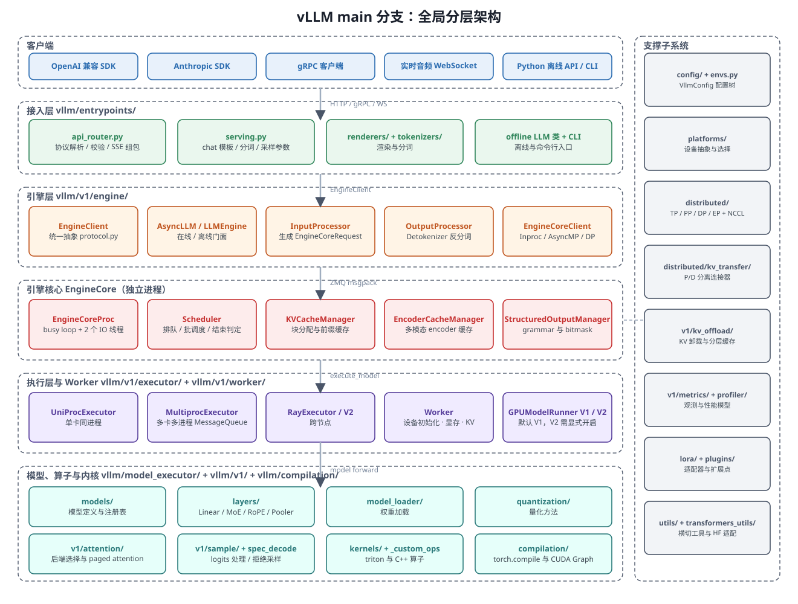

---

---

<details>
<summary>Mermaid 源码（可编辑，需支持 mermaid 的渲染器）</summary>

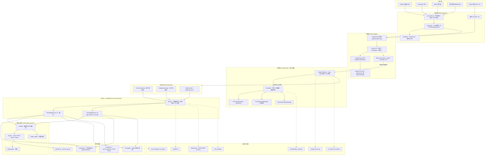

</details>

### 1.1 分层职责边界

| 层 | 目录 | 一句话职责 | 不该做的事 |
|---|---|---|---|
| 接入层 | `vllm/entrypoints/` | 协议适配、模板/分词、参数构造、组包与流式回包 | 不做排队、不碰 KV、不直接调模型 |
| 引擎层 | `vllm/v1/engine/` | 请求对象化（`EngineCoreRequest`）、结果对象化（`RequestOutput`）、跨进程通信 | 不做批调度 |
| 引擎核心 | `vllm/v1/engine/core.py` 与 `vllm/v1/core/` | 排队、批调度、KV 分配、结束判定 | 不碰 CUDA、不做张量计算 |
| 执行层 | `vllm/v1/executor/` | 把 `SchedulerOutput` 广播到各 rank 的 worker 并收回结果 | 不做调度决策 |
| Worker | `vllm/v1/worker/` | 持有 CUDA context、权重、KV 张量；输入准备、前向、采样 | 不做跨请求调度 |
| 模型层 | `vllm/model_executor/` | 模型结构、层实现、权重加载、量化 | 不做请求管理 |
| 内核层 | `v1/attention` `v1/sample` `kernels` `compilation` | paged attention、采样、融合算子、图编译 | — |
| 支撑层 | `config` `platforms` `distributed` `metrics` `utils` 等 | 横切能力 | — |

### 1.2 三条最重要的边界

1. **前后端分离**：API Server 进程与 EngineCore 进程之间只走 ZMQ（`v1/engine/core_client.py` 与 `v1/engine/core.py`），消息类型只有 5 种（`EngineCoreRequestType`，`v1/engine/__init__.py:243-250`）：`ADD / ABORT / START_DP_WAVE / UTILITY / EXECUTOR_FAILED`。
2. **调度与执行分离**：`Scheduler` 只产出"这一步算哪些 token、用哪些 block"（`SchedulerOutput`，`v1/core/sched/output.py:181`），Worker 只把它变成 GPU 计算并回传 `ModelRunnerOutput`（`v1/outputs.py:166`）。
3. **逻辑与物理分离**：KV 的**逻辑**分配在 EngineCore 的 `KVCacheManager`，**物理**张量在 Worker；多模态的**逻辑**缓存在 `EncoderCacheManager`（`v1/core/encoder_cache_manager.py`），**物理**显存在 `v1/worker/gpu/mm/encoder_cache.py`。

---

### 1.3 一次生成请求的端到端流程

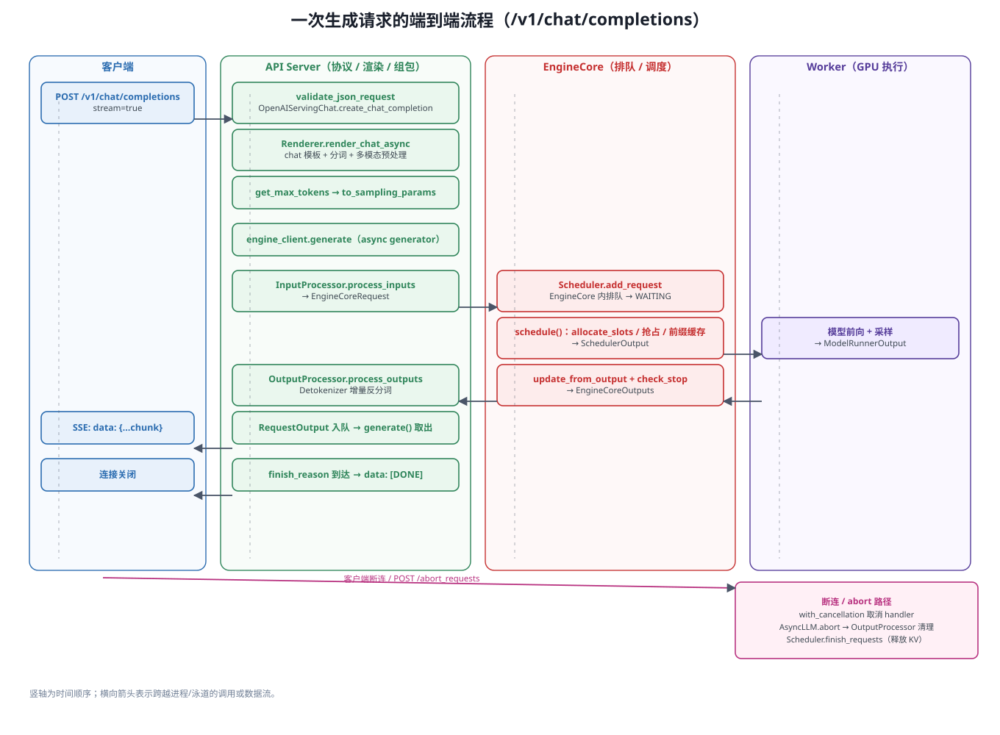

---

---

---


## 2. 进程、线程与通信拓扑

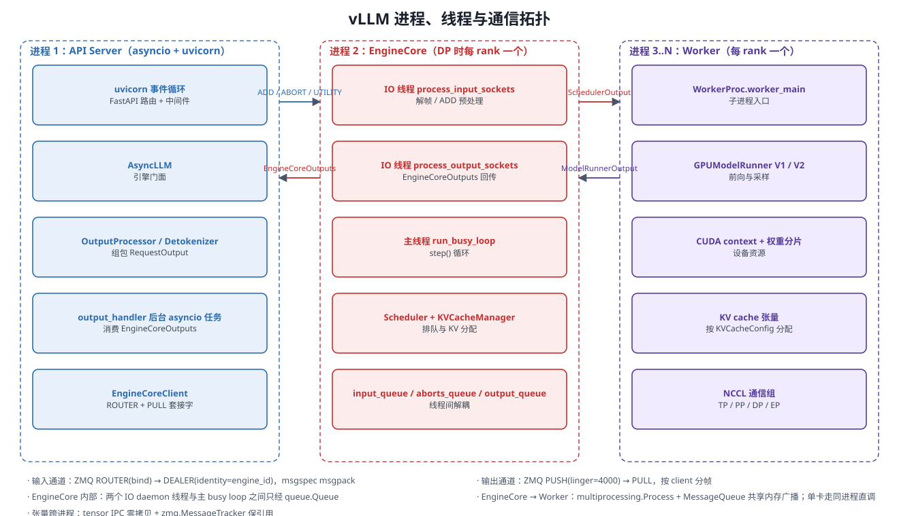

---

---

<details>
<summary>Mermaid 源码（可编辑，需支持 mermaid 的渲染器）</summary>

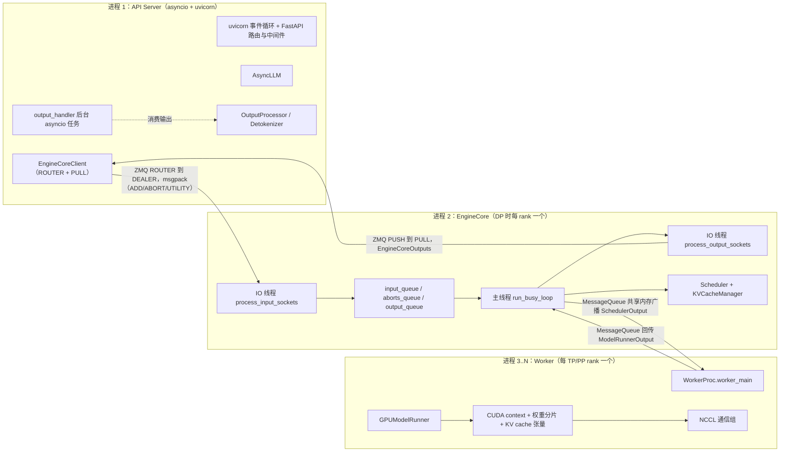

</details>

| 边界 | 机制 | 源码 |
|---|---|---|
| API Server 到 EngineCore（输入） | ZMQ `ROUTER(bind)` 到 `DEALER(identity=engine_id)`，帧格式 `(request_type_byte, *msgpack)` | `core_client.py:524-530`、`core.py:1412-1418` |
| EngineCore 到 API Server（输出） | ZMQ `PUSH(linger=4000)` 到 `PULL` | `core.py:1506-1511`、`core_client.py:531-533` |
| EngineCore 内部 | 两个 IO daemon 线程 + 主 busy loop，用 `queue.Queue` 解耦 | `core.py:912-934`、`core.py:1187-1226` |
| EngineCore 到 Worker | 多卡：`multiprocessing.Process` + `MessageQueue`（共享内存广播 + 每 rank 响应队列）；单卡：同进程直调 | `multiproc_executor.py:676-677,339,373`、`uniproc_executor.py:107-130` |
| 张量跨进程 | tensor IPC / 零拷贝 buffer + `zmq.MessageTracker` 保引用 | `core_client.py:1023-1036`、`core.py:1541-1554`、`v1/engine/tensor_ipc.py` |
| 多 API Server | `--api-server-count>1` 时 `run_multi_api_server` 拉起多个 uvicorn 进程共享同一 EngineCore | `cli/serve.py:231` |

> 关键设计：**EngineCore 对在线服务永远是独立进程**（`async_llm.py:146` 固定调用 `make_async_mp_client`）；只有离线 `LLM` 可能同进程（`InprocClient`）。

---

## 3. 四种运行形态

| 形态 | 入口 | 引擎客户端 | 特点 |
|---|---|---|---|
| **在线 OpenAI 服务** | `vllm serve` 到 `openai/api_server.py:579 build_and_serve` | `AsyncMPClient`（EngineCore 独立进程） | 多 API server 可共享一个引擎；支持全部 HTTP 方言 |
| **离线批处理** | `from vllm import LLM` 到 `entrypoints/llm.py:106` | `InprocClient`（默认同进程）或 `SyncMPClient` | 无 HTTP，直接拿 `RequestOutput` |
| **gRPC 服务** | `vllm serve --grpc` 到 `entrypoints/grpc_server.py:56` | `AsyncLLM` | servicer 在仓库外的 `smg_grpc_servicer` 包 |
| **render-only 服务** | `vllm launch render` 到 `api_server.py:627 build_and_serve_renderer` | 无引擎（CPU-only） | 只做 chat 模板与分词/反分词，`build_app(args, ("render",))` |

启动时的任务判定链路（决定暴露哪些接口）：

```
build_and_serve():596   supported_tasks = await engine_client.get_supported_tasks()
  到 EngineCore.get_supported_tasks()          v1/engine/core.py:312
  到 GPUModelRunner.get_supported_tasks()      v1/worker/gpu_model_runner.py:3141
      runner_type == "generate" -> generate / transcription / realtime
      runner_type == "pooling"  -> model.pooler.get_supported_tasks()
  到 build_app(args, supported_tasks, model_config)   api_server.py:157
```

任务全集见 `vllm/tasks.py:5-28`；**`runner_type` 是单值**（`config/model.py:544-554`），所以一台服务要么是生成服务器、要么是池化服务器。

---

## 4. 配置层：VllmConfig 与启动参数

```
命令行 / Python 参数
  到 EngineArgs（engine/arg_utils.py:412，约 100 个字段）
    到 create_engine_config()（:1639）
      到 VllmConfig（config/vllm.py:282）
        到各子 Config（config/*.py）
          到 Platform.check_and_update_config()（平台回调，改写并行/编译/attention 默认值）
```

* `EngineArgs.__post_init__`（`engine/arg_utils.py:706`）做默认值与互斥校验；`_set_default_chunked_prefill_and_prefix_caching_args`（`:2303`）、`_set_default_max_num_seqs_and_batched_tokens_args`（`:2380`）按硬件/模型推默认值。
* 环境变量集中在 `vllm/envs.py`（全部 `VLLM_*`，模块 `__getattr__` 惰性求值）；`vllm/env_override.py` 在 `vllm/__init__.py:14` **最先**导入，用于在其它 import 之前改写环境变量。
* `VllmConfig` 可哈希（`compute_hash`，`config/vllm.py:2065`），用于编译缓存与 KV 事件一致性判断。

### 4.1 `VllmConfig` 组成（`config/vllm.py:282-370`）

| 字段 | 子配置类 | 管什么 |
|---|---|---|
| `model_config` | `ModelConfig`（`config/model.py`） | 模型路径/架构/`runner_type`/dtype/max_model_len/tokenizer/多模态限制 |
| `cache_config` | `CacheConfig`（`config/cache.py`） | block_size、`gpu_memory_utilization`、prefix caching、KV dtype、KV offload 开关 |
| `parallel_config` | `ParallelConfig`（`config/parallel.py`） | TP/PP/DP/EP/CP 大小、executor backend |
| `scheduler_config` | `SchedulerConfig`（`config/scheduler.py`） | `max_num_seqs`、`max_num_batched_tokens`、chunked prefill、策略 |
| `device_config` / `load_config` | `DeviceConfig` / `LoadConfig` | 设备类型；`--load-format` 与权重加载细节 |
| `offload_config` | `OffloadConfig`（`config/offload.py`） | **模型权重** offload（uva / prefetch） |
| `attention_config` | `AttentionConfig`（`config/attention.py`） | 后端选择、`flash_attn_version`、MLA prefill 后端 |
| `mamba_config` / `kernel_config` | `MambaConfig` / `KernelConfig` | 混合模型状态；IR 算子优先级与 MoE 后端 |
| `lora_config` / `speculative_config` | `LoRAConfig` / `SpeculativeConfig` | LoRA 容量；投机解码方法与 draft 模型 |
| `structured_outputs_config` | `StructuredOutputsConfig` | guided decoding 后端与 reasoning parser |
| `observability_config` | `ObservabilityConfig` | 日志与迭代详情 |
| `quant_config` | `QuantizationConfig` | 量化方法（权重自动推断或 `--quantization`） |
| `compilation_config` | `CompilationConfig`（`config/compilation.py`） | `-O` 等级、torch.compile 模式、CUDA Graph 尺寸与模式 |
| `profiler_config` | `ProfilerConfig` | torch profiler 与逐层 profiling |
| `kv_transfer_config` / `kv_events_config` / `ec_transfer_config` | 对应 Config | P/D 分离、KV 事件发布、EC 传输 |
| `reasoning_config` / `weight_transfer_config` | `ReasoningConfig` / `WeightTransferConfig` | 推理链解析；RL 权重热更 |
| `instance_id` / `optimization_level` / `performance_mode` / `shutdown_timeout` / `additional_config` | — | 全局开关（`optimization_level` 默认 O2，用启动时间换性能） |

---

## 5. 接入层 `vllm/entrypoints/`

职责：**协议适配**。接口清单与请求流程见配套报告，本节只给架构定位。

```
entrypoints/
├── openai/          生产主干：api_server.py(装配) + cli_args + 各 API 子包
│   ├── chat_completion/  completion/  responses/    生成类
│   ├── engine/          OpenAIServing 基类（所有 serving 的父类）
│   ├── generate/        路由注册入口与 factories
│   ├── generative_scoring/  models/  parser/
│   └── run_batch.py  server_utils.py  fingerprint.py  orca_metrics.py  utils.py
├── anthropic/       Anthropic Messages 兼容（复用 chat 链路）
├── pooling/         embed / score / rerank / classify / pooling
├── speech_to_text/  transcription / translation / realtime WS
├── serve/           instrumentator / lora / profile / tokenize / render / disagg / elastic_ep
│                    以及 dev（仅 VLLM_SERVER_DEV_MODE）：cache / rlhf / rpc / sleep
├── sagemaker/       /ping 与 /invocations
├── mcp/             MCP 工具服务（Responses API 用）
├── cli/             vllm 命令行本体
├── llm.py           离线 LLM 类（1734 行）
├── chat_utils.py    chat 消息、模板、多模态 content part 解析
├── utils.py         with_cancellation 等 HTTP 层公共设施
├── launcher.py      uvicorn 启动 + watchdog + SSL 刷新
├── logger.py  constants.py  ssl.py
├── grpc_server.py   gRPC
└── api_server.py    遗留演示服务（不用于生产）
```

三点架构约定：

1. **每个任务子包都是 `api_router.py` + `serving.py` + `protocol.py` 三件套**，注册统一走 `attach_router(app)` 或 `register_*_routers(app)`。
2. **装配集中在 `openai/api_server.py:157 build_app()`**：先无条件挂 `serve/*`、`/v1/models`、SageMaker，再按 `supported_tasks` 分支挂生成类/语音类/池化类（`:198-246`）。
3. **断连取消的责任在接入层**：`utils.py:56 with_cancellation` 是 abort 链路起点，真正落到引擎是 `AsyncLLM.generate` 的 `except (CancelledError, GeneratorExit)`（`async_llm.py:591-596`）。

## 6. 引擎层 `vllm/v1/engine/`

| 文件 | 作用 | 关键符号 |
|---|---|---|
| `async_llm.py` | **在线引擎门面**：`AsyncLLM(EngineClient)`，持有 `InputProcessor`、`OutputProcessor`、`EngineCoreClient`、后台 `output_handler` 任务 | `AsyncLLM:70`、`generate:524`、`abort:709`、`_run_output_handler:637` |
| `llm_engine.py` | **离线引擎门面**：`LLMEngine`，`add_request`/`step`/`abort_request` | `abort_request:203` |
| `core.py` | **EngineCore 本体**：`EngineCore`（进程内）、`EngineCoreProc`（ZMQ 包装）、`DPEngineCoreProc`（数据并行）；含 busy loop、请求预处理、utility RPC | `step:425`、`run_busy_loop:1187`、`_handle_client_request:1289`、`abort_requests:371` |
| `core_client.py` | 5 种引擎客户端的统一抽象 | `EngineCoreClient.make_client:81`、`make_async_mp_client:107`、`InprocClient:274`、`SyncMPClient:716`、`AsyncMPClient:887`、`DPAsyncMPClient:1137`、`DPLBAsyncMPClient:1317` |
| `input_processor.py` | `EngineInput + SamplingParams` 转 **`EngineCoreRequest`**；分配 request id、处理 mm features / prompt embeds / lora | `process_inputs:234` |
| `output_processor.py` | `EngineCoreOutputs` 转 **`RequestOutput`**；每请求状态、n>1 聚合、abort 前端清理、指标统计 | `process_outputs:597`、`abort_requests:471`、`RequestOutputCollector:48` |
| `detokenizer.py` | 增量反分词 + **stop string 检测**（命中会回头 abort 引擎侧请求） | `update:95`、`check_stop_strings:309` |
| `parallel_sampling.py` | `n>1` 的父子请求与结果聚合 | `ParentRequest:13` |
| `logprobs.py` / `coordinator.py` / `tensor_ipc.py` / `exceptions.py` / `utils.py` | 输出侧 logprobs；DP wave 协调；跨进程张量零拷贝；异常；设备索引与 `CUDA_VISIBLE_DEVICES` 设置（`set_device_control_env_var:262`） | — |
| `__init__.py` | 跨进程数据结构 | `EngineCoreRequest:80`、`EngineCoreOutput:167`、`EngineCoreOutputs:212`、`EngineCoreRequestType:243`、`FinishReason:59` |

**关键契约**

* `EngineClient`（`vllm/engine/protocol.py:40`）是在线/离线、同进程/跨进程的统一接口，接入层只认它——所以同一套 serving 代码能同时服务 `LLM` 与 `AsyncLLM`。
* `AsyncLLM.generate()` 是 **async generator**：`add_request` 拿到 `RequestOutputCollector` 后 `while not finished: out = q.get_nowait() or await q.get()`（`async_llm.py:576-586`）；客户端断连时生成器被回收，`except (CancelledError, GeneratorExit)` 触发 abort（`:591-596`）。
* `AsyncLLM` 的 `add_request` 负责 `n>1` 分叉（`:389-397`）、流式输入会话（`:417-503`）、以及"先登前端、再发引擎"的顺序（`:409` → `:412`）。

---

## 7. 调度与 KV 缓存 `vllm/v1/core/`

```
vllm/v1/
├── request.py              Request 状态机 + RequestStatus + FinishReason 映射
├── outputs.py              ModelRunnerOutput 等 worker 到 scheduler 的结果类型
├── kv_cache_interface.py   KVCacheSpec / KVCacheConfig / KVCacheGroup 抽象
└── core/
    ├── sched/
    │   ├── interface.py        SchedulerInterface（has_requests:185 = 未完成或已完成待上报）
    │   ├── scheduler.py        Scheduler：调度主逻辑（2232 行）
    │   ├── async_scheduler.py  AsyncScheduler：异步调度（输出占位 token）
    │   ├── output.py           SchedulerOutput / NewRequestData / CachedRequestData
    │   ├── request_queue.py    FCFS / Priority 队列
    │   └── utils.py            check_stop
    ├── kv_cache_manager.py             门面（跨 KV group）
    ├── kv_cache_coordinator.py         多 group 协调
    ├── single_type_kv_cache_manager.py 单类型 KV（full attention 等）块管理
    ├── block_pool.py                   块分配/释放/前缀缓存命中
    ├── encoder_cache_manager.py        多模态 encoder 输出的逻辑缓存
    ├── kv_cache_utils.py               块哈希、KV 规模推算、配置生成
    └── kv_cache_metrics.py             KV 相关指标
```

### 7.1 `Scheduler.schedule()` 的调度模型

`schedule()`（`scheduler.py:308`）的注释写明了设计哲学：**没有"prefill 阶段"与"decode 阶段"之分**，每个请求只有 `num_computed_tokens` 与 `num_tokens_with_spec`，调度器每步只让前者追上后者。这一统一模型自然覆盖了 chunked prefill、前缀缓存、投机解码。

每步顺序（`scheduler.py:308-901`）：

1. `kv_cache_manager.new_step_starts()` 重置本步状态（`:341`）
2. **先调度 RUNNING**（`:345-478`）：算 `num_new_tokens` 到 `allocate_slots`（`:423`），失败则 `_preempt_request`（`:435-466` 到 `:908`）
3. **再调度 WAITING**（`:527` 起）：选队列（`:1527`）到 前缀缓存命中 `get_computed_blocks`（`:573`，`kv_cache_manager.py:194`）到 chunked prefill 切分（`:633-648`）
4. 构造 `SchedulerOutput`（`:866-882`，含 `finished_req_ids` / `preempted_req_ids` / `free_encoder_mm_hashes`）
5. `_update_after_schedule`（`:899` 到 `:930`）推进 `num_computed_tokens` 并清空 `finished_req_ids`

回程：`update_from_output`（`:1246`）逐请求 `_update_request_with_output`（`:1557`）到 `check_stop`（`sched/utils.py:94`：EOS / stop_token_ids / 长度上限 / 重复检测）到 生成 `EngineCoreOutput`（`:1415-1430`）。


### 7.2 KV 缓存的三层结构

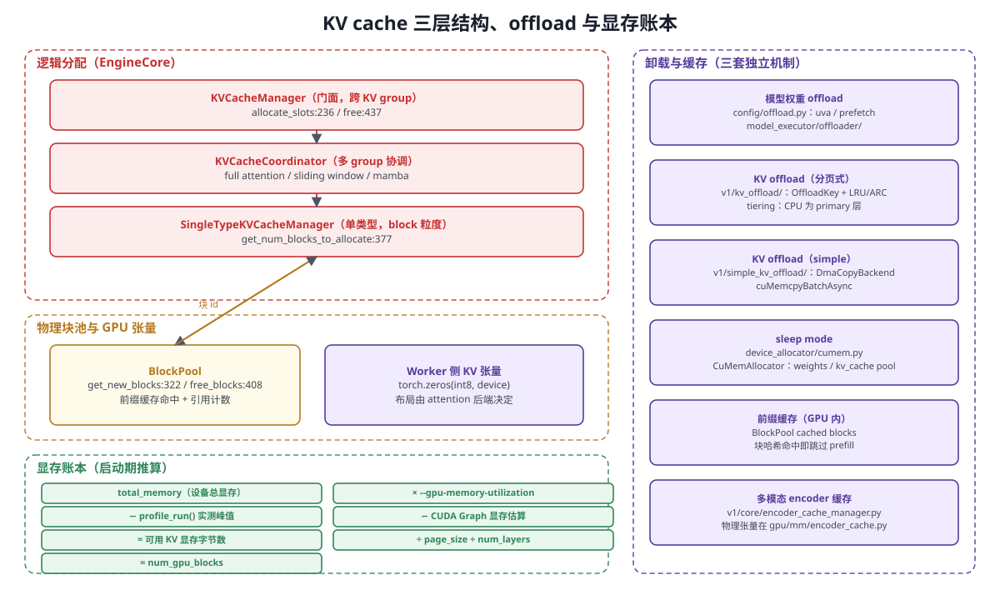

```
KVCacheManager（门面，跨 group）
   └── KVCacheCoordinator（多 group 协调：full attention / sliding window / mamba 混合）
         └── SingleTypeKVCacheManager（单类型，按 block 粒度）
               └── BlockPool（真正的块池：free queue、cached blocks、引用计数）
```

* 分配入口 `KVCacheManager.allocate_slots`（`kv_cache_manager.py:236`）到 `coordinator.get_num_blocks_to_allocate`（`:377`）；块不足返回 `None` 触发抢占。
* 块池 `BlockPool.get_new_blocks`（`block_pool.py:322`）用 `free_block_queue.popleft_n` 取块（`:336`），必要时 `_maybe_evict_cached_block`（`:354`）驱逐前缀缓存。
* 前缀缓存靠**块哈希**（`kv_cache_utils.py`）：相同前缀命中已缓存块；`cache_full_blocks:211` 写入，`touch:391` 更新 LRU，`free_blocks:408` 反引用计数。
* **混合模型**（full attention + sliding window + mamba）由 `KVCacheCoordinator` 统一协调，各 group 独立算需求。
* **逻辑/物理分离**：EngineCore 只持有块 id，物理张量在 Worker（见第 8 章）。

### 7.3 `Request` 状态机

```
WAITING 到 WAITING_FOR_STRUCTURED_OUTPUT_GRAMMAR / WAITING_FOR_REMOTE_KVS / WAITING_FOR_STREAMING_REQ
WAITING 到 RUNNING 到 PREEMPTED 回到 WAITING
RUNNING 到 FINISHED_STOPPED / FINISHED_LENGTH_CAPPED / FINISHED_REPETITION / FINISHED_ERROR
WAITING 或 RUNNING 到 FINISHED_ABORTED
```

定义与状态到结束原因的映射在 `vllm/v1/request.py:316-358`；`RequestStatus.is_finished()` 以 `PREEMPTED` 为界（`:337-339`）。

---

## 8. 执行层与 Worker

```
vllm/v1/executor/            （8 个文件）
├── abstract.py              Executor 抽象 + get_class 选择
├── uniproc_executor.py      单卡：同进程直调
├── multiproc_executor.py    多卡：多进程 + MessageQueue
├── ray_executor.py          Ray（经典）
├── ray_executor_v2.py       Ray（V2，VLLM_USE_RAY_V2_EXECUTOR_BACKEND）
└── ray_utils.py  ray_env_utils.py

vllm/v1/worker/              （24 个顶层文件 + gpu/ 52 个）
├── worker_base.py           WorkerBase / WorkerWrapperBase（worker 类解析与动态继承）
├── gpu_worker.py            主线：Worker（CUDA）
├── gpu_model_runner.py      V1 ModelRunner（默认，单体 7256 行）
├── cpu_worker.py  cpu_model_runner.py  xpu_worker.py  xpu_model_runner.py
├── gpu_input_batch.py  tpu_input_batch.py  block_table.py
├── ubatching.py  ubatch_utils.py  gpu_ubatch_wrapper.py      微批 / DBO
├── kv_connector_model_runner_mixin.py  ec_connector_model_runner_mixin.py
├── lora_model_runner_mixin.py      LoRA 权重切换
├── encoder_cudagraph.py  encoder_cudagraph_defs.py           多模态 encoder 的 CUDA Graph
├── mamba_utils.py  cp_utils.py  dp_utils.py  workspace.py
└── gpu/                     V2 ModelRunner 及其拆件
    ├── model_runner.py          V2 主文件（1412 行）
    ├── input_batch.py  block_table.py  attn_utils.py  buffer_utils.py
    ├── cudagraph_utils.py  states.py  structured_outputs.py  warmup.py
    ├── model_states/            default / mamba_hybrid / whisper 三套请求态管理
    ├── sample/                  GPU 侧采样算子
    ├── mm/                      encoder_cache / encoder_runner / rope
    ├── pool/                    pooling 与 late-interaction 执行
    └── spec_decode/             投机解码 GPU 侧（rejection_sampler、eagle/）
```


### 8.1 执行器选择

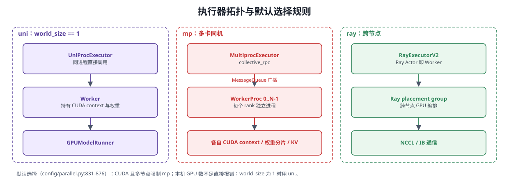

<details>
<summary>Mermaid 源码（可编辑，需支持 mermaid 的渲染器）</summary>

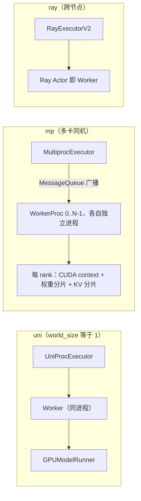

</details>

* 选择逻辑 `vllm/v1/executor/abstract.py:48`；**默认值带平台分支**（`config/parallel.py:831-876`）：CUDA 且多节点强制 `mp`；CUDA 且本机 GPU 不足直接报错；`world_size == 1` 用 `uni`。
* `MultiprocExecutor` 断言 `world_size == tp*pp*pcp`（`multiproc_executor.py:116-122`），并把 `OMP_NUM_THREADS` 压到 1（`:1009-1037`）。
* 控制面：`collective_rpc`（`:339`）到 `rpc_broadcast_mq.enqueue(...)`（`:373`）把 `SchedulerOutput` 广播给所有 worker，结果经每 rank 的 response queue 收回。单卡时唯一的"非阻塞"点是 `AsyncOutputFuture`（`uniproc_executor.py:26-42`）。


### 8.2 Worker 生命周期（`vllm/v1/worker/gpu_worker.py`）

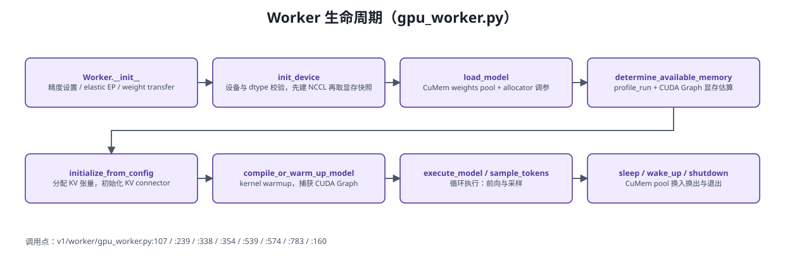

<details>
<summary>Mermaid 源码（可编辑，需支持 mermaid 的渲染器）</summary>

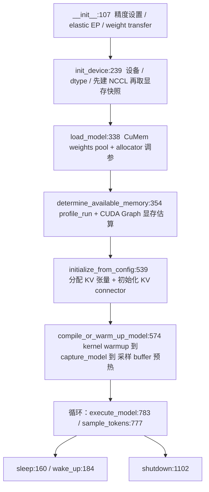

</details>

| 阶段 | 关键动作 | 源码 |
|---|---|---|
| `init_device` | 设备字符串校验；移除 `NCCL_ASYNC_ERROR_HANDLING`；重算 local_rank；`torch.cuda.set_device`；dtype 能力校验；**先初始化 NCCL 再取显存快照**（让 NCCL buffer 计入） | `gpu_worker.py:239-334` |
| `load_model` | 在 CuMem weights pool 内加载权重；CUDA 上额外用 `_scoped_allocator_max_split(20MB)` 调 allocator | `:338-345`、`:215-236` |
| `determine_available_memory` | `profile_run()` 测峰值，减掉非 KV 占用与 CUDA Graph 估算，得到可用 KV 字节数 | `:354-506` |
| `initialize_from_config` | 写回 `num_gpu_blocks`、初始化 KV connector、分配 KV 张量（sleep 模式下放进 CuMem pool） | `:539-571` |
| `compile_or_warm_up_model` | kernel warmup（DeepGEMM/FlashInfer autotune）到 CUDA Graph 捕获到 末 rank 预分配最大形状 logits buffer | `:574-727` |
| `execute_model` | 委托给 `model_runner.execute_model`；PP 场景用 `AsyncIntermediateTensors` 做非阻塞 send/recv | `:783-871`、`:74-103` |

### 8.3 ModelRunner：V1 与 V2

| | V1 | V2 |
|---|---|---|
| 文件 | `v1/worker/gpu_model_runner.py`（7256 行单体） | `v1/worker/gpu/model_runner.py`（1412 行）+ `gpu/` 下 52 个拆件 |
| 启用 | **默认**（`VLLM_USE_V2_MODEL_RUNNER=0`，`envs.py:251,1714`） | `VLLM_USE_V2_MODEL_RUNNER=1` |
| 选择点 | `gpu_worker.py:316-330` | 同左 |

一次执行（以 V2 为例，`gpu/model_runner.py`）：

1. **请求态增删**：`finish_requests:656`（含 preempted）到 `free_states:664` 到 `add_requests:669` 到 `update_requests:714`，末尾 `apply_staged_writes`
2. **输入准备** `prepare_inputs:735`：decode-first 排序到 `idx_mapping` 异步 H2D 到 `query_start_loc`（FA3 要求非递减，尾部 padding）到 组合 sampled/draft tokens（triton）
3. **注意元数据** `prepare_attn:887`：按 block table 生成 slot mapping（triton kernel）
4. **CUDA Graph 分派** `dispatch_cg_and_sync_dp:1020`：DP>1 时用 CPU group `all_reduce` 让所有 rank 就 cg_mode 与 token 数达成一致
5. **前向**：FULL 图用 `run_fullgraph` 重放；PIECEWISE/eager 用 `set_forward_context(...)` 后 `self.model(**model_inputs)`
6. **采样** `sample_tokens:1183` 到 `sample:914`
7. **结果**：`ModelRunnerOutput` + `AsyncOutput`（异步调度时延迟 D2H）

### 8.4 Worker 侧可插拔 mixin

| Mixin | 作用 | 文件 |
|---|---|---|
| `LoRAModelRunnerMixin` | 按请求切换 LoRA 权重、`add/remove/pin_lora` | `v1/worker/lora_model_runner_mixin.py` |
| `KVConnectorModelRunnerMixin` | 前向前后调用 KV connector 的 `pre_forward`/`post_forward`/`get_finished` | `v1/worker/kv_connector_model_runner_mixin.py` |
| `ECConnectorModelRunnerMixin` | 多模态 encoder cache 的跨实例传输 | `v1/worker/ec_connector_model_runner_mixin.py` |
| `model_states/*` | 请求态管理按模型类型分派（default / mamba 混合 / whisper） | `v1/worker/gpu/model_states/` |

## 9. 模型层 `vllm/model_executor/`

665 个 Python 文件，仓库中最大的子系统。边界很清楚：**给定 `VllmConfig` 与一批输入张量，构造 `nn.Module`、加载权重、跑出 logits 或 pooled 输出**。

### 9.1 目录总览

| 子目录/文件 | py 数 | 职责 |
|---|---|---|
| `models/` | 298 | 模型定义 + **模型注册表**（`registry.py`、`interfaces.py`、`interfaces_base.py`、`utils.py`、`adapters.py`，以及每个模型一个文件） |
| `layers/` | 284 | 可复用层与算子（见 9.3） |
| `model_loader/` | 20 | 权重加载：各 `--load-format` 后端 + `reload/`（权重热重载） |
| `kernels/` | 51 | 平台无关 kernel 抽象（`linear/`、`mhc/`），细节见第 13 章 |
| `offloader/` | 5 | 权重 offload：`base.py`、`prefetch.py`、`prefetch_ops.py`、`uva.py` |
| `warmup/` | 3 | `kernel_warmup.py`、`deep_gemm_warmup.py` |
| `custom_op.py` | — | `CustomOp` 基类：**平台分派** |
| `parameter.py` | — | vLLM 参数子类，把 TP 切片/打包信息放进参数本身：`BasevLLMParameter:31`、`RowvLLMParameter:204`、`ModelWeightParameter:233`、`PackedvLLMParameter:353`、`SharedWeightParameter:406` |
| `utils.py` | — | `set_weight_attrs:13`、`replace_parameter:47`、`get_moe_expert_mapping:124` |

### 9.2 模型注册表（`models/registry.py`）

<details>
<summary>Mermaid 源码（可编辑，需支持 mermaid 的渲染器）</summary>

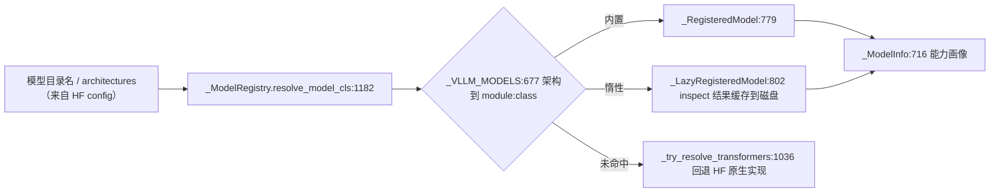

</details>

| 符号 | 作用 |
|---|---|
| `_VLLM_MODELS:677` | 架构名到 `module:class` 的静态映射表（由 `_TEXT_GENERATION_MODELS:70`、`_EMBEDDING_MODELS:223`、`_MULTIMODAL_MODELS:343` 等合并） |
| `_ModelInfo:716` / `from_model_cls:738` | 模型能力画像：是否文本生成/池化/多模态/支持 PP/有内部状态/无 attention |
| `_LazyRegisteredModel:802` | 惰性 inspect：按源文件 hash 查 `VLLM_CACHE_ROOT/modelinfos/*.json`（`:811-865`），未命中则在**子进程**里 import 模型并执行 inspect（`_run_in_subprocess:892`），避免主进程初始化 CUDA |
| `_ModelRegistry:938` | 门面：`register_model:945`（OOT 与插件注册）、`resolve_model_cls:1182`、`inspect_model_cls:1130`、`is_text_generation_model:1236`、`is_pooling_model:1244`、`is_multimodal_model:1252`、`is_pp_supported_model:1268`、`is_transcription_only_model:1316` |
| `interfaces*.py` | 能力判定协议：`is_text_generation_model`、`is_pooling_model`、`supports_multimodal:457`、`supports_pp:682`、`has_inner_state:753`、`is_hybrid:837`、`supports_transcription:1247`、`SupportsLoRA:536`、`SupportsEagle3:1333`、`SupportsQuant:995` |
| `models/utils.py` | `WeightsMapper:44`、`AutoWeightsLoader:117`（`load_weights:342`）、`init_vllm_registered_model:359`、`PPMissingLayer:607`、`make_layers:620` |

> **重要联动**：第 3 章的 `supported_tasks` 由 `runner_type` + 这些 `is_*` 判定共同决定（`v1/worker/gpu_model_runner.py:3116-3149`）——**模型类上的能力声明直接决定服务器暴露哪些 HTTP 接口**。

### 9.3 `layers/`：层与算子

| 子目录/文件 | 内容 |
|---|---|
| `linear.py` | **TP 切分核心**：`LinearMethodBase:142`、`LinearBase:235`、`ReplicatedLinear:296`、`ColumnParallelLinear:414`（按输出维切，需要时 all-gather）、`MergedColumnParallelLinear:611`、`QKVParallelLinear:979`（KV head 复制）、`RowParallelLinear:1396`（按输入维切，末尾 `tensor_model_parallel_all_reduce`）。**切分不用 `partition_dim/stride`，而是把 `output_partition_sizes` 交给 `quant_method.create_weights(...)`**，loader 用前缀和算偏移 |
| `quantization/`（102） | 方法枚举 `QuantizationMethods`（`__init__.py:12-45`）：`awq / fp8 / gptq_marlin / awq_marlin / gptq / compressed-tensors / bitsandbytes / modelopt* / quark / mxfp4 / torchao / inc / humming / fp_quant / online` 等；`register_quantization_config:58`、`get_quantization_config:108`；抽象基类 `base_config.py:19 QuantizeMethodBase`、`:70 QuantizationConfig` |
| `fused_moe/`（80） | `layer.py:73 FusedMoE(PluggableLayer)` 管模块/权重/sharding；`fused_moe.py:1587 fused_experts` 是执行入口；`modular_kernel.py:465/763/1500` 是模块化抽象。子目录 `experts/`（flashinfer_cutlass、triton、cutlass、deep_gemm、marlin、trtllm*、cpu、xpu、fallback）、`router/`、`runner/`、`oracle/`、`prepare_finalize/`、`configs/`（调优 JSON）。TP/EP 见 `layer.py:120`、`ExpertMapManager:256` |
| `attention/`（9） | **层内** attention 封装：`Attention:177`、`MLAAttention:321`、`ChunkedLocalAttention:81`、`CrossAttention:189`、`EncoderOnlyAttention:51`、`StaticSinkAttention:116`、`MMEncoderAttention:216`。**本目录没有 `selector.py`/`backend.py`/`mla/`**，后端选择在 `vllm/v1/attention/` |
| `rotary_embedding/`（20） | 工厂 `get_rope`（`__init__.py:33`，带 `_ROPE_DICT:30` 缓存）分派约 16 种缩放：`llama3_rope`、`yarn_scaling_rope`、`deepseek_scaling_rope`、`mrope`、`xdrope`、`fope` 等 |
| `mamba/`（24） / `fla/`（18） | 状态空间与线性注意力算子（`kda.py:86 KimiDeltaAttention`、`lightning_attn.py`、`mhc.py:13`） |
| `pooler/`（13） | **池化头**：`abstract.py:16 Pooler`；seqwise（`SequencePooler:44`、`SequencePoolerHead:19`、`EmbeddingPoolerHead:33`、`ClassifierPoolerHead:102`、`CLSPool/LastPool/MeanPool`）；tokwise（`TokenPooler:48`、`AllPool/StepPool`）；`special.py:25 DispatchPooler`、`:198 BgeM3Pooler`。`get_supported_tasks()` 决定该模型能做 embed/classify/token_embed 中的哪些 |
| `mla.py` `deepseek_v4_attention.py` `sparse_attn_indexer.py` `deepseek_compressor.py` | DeepSeek 系专用结构 |
| `layernorm.py` `activation.py` `vocab_parallel_embedding.py` `logits_processor.py` `conv.py` `resampler.py` | `RMSNorm:38`/`GemmaRMSNorm:133`/`LayerNorm:304`；`SiluAndMul:118`/`GELU:294` 与注册表 `get_act_fn:736`；`VocabParallelEmbedding:192`/`ParallelLMHead:503`；`logits_processor.py:19` |

**平台分派机制**（`custom_op.py`）：`CustomOp:103`，`__new__:109` 查 `op_registry_oot:22` 做 OOT 整类替换，`dispatch_forward:174` 缓存 `_forward_method`；分支顺序 `forward_hip:149`（ROCm）到 `forward_cpu:158` 到 `forward_tpu:163` 到 `forward_xpu:153` 到 **`forward_oot:169`** 到 默认 `forward_cuda:146`，`forward_native:138` 是参考实现兼回退。**CUDA 是默认分支**，自定义算子只需实现 `forward_cuda`。开关由 `CompilationConfig.custom_ops`（`+name`/`-name`/`all`/`none`）控制。注意 `dispatch_key` **不在 `custom_op.py`**，它是平台属性（`platforms/interface.py:113`、`cuda.py:162`），在 `vllm/utils/torch_utils.py:937 direct_register_custom_op` 中使用。

### 9.4 权重加载（`model_loader/`）

`--load-format` 共 15 个取值（`model_loader/__init__.py:31-64`）：

| load_format | Loader | 说明 |
|---|---|---|
| `auto` / `hf` / `safetensors` / `pt` / `npcache` / `fastsafetensors` / `instanttensor` / `mistral` | `DefaultModelLoader`（`default_loader.py:43`） | HF 下载 + safetensors/pt 迭代（多种加速迭代器） |
| `bitsandbytes` | `BitsAndBytesModelLoader:56` | 加载时在线 4/8bit 量化 |
| `gguf` | `GGUFModelLoader:38` | GGUF 单文件（覆写 `load_model:413`） |
| `tensorizer` | `TensorizerLoader:43` | 可 mmap 的序列化张量，含 `save_model:141` |
| `sharded_state` / `runai_streamer_sharded` | `ShardedStateLoader:29` | 每 rank 只读自己的分片；S3 感知 |
| `runai_streamer` | `RunaiModelStreamerLoader:21` | 从对象存储流式加载（大模型快速启动） |
| `dummy` | `DummyModelLoader:22` | 随机权重（性能测试） |

* 扩展点：`register_model_loader:67`、`get_model_loader:120`、`get_model:128`。
* **默认流程**：`BaseModelLoader.load_model`（`base_loader.py:42-82`）到 解析设备 到 `set_default_torch_dtype` 到 `initialize_model`（`model_loader/utils.py:40`：取架构、配量化、构造模块）到 `load_weights`（`default_loader.py:382-412`）到 在线量化收尾 到 **`process_weights_after_loading`**（`utils.py:99-127`：遍历 `QuantizeMethodBase`，并对 `Attention`/`MLAAttention`/`MMEncoderAttention` 后处理）到 `model.eval()`。
* `device_loading_context`（`model_loader/utils.py:131-172`）：临时把 CPU 参数搬到目标设备执行完再还原，避免峰值显存。
* `weight_utils.py`（1629 行）：`atomic_writer:125`、`get_quant_config:263`、`download_weights_from_hf:504`、`safetensors_weights_iterator:893`、`multi_thread_safetensors_weights_iterator:1030`、`fastsafetensors_weights_iterator:1109`、`pt_weights_iterator:1206`、`default_weight_loader:1383`、`row_parallel_weight_loader:1404`、`sharded_weight_loader:1422`、`initialize_dummy_weights:1450`。
* `ep_weight_filter.py`：EP 场景跳过非本地专家的 I/O。`reload/`（7 个文件）：layerwise 权重重载，服务于 RL 的 `update_weights`；**明确不与 CPU offloading 组合**（`reload/__init__.py:10`）。

### 9.5 `warmup/` 与 `offloader/`

* **warmup**：`warmup/kernel_warmup.py:27 kernel_warmup(worker)` —— DeepGEMM 预热（`:29-37` 到 `deep_gemm_warmup.py:363`）、FlashInfer autotune（`:39-46`）、FlashInfer attention 混合 batch 预热（`:51-78`，仅当所有 attention group 后端都是 FlashInfer）。**唯一调用点**是 `v1/worker/gpu_worker.py:608`，在 dummy run 之后、CUDA Graph 捕获之前。
* **offloader**：`base.py:47 BaseOffloader`（`wrap_modules:55`）、`:96 NoopOffloader`、`create_offloader:126` 按配置选实现；`prefetch.py:127 PrefetchOffloader`（按 group 选层 + `StaticBufferPool:60` 双缓冲 + 专用 copy stream，`post_init:310` 在 `process_weights_after_loading` 后重建 CPU 存储）、`uva.py:21 UVAOffloader`（按字节预算把参数留在 pinned CPU）。CUDA-graph 安全的预取算子在 `prefetch_ops.py`。调用方：`v1/worker/gpu_model_runner.py:868`、`models/utils.py:646`、`compilation/cuda_graph.py:310`。

### 9.6 与其它子系统的接口

| 方向 | 内容 |
|---|---|
| **谁调用 model_executor** | `v1/worker/*`（`gpu_model_runner.py:4940`、`gpu/model_runner.py:271`、`gpu_worker.py:608/955`）；`v1/spec_decode/*`（draft/eagle/medusa proposer）；`lora/`（子类化 `linear`/`fused_moe`/`vocab_parallel_embedding` 实现 LoRA）；`compilation/`（fusion pass 直接改写 attention/rope 层）；`entrypoints/`（`--load-format`）；`config/`（`model.py:566` 决定 runner_type） |
| **model_executor 依赖谁** | import 次数：`vllm.config` 332、`vllm.distributed` 203、`vllm.platforms` 153、`vllm.compilation.decorators` 135、`vllm.v1.attention.backend*` 104、`vllm.transformers_utils.*` 32、`vllm.distributed.parallel_state` 26、`vllm.v1.kv_cache_interface` 16 —— **配置/分布式/平台是基础设施，v1 的 attention 与 pool 元数据是契约** |
| **与 C++ 扩展边界** | model_executor 内 18 个文件 `from vllm._custom_ops import ...`；反向只有 `_custom_ops.py:663/696/915` 三处在函数体内惰性 import 量化 triton 模块（避免循环导入） |

### 9.7 容易记错的命名（已逐项核实）

| 常见说法 | 实际情况 |
|---|---|
| `model_loader/loader.py` | 不存在；ABC 在 `base_loader.py`，格式映射在 `__init__.py` |
| `layers/sampler.py` | 不存在；采样在 `vllm/v1/sample/` |
| `layers/attention/{selector,backend,mla/}` | 不存在；后端选择与 metadata 在 `vllm/v1/attention/` |
| `CustomOp.forward_rocm` | 实际是 `forward_hip` |
| `custom_op.dispatch_key` | `dispatch_key` 是平台属性，不在这里 |
| `hf_model_weights_iterator` / `WeightsIterator` | 已拆分为多个迭代器（见 9.4） |
| `QKVCrossParallelLinear` | 本版本不存在 |

---

## 10. 注意力 `vllm/v1/attention/`

注意力是 vLLM 里**平台差异最大**的子系统：同一抽象要覆盖 FlashAttention、FlashInfer、Triton、FlashMLA、CUTLASS MLA、Mamba/线性注意力、ROCm/XPU/CPU 实现。

```
vllm/v1/attention/
├── backend.py     抽象：AttentionBackend / AttentionMetadata / MetadataBuilder / AttentionImpl / MLAAttentionImpl / SparseMLAAttentionImpl
├── selector.py    选后端：get_attn_backend / get_mamba_attn_backend（带 @cache）
└── backends/
    ├── registry.py          AttentionBackendEnum 到实现类路径表 + register_backend 扩展点
    ├── fa_utils.py          flash-attn 版本探测与回退矩阵（FA2/FA3/FA4）
    ├── flash_attn.py  flashinfer.py  triton_attn.py  flex_attention.py  turboquant_attn.py
    ├── flash_attn_diffkv.py
    ├── mamba_attn.py  mamba1_attn.py  mamba2_attn.py  gdn_attn.py  linear_attn.py  short_conv_attn.py
    ├── cpu_attn.py  rocm_attn.py  rocm_aiter_fa.py  rocm_aiter_unified_attn.py
    └── mla/                DeepSeek 系 MLA：flashattn_mla / flashmla / cutlass_mla / flashinfer_mla / triton_mla
        ├── *_sparse.py  indexer.py  sparse_swa.py  sparse_utils.py  compressor_utils.py
        └── prefill/    MLA prefill 单独选后端：flash_attn / flashinfer / trtllm_ragged + selector
└── ops/                  具体 kernel 封装
    ├── paged_attn.py  chunked_prefill_paged_decode.py  prefix_prefill.py  merge_attn_states.py
    ├── triton_unified_attention.py  triton_decode_attention.py  triton_prefill_attention.py
    ├── triton_reshape_and_cache_flash.py  triton_merge_attn_states.py  triton_attention_helpers.py
    ├── flashmla.py  dcp_alltoall.py  vit_attn_wrappers.py
    └── deepseek_v4_ops/    DeepSeek-V4 专用融合算子
```

### 10.1 选择流程

```
get_attn_backend(vllm_config, ...)                       selector.py:52
  组装 AttentionSelectorConfig（dtype / kv_cache_dtype / block_size / use_mla / num_heads 等）  :21
  _cached_get_attn_backend(...)   @cache                 :105
    到 current_platform.get_attn_backend_cls(backend, cfg, num_heads)   :113
         各平台实现优先级表（CUDA 见 platforms/cuda.py:78-143）
  按后端要求设置 KV cache layout（NHD/HND）              :124-134
```

* **用户可指定**：`--attention-backend` 到 `AttentionConfig.backend`（`config/attention.py:20,105-117`）；MLA prefill 另有 `mla_prefill_backend`（`:55-59`）与独立选择器 `backends/mla/prefill/selector.py:77`。**本版本没有 `VLLM_ATTENTION_BACKEND` 环境变量**。
* **自动选择**：平台优先级表逐个 `validate_configuration`，第一个可用者胜出；`ImportError` 被折算成"该后端不可用"（`platforms/cuda.py:247-280,331-374`）。
* **第三方扩展**：`backends/registry.py:200-252 register_backend` 可覆盖内置实现。

### 10.2 抽象接口要点

| 抽象 | 关键成员 | 作用 |
|---|---|---|
| `AttentionBackend:55` | `get_name` `get_impl_cls` `get_builder_cls` `get_kv_cache_shape` `get_kv_cache_stride_order` `get_required_kv_cache_layout` | 静态能力声明：KV 张量长什么样、用哪个 impl 与 metadata builder |
| 能力断言 | `supports_head_size` `supports_dtype` `supports_kv_cache_dtype` `supports_block_size` `supports_sink` `supports_alibi_sqrt` `supports_non_causal` `supports_batch_invariance` `supports_compute_capability` `is_mla` `is_sparse` `is_ssm` | 供选择器过滤 |
| `CommonAttentionMetadata:353` | `batch_size` `naive_query_lens` `compute_num_computed_tokens` `unpadded` | 调度侧交给后端的统一注意元数据 |
| `AttentionMetadataBuilder:516` | `build:583` `update_block_table:602` `build_for_cudagraph_capture:617` `build_for_drafting:629` `get_cudagraph_support:542` | 把 `CommonAttentionMetadata` 编译成后端专用 metadata |
| `AttentionCGSupport:499` | `NEVER` / `UNIFORM_BATCH` / `UNIFORM_SINGLE_TOKEN_DECODE` / `ALWAYS` | CUDA Graph 兼容等级 |
| `AttentionImpl:763` / `MLAAttentionImpl:843` / `SparseMLAAttentionImpl:933` | `forward` / `forward_mha` / `forward_mqa` / `do_rope_and_kv_cache_update` / `process_weights_after_loading` | 真正做计算 |

> **重要联动**：`AttentionMetadataBuilder.get_cudagraph_support()` 是 `CompilationConfig.resolve_cudagraph_mode_and_sizes`（`config/compilation.py:1310-1440`）的输入之一——后端不支持统一 batch，就只能退化为 piecewise 或禁用 CUDA Graph。这是"换 attention 后端会改变图捕获策略"的原因。


### 10.3 一次 attention 的数据流

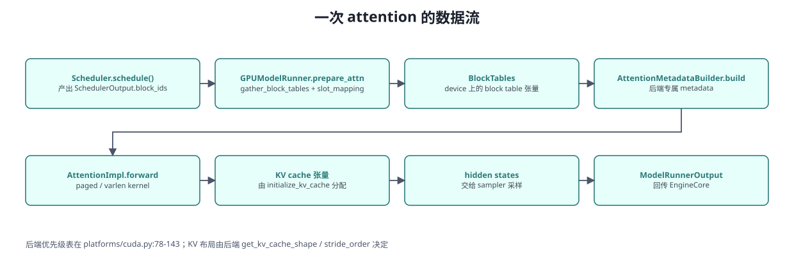

<details>
<summary>Mermaid 源码（可编辑，需支持 mermaid 的渲染器）</summary>

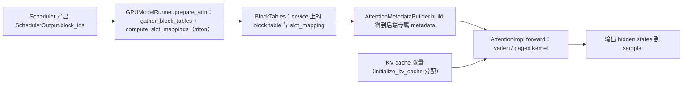

</details>

* KV cache 物理布局由后端决定：`get_kv_cache_shape` + `get_kv_cache_stride_order` 在 `initialize_kv_cache` 时用于 reshape/permute（`v1/worker/gpu/attn_utils.py:146-241`）。
* `ops/` 下的 triton kernel 与 `deepseek_v4_ops/` 是融合优化层：prefill 与 decode 融合（`chunked_prefill_paged_decode.py`）、KV 写入与 RoPE 融合、attention 输出与量化融合。

---

## 11. 采样、投机解码与结构化输出

### 11.1 采样 `vllm/v1/sample/`（15 个文件）

| 文件 | 关键符号 |
|---|---|
| `sampler.py` | `Sampler(nn.Module):21`、`forward:68`、`sample:235`、`apply_logits_processors:360` |
| `metadata.py` | `SamplingMetadata:15`（temperature / top_p / top_k / generators / max_num_logprobs / penalties / allowed_token_ids_mask / bad_words_token_ids / logitsprocs / spec_token_ids） |
| `rejection_sampler.py` | `RejectionSampler:37`、`forward:87`、`rejection_sample:392`、`sample_recovered_tokens:659`；`MAX_SPEC_LEN=128:34` |
| `logits_processor/` | `interface.py`（`LogitsProcessor` ABC `:60`、`BatchUpdate:37`）；`builtin.py`（`MinPLogitsProcessor:22`、`LogitBiasLogitsProcessor:118`、`MinTokensLogitsProcessor:167`）；`state.py`（`BatchUpdateBuilder:18`、`LogitsProcessors:148`）；`__init__.py`（`BUILTIN_LOGITS_PROCESSORS:49`、`build_logitsprocs:184`、插件加载 `:56`） |
| `ops/topk_topp_sampler.py` | `TopKTopPSampler:22`；`forward_native:111` / `forward_cuda:132` / `forward_cpu:159` / `forward_hip:189`；`apply_top_k_top_p:310`、`flashinfer_sample:414` |
| `ops/penalties.py` `ops/bad_words.py` `ops/logprobs.py` `ops/topk_topp_triton.py` | 各算子（triton 版 `_topk_topp_kernel:94`） |
| `thinking_budget_state.py` | 推理模型 thinking token 预算控制 |

**采样算子顺序**（`Sampler.forward:68`，契约写在 docstring `:22-59`）：

```
raw logprobs/logits 快照 :81 到 转 fp32 :91
  到 allowed_token_ids mask :385
  到 bad words :390
  到 非 argmax-invariant processor（logit bias、min_tokens）:393
  到 penalties :397 到 apply_all_penalties :411
  到 thinking budget :398
  到 temperature :265 到 argmax-invariant（min_p）:271 到 top-k/top-p + RNG :275
  到（temperature 小于 1e-5 回退 greedy :285）
  到 logprobs gather :123 到 SamplerOutput :136
```

### 11.2 V1 与 V2 两套采样实现（容易踩坑）

| | V1 runner | V2 runner |
|---|---|---|
| 采样器 | `v1/sample/sampler.py` 的 `Sampler`（`gpu_model_runner.py:489` 实例化） | `v1/worker/gpu/sample/sampler.py` 的 `Sampler`（`gpu/model_runner.py:214`） |
| logits processor 状态 | **每请求一个 processor 对象**，存在 `gpu_input_batch.py`（`BatchUpdateBuilder:263`、`logitsprocs:281`），每次 forward 前 `update_state`（`:823-826`） | **无 per-request 对象**：状态全在 worker 的 UVA 张量里（`gpu/sample/states.py:17 SamplingStates`） |
| 规格化路径 | `SamplingParams` 到 `SamplingMetadata` 到 `Sampler` | `Sampler.apply_sampling_params`（`gpu/sample/sampler.py:121`）按序：logit_bias 到 penalties 到 bad_words 到 temperature 到 min_p 到 top_k/top_p 到 `gumbel_sample:188` |
| 投机解码 | `v1/sample/rejection_sampler.py` | `v1/worker/gpu/spec_decode/rejection_sampler.py:40` |
| 已知差异 | logits processors 调用点齐全 | **V2 采样器中未发现 logits processors 调用点**，迁移前需确认 |

### 11.3 投机解码 `vllm/v1/spec_decode/`（23 个文件）

| 文件 | 关键符号 |
|---|---|
| `metadata.py` | `SpecDecodeMetadata:10`（draft_token_ids、cu_num_draft_tokens、target/bonus logits 索引） |
| `llm_base_proposer.py` | `SpecDecodeBaseProposer:55`（Eagle / draft model / dflash / gemma4 都继承它） |
| `eagle.py` `draft_model.py` `dflash.py` `gemma4.py` `medusa.py` | 各 proposer |
| `ngram_proposer.py` `ngram_proposer_gpu.py` | n-gram 投机（CPU numba 版 + GPU kernel 版，`NgramProposerGPU:216`） |
| `suffix_decoding.py` | 后缀解码（依赖外部 `arctic_inference`） |
| `extract_hidden_states.py` / `custom_class_proposer.py` | 输出 hidden states / 用户自定义 proposer |
| `utils.py` | eagle kernels、`compute_new_slot_mapping:242`、`unconditional_to_conditional_rates:599` |
| `metrics.py` | `SpecDecodingStats:18`、`SpecDecodingLogging:48`、`SpecDecodingProm:121` |

**选择方式不是注册表，而是 `if/elif` 链**（`v1/worker/gpu_model_runner.py:523-592`）：按 `method` 依次判 `custom_class` 到 `ngram` 到 draft model 到 ngram-gpu 到 gemma4-mtp 到 dflash 到 `suffix` 到 eagle 到 medusa 到 extract_hidden_states，否则 `ValueError`。配置入口 `--speculative-config/-sc`（JSON）到 `create_speculative_config`（`engine/arg_utils.py:1617`）。**`v1/spec_decode/` 下没有 `mlp_speculator.py`**（该 method 值只在 `config/speculative.py:691` 被映射）。


### 11.4 结构化输出 `vllm/v1/structured_output/`（8 个文件）

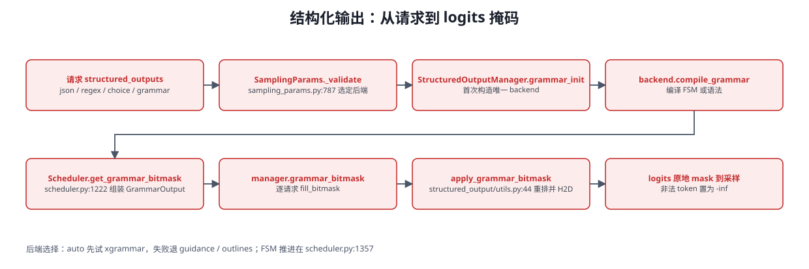

<details>
<summary>Mermaid 源码（可编辑，需支持 mermaid 的渲染器）</summary>

```mermaid
flowchart LR
    A["请求 sampling_params.structured_outputs"] --> B["SamplingParams._validate_structured_outputs  sampling_params.py:787"]
    B -->|"auto：先 xgrammar，失败退 guidance/outlines"| C["_backend 字段"]
    C --> D["StructuredOutputManager.grammar_init  __init__.py:114"]
    D --> E["backend.compile_grammar:183"]
    E --> F["Scheduler.get_grammar_bitmask  scheduler.py:1222"]
    F --> G["manager.grammar_bitmask:203 + _fill_bitmasks:185"]
    G --> H["GrammarOutput"]
    H --> I["worker：apply_grammar_bitmask  structured_output/utils.py:44"]
    I --> J["logits 原地 mask 到 采样"]
```

</details>

| 文件 | 关键符号 |
|---|---|
| `backend_types.py` | `StructuredOutputGrammar` ABC `:31`（`accept_tokens:35`、`validate_tokens:49`、`rollback:63`、`fill_bitmask:73`）、`StructuredOutputBackend:99` |
| `backend_xgrammar.py` / `backend_guidance.py` / `backend_outlines.py` / `backend_lm_format_enforcer.py` | 四个后端（`XgrammarBackend:35` 等） |
| `request.py` | `StructuredOutputRequest:22`（每请求 grammar 状态） |
| `__init__.py` | `StructuredOutputManager:35`、`grammar_init:114`、`grammar_bitmask:203`、`should_advance:321`、`clear_backend:359` |
| `utils.py` | `apply_grammar_bitmask:44`（按 batch 顺序重排后 H2D 并原地 mask logits） |

* **后端选择**由 `SamplingParams._validate_structured_outputs`（`vllm/sampling_params.py:787`）完成：`auto` 先试 xgrammar，失败退 guidance 或 outlines；**请求级覆盖被拒绝**（`:807-815`）。CLI 上用 `--structured-outputs-config`（**没有** `--guided-decoding-backend`）。
* **注意**：`get_grammar_bitmask` **不是** manager 的方法，而是 scheduler 的方法（`v1/core/sched/scheduler.py:1222`）；manager 的公开产出是 `grammar_bitmask()`。
* **FSM 推进**由 `StructuredOutputManager.should_advance:321` 在调度器输出处理时调用（`scheduler.py:1357`、`:1616`、`:1645`）；语法拒绝 token 则 `FINISHED_ERROR`。引擎关闭时 `clear_backend`（`v1/engine/core.py:595`）。

### 11.5 池化执行

| 部分 | 说明 |
|---|---|
| `v1/pool/metadata.py` | `PoolingMetadata:49`、`PoolingStates:39`（chunked prefill 的 hidden states 缓存）、`PoolingCursor:16` |
| `v1/pool/late_interaction.py` | **late-interaction（ColBERT 类）跨引擎路由**：`get_late_interaction_engine_index:15` 用 `crc32(query_key) % num_engines` 做引擎亲和；`compute_maxsim_score_batched:59` |
| `v1/worker/gpu/pool/pooling_runner.py` | `PoolingRunner:18`、`get_supported_tasks:23`（只支持 `embed`）、`pool:29`（取最后一个 token 的 hidden state 并 L2 归一化） |
| `v1/worker/gpu/pool/late_interaction_runner.py` | `LateInteractionRunner:16`（query 缓存、`postprocess_pooler_output:47`） |

**关键点**：late-interaction 打分是**两阶段**的——query 先编码并缓存（`LATE_INTERACTION_MODE_CACHE_QUERY`），再按 query 亲和路由到同一引擎做文档打分，MaxSim 在 worker 侧计算。这就是 `/score`、`/rerank` 在 ColBERT 类模型上要走特殊路径的原因。

## 12. 输入侧：renderers / inputs / tokenizers / multimodal

这一层回答：**HTTP 请求里的 `messages`（可能含图片/音频/视频 URL、base64、prompt_embeds）如何变成引擎能吃的 `EngineInput`**。


### 12.1 总管线

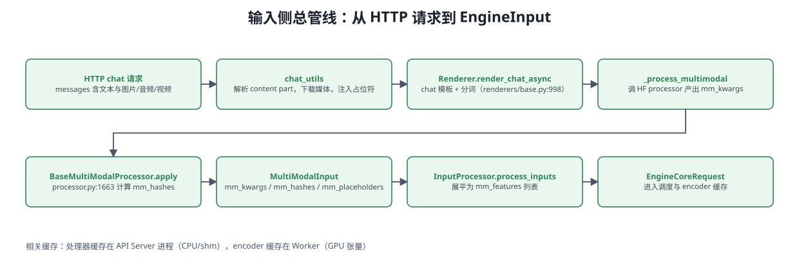

<details>
<summary>Mermaid 源码（可编辑，需支持 mermaid 的渲染器）</summary>

```mermaid
graph LR
  A["HTTP chat request"] --> B["chat_utils：AsyncMultiModalItemTracker + ContentParser"]
  B -->|"mm_data, mm_uuids"| C["Renderer.render_chat_async  renderers/base.py:998"]
  C --> D["tokenize_prompts_async  base.py:578"]
  D --> E["_process_multimodal  base.py:666"]
  E --> F["BaseMultiModalProcessor.apply  processing/processor.py:1663 到 调 HF processor"]
  F -->|"MultiModalInput：mm_kwargs / mm_hashes / mm_placeholders"| G["InputProcessor.process_inputs  v1/engine/input_processor.py:234"]
  G -->|"mm_features：list[MultiModalFeatureSpec]"| H["EngineCoreRequest"]
  H --> I["EncoderCacheManager 到 EncoderRunner 到 GPU EncoderCache"]
```

</details>

关键跳点：

1. `OpenAIServingChat.create_chat_completion`（`openai/chat_completion/serving.py:225`）到 `render_chat_request`（`:198`）到 `OpenAIServingRender.render_chat`（`serve/render/serving.py:185`）
2. `preprocess_chat`（`serve/render/serving.py:525`）构造 `ChatParams`/`TokenizeParams`（`:553-560`）到 `renderer.render_chat_async`（`:562`）
3. `BaseRenderer.render_chat_async`（`renderers/base.py:998`）到 `HfRenderer.render_messages_async`（`renderers/hf.py:919`）到 `parse_chat_messages_async`（`entrypoints/chat_utils.py:1886`）
4. **URL/base64 到媒体对象**：`_parse_chat_message_content_part`（`chat_utils.py:1628`）按 `type` 分派到 `AsyncMultiModalContentParser.parse_image/parse_audio/parse_video/parse_prompt_embeds`（`:1062` 起）；下载走 `MediaConnector`（`multimodal/media/connector.py:74`），支持 `data:` URL、允许的本地路径（`--allowed-local-media-path`）与 HTTP
5. **占位符注入**：`AsyncMultiModalItemTracker.add`（`chat_utils.py:598`）向模型要占位符 `get_placeholder_str`（`:653`）并校验数量 `validate_num_items`（`:644`），`resolve_items`（`:822`）并发等待所有下载
6. **tokenize 与 MM 处理**：`BaseRenderer.process_for_engine_async`（`base.py:889`）到 `_process_multimodal`（`:666`）到 `BaseMultiModalProcessor.apply`（`processing/processor.py:1663`）到 `_cached_apply_hf_processor`（`:1441`）到 `call_hf_processor`（`processing/context.py:243`），产出 `MultiModalKwargsItems` 与 `mm_hashes` 到 `mm_input(...)`（`processor.py:1702`）
7. **进引擎**：`InputProcessor.process_inputs`（`v1/engine/input_processor.py:234`）把 MM 位置展平为 `MultiModalFeatureSpec` 列表（`:344-367`），类型定义在 `multimodal/inputs.py:302`

### 12.2 `renderers/`：为什么要在 tokenizer 之上再抽象一层

**tokenizer 只负责 string 到 ids；renderer 承载 prompt 语义**：chat 模板解析与内容格式探测（`hf.py:501`）、多模态占位符与 UUID 生成（`base.py:637-663`）、MM 处理调度（`:666`）、embeds 与 enc-dec 分支（`:737`/`:817`）、截断与长度错误语义（`params.py:314-441`）。

| 文件 | 关键类/函数 | 职责 |
|---|---|---|
| `base.py` | `BaseRenderer:74`、`render_cmpl:912` / `render_cmpl_async:935`、`render_chat:962` / `render_chat_async:998`、`process_for_engine:872` | 四阶段流水：`render_prompt:360` 到 `tokenize_prompt:551` 到 `_apply_prompt_extras:588` 到 `process_for_engine:872` |
| `registry.py` | `RendererRegistry:36`、`RENDERER_REGISTRY:73`、`renderer_from_config:82` | 按 `renderer_mode` 查表实例化 |
| `hf.py` | `HfRenderer:783`、`resolve_chat_template:265`（4 级优先级）、`safe_apply_chat_template:629` | 默认 renderer；Jinja 模板、内容格式探测、prompt_embeds 注入 |
| `mistral.py` / `deepseek_v32.py` / `deepseek_v4.py` / `grok2.py` / `terratorch.py` | 各自 `*Renderer` | 厂商专用模板/编码器 |
| `params.py` | `TokenizeParams:129`、`ChatParams:72`、`merge_kwargs:28`、`get_encode_kwargs:288` | 分词与模板参数、截断、填充、长度校验 |
| `inputs/preprocess.py` | `parse_model_prompt:235`、`parse_enc_dec_prompt:218`、`DictPrompt:112` | 原始 prompt 到规范化 dict prompt |
| `inputs/tokenize.py` | `TokPrompt:53`、`EncoderDecoderTokPrompt:32` | 分词后 prompt schema |
| `embed_utils.py` | `safe_load_prompt_embeds:16` | base64 到 Tensor，校验 hidden_size 与 dtype |

### 12.3 `inputs/`：`EngineInput` 的形态

* `inputs/llm.py`：`PromptType:215`、`DataPrompt:223`、`TextPrompt`、`TokensPrompt`、enc-dec 组合类型
* `inputs/engine.py`：`TokensInput("token"):29`、`EmbedsInput("embeds"):62`、`MultiModalInput("multimodal"):126`（含 `mm_kwargs` / `mm_hashes` / `mm_placeholders`）、`MultiModalEncDecInput:176`、`EncoderDecoderInput("enc_dec"):239`；工厂 `tokens_input:42`、`embeds_input:88`、`mm_input:151`
* `inputs/preprocess.py:48 InputPreprocessor` 已退化为 renderer 的薄委托（`_process_multimodal:90` 直接调 `self.renderer._process_multimodal`）

### 12.4 `multimodal/`：注册表、处理器、媒体、缓存

| 文件 | 关键符号 | 作用 |
|---|---|---|
| `registry.py` | `MultiModalRegistry:98`、`create_processor:211`、全局 `MULTIMODAL_REGISTRY` | 按模型类懒构造 processor（info + dummy_inputs + processor 三工厂，`:81-95`） |
| `processing/processor.py` | `BaseMultiModalProcessor:972`、`apply:1663`、`_merge_mm_kwargs:1347` | MM 处理核心：HF processor 到 `MultiModalKwargsItems` 到 占位符改写 到 `MultiModalInput` |
| `processing/context.py` | `BaseProcessingInfo:295`、`call_hf_processor:243`、`get_merged_mm_kwargs:239` | 模型侧 processing info；**`mm_processor_kwargs` 的合并点** |
| `parse.py` | `MultiModalDataParser:476`、`Image/Audio/VideoProcessorItems` | `MultiModalDataDict` 到 逐模态 items |
| `inputs.py` | `PlaceholderRange:119`、`MultiModalFeatureSpec:302`、`MultiModalKwargsItems:882` | 引擎侧 MM 载荷类型 |
| `hasher.py` | `MultiModalHasher:50`、`hash_kwargs:154` | blake3 内容哈希（`VLLM_MM_HASHER_ALGORITHM` 可改） |
| `cache.py` | `MultiModalProcessorOnlyCache:326`、`MultiModalProcessorSenderCache:379`、`ShmObjectStoreSenderCache:437` | 处理器输出缓存（CPU 与 shm） |
| `media/connector.py` | `MediaConnector:74`、`MEDIA_CONNECTOR_REGISTRY:41` | URL / base64 / 本地文件 到 媒体对象 |
| `media/{image,video,audio}.py` | `ImageMediaIO:20`、`VideoMediaIO:19`、`AudioMediaIO:163` | 解码后端：图像 PIL、**视频 OpenCV + PyAV（无 decord）**、音频 soundfile + PyAV |
| `utils.py` | `argsort_mm_positions:112`、`group_and_batch_mm_kwargs:211` | 引擎侧位置排序与批分组 |
| `encoder_budget.py` | `MultiModalBudget:44` | encoder token 预算（决定可同时处理多少多模态输入） |

### 12.5 `tokenizers/`：`TokenizerLike` 契约与多后端

| 文件 | 说明 |
|---|---|
| `protocol.py:13 TokenizerLike` | 唯一契约：`encode:91`、`decode:120`、`apply_chat_template:100`、`max_chars_per_token:62`、`truncation_side:66`、bos/eos/pad id。**没有** `batch_encode` / `tokenizer_mode`，也**不存在** `TokenizerBase` |
| `registry.py` | `get_tokenizer:197`、`resolve_tokenizer_args:96`、`cached_get_tokenizer:255`；mode `slow` 用 hf 且 `use_fast=False`，`auto` 判定 mistral 仓库，否则 hf |
| `hf.py` / `mistral.py` / `grok2.py` / `deepseek_v32.py` / `deepseek_v4.py` / `kimi_audio.py` / `qwen_vl.py` / `fastokens.py` | 各 tokenizer 实现 |
| `detokenizer_utils.py:110 detokenize_incrementally` | 增量反分词（引擎回程使用） |

> renderer **不直接 import `get_tokenizer`**，tokenizer 由 `renderer_from_config`（`renderers/registry.py:85`）注入；异步分词走 `AsyncMicrobatchTokenizer`（`vllm/utils/async_utils.py:24`）。`vllm/transformers_utils/tokenizer.py` 只是兼容 shim。

### 12.6 parser / tool_parsers / reasoning —— 是三层，不是三个平级目录

1. **`vllm/reasoning/`**：`ReasoningParser`（`abs_reasoning_parsers.py:26`，`is_reasoning_end:60`、`extract_reasoning:133`）+ `ReasoningParserManager:189`。24 个模型实现（qwen3、deepseek_r1、gptoss、kimi_k2 等）。
2. **`vllm/tool_parsers/`**：`ToolParser`（`abstract_tool_parser.py:43`，`extract_tool_calls:156`）+ `ToolParserManager:192`；辅助 `streaming.py`（增量过滤）、`structural_tag_registry.py`（供 xgrammar 结构化输出）。
3. **`vllm/parser/`**：**统一门面**——`Parser`（`abstract_parser.py:67`）、`DelegatingParser:329`、`ParserManager:23`（`get_parser:241` 三策略，内部转发到上面两个 manager）。`minimax_m2_parser.py` 是唯一自带统一 Parser 的模型。

挂载点：`--tool-call-parser`（`openai/cli_args.py:114`）、`--tool-parser-plugin:119`、`--enable-auto-tool-choice:108`、`--reasoning-parser`（`engine/arg_utils.py:911`）；请求期在 `chat_completion/serving.py:122-132` 解析类，每请求实例化（`:470`/`:1068`），生成期调用 `parse_delta:718` / `extract_tool_calls:1070` / `extract_reasoning:1116`。

### 12.7 两级缓存的分工（容易混）

| | **处理器缓存**（CPU / shm） | **encoder 缓存**（GPU） |
|---|---|---|
| 位置 | `multimodal/cache.py`（`MultiModalProcessorSenderCache:379`、`ShmObjectStoreSenderCache:437`） | 逻辑：`v1/core/encoder_cache_manager.py:17`；物理：`v1/worker/gpu/mm/encoder_cache.py:8` |
| 缓存什么 | HF processor 的输出（`MultiModalKwargsItem` 张量 + prompt_updates） | encoder（视觉/音频 tower）输出张量 |
| 键 | `mm_hash or identifier`（跨 LoRA 共享） | 仅 `identifier`（含 LoRA 前缀，`encoder_cache_manager.py:106`） |
| 淘汰 | 字节级 LRU 或 shm 环形 FIFO；由 `mm_processor_cache_gb`（默认 4，**每进程一份**）控制 | embedding 槽位级记账 + 懒淘汰（`can_allocate:173`）；由 scheduler 通过 `SchedulerOutput.free_encoder_mm_hashes` 通知 worker 释放 |
| 命中后 | 跳过 HF processor | 跳过 encoder 前向，直接 `gather_mm_embeddings` |

两者**互不感知**：前者省 CPU 预处理，后者省 GPU 视觉前向。注意 GPU 侧 `EncoderCache` 本身只有约 40 行，**没有容量计算也没有淘汰策略**——边界完全由 scheduler 的逻辑记账决定。

---

## 13. 编译与内核

### 13.1 `compilation/` 目录清单（43 个文件）

| 文件/目录 | 作用 |
|---|---|
| `backends.py`（1331 行） | 核心：`VllmBackend`、`CompilerManager`、`split_graph`、`PiecewiseCompileInterpreter`、`wrap_with_cudagraph_if_needed` |
| `compiler_interface.py` | `CompilerInterface` 抽象 + `InductorAdaptor:482` / `InductorStandaloneAdaptor:280` / `EagerAdaptor:768`；`is_compile_cache_enabled:193` |
| `decorators.py` | **`support_torch_compile:118`**、`ignore_torch_compile:58`、AOT 加载/保存、`maybe_use_cudagraph_partition_wrapper:724` |
| `wrapper.py` | `TorchCompileWithNoGuardsWrapper:47`：丢弃 guards 后调 `torch.compile` |
| `cuda_graph.py` | `CUDAGraphWrapper:145` 捕获与回放、`CUDAGraphOptions:139` |
| `piecewise_backend.py` | `PiecewiseBackend:86`：按 compile range 调度已编译子图 |
| `caching.py` | `VllmSerializableFunction:166`、`aot_compile_hash_factors:565` |
| `codegen.py` | 把 split graph 拼成纯 Python `execution_fn` 并编译（`generate_execution_code:131`） |
| `partition_rules.py` | `should_split:14` 与 `inductor_partition_rule_context:41` |
| `monitor.py` / `counter.py` | 编译计时与 depyf dump；`CompilationCounter` 全局计数 |
| `base_static_graph.py` | `AbstractStaticGraphWrapper` Protocol —— 平台自定义静态图 wrapper 接口 |
| `passes/` | 见 13.4 |

**注意**：本版本**没有** `compilation/compile.py`（`support_torch_compile` 在 `decorators.py:118`），**没有** `compilation/splitting_ops.py`（切分策略在 `CompilationConfig`），也**没有** `compilation/ir/`（IR pass 在 `passes/ir/`）。

### 13.2 `torch.compile` 集成（10 步）

1. 模型类标 `@support_torch_compile`（`decorators.py:118`），`_support_torch_compile:331` 把 `TorchCompileWithNoGuardsWrapper` 追加进 `__bases__`
2. 构造时读 `compilation_config`，算 `do_not_compile`（mode 为 `NONE`、`ignore_torch_compile`、`enable_if` 为假时跳过）
3. `compilation_config.init_backend()`（`config/compilation.py:1020`）：`STOCK_TORCH_COMPILE` 用原生 backend；`VLLM_COMPILE` 用 **`VllmBackend`**
4. `torch.compile(..., fullgraph=True, dynamic=False, backend=backend)`（`wrapper.py:148`），并用 `guard_filter_fn` 丢弃全部 guard
5. 首次调用时按 `dynamic_arg_dims` 调 `torch._dynamo.mark_dynamic`（`decorators.py:414-500`），并收集 traced files
6. Dynamo 追踪到 `VllmBackend.__call__`（`backends.py:1015`）：算 cache hash 到 `configure_post_pass()`（注入 IR in-place functionalization 与平台 `PostGradPassManager`）到 **`split_graph`** 切分
7. `PiecewiseCompileInterpreter.call_module:725` 为每个可编译子图建 `PiecewiseBackend`，必要时 `wrap_with_cudagraph_if_needed:761` 包静态图
8. `PiecewiseBackend.compile_all_ranges:245` 逐个 range 调 `CompilerManager.compile:264` 到 adaptor 编译
9. `generate_execution_code` 与 `compile_execution_fn`（`backends.py:1271-1281`）得到 `VllmSerializableFunction`
10. 运行期 `VllmSerializableFunction.__call__`（`caching.py:216`）按 runtime shape 选 range（`piecewise_backend.py:343-356`）

### 13.3 CUDA Graph 与 piecewise 切分

* `CUDAGraphMode`（`config/compilation.py:53`）：`NONE / PIECEWISE / FULL / FULL_DECODE_ONLY / FULL_AND_PIECEWISE`
* **切分点默认是 attention 算子**（`_attention_ops`，`config/compilation.py:747,1113`），并追加 `vllm::unified_kv_cache_update` 等（`:1131-1132`）—— 这就是"attention 之外的部分能被图捕获、attention 每次重跑"的由来
* `resolve_cudagraph_mode_and_sizes:1310` 按 attention 后端的 `AttentionCGSupport` **自动降级**：不支持 mixed batch 用 `FULL_AND_PIECEWISE` 或 `FULL_DECODE_ONLY`；`NEVER` 用 `PIECEWISE` 或 `NONE`；spec-decode 的 `uniform_decode_query_len>1` 会调整 capture sizes
* piecewise 划分两条路：Dynamo FX 级（`split_graph`，`backends.py:548`）或 Inductor codegen 级（`use_inductor_graph_partition` 与 `custom_should_partition_ops`）
* 捕获与回放：`CUDAGraphWrapper.__call__`（`cuda_graph.py:233`）从 forward context 取 `batch_descriptor` 与 `cudagraph_runtime_mode`，mode 不匹配直通，miss 则 `torch.cuda.graph(...)` 捕获（`:265-344`），hit 则 `replay()`（`:360`）

### 13.4 `passes/`：图优化

| pass | 作用 |
|---|---|
| `inductor_pass.py` / `vllm_inductor_pass.py` | pass 基类、`PassContext`、`VllmPatternMatcherPass`、dump 支持 |
| `pass_manager.py` | `PostGradPassManager:81`：执行顺序 passes 到 post_cleanup 到 **ir_lowering** 到 clone_elimination 到 post_cleanup 到 fix_functionalization；`uuid():200` 把各 pass 纳入 Inductor cache key |
| `fusion/act_quant_fusion.py` `attn_quant_fusion.py` `mla_attn_quant_fusion.py` `rms_quant_fusion.py` | 激活 / attention / RMSNorm 与 FP8、NVFP4 量化融合 |
| `fusion/allreduce_rms_fusion.py` | FlashInfer fused allreduce + RMSNorm（含量化）；ROCm 版 `RocmAiterAllReduceFusionPass:1000` |
| `fusion/collective_fusion.py` | async TP：GEMM 与 AllGather / reduce-scatter 融合（`AsyncTPPass:900`） |
| `fusion/sequence_parallelism.py` | `enable_sp`：AR 与 RMSNorm 改写为 RS 到 RMSNorm 到 AG（`SequenceParallelismPass:495`，仅整图编译） |
| `fusion/qk_norm_rope_fusion.py` `rope_kvcache_fusion.py` `mla_rope_kvcache_cat_fusion.py` | QK-Norm / RoPE / KV cache 写入融合 |
| `fusion/rocm_aiter_fusion.py` `minimax_qk_norm_fusion.py` | 平台与模型专用融合 |
| `ir/lowering_pass.py` | `VllmIRLoweringPass:25`：按 IR 算子优先级降级为具体 kernel |
| `ir/inplace_functionalization.py` | IR `maybe_inplace` 到默认 overload（donation 语义校验） |
| `ir/clone_elimination.py` | 删除多余 clone（利用 donated inputs） |
| `utility/noop_elimination.py` `post_cleanup.py` `fix_functionalization.py` `split_coalescing.py` `scatter_split_replace.py` | 通用图清理与 defunctionalization |

### 13.5 `vllm/ir/`：可调优先级的算子抽象

`ir/op.py` 是核心：`register_op:98` 把普通 PyTorch 函数注册成 `IrOp:144`（用 `torch.library.Library("vllm_ir","FRAGMENT")` 建 custom op），`register_impl(provider, supported=...)` 注册多后端实现，`dispatch:313` 按**当前优先级**选实现，`IrOpInplace:456` 提供 `maybe_inplace` overload。

* 优先级配置在 `vllm/config/kernel.py:20 IrOpPriorityConfig`（字段 `rms_norm`、`fused_add_rms_norm`），`set_priority():71` 会先 `current_platform.import_ir_kernels()` 再设置
* CUDA 默认：编译时 `["native"]`，非编译时 `["vllm_c", "native"]`（`platforms/cuda.py:564-583`）
* 与编译联动：`forward_context.py:322-329` 每次 forward 用 `set_priority()` 与 `enable_torch_wrap()` 包住整图；post-grad 的 `VllmIRLoweringPass` 负责把 IR op 落成具体实现
* 实现提供方在 `vllm/kernels/`：`vllm_c.py`、`aiter_ops.py`（ROCm）、`xpu_ops.py`、`oink_ops.py`

### 13.6 `kernels/` / `triton_utils/` / `_custom_ops.py`

| 位置 | 内容 |
|---|---|
| `vllm/kernels/` | `vllm_c.py` / `aiter_ops.py` / `xpu_ops.py` / `oink_ops.py`（IR impl）；`triton/`（如 `qkv_padded_fp8_quant.py`）；`helion/`（`HelionKernelWrapper`，唯一已注册 kernel 是 `silu_mul_fp8`，带 H100/H200 预调 config JSON） |
| `vllm/triton_utils/` | `importing.py`（`HAS_TRITON` 探测；无 Triton 时把 `triton.jit` 退化为 no-op 装饰器）、`allocation.py`（Triton scratch 分配器）、`jit_monitor.py`（推理期意外 JIT 告警）。**该包不提供 autotune 装饰器封装** |
| `vllm/_custom_ops.py`（3825 行） | 对 `csrc/` C++ 扩展的 Python 封装：首行 `current_platform.import_kernels()` 触发 `vllm._C` / `vllm._moe_C` 导入；用 `@register_fake("_C::op")` 给每个 C++ op 补 fake/meta 实现，并用 out-variant 与 functional-variant 成对定义配合 torch.compile 的 buffer 管理 |
| `vllm/_aiter_ops.py` / `_xpu_ops.py` / `_tilelang_ops.py` | ROCm AITER / XPU / TileLang 算子的同构封装 |
| `vllm/vllm_flash_attn/` | 探测 `_vllm_fa2_C` / `_vllm_fa3_C` / `cute`，提供 `flash_attn_varlen_func`、`get_scheduler_metadata` |

### 13.7 编译缓存与相关环境变量

| 环境变量 | 作用 |
|---|---|
| `VLLM_CACHE_ROOT` | 缓存根目录；编译缓存在 `{root}/torch_compile_cache/{hash}/rank_{r}_{dp}/{prefix}` |
| `VLLM_DISABLE_COMPILE_CACHE` | 关闭编译缓存（`compiler_interface.py:193`） |
| `VLLM_USE_AOT_COMPILE` / `VLLM_USE_MEGA_AOT_ARTIFACT` / `VLLM_USE_STANDALONE_COMPILE` / `VLLM_FORCE_AOT_LOAD` | AOT 预编译产物的生成与加载 |
| `VLLM_USE_BYTECODE_HOOK` | 直接跑编译后字节码，绕过部分 Dynamo 开销 |
| `VLLM_COMPILE_CACHE_SAVE_FORMAT` | `binary`（多进程安全）或 `unpacked` |
| `VLLM_ENABLE_INDUCTOR_MAX_AUTOTUNE` / `VLLM_ENABLE_INDUCTOR_COORDINATE_DESCENT_TUNING` | Inductor autotune（仅单尺寸 range 开启） |
| `VLLM_PATTERN_MATCH_DEBUG` | pattern 匹配调试 |

> Cache key = 环境因子（`envs.compile_factors()`，按白名单剔除无语义变量）+ `VllmConfig.compute_hash()` + traced 源码 hash + compiler hash（`backends.py:1026-1061`）。

---

## 14. 分布式 `vllm/distributed/`

112 个 `.py`。这一层决定"多卡/多机时什么被切开、什么被复制、用什么通信"。


### 14.1 并行维度总览

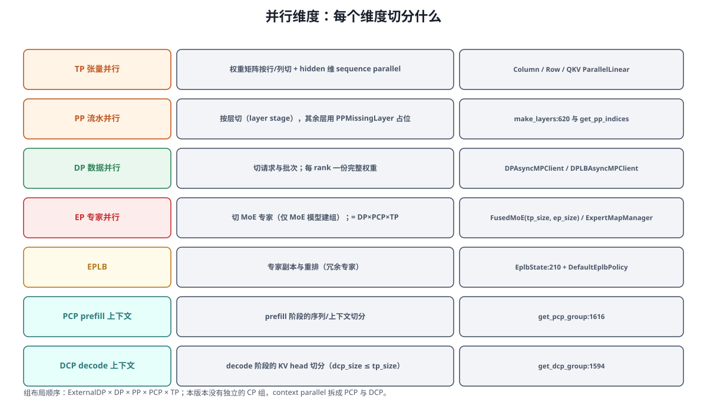

| 维度 | 切什么 | getter | 源码 |
|---|---|---|---|
| WORLD | 全部 rank 的通信域 | `get_world_group()` | `parallel_state.py:1132,1137` |
| **TP** | 权重矩阵行/列 + hidden 维 sequence parallel | `get_tp_group()`、`get_tensor_model_parallel_world_size()` | `:1226,1229,1837` |
| **PP** | 层（layer stage） | `get_pp_group()` | `:1245,1635` |
| **DP** | 请求与批次 | `get_dp_group()` | `:1253,1653` |
| **EP** | MoE 专家（仅 MoE 模型建组）；等于 DP×PCP×TP 合并 | `get_ep_group()` | `:1261,1670` |
| EPLB | 与 EP 同 ranks，独立进程组隔离通信 | `get_eplb_group()` | `:1273,1698` |
| **PCP** | prefill 阶段的序列/上下文 | `get_pcp_group()` | `:1285,1616` |
| **DCP** | decode 阶段的 KV head/上下文（复用 TP 的 GPU，`dcp_size <= tp_size`） | `get_dcp_group()` | `:1234,1594` |
| 节点 | 仅拓扑信息，非通信域 | `get_node_count()` | `:1134` |

* 组布局顺序：`ExternalDP × DP × PP × PCP × TP`（`:1560-1575`）
* **本版本没有独立的 CP 组** —— context parallel 拆成 PCP（prefill 序列）与 DCP（decode KV）
* 每组的 `GroupCoordinator:319` 同时建 device group 与 gloo cpu_group（`:339-345`），按平台选 device communicator（`:372-381`）；TP 组额外建 `MessageQueue`（`:386-389`）

### 14.2 初始化流程

```
Worker.init_device 之后
  init_worker_distributed_environment()        v1/worker/gpu_worker.py:1121
    override_envs_for_eplb()                   :1133
    set_custom_all_reduce(...)                 :1134
    init_distributed_environment(...)          parallel_state.py:1358
      DP/多机时 rank 偏移 = dp_rank*world_size + rank，world_size 改为 world_size_across_dp  :1390-1402
      torch.distributed.init_process_group :1432（backend 不可用回退 gloo :1422-1430）
    ensure_model_parallel_initialized(...)     :1738
      initialize_model_parallel(tp, pp, pcp, dcp)  :1494
        TP:1577 到 DCP:1594 到 PCP:1616 到 PP:1635 到 DP:1653 到 EP:1670 到 EPLB:1698
    ensure_ec_transfer_initialized(...)        :1160（必须在 KV cache 初始化之前）
```

* Elastic EP 时走 `_init_elastic_ep_world()`（`:1323-1355`），`_WORLD` 变为 `StatelessGroupCoordinator`（`stateless_coordinator.py:61`）
* 设备字符串分派：`is_cuda_alike()` 用 `cuda:{local_rank}`；`is_xpu()` 用 `xpu:N`；`is_out_of_tree()` 用 `{device_name}:N`；否则 `cpu`（`:359-368`）
* CUDA Graph 捕获：`graph_capture(device)`（`:1293-1310`）是 TP 与 PP 两个 group coordinator 的嵌套，内部切换新 CUDA stream 并注册 custom-AR / aiter 的 graph buffer

### 14.3 `device_communicators/`：all-reduce 的多级回退

| Communicator | 用途 |
|---|---|
| `DeviceCommunicatorBase:118` | 抽象基类，默认走 torch.distributed |
| `CudaCommunicator:25` | CUDA/ROCm 主通信器，聚合所有 AR 后端与 all2all manager |
| `PyNcclCommunicator:60` | 直接 dlopen NCCL 的薄封装（all_reduce / all_gather / reduce_scatter / send / recv / broadcast 等） |
| `CustomAllreduce:50` | IPC 对称内存快速 AR，仅 `tp` 组、world_size 属于 {2,4,6,8} |
| `SymmMemCommunicator:25` | torch symmetric memory 多播 AR |
| `FlashInferAllReduce:229` | FlashInfer fused AR |
| `QuickAllReduce:45` | ROCm MI300 量化 AR |
| `MessageQueue:358` / `ShmRingBuffer:209` | 共享内存环形缓冲 + ZMQ XPUB 的 CPU 广播（TP 组用来播 `SchedulerOutput`） |
| `SingleWriterShmObjectStorage:414` | 单写多读共享内存对象存储（引用计数 + FIFO 淘汰） |
| `all2all.py` 各 manager | `AgRsAll2AllManager:40`、`DeepEPHT/LL:196/257`、`NixlEPAll2AllManager:327`（RDMA，支持弹性 EP）、`FlashInferNVLinkTwoSided/OneSided:443/550`、`MoriAll2AllManager:672`（ROCm） |

**`all_reduce` 回退链**（`cuda_communicator.py:174-231`）：NCCL symm-mem 到 QuickReduce(ROCm) 到 FlashInfer AR 到 Custom AR 到 torch symm-mem 到 PyNccl 到 `torch.distributed.all_reduce`。

### 14.4 `kv_transfer/`：P/D 分离的核心

```
kv_transfer/
├── kv_transfer_state.py     全局 connector 单例：get_kv_transfer_group / has_kv_transfer_group
└── kv_connector/
    ├── base.py              KVConnectorBase = KVConnectorBase_V1
    ├── factory.py           KVConnectorFactory:27 + 注册表
    ├── utils.py             KVOutputAggregator:50、TransferTopology:393
    └── v1/
        ├── base.py          KVConnectorBase_V1:171（生命周期钩子）
        ├── metrics.py       KVConnectorStats / PromMetrics / Logging
        ├── multi_connector.py  offloading_connector.py  simple_cpu_offload_connector.py
        ├── nixl/  mooncake/  moriio/  hf3fs/  p2p/  offloading/  lmcache_integration/
        └── example_connector.py  decode_bench_connector.py  flexkv_connector.py
```

| Connector（注册名） | 机制 |
|---|---|
| `NixlConnector` | NIXL/UCX RDMA（GPU 直传），支持 HMA |
| `MooncakeConnector` / `MooncakeStoreConnector` | Mooncake transfer engine / store（含 lookup key server） |
| `LMCacheConnectorV1` / `LMCacheMPConnector` | LMCache 集成（单进程 / 多进程适配） |
| `P2pNcclConnector` | P2P NCCL 直连 |
| `HF3FSKVConnector` | 3FS 分布式文件系统，带独立 metadata server |
| `OffloadingConnector` / `SimpleCPUOffloadConnector` | CPU 与分层 offload |
| `MultiConnector` | 组合多 connector：**从首个可用者加载，保存到所有** |
| `MoRIIOConnector` / `FlexKVConnectorV1` / `DecodeBenchConnector` / `ExampleConnector` | ROCm IO / FlexKV / 基准 / 示例 |

**生命周期钩子**（`v1/base.py`）—— 理解 P/D 分离只需看这几个：

| 侧 | 钩子 | 时机 |
|---|---|---|
| Scheduler | `get_num_new_matched_tokens:453` | 调度时问 connector"远端已有多少 KV 可命中" |
| Scheduler | `update_state_after_alloc:488` | 分配后同步状态（可能进入 `WAITING_FOR_REMOTE_KVS`） |
| Scheduler | `build_connector_meta:509` | 生成本步传输计划，写进 `SchedulerOutput.kv_connector_metadata` |
| Scheduler | `on_new_request:524` / `request_finished:542` | 请求生命周期钩子（abort 时靠它释放远端块） |
| Worker | `bind_connector_metadata:211` / `start_load_kv:292` / `save_kv_layer:324` / `wait_for_save:346` / `get_finished:357` | 前向前后真正做 P2P 读写 |

`kv_role` 定义在 `config/kv_transfer.py:11-13`：`kv_producer` / `kv_consumer` / `kv_both`。P 实例是 producer，D 实例是 consumer，`kv_both` 用于 offload 与共享缓存。

### 14.5 ec_transfer / eplb / elastic_ep / weight_transfer

| 子系统 | 作用 | 入口 |
|---|---|---|
| `ec_transfer/` | **多模态 encoder cache 的跨实例传输**（EPD 分离），`ECConnectorBase:59` 与工厂（当前仅 `ECExampleConnector`） | `ensure_ec_transfer_initialized:26` |
| `eplb/` | 专家负载均衡：`EplbState:210` 维护 physical 到 logical 映射，`policy/DefaultEplbPolicy:21` 算重排，`rebalance_execute.py` 搬权重，`eplb_communicator.py:609` 提供 torch_nccl / gloo / nixl / pynccl 四种传输 | `override_envs_for_eplb:64` |
| `elastic_ep/` | 弹性扩缩 EP：worker 侧 `ElasticEPScalingExecutor:133`，engine 侧 `ElasticEPScalingState:82` 状态机；standby 组通过 `standby_state.py:37` 创建 | `v1/engine/core.py:1922` |
| `weight_transfer/` | **RL 训练权重热更**：`WeightTransferEngine:49`，后端 `"nccl"`（`nccl_engine.py:97`）与 `"ipc"`（`ipc_engine.py:111`） | `Worker.update_weights`（`gpu_worker.py:1026`） |

### 14.6 与引擎/Worker 的接口

* Worker 启动：`gpu_worker.py:1121`（见 14.2）；构造时 `:129 ElasticEPScalingExecutor`、`:136 WeightTransferEngineFactory.create_engine`
* 模型加载后：`prepare_communication_buffer_for_model(model)`（`gpu_model_runner.py:5034`、`gpu/model_runner.py:300`）—— 为 DeepEP 类后端按模型形状分配 buffer
* KV 初始化：`gpu_worker.py:539 initialize_from_config` 到 `:551 ensure_kv_transfer_initialized`；握手元数据 `:508 get_kv_connector_handshake_metadata`
* Scheduler 侧：`scheduler.py:123 KVConnectorFactory.create_connector(role=SCHEDULER)`、`:141 ECConnectorFactory...`
* 每步前向：`v1/worker/kv_connector_model_runner_mixin.py:85 _get_kv_connector_output()`
* 集合通信封装：`distributed/communication_op.py`（`tensor_model_parallel_all_reduce:12` 等）

## 15. 显存与 KV 卸载

vLLM 里有**三种**"把东西放到别处"的机制，很容易混：**模型权重 offload**、**KV cache offload**、**sleep mode**。

### 15.1 显存账本（启动时三步）

```
total_memory（设备总显存）
  到 requested_memory = total × --gpu-memory-utilization
  到 non_kv_cache_memory = profile_run() 实测峰值（+ CUDA Graph 估算）
  到 available_kv_cache_memory = requested - non_kv - cudagraph_estimate
  到 num_gpu_blocks = available / page_size / num_layers
```

| 环节 | 说明 | 源码 |
|---|---|---|
| 显存快照 | `MemorySnapshot.measure` 用 `torch.accelerator.memory_stats(...)["allocated_bytes.all.peak"]`；**集成 GPU（GH200/DGX Spark/Jetson）改用 `psutil.virtual_memory()`**，因为 `cudaMemGetInfo` 不计可回收 OS 页缓存 | `vllm/utils/mem_utils.py:96-126`（UMA 特例 `:109-116`） |
| 可用 KV 显存 | `Worker.determine_available_memory`：`profile_run()` + **仅 CUDA 且开 CUDA Graph 时**才做 graph 显存估算 | `v1/worker/gpu_worker.py:354-506`（CUDA 条件 `:398-407`） |
| block 数 | `get_kv_cache_configs` 取所有 worker 的最小可用显存，`get_num_blocks` 做除法并 clamp | `v1/core/kv_cache_utils.py:1942-2074`、`:932-949` |
| 物理分配 | `_allocate_kv_cache` 在设备上 `torch.zeros(int8)`，`shared_by` 的层共享同一张量；布局由 attention 后端的 `get_kv_cache_shape` 与 `stride_order` 决定 | `v1/worker/gpu/attn_utils.py:129-241` |
| 混合模型 | full attention / sliding window / mamba 各成 group，由 `KVCacheCoordinator` 分别算需求 | `v1/core/kv_cache_coordinator.py` |

### 15.2 模型权重 offload（`config/offload.py` 与 `model_executor/offloader/`）

注意：**这不是 KV offload，而是把模型权重的一部分放到 CPU**。

| 后端 | 配置 | 机制 |
|---|---|---|
| `uva` | `cpu_offload_gb`（每 GPU 卸载多少 GiB）、`cpu_offload_params`（按参数名片段选择） | 用 UVA（统一虚拟地址）零拷贝访问 pinned CPU 内存，每次 forward 按需读取；实现简单，但对 CPU-GPU 互联带宽敏感 |
| `prefetch` | `offload_group_size` / `offload_num_in_group` / `offload_prefetch_step` / `offload_params` | 把每 N 层分一组，异步 H2D 预取隐藏传输延迟（`offloader/prefetch.py` 与 `prefetch_ops.py`） |
| `auto` | — | 按上述两个子配置哪边非默认值自动选（两者都设时选 prefetch 并告警） |

`OffloadConfig.compute_hash()` 把 offload 设置纳入编译缓存 key，因为 prefetch 会往计算图里插 `wait_prefetch` / `start_prefetch` 自定义算子（`config/offload.py:139-152`）。

### 15.3 KV cache offload（`v1/kv_offload/` 与 `v1/simple_kv_offload/`）

配置入口：`--kv-offloading-size`（GiB）与 `--kv-offloading-backend`（`native` 或 `lmcache`），字段在 `config/cache.py:167-176`；`config/vllm.py:695-720` 把它翻译成 connector 配置：`native` 用 `OffloadingConnector`（CPU 与分层），`lmcache` 用 LMCache 连接器。

**两条 native 路径**：

| | 分页式（`v1/kv_offload/`，21 个文件） | simple（`v1/simple_kv_offload/`，6 个文件） |
|---|---|---|
| 接入 | `OffloadingConnector`（`.../v1/offloading_connector.py:46`）到 `OffloadingSpecFactory.create_spec` | `SimpleCPUOffloadConnector`（`.../v1/simple_cpu_offload_connector.py:45`） |
| 抽象 | `OffloadKey`（block hash + group）、`OffloadingManager`（`lookup` / `prepare_load` / `prepare_store` / `touch` / `complete_load`）、`LoadStoreSpec`、`OffloadingWorker` | 复用 `KVCacheCoordinator` 与 `BlockPool` 语义，在 CPU 上建一份 `cpu_kv_cache_config` |
| 淘汰策略 | `LRUCachePolicy:10` 或 `ARCCachePolicy:10`（`cpu/spec.py:58` 选） | 无独立策略类 |
| 多级 | **tiering**：primary 是 CPU（`CPUPrimaryTierOffloadingManager:58`），secondary 经 `SecondaryTierManager:42`（当前仅示例实现 `ExampleSecondaryTier`）；"primary tier is the gateway"，secondary 只能经 primary 访问 | 无 |
| 传输 | `SingleDirectionOffloadingHandler:111`（持 stream/event 池保序）、`pin_mmap_region:89` 用 `cudaHostRegister` 固定整块 mmap、`SharedOffloadRegion:27`（`/dev/shm/vllm_offload_{instance}.mmap`） | `DmaCopyBackend:23` 到 `cuda_mem_ops.copy_blocks:157`（CUDA 12.8+ 走 `cuMemcpyBatchAsync`）+ `pin_tensor:17` |
| 触发条件 | `kv_offloading_backend == "native"` 且未设 `VLLM_USE_SIMPLE_KV_OFFLOAD` | `VLLM_USE_SIMPLE_KV_OFFLOAD=1` |

**与前缀缓存的关系**：offload 的键就是 KV block 的哈希，所以命中逻辑与 GPU 前缀缓存一致——查 CPU 层，命中就把 block 搬回 GPU，免去重算 prefill。

### 15.4 `CuMemAllocator` 与 sleep mode（`vllm/device_allocator/cumem.py`）

* `CuMemAllocator:90` 是**单例**（原因见 docstring `:106-112`），基于 CUDA VMM API 管理可 `unmap` / `remap` 的显存池。
* `sleep(offload_tags)`（`:171`）：tag 命中则把内容 pin 到 CPU 备份（`:198-206`）；其余直接 `unmap_and_release` 丢弃（`:207`）。`wake_up:221` 反向恢复。
* 接线：`Worker.sleep(level)`（`gpu_worker.py:160`）—— level 1 只 offload `("weights",)`，level 2 全部丢弃（`:173`）；权重加载时用 `tag="weights"` 的上下文（`:340`），KV cache 分配时用 `tag="kv_cache"`（`:557`）。门控是 `model_config.enable_sleep_mode`（CLI `arg_utils.py:833`）。
* **与 KV offload 无关**：两者都用 pinned host memory，但路径完全独立（cumem 服务于 `/sleep`、`/wake_up` 与权重池）。

### 15.5 三者对照

| 机制 | 卸载对象 | 触发方式 | 恢复代价 |
|---|---|---|---|
| 权重 offload（uva / prefetch） | 模型权重 | `--cpu-offload-gb` 或 `--offload-group-size` | 每次 forward 按需读或预取 |
| KV offload（native / lmcache） | KV cache block | `--kv-offloading-size` | 命中则 H2D 拷贝，避免重算 prefill |
| sleep mode（cumem） | 权重 + KV + 激活 | `POST /sleep`（需 dev mode 或 `--enable-sleep-mode`） | `POST /wake_up` 恢复 |

---

## 16. 观测：metrics / profiler / tracing / logging

### 16.1 指标类型（`v1/metrics/stats.py`）

| 类 | 内容 |
|---|---|
| `SchedulerStats:171` | 每步快照：running / waiting / skipped 数、`kv_cache_usage:183`、prefix cache、KV eviction 事件、spec decoding、KV connector、LoRA、CUDA Graph、perf |
| `IterationStats:325` | 每次输出迭代：prompt 与 generation token 数、TTFT / TPOT 等（`update_from_output:353`、`update_from_finished_request:428`） |
| `FinishedRequestStats:224` | 请求结束时的统计（**abort 路径不会写它**，见配套报告 6.8） |
| `RequestStateStats:202` / `PrefillStats:243` / `PromptTokenStats:277` | 单请求与 prefill 细分 |
| `PrefixCacheStats:115` / `MultiModalCacheStats:146` / `CachingMetrics:35` | 缓存命中（滑动窗口） |
| `LoRAStats:483` / `LoRARequestStates:507` | LoRA 使用情况 |
| `SpecDecodingStats` | 在 `v1/spec_decode/metrics.py:18` |


### 16.2 指标通路

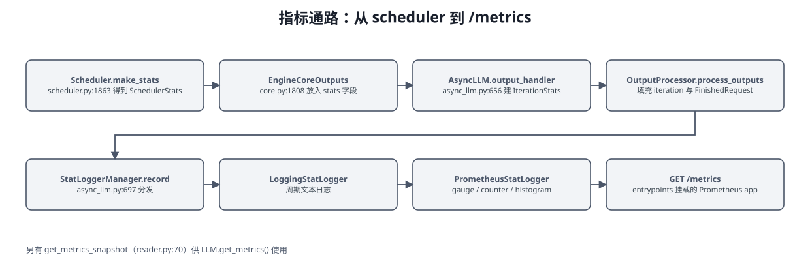

<details>
<summary>Mermaid 源码（可编辑，需支持 mermaid 的渲染器）</summary>

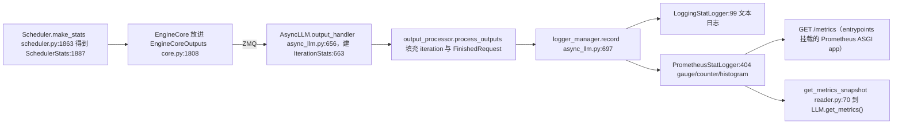

</details>

* `StatLoggerManager:1268`（`loggers.py`）：构造时默认注册 `LoggingStatLogger` 与一个 `PrometheusStatLogger`（`:1281-1330`）；`record:1332` 分发给所有 logger，`log:1353` 周期输出文本日志。
* 插件式 logger：`load_stat_logger_plugin_factories:74` 支持第三方 StatLogger。
* Prometheus 多进程：`setup_multiprocess_prometheus:17`（`PROMETHEUS_MULTIPROC_DIR`）、`get_prometheus_registry:39`、`unregister_vllm_metrics:55`。
* Ray 与 DP：`ray_wrappers.py` 给每个 Ray replica 打标签（`RayPrometheusStatLogger:203`）。
* 端点侧还有两个轻量指标：`/load`（`--enable-server-load-tracking`）与 `orca_metrics.py` 的端点负载响应头。

### 16.3 性能模型分析（`v1/metrics/perf.py`）

这是一个**静态性能建模**子系统（不是运行时打点）：`ParserChain` 解析模型配置，`AttentionMetrics:400` / `FfnMetrics:662` / `UnembedMetrics:919` 估算各组件在**当前并行配置**下每步的耗时与显存，`ModelMetrics:985` 汇总，`PerfMetricsLogging:1197` 与 `PerfMetricsProm:1265` 输出。用途是"在跑起来之前预估配置是否合理"。

### 16.4 profiler / tracing / logging

| 子系统 | 内容 |
|---|---|
| `vllm/profiler/` | `wrapper.py`（torch profiler 生命周期，对应 `POST /start_profile`、`/stop_profile`）、`layerwise_profile.py`（逐层耗时与显存分解） |
| `vllm/tracing/` | OpenTelemetry：`otel.py`、`utils.py`（`instrument` 装饰器，`engine_client.is_tracing_enabled()`） |
| `vllm/logging_utils/` | `formatter.py`（彩色日志）、`access_log_filter.py`（过滤 uvicorn 访问日志）、`dump_input.py`、`log_time.py` |
| `entrypoints/logger.py` | `RequestLogger`：把请求与响应写到日志或文件（`--enable-log-requests`） |
| `entrypoints/openai/orca_metrics.py` | 端点负载指标响应头（`endpoint-load-metrics-format`） |

---

## 17. 支撑子系统

### 17.1 `vllm/platforms/`：设备抽象层（8 个文件）

一切"和设备有关"的默认行为都收敛在这里，上层只写 `current_platform.xxx`。

| 文件 | 作用 |
|---|---|
| `__init__.py` | `current_platform` 懒加载单例；`resolve_current_platform_cls_qualname()`（`:212-252`）按内置与入口点插件探测，各只允许一个生效；`cuda_platform_plugin`（`:60-108`）等探测函数 |
| `interface.py` | `Platform` 抽象基类：`is_cuda/is_rocm/is_tpu/is_xpu/is_cpu/is_out_of_tree`、`device_name/device_type/dispatch_key/dist_backend`、`get_attn_backend_cls`、`get_device_capability`、`is_sleep_mode_available` |
| `cuda.py` | `CudaPlatformBase` 与 `NvmlCudaPlatform`/`NonNvmlCudaPlatform`；CUDA 的 attention 后端优先级表（`:78-143`）、NVML 设备信息、NUMA 亲和 |
| `rocm.py` `tpu.py` `xpu.py` `cpu.py` `zen_cpu.py` | 其它平台实现 |

> `Platform.check_and_update_config()`（`cuda.py:218-223` 等）是"平台改写配置默认值"的钩子：注入 `worker_cls`、决定并行/编译/attention 默认值。`is_out_of_tree()`（`interface.py:182-183`）是第三方平台（如 Ascend）的唯一注入点。

### 17.2 横切工具与基础设施

| 目录 | 内容 |
|---|---|
| `vllm/utils/`（34） | `argparse_utils.py`（`FlexibleArgumentParser`）、`async_utils.py`（`merge_async_iterators`）、`mem_utils.py`（`MemorySnapshot`）、`nccl.py`、`network_utils.py`、`multi_stream_utils.py`、`registry.py`（插件式注册表基类）、`numa_utils.py` 等 |
| `vllm/logging_utils/` | 日志格式化、访问日志过滤、输入 dump、惰性日志、耗时统计 |
| `vllm/tracing/` | OpenTelemetry 接入 |
| `vllm/profiler/` | torch profiler 封装与逐层 profiling |
| `vllm/usage/` | 匿名使用统计上报（`usage_lib.py` 的 `UsageContext`） |
| `vllm/ray/` | Ray 的惰性导入与运行时环境改写 |
| `vllm/device_allocator/` | CUDA VMM 分配器（`cumem.py` 的 `CuMemAllocator`） |
| `vllm/third_party/` | vendor 进来的依赖（`pynvml.py`、`flashmla/`） |

### 17.3 `vllm/transformers_utils/`（99 个文件）

HuggingFace 生态适配层——**所有和"外部模型定义"打交道的事都在这里**：

| 子项 | 作用 |
|---|---|
| `config.py` | `get_config()`：下载/解析 HF config，按 `--hf-overrides` 覆盖 |
| `configs/`（55） | 各模型的 config 补丁（自定义 architecture、RoPE 缩放、多模态配置等） |
| `processors/`（30） | 多模态 processor 适配（HF 侧图像/视频/音频预处理包装） |
| `chat_templates/` | 内置 chat template 资源 |
| `tokenizer.py` | HF tokenizer 加载（现为 `vllm/tokenizers/` 的兼容 shim） |
| `dynamic_module.py` | 远程代码（`trust_remote_code`）加载 |
| `gguf_utils.py` / `repo_utils.py` / `runai_utils.py` / `s3_utils.py` | 各种权重来源（GGUF、ModelScope、Run:ai、S3） |
| `model_arch_config_convertor.py` | 架构名与 vLLM 实现的转换 |

### 17.4 `vllm/lora/`（42 个文件）

`lora_model.py`（把 LoRA 应用到模型层）、`lora_weights.py`、`model_manager.py`（多 LoRA 加载与淘汰）、`worker_manager.py`（worker 侧管理）、`peft_helper.py`、`resolver.py`（动态解析 LoRA 路径，可插件化）、`layers/`、`ops/`、`punica_wrapper/`（Punica 风格的批量 LoRA 算子）。

**联动点**：请求级 LoRA 由 `OpenAIServingModels` 与 `PoolingServingBase` 解析（`--lora-modules` 与请求里的 `model` 字段），经 `EngineCoreRequest.lora_request` 传到 worker，由 `LoRAModelRunnerMixin` 在 forward 前切换权重。

### 17.5 `vllm/plugins/`（6 个文件）

| 子包 | 扩展点 |
|---|---|
| `io_processors/` | 池化接口的自定义 IO 处理（`--io-processor-plugin`），让 `/pooling`、`/score` 支持自定义前后处理 |
| `lora_resolvers/` | LoRA 路径解析插件（`LoRAResolver`），支持从远端仓库按需拉取 adapter |

> 另有平台插件（`PLATFORM_PLUGINS_GROUP`）、通用注册表（`vllm/utils/registry.py`）与工具/推理解析器注册三处扩展机制，共同构成插件体系。

### 17.6 顶层单文件模块

| 文件 | 作用 |
|---|---|
| `envs.py` | **全部环境变量**的集中定义与默认值（`VLLM_*`），模块 `__getattr__` 惰性求值 |
| `env_override.py` | 在其它 import 之前改写环境变量（`vllm/__init__.py:14` 首先导入） |
| `outputs.py` | 公共输出类型：`RequestOutput` / `CompletionOutput` / `PoolingOutput` / `EmbeddingOutput` / `ClassificationOutput` / `ScoringOutput` |
| `sampling_params.py` / `pooling_params.py` | `SamplingParams`（含 `from_optional`）、`BeamSearchParams`、`GuidedDecodingParams`；`PoolingParams` |
| `logits_process.py` / `logprobs.py` | LogitsProcessor 公共接口；Logprobs 数据结构与切片 |
| `forward_context.py` | 前向上下文（当前 VllmConfig、attention metadata、DP 元数据等全局状态） |
| `sequence.py` / `scalar_type.py` / `tasks.py` | 遗留序列枚举兼容层；张量标量类型抽象；任务定义 |
| `connections.py` / `exceptions.py` / `logger.py` | 跨进程共享连接；公共异常；日志初始化 |
| `model_inspection.py` / `beam_search.py` | 模型检查工具；beam search 公共逻辑 |
| `collect_env.py` / `scripts.py` / `version.py` | 环境信息收集；打包脚本入口；版本号 |
| `_custom_ops.py` / `_aiter_ops.py` / `_xpu_ops.py` / `_tilelang_ops.py` | 自定义算子封装（torch.ops 命名空间），与 `csrc/` 对接 |

### 17.7 非核心目录

| 目录 | 说明 |
|---|---|
| `benchmarks/`（25） | 官方基准脚本（latency / throughput / serving），与 `entrypoints/cli/benchmark/` 对应 |
| `assets/`（5） | 内置音频/图像/视频素材（`audio.py`、`image.py`、`video.py`） |
| `kernels/`（14） | 见第 13 章 |

---

## 18. 目录索引总表

| 顶层目录/文件 | py 数 | 职责 | 详见 |
|---|---|---|---|
| `entrypoints/` | 162 | 接入层：HTTP / gRPC / WS / CLI / 离线 API | 第 5 章与配套报告 |
| `v1/` | 271 | 引擎核心：engine / core / executor / worker / attention / sample / spec_decode / structured_output / kv_offload / metrics | 第 6、7、8、10、11、15、16 章 |
| `model_executor/` | 665 | 模型定义、层与算子、权重加载、量化、warmup | 第 9 章 |
| `distributed/` | 112 | 并行组、设备通信、KV/EC 传输、EPLB、弹性 EP、权重传输 | 第 14 章 |
| `transformers_utils/` | 99 | HF 生态适配 | 第 17.3 |
| `compilation/` | 43 | torch.compile 集成、passes、CUDA Graph、编译缓存 | 第 13 章 |
| `lora/` | 42 | LoRA 全链路实现 | 第 17.4 |
| `tool_parsers/` | 44 | 各模型的工具调用解析器 | 第 12.6 |
| `utils/` | 34 | 通用工具 | 第 17.2 |
| `config/` | 29 | 全部配置对象与校验 | 第 4 章 |
| `reasoning/` | 24 | 各模型的推理链解析器 | 第 12.6 |
| `multimodal/` | 23 | 多模态注册表、处理器、媒体加载、缓存 | 第 12.4 |
| `kernels/` | 14 | Triton 内核与算子封装 | 第 13.6 |
| `tokenizers/` | 14 | Tokenizer 抽象与各实现 | 第 12.5 |
| `renderers/` | 14 | 渲染抽象：chat 模板 + 分词 + 参数合并 | 第 12.2 |
| `platforms/` | 8 | 设备平台抽象与选择 | 第 17.1 |
| `logging_utils/` `tracing/` `profiler/` `usage/` `ray/` `device_allocator/` `plugins/` `inputs/` `parser/` `ir/` `third_party/` | 各 2 到 7 | 横切能力 | 第 15 到 17 章 |
| `assets/` `benchmarks/` | 5 / 25 | 素材与基准脚本 | 第 17.7 |
| 顶层单文件 | 25+ | `envs.py`、`outputs.py`、`sampling_params.py`、`forward_context.py`、`tasks.py` 等 | 第 17.6 |

---

## 19. 阅读路线建议

**路线 A：搞清一条请求怎么走完（1 到 2 小时）**

1. `entrypoints/openai/api_server.py:157 build_app` —— 看路由怎么挂
2. `entrypoints/openai/chat_completion/api_router.py:40` 到 `serving.py:225` 到 `engine/serving.py` 基类
3. `v1/engine/async_llm.py:524 generate` 到 `:280 add_request`
4. `v1/engine/input_processor.py:234` 到 `v1/engine/__init__.py:80 EngineCoreRequest`
5. `v1/engine/core_client.py:81 make_client` —— 进程边界
6. `v1/engine/core.py:425 step` 到 `v1/core/sched/scheduler.py:308 schedule`
7. `v1/worker/gpu_worker.py:783 execute_model` 到 `gpu_model_runner.py`
8. 回程：`v1/engine/output_processor.py:597` 到 `detokenizer.py:95`

**路线 B：搞清显存与 KV（半天）**

`v1/worker/gpu_worker.py:354 determine_available_memory` 到 `v1/core/kv_cache_utils.py:1942 get_kv_cache_configs` 到 `v1/core/kv_cache_manager.py:236 allocate_slots` 到 `v1/core/block_pool.py:322` 到 `v1/worker/gpu/attn_utils.py:129 _allocate_kv_cache`；再看 `v1/kv_offload/` 与 `device_allocator/cumem.py`。

**路线 C：搞清性能优化（1 到 2 天）**

`config/compilation.py` 到 `compilation/` 到 `v1/worker/gpu/cudagraph_utils.py` 到 `v1/attention/selector.py` 与 `platforms/cuda.py:78-143` 到 `v1/sample/` 到 `v1/spec_decode/`。

**路线 D：搞清分布式与 P/D 分离（2 到 3 天）**

`config/parallel.py` 到 `distributed/parallel_state.py` 到 `v1/executor/` 到 `distributed/device_communicators/` 到 `distributed/kv_transfer/` 到 `v1/core/sched/scheduler.py` 里的 connector 钩子（`_connector_finished:1933`、`_update_waiting_for_remote_kv:1964`）。

**配套文档**：接口清单与 abort 细节见 [vllm-main-nvidia-request-flow-report.md](./vllm-main-nvidia-request-flow-report.md)；CUDA 特有路径见 [appendix-nvidia-cuda-path-notes.md](./appendix-nvidia-cuda-path-notes.md)；`model_executor` 细化笔记见 [appendix-model-executor-arch-map.md](./appendix-model-executor-arch-map.md)。


