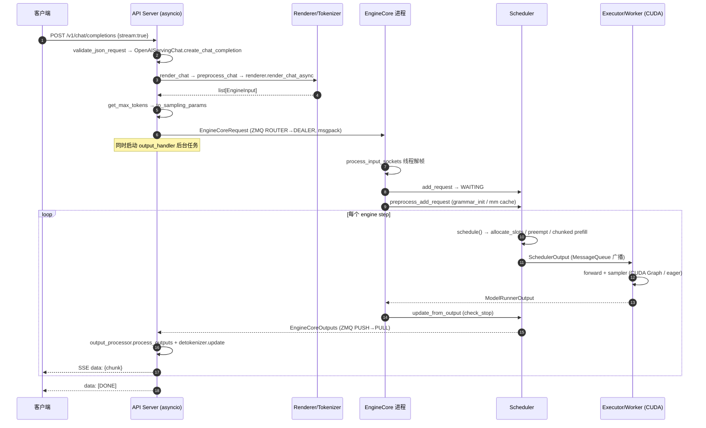
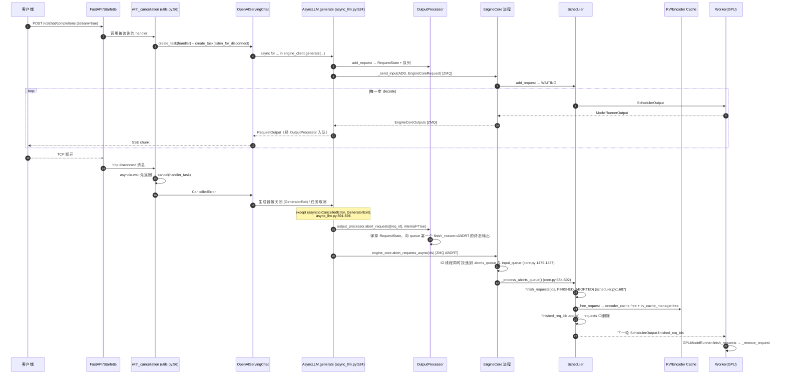
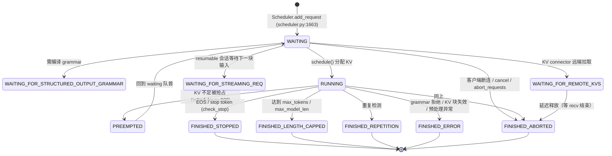

# vLLM（main 分支）以 NVIDIA GPU 为算卡时的请求处理与客户端接口分析报告

> 分析对象：本地仓库 `vllm` 的 **main 分支**
> 基线 commit：`70c00163ffa80f5821bc8f87f80bde632bc29015`
> commit 时间：2026-05-14 09:41:22 +0800
> 提交标题：`[Feature] Add instruction support for score/rerank chat templates (#42412)`
> 远程：`git@gitcode.com:xiefei_cn/vllm.git`（本地 `main` 与 `origin/main` 完全一致，即上游 vLLM main 的镜像）
> 分析方式：以该 commit 新建只读 git worktree（`git worktree add --detach <tmp> main`）后逐文件阅读，全部结论均给出 `文件:行号` 以便复核。
> 说明：本报告中 "NVIDIA 算卡" 指 CUDA 平台（`cuda`/`CUDA` dispatch key），不涉及 NPU/Ascend、ROCm、TPU、XPU、CPU 等其他平台；仓库中另有 `vllm-ascend` 等目录不属于本次分析范围。
>
> 配套文件：[appendix-nvidia-cuda-path-notes.md](./appendix-nvidia-cuda-path-notes.md)（NVIDIA/CUDA 特有路径的细化附录）。

---

## 目录

1. [结论速览](#1-结论速览)
2. [进程与线程模型（总览）](#2-进程与线程模型总览)
3. [面向客户端暴露的接口清单](#3-面向客户端暴露的接口清单)
4. [生成类请求的端到端流程](#4-生成类请求的端到端流程)
5. [非生成类与辅助请求流程](#5-非生成类与辅助请求流程)
6. [abort / 取消：完整触发与清理链路](#6-abort--取消完整触发与清理链路)
7. [NVIDIA（CUDA）侧的执行路径](#7-nvidiacuda侧的执行路径)
8. [关键状态与索引](#8-关键状态与索引)
9. [附录](#9-附录)

---

## 1. 结论速览

* vLLM main 分支的在线服务是 **「HTTP API Server 进程 + EngineCore 进程 + 若干 GPU Worker 进程」** 的三层结构。API Server 只做协议解析、tokenize/chat 模板、采样参数构造、反 tokenize 与 SSE 组包；真正的排队、批调度、KV cache 分配、显存执行全部在 EngineCore 与 Worker 中完成。
* 客户端可见的接口分四类：**(a) OpenAI 兼容 REST**、**(b) 厂商兼容 REST（Anthropic Messages / SageMaker）**、**(c) 流式与专用通道（SSE、WebSocket realtime、gRPC、离线 Python API、CLI）**、**(d) 运维/控制类端点（health/version/metrics/profile/sleep/lora/cache/rlhf/rpc/elastic-ep）**。
* **唯一的客户端主动 abort 入口是「断开连接」**：对非流式请求由 `with_cancellation` 装饰器监听 `http.disconnect` 并 cancel handler task；对 SSE 流式请求由 Starlette 关闭 async generator，触发 `AsyncLLM.generate()` 的 `except (asyncio.CancelledError, GeneratorExit)` 分支调用 `abort()`。另有 `POST /abort_requests`，但**仅在 disaggregated everything（`--tokens-only`）模式下注册**。
* abort 是 **"标记 + 在调度安全点回收"** 的语义，不会中断已在 GPU 上飞行的那一步计算：`Scheduler.finish_requests()` 立刻把请求置为 `FINISHED_ABORTED` 并释放 KV/encoder cache，随后通过下一次 `SchedulerOutput.finished_req_ids` 通知 Worker 删除请求态。EngineCore 在 `step()` 中于 **模型输出被消费之前** 抢跑处理 abort 队列，从而保证"已 abort 的请求不会再产出 token"。
* abort 是**幂等**的：`finish_requests()` 对不存在或已完成的 request id 直接跳过（`scheduler.py:1716`），因此 EngineCore 可以同时把 abort 放进"快通道队列"和"输入顺序队列"两份（`core.py:1479-1487`）。

---

## 2. 进程与线程模型（总览）

### 2.1 启动路径

```
vllm serve <model>            (CLI)
  └─ vllm/entrypoints/cli/main.py            CLI 子命令分发
     └─ vllm/entrypoints/cli/serve.py:49     serve 子命令
        └─ vllm/entrypoints/openai/api_server.py:672  run_server()
           ├─ setup_server(args)                            api_server.py:535  解析监听地址、建 socket
           └─ run_server_worker()                           api_server.py:682
              ├─ build_async_engine_client()                api_server.py:78
              │  └─ build_async_engine_client_from_engine_args()  api_server.py:109
              │     └─ AsyncLLM.from_vllm_config()          v1/engine/async_llm.py:203
              │        ├─ Executor.get_class(vllm_config)   v1/executor/abstract.py:48   选执行器
              │        └─ EngineCoreClient.make_client(...) v1/engine/core_client.py:81 选引擎客户端
              └─ build_and_serve()                          api_server.py:579  建 FastAPI app + uvicorn
```

### 2.2 三类进程

| 角色 | 载体 | 关键源码 | 说明 |
|---|---|---|---|
| API Server 进程 | asyncio + uvicorn + FastAPI | `vllm/entrypoints/openai/api_server.py:682`、`vllm/entrypoints/launcher.py:76` | 一个进程内跑一个 `AsyncLLM` 客户端对象；`--api-server-count>1` 时由 `vllm/entrypoints/launcher.py` 拉起多个 uvicorn worker 共享同一个 EngineCore |
| EngineCore 进程 | `multiprocessing` 子进程 + ZMQ | `vllm/v1/engine/core.py`（`EngineCoreProc`）、`vllm/v1/engine/core_client.py:460` `MPClient`、`:887` `AsyncMPClient` | 承载 `Scheduler` + `KVCacheManager`，跑 busy loop（`core.py:1187 run_busy_loop`） |
| GPU Worker 进程 | TP/PP rank 各一进程 | `vllm/v1/executor/multiproc_executor.py`、`vllm/v1/worker/gpu_worker.py` | 每个 rank 持有自己的 CUDA context、模型权重分片与 KV cache |

* 引擎客户端有 5 种实现（`core_client.py`）：`InprocClient:274`（同进程，离线 `LLM` 用）、`SyncMPClient:716`（同步 ZMQ，离线 `LLM` 多进程用）、`AsyncMPClient:887`（异步 ZMQ，在线服务用）、`DPAsyncMPClient:1137`（数据并行、外部 LB）、`DPLBAsyncMPClient:1317`（数据并行、内置 LB）。选择逻辑见 `core_client.py:81-130`。
* 执行器选择见 `vllm/v1/executor/abstract.py:48`：`ray` / `mp` / `uni` / `external_launcher` / 自定义 qualname。默认值本身带 CUDA 分支（见 7.2）。
* 在线服务（`AsyncLLM`）**总是**用 `EngineCoreClient.make_async_mp_client` 创建引擎客户端（`vllm/v1/engine/async_llm.py:146-153`），因此 **EngineCore 对 HTTP 服务而言始终是独立进程**；`InprocClient` 只服务于离线 `LLM`。这也意味着 `AsyncLLM.abort()` 依赖异步客户端（`InprocClient` 未实现 `abort_requests_async`，基类会抛 `NotImplementedError`，`core_client.py:244-245`）。
* GPU model runner 在本 commit 有**两套**：默认（`VLLM_USE_V2_MODEL_RUNNER=0`，`vllm/envs.py:251,1714-1715`）是 V1 `vllm/v1/worker/gpu_model_runner.py`；V2 `vllm/v1/worker/gpu/model_runner.py` 需显式开启（`vllm/v1/worker/gpu_worker.py:316-330`）。阅读代码时务必先确认走哪一套。

### 2.3 请求跨进程边界的两条通道

| 方向 | 机制 | 源码 |
|---|---|---|
| API Server → EngineCore（ADD / ABORT / UTILITY） | ZMQ PUSH/PULL，msgpack 编码；张量走辅助 buffer 零拷贝 | `core_client.py:798 _send_input()`、`core_client.py:828 abort_requests()`、`core.py:1456-1487`（IO 线程 `process_input_sockets`） |
| EngineCore → API Server（EngineCoreOutputs） | ZMQ PUSH/PULL 反向通道，每 client 一个 socket | `core.py:1489 process_output_sockets()`、`core_client.py` 的 output queue task |
| EngineCore → Worker（SchedulerOutput / ModelRunnerOutput） | 进程间 RPC（mp / ray） | `core.py:437 model_executor.execute_model()` |

> 关键点：`EngineCoreOutputs` 与 `abort` 走的是**两条独立的 ZMQ 通道**，方向相反，因此 abort 不需要等待输出流，也不会被输出背压阻塞。

---

## 3. 面向客户端暴露的接口清单

> 全部路径均为 `@router.*` 中声明的字面路径；服务端不额外加前缀，客户端可通过 `--root-path` 让服务声明自己的挂载前缀（`api_server.py:248` 设置 `app.root_path`）。

### 3.1 OpenAI 兼容生成类（`vllm/entrypoints/openai/*/api_router.py`）

| 方法 | 路径 | handler | 源码位置 | 请求模型 | 响应模型 |
|---|---|---|---|---|---|
| POST | `/v1/chat/completions` | `create_chat_completion` | `chat_completion/api_router.py:40` | `ChatCompletionRequest` | `ChatCompletionResponse` / SSE / `ErrorResponse` |
| POST | `/v1/chat/completions/batch` | `create_batch_chat_completion` | `chat_completion/api_router.py:77` | `BatchChatCompletionRequest` | `ChatCompletionResponse` / `ErrorResponse` |
| POST | `/v1/completions` | `create_completion` | `completion/api_router.py:34` | `CompletionRequest` | `CompletionResponse` / SSE / `ErrorResponse` |
| POST | `/v1/responses` | `create_responses` | `responses/api_router.py:48` | `ResponsesRequest` | `ResponsesResponse` / SSE / `ErrorResponse` |
| GET | `/v1/responses/{response_id}` | `retrieve_responses` | `responses/api_router.py:80` | path + `starting_after`/`stream` | `ResponsesResponse` / SSE |
| POST | `/v1/responses/{response_id}/cancel` | `cancel_responses` | `responses/api_router.py:110` | path | `ResponsesResponse` / `ErrorResponse` |
| GET | `/v1/models` | `show_available_models` | `models/api_router.py:20` | — | `ModelList` |
| POST | `/generative_scoring` | `create_generative_scoring` | `generative_scoring/api_router.py:35` | `GenerativeScoringRequest` | `GenerativeScoringResponse` |

* `/v1/responses/{id}/cancel` 是**除断连之外唯一一个"取消"语义的 REST 端点**：由 serving 层把该 `response_id` 对应的在飞请求 abort（见第 6 章）。

### 3.2 厂商兼容接口

| 方法 | 路径 | handler | 源码位置 | 说明 |
|---|---|---|---|---|
| POST | `/v1/messages` | `create_messages` | `anthropic/api_router.py:48` | Anthropic Messages 兼容，支持 SSE |
| POST | `/v1/messages/count_tokens` | `count_tokens` | `anthropic/api_router.py:94` | token 计数 |
| GET/POST | `/ping` | `ping` | `sagemaker/api_router.py:48-49` | SageMaker 健康检查 |
| POST | `/invocations` | `invocations` | `sagemaker/api_router.py:55` | SageMaker 统一入口（按 body 判定 generate / pooling） |

Anthropic 通道内部复用 chat 通道：`AnthropicServingMessages` 在 `openai/generate/api_router.py:154-173` 构造，最终仍落到 `Renderer.render_chat` + `engine_client.generate`。

### 3.3 池化 / 打分 / 重排 / 分类

| 方法 | 路径 | handler | 源码位置 | 说明 |
|---|---|---|---|---|
| POST | `/classify` | `create_classify` | `pooling/classify/api_router.py:23` | 文本分类 |
| POST | `/v1/embeddings` | `create_embedding` | `pooling/embed/api_router.py:22` | OpenAI embeddings |
| POST | `/v2/embed` | `create_cohere_embedding` | `pooling/embed/api_router.py:43` | Cohere 兼容 |
| POST | `/pooling` | `create_pooling` | `pooling/pooling/api_router.py:21` | 通用 pooling（可返回 raw bytes） |
| POST | `/score` | `create_score` | `pooling/scoring/api_router.py:28` | 打分 |
| POST | `/v1/score` | `create_score_v1` | `pooling/scoring/api_router.py:46` | 遗留别名（打 warning） |
| POST | `/rerank` | `do_rerank` | `pooling/scoring/api_router.py:65` | 重排（Jina 风格） |
| POST | `/v1/rerank` | `do_rerank_v1` | `pooling/scoring/api_router.py:83` | 遗留别名 |
| POST | `/v2/rerank` | `do_rerank_v2` | `pooling/scoring/api_router.py:102` | Jina 兼容别名 |

### 3.4 语音类

| 方法 | 路径 | handler | 源码位置 | 说明 |
|---|---|---|---|---|
| POST | `/v1/audio/transcriptions` | `create_transcriptions` | `speech_to_text/transcription/api_router.py:30` | 语音转写（multipart form），支持 SSE |
| POST | `/v1/audio/translations` | `create_translations` | `speech_to_text/translation/api_router.py:30` | 语音翻译 |
| **WS** | `/v1/realtime` | `realtime_endpoint` | `speech_to_text/realtime/api_router.py:17` | 实时转写 WebSocket（`session.update` / `input_audio_buffer.append` / `commit` → `transcription.delta` / `transcription.done`） |

### 3.5 运维 / 控制类（`vllm/entrypoints/serve/*`）

| 方法 | 路径 | handler | 源码位置 | 注册条件 |
|---|---|---|---|---|
| POST | `/v1/load_lora_adapter` | `load_lora_adapter` | `serve/lora/api_router.py:42` | `VLLM_ALLOW_RUNTIME_LORA_UPDATING` |
| POST | `/v1/unload_lora_adapter` | `unload_lora_adapter` | `serve/lora/api_router.py:58` | 同上 |
| POST | `/start_profile` `/stop_profile` | `start_profile` / `stop_profile` | `serve/profile/api_router.py:21,29` | 配置了 profiler |
| POST | `/sleep` `/wake_up` | `sleep` / `wake_up` | `serve/sleep/api_router.py:22,33` | `VLLM_SERVER_DEV_MODE` |
| GET | `/is_sleeping` | `is_sleeping` | `serve/sleep/api_router.py:46` | 同上 |
| POST | `/collective_rpc` | `collective_rpc` | `serve/rpc/api_router.py:24` | `VLLM_SERVER_DEV_MODE` |
| POST | `/reset_prefix_cache` `/reset_mm_cache` `/reset_encoder_cache` | 同名 | `serve/cache/api_router.py:21,47,58` | `VLLM_SERVER_DEV_MODE` |
| POST | `/pause` `/resume` | `pause_generation` / `resume_generation` | `serve/rlhf/api_router.py:30,75` | `VLLM_SERVER_DEV_MODE` |
| GET | `/is_paused` | `is_paused` | `serve/rlhf/api_router.py:95` | 同上 |
| POST | `/init_weight_transfer_engine` `/start_weight_update` `/update_weights` `/finish_weight_update` | 同名 | `serve/rlhf/api_router.py:113,131,144,162` | 同上 |
| GET | `/get_world_size` | `get_world_size` | `serve/rlhf/api_router.py:168` | 同上 |
| POST | `/inference/v1/generate` | `generate` | `serve/disagg/api_router.py:49` | `tokens_only`（disagg everything） |
| POST | **`/abort_requests`** | `abort_requests` | `serve/disagg/api_router.py:82` | **仅 `--tokens-only`** |
| POST | `/scale_elastic_ep` `/is_scaling_elastic_ep` | 同名 | `serve/elastic_ep/api_router.py:32,90` | elastic EP |
| POST | `/v1/chat/completions/render` `/v1/completions/render` | `render_chat_completion` / `render_completion` | `serve/render/api_router.py:25,51` | `generate` 或 `render` 任务 |
| POST | `/tokenize` `/detokenize` | `tokenize` / `detokenize` | `serve/tokenize/api_router.py:38,64` | 始终注册 |
| GET | `/tokenizer_info` | `get_tokenizer_info` | `serve/tokenize/api_router.py:100` | `--enable-tokenizer-info-endpoint` |
| GET | `/load` `/version` | `get_server_load_metrics` / `show_version` | `serve/instrumentator/basic.py:31,54` | 始终注册 |
| GET | `/health` | `health` | `serve/instrumentator/health.py:22` | 始终注册（200/503） |
| GET | `/server_info` | `show_server_info` | `serve/instrumentator/server_info.py:43` | `VLLM_SERVER_DEV_MODE` |
| MOUNT | `/metrics` | Prometheus ASGI app | `serve/instrumentator/metrics.py:41,45` | 始终注册 |
| GET | `/docs`、`/static` | swagger UI | `serve/instrumentator/offline_docs.py:34,36,46` | `--enable-offline-docs`；`--disable-fastapi-docs` 则全部关闭 |

### 3.6 非 HTTP 通道

| 通道 | 入口 | 具体接口 | 源码位置 |
|---|---|---|---|
| gRPC（beta） | `vllm serve --grpc` → `serve_grpc()` | `VllmEngine` 服务 + `grpc.health.v1.Health` + reflection | `vllm/entrypoints/grpc_server.py:56,101,105`；`cli/serve.py:48-52` |
| 离线 Python `LLM` | `from vllm import LLM` | `generate / chat / encode / embed / classify / score / reward / beam_search / enqueue + wait_for_completion / collective_rpc / sleep / wake_up / profile / 权重热更` | `vllm/entrypoints/llm.py:444,979,1073,1221,1266,1355,1311,689,509,555,644,1490,1515,1470,1892` |
| 引擎 Python API | `AsyncLLM` | `generate / encode / add_request / abort / pause_generation / resume_generation / sleep / wake_up / add_lora / reset_*_cache / scale_elastic_ep` | `vllm/v1/engine/async_llm.py:524,801,280,709,750,793,929,935,944,915,990` |
| 引擎客户端抽象 | `EngineClient` ABC | `generate / encode / abort / notify_kv_transfer_request_rejected / check_health / sleep / wake_up / pause_generation / …` | `vllm/engine/protocol.py:40-255` |
| CLI | `vllm` | `serve / chat / complete / launch / bench / run-batch / collect-env` | `vllm/entrypoints/cli/main.py:27-34` |
| 演示用简易服务 | `vllm/entrypoints/api_server.py` | `GET /health`、`POST /generate` | `api_server.py:40,46` |

> gRPC 的服务定义（`VllmEngine` 的 RPC 方法名与消息）来自**仓库外的** `smg_grpc_proto` / `smg_grpc_servicer` 包（`grpc_server.py:31-33`），本仓库内没有 `.proto` 文件，因此方法清单无法从本仓库代码核实，本报告不臆测。

### 3.7 鉴权与全局中间件

| 机制 | 源码位置 | 行为 |
|---|---|---|
| API key | `api_server.py:264-268` + `openai/server_utils.py:38-86` | `--api-key`/`VLLM_API_KEY` 非空时启用 `AuthenticationMiddleware`；**仅**对 `path` 以 `/v1` 开头且非 `OPTIONS` 的请求校验 `Bearer` |
| `X-Request-Id` | `api_server.py:270-273` | `--enable-request-id-headers` 启用，回显 `X-Request-Id` |
| `ScalingMiddleware` | `api_server.py:276` | 弹性 EP 缩容期间拒绝新请求 |
| realtime WS metrics | `api_server.py:278-284` | 仅 realtime 任务 |
| 用户中间件 | `api_server.py:294-304` | `--middleware` 逐个 import 后 `add_middleware` |
| SageMaker 标准 | `api_server.py:306` | 调用外部包 `model_hosting_container_standards.bootstrap(app)` |
| CORS | `api_server.py:286-292` | `--allowed-origins` / `--allowed-methods` / `--allowed-headers` |
| 负载感知 | `vllm/entrypoints/utils.py:105 load_aware_call` | `--enable-server-load-tracking` 时把 `GET /load` 的计数纳入请求生命周期 |

## 4. 生成类请求的端到端流程

> 以 `POST /v1/chat/completions`（`stream=true`）为主线，其它生成类接口（completions / responses / messages / generative_scoring / disagg generate）在满足第 5 章骨架的前提下共用同一条引擎链路。
>
> **重要版本事实**：本 commit 中存在两套 GPU model runner。默认（`VLLM_USE_V2_MODEL_RUNNER=0`，`vllm/envs.py:251,1714-1715`）使用 **V1 runner**：`vllm/v1/worker/gpu_model_runner.py`；`vllm/v1/worker/gpu/model_runner.py`（V2，目录化重构版）仅在显式打开该环境变量时才由 `vllm/v1/worker/gpu_worker.py:316-330` 实例化。下文对两者都给出锚点。

### 4.1 阶段总览

| # | 阶段 | 执行者/边界 | 关键函数与源码位置 | 数据形态 |
|---|---|---|---|---|
| 1 | HTTP 路由、鉴权、JSON 校验 | FastAPI（API Server 进程，asyncio） | `openai/chat_completion/api_router.py:40-53`；依赖 `validate_json_request`，装饰 `@with_cancellation`/`@load_aware_call` | `ChatCompletionRequest` |
| 2 | 取 serving handler、模型检查 | 同上 | `api_router.py:57 chat(raw_request)` → `chat_completion/serving.py:225` → `:241 _create_chat_completion` | pydantic 对象 |
| 3 | 聊天模板渲染 + 分词 + 多模态预处理 | 同上（纯 CPU） | `chat_completion/serving.py:198 render_chat_request` → `serve/render/serving.py:185 render_chat` → `:525 preprocess_chat` → `:562 renderer.render_chat_async(...)` | `(conversation, list[EngineInput])` |
| 4 | `max_tokens` 求解 + 采样参数 | 同上 | `chat_completion/serving.py:289 get_max_tokens`（`entrypoints/utils.py:174`）→ `:306 request.to_sampling_params(...)`（`chat_completion/protocol.py:517,585`） | `SamplingParams` |
| 5 | 请求注册 + 转成引擎请求 | 同上 | `chat_completion/serving.py:347 self.engine_client.generate(...)` → `v1/engine/async_llm.py:524 generate` → `:280 add_request` → `v1/engine/input_processor.py:234 process_inputs`（构造 `EngineCoreRequest` 于 `:362-377`）→ `:368 assign_request_id` → `:376 RequestOutputCollector` | `EngineCoreRequest` |
| 6 | 跨进程发送 + 后台输出泵 | ZMQ（进程边界）+ asyncio 任务 | `async_llm.py:409 output_processor.add_request`（本进程登记）→ `:412 engine_core.add_request_async`；`core_client.py:1058-1061` → `:1001-1011 _send_input` → `:1013-1036 _send_input_message`；`:707` 启动 `output_handler` 任务 | msgpack 帧 `(type, payload)` |
| 7 | EngineCore IO 线程解帧 | EngineCore 进程 · 独立线程 | `core.py:1395 process_input_sockets` → `:1465` 判类型 → `:1470 add_request_decoder.decode` → `:1472 preprocess_add_request`（`:788`：mm cache、`Request.from_engine_core_request` `:802`、`structured_output_manager.grammar_init` `:809`）→ `:1487 input_queue.put_nowait` | `Request`（引擎内部） |
| 8 | 忙循环取请求 | EngineCore 进程 · 主线程 | `core.py:1187 run_busy_loop` → `:1197 _process_input_queue` → `:1289 _handle_client_request` → `:334 add_request` → `scheduler.add_request` | — |
| 9 | 排队 | Scheduler | `scheduler.py:1663 add_request` → `:1521 _enqueue_waiting_request`（FCFS / Priority 队列，`request_queue.py:75,131,201`） | `WAITING` |
| 10 | 调度一步 | Scheduler | `scheduler.py:308 schedule`：RUNNING 优先 `:345`（`allocate_slots` `:423`；不足则抢占 `:435-466` → `_preempt_request:908`）；再 WAITING `:527`（前缀命中 `:573` → `kv_cache_manager.py:194`；chunked prefill `:633-648`）→ 产 `SchedulerOutput` `:866-882` → `_update_after_schedule` `:899,:930` | `SchedulerOutput` |
| 11 | KV cache 分配 | Scheduler + BlockPool | `kv_cache_manager.py:236 allocate_slots` → `block_pool.py:322 get_new_blocks`（`:336 popleft_n`、`:354 _maybe_evict_cached_block`）；前缀缓存写入 `block_pool.py:211 cache_full_blocks` | 块 id 列表 |
| 12 | 下发执行 | EngineCore → Executor（进程/共享内存边界） | `core.py:425 step` → `:437 model_executor.execute_model(scheduler_output, non_block=True)`；`executor/abstract.py:48 get_class`（`uni`/`mp`/`ray`）；`multiproc_executor.py:339 collective_rpc` → `:373 rpc_broadcast_mq.enqueue`（`MessageQueue` 共享内存广播）；worker 子进程 `:676-677` | `SchedulerOutput` |
| 13 | GPU 前向 + 采样 | Worker 进程（CUDA） | `gpu_worker.py:783 execute_model` → `:843 model_runner.execute_model(...)`；V1：`v1/worker/gpu_model_runner.py`；V2：`v1/worker/gpu/model_runner.py:987`（`:997-1001` 请求态增删、`:1038 prepare_inputs`、`:1122-1128` CUDA Graph 重放或 `:1136-1147 self.model(**model_inputs)`）→ 采样 `:1183 sample_tokens` → `:914 sample` → `v1/worker/gpu/sample/sampler.py:63`（`:121 apply_sampling_params`，`:188 gumbel_sample`） | `ModelRunnerOutput` / `AsyncOutput` |
| 14 | 结果回传 EngineCore | Executor → EngineCore | `ModelRunnerOutput` 经 MessageQueue 回到 `core.py:443 future.result()`；异步调度下 `:445 sample_tokens` | `ModelRunnerOutput` |
| 15 | 结束判定 + 生成增量 | Scheduler | `scheduler.py:1246 update_from_output`：`_update_request_with_output:1557` + `check_stop`（`sched/utils.py:94`，EOS `:104`、stop_token_ids `:108`、长度 `:112-117`、重复 `:119-128`）→ `EngineCoreOutput` 构造 `:1415-1430` | `dict[client_index, EngineCoreOutputs]` |
| 16 | 输出回传前端 | EngineCore → API Server（ZMQ） | `core.py:1234-1235 output_queue.put_nowait` → `:1489 process_output_sockets` → `:1546 PUSH send_multipart`；前端 `core_client.py:942 process_outputs_socket` → `:947 decode` → `:980 output_queue` → `:990 get_output_async` | `EngineCoreOutputs` |
| 17 | 反分词 + 组装 RequestOutput | API Server 进程（asyncio 任务） | `async_llm.py:656-707 output_handler` → `:660 get_output_async` → `:675 output_processor.process_outputs`（`output_processor.py:597`）→ `:657 detokenizer.update`（`detokenizer.py:95`）→ `:669 make_request_output`（`:272`）→ `:682 req_state.queue.put` | `RequestOutput` |
| 18 | 交回业务协程 | asyncio | `async_llm.py:579 out = q.get_nowait() or await q.get()` → `:586 yield out` | `RequestOutput` |
| 19 | 协议对象 + SSE | API Server | `chat_completion/serving.py:397 chat_completion_stream_generator` → `:496 async for res in result_generator` → `:550-551 yield f"data: {chunk.model_dump_json(...)}\n\n"` → `:1001 yield "data: [DONE]\n\n"` | HTTP chunked SSE |

### 4.2 时序图（流式生成）



### 4.3 关键数据结构

| 类型 | 定义位置 | 作用 | 关键字段 |
|---|---|---|---|
| `ChatCompletionRequest` | `openai/chat_completion/protocol.py`（`to_sampling_params:517`） | OpenAI 入参 | `model/messages/max_tokens/n/logprobs/top_logprobs/stream/response_format/structured_outputs` |
| `EngineInput` | `vllm/inputs/` | 渲染分词后的引擎输入 | `type`(token/embeds/multimodal/enc_dec)、`prompt_token_ids`、`mm_kwargs`、`mm_placeholders`、`cache_salt` |
| `SamplingParams` | `vllm/sampling_params.py`（构造 `chat protocol.py:585`） | 采样配置 | `n`、`logprobs`、`max_tokens`、`temperature/top_p/top_k/min_p`、`stop/stop_token_ids`、`output_kind`、`structured_outputs`、`logit_bias`、`extra_args` |
| `EngineCoreRequest` | `v1/engine/__init__.py:80` | **前端 → EngineCore 的唯一请求载体**（msgspec） | `request_id`、`prompt_token_ids/embeds`、`mm_features`、`sampling_params`、`lora_request`、`cache_salt`、`client_index`、`priority`、`external_req_id`、`abort_immediately`（`:129`） |
| `Request` | `v1/request.py:59`（工厂 `:191`） | EngineCore 内部请求状态机 | `status`(`:97`)、`num_computed_tokens`、`num_output_tokens`、`block_hashes`、`structured_output_request`(`:87`)、`spec_token_ids` |
| `RequestStatus` | `v1/request.py:316-343` | 请求状态枚举 | `WAITING/WAITING_FOR_STRUCTURED_OUTPUT_GRAMMAR/WAITING_FOR_REMOTE_KVS/WAITING_FOR_STREAMING_REQ/RUNNING/PREEMPTED/FINISHED_*`；`is_finished():338`、`get_finished_reason():342` |
| `SchedulerOutput` | `v1/core/sched/output.py:181`（构造 `scheduler.py:866`） | 调度 → 执行的单步计划 | `scheduled_new_reqs`/`scheduled_cached_reqs`/`num_scheduled_tokens`/`total_num_scheduled_tokens`/`scheduled_spec_decode_tokens`/`scheduled_encoder_inputs`/`preempted_req_ids`/`finished_req_ids`/`free_encoder_mm_hashes` |
| `GrammarOutput` | `v1/core/sched/output.py`（`scheduler.py:1244`） | 结构化输出位掩码 | `structured_output_request_ids`、`grammar_bitmask` |
| `ModelRunnerOutput` | `v1/outputs.py:166` | worker → scheduler | `req_ids`、`sampled_token_ids`、`logprobs`、`prompt_logprobs_dict`、`kv_connector_output` |
| `AsyncOutput` | `v1/worker/gpu/async_utils.py:12`（`get_output():48`） | 异步调度下延迟 D2H | — |
| `EngineCoreOutput` | `v1/engine/__init__.py:167` | EngineCore → 前端 单请求增量 | `request_id`、`new_token_ids`、`finish_reason`、`stop_reason`、`kv_transfer_params` |
| `EngineCoreOutputs` | `v1/engine/__init__.py:212` | ZMQ 输出帧载荷 | `engine_index`、`outputs`、`finished_requests`、`scheduler_stats`、`timestamp`、`utility_output`、`wave_complete` |
| `EngineCoreRequestType` | `v1/engine/__init__.py:243-250` | 输入帧首字节判别 | `ADD=b"\x00"`、`ABORT=b"\x01"`、`START_DP_WAVE=b"\x02"`、`UTILITY=b"\x03"`、`EXECUTOR_FAILED=b"\x04"` |
| `RequestOutput` / `CompletionOutput` | `vllm/outputs.py`（构造 `output_processor.py:387`） | 前端 → serving | `request_id`、`outputs[].text/token_ids/logprobs/finish_reason`、`finished`、`num_cached_tokens` |
| `RequestOutputCollector` | `v1/engine/output_processor.py:48` | output_handler → generate 交接 | `put:65`、`get:81`、`get_nowait:91`、`asyncio.Event:61` |
| `ParentRequest` | `v1/engine/parallel_sampling.py:13` | n>1 父请求聚合 | `child_requests`、`output_aggregator:28`、`get_child_info:83` |

### 4.4 异步 / 进程边界小结

| 边界 | 机制 | 源码 |
|---|---|---|
| 同进程 asyncio | `output_handler` 后台任务把 `EngineCoreOutputs` 变成 `RequestOutput` 投递到每请求队列；`generate()` 协程消费 | `async_llm.py:707,656-707,579` |
| API Server ↔ EngineCore | ZMQ（客户端 `ROUTER(bind)` ↔ 引擎 `DEALER(identity)`；输出 `PUSH(linger=4000)` → `PULL`），msgspec msgpack，大张量走 tensor IPC/零拷贝 + `MessageTracker` 保引用 | `core_client.py:524-533,1001-1036`；`core.py:1412-1416,1506-1511,1541-1554` |
| EngineCore 内部 | 两个 daemon IO 线程（`:1395 process_input_sockets`、`:1489 process_output_sockets`）与主线程忙循环之间只经 `queue.Queue`（`input_queue:848`、`aborts_queue:218`、`output_queue`）解耦 | `core.py:912-934,1187` |
| EngineCore ↔ Worker | 多卡：`multiprocessing.Process` 子进程 + `MessageQueue` 共享内存广播控制面；单卡：`UniProcExecutor` 同进程直调 | `multiproc_executor.py:676-677,339,373`；`uniproc_executor.py:107-130` |
| 同步等待点 | 异步调度下唯一的阻塞点是 `AsyncOutput.get_output()` 的 GPU→CPU 拷贝 | `v1/worker/gpu/async_utils.py:48`；`core.py:443,445` |

### 4.5 特性分支如何挂进主链路

| 特性 | 挂载点 | 说明（含源码） |
|---|---|---|
| `n > 1` 并行采样 | `async_llm.py:389-397` | 用 `ParentRequest` 分叉 n 个子请求（`parallel_sampling.py:83-94`），前端聚合 `output_processor.py:340-346` → `parallel_sampling.py:100-126`（FINAL_ONLY 需凑齐 n 个） |
| logprobs | worker `gpu/sample/sampler.py:87-105` → `ModelRunnerOutput.logprobs` → `scheduler.py:1396-1401 slice_request` → `EngineCoreOutput.new_logprobs` → 前端 `output_processor.py:666` | prompt logprobs 由独立 worker 处理（`gpu/model_runner.py:1218`）；`kv_sharing_fast_prefill + prompt_logprobs` 被显式拒绝（`async_llm.py:305-314`） |
| 结构化输出 | `chat protocol.py:549-579` → `Request.status=WAITING_FOR_STRUCTURED_OUTPUT_GRAMMAR`（`request.py:111-112`）→ `core.py:809 grammar_init` → `scheduler.py:1222 get_grammar_bitmask` → worker `structured_outputs_worker.apply_grammar_bitmask` | 采样后 `grammar.accept_tokens` 校验（`scheduler.py:1357-1372`，拒绝则 `FINISHED_ERROR`）；spec draft 也过 `validate_tokens`（`:1616-1619`） |
| 投机解码 | `gpu/model_runner.py:175 init_speculator`、`:223 rejection_sampler`；调度侧填 `scheduled_spec_decode_tokens`（`scheduler.py:480-496`）；`core.py:460-464 post_step` | 有 draft 时走 `rejection_sampler`（`gpu/model_runner.py:936-945`）；`update_from_output` 用接受/拒绝数校正 `num_computed_tokens`（`scheduler.py:1310-1334`） |
| logits processors | 仅引擎启动参数 `--logits-processors` 注册到 `ModelConfig.logits_processors`（`config/model.py:305`）；请求侧受 `--logits-processor-pattern` 白名单限制（`openai/engine/protocol.py:193-224`） | 调用点在 V1 采样器 `v1/sample/sampler.py:93 → :360`；**V2 采样器 `v1/worker/gpu/sample/sampler.py` 中未发现调用点**（仅 logit_bias/penalties/bad_words/temperature/min_p/top_k/top_p，`:121-167`）——这是 V1/V2 的行为差异，使用前需确认 |
| beam search | `openai/engine/serving.py:177 beam_search`（`:225` 起逐步展开 beam） | 每个 beam 一个新 request id（`f"{batch}-beam-{i}"`），由 API Server 侧循环驱动，**不走 EngineCore 的 beam 逻辑** |
| 流式输入（`StreamingInput`） | `async_llm.py:316-331,417-503` | 输入作为 async generator 逐块提交；`resumable` 请求在 `scheduler.py:956,1521` 被作为会话管理 |
| 多 prompt 并发 | `merge_async_iterators`（`vllm/utils/async_utils.py:272-307`） | 单迭代器走 fast-path（`:281-285`）；多迭代器在 `finally`（`:302-307`）cancel+`aclose()` 其余生成器 → 触发各自 abort |

---

## 5. 非生成类与辅助请求流程

### 5.1 池化类统一骨架

所有池化类接口共用一条骨架（`vllm/entrypoints/pooling/`）：

```
api_router handler
  → PoolingServingBase.__call__          pooling/base/serving.py:72
      :77  get_io_processor()            # 按 task 选 IOProcessor
      :101 _init_ctx()                   # 构造 ctx（含 create_pooling_params）
      :120 _validate_request()           # truncate/长度校验  base/serving.py:249
      :79  _preprocessing_async()        # → io_processor.pre_process_online()  base/io_processor.py:65
             → renderer.render_cmpl / render_chat
      :124 _prepare_generators()
      :144 params.verify()
      :168 self.engine_client.encode(...)   ← 进入 AsyncLLM/EngineCore
      :179 merge_async_iterators(...)
      :181 _collect_batch()
  → 各接口 _build_response() → 对应 Response 模型
```

* 引擎侧：`AsyncLLM.encode`（`v1/engine/async_llm.py:801`）→ `add_request`（`:280`）→ `EngineCore.add_request` → 同一个 Scheduler。**池化请求与生成请求共用调度器与 KV 机制**，区别在于 `params` 是 `PoolingParams` 且请求结束时 `pooling_output` 非空。
* GPU 侧：`gpu_worker.py:783 execute_model` → `:851 model_runner.pool()` → V2 `v1/worker/gpu/model_runner.py:1310 pool()` → `v1/worker/gpu/pool/pooling_runner.py:29 PoolingRunner.pool`（last-token + L2 normalize）；late-interaction 走 `v1/worker/gpu/pool/late_interaction_runner.py:16`。
* Pooler 实现位于包 `vllm/model_executor/layers/pooler/`（`abstract.py:16 Pooler`、`seqwise/poolers.py:44`、`tokwise/poolers.py:48`）；注意**不存在** `vllm/model_executor/layers/pooler.py` 单文件。

### 5.2 各接口链路

| 接口 | 链路 | 源码锚点 |
|---|---|---|
| `POST /v1/embeddings` | router → `ServingEmbedding` → `PoolingServingBase.__call__` → `engine_client.encode` | `pooling/embed/api_router.py:22-40`；`embed/serving.py:42,53`；`base/serving.py:72,168`；`embed/protocol.py:37,51` |
| `POST /v2/embed`（Cohere） | 同上，Cohere 参数覆盖 | `embed/api_router.py:43`；`embed/serving.py:178`；`embed/io_processor.py:362` |
| `POST /pooling` | `ServingPooling`；拒绝 `dimensions` 参数 | `pooling/pooling/api_router.py:21`；`pooling/serving.py:33,59-61` |
| `POST /classify` | `ServingClassification` → 交叉编码器 IOProcessor | `pooling/classify/api_router.py:23`；`classify/serving.py:28`；`scoring/io_processor.py:336-357` |
| `POST /score`、`/v1/score` | `ServingScores`；按 `SCORE_TYPE_MAP` 选 bi-encoder / cross-encoder / late-interaction | `pooling/scoring/api_router.py:28,46`；`scoring/serving.py:35,46-61,101`；`scoring/io_processor.py:125,258,336` |
| `POST /rerank`、`/v1/rerank`、`/v2/rerank` | 同上；flash late-interaction 走两阶段 + worker MaxSim | `scoring/api_router.py:65,92,102`；`scoring/serving.py:138,191,202,246`；`v1/worker/gpu/pool/late_interaction_runner.py:16,32,47,119` |
| `POST /generative_scoring` | 生成式打分（走 generate） | `generative_scoring/api_router.py:35`；`generative_scoring/serving.py:276` |
| `POST /v1/audio/transcriptions` | multipart → 音频解码 → Whisper prompt → `render_cmpl_async` → `engine_client.generate` | `speech_to_text/transcription/api_router.py:30,41,48`；`base/serving.py:378,217-221,252,258,269,501` |
| `POST /v1/audio/translations` | 同上（翻译模板） | `translation/api_router.py:30` |
| `WS /v1/realtime` | `session.update` / `input_audio_buffer.append` / `commit` → PCM16 → `StreamingInput` → `engine_client.generate` | `realtime/api_router.py:17`；`realtime/connection.py:56,95,104,115,135,141,225`；`realtime/serving.py:55,79,86,88` |
| `POST /inference/v1/generate`（disagg） | `ServingTokens.serve_tokens` → 预处理 → `engine_client.generate` | `serve/disagg/api_router.py:49-61`；`disagg/serving.py:96,126-153,155,197` |
| `POST /v1/messages`（Anthropic） | `AnthropicServingMessages` 把 Anthropic 请求转成 `ChatCompletionRequest`，再复用 chat 链路 | `anthropic/api_router.py:48`；`anthropic/serving.py:56,120,433,446,449` → `chat_completion/serving.py:347` |
| `POST /v1/messages/count_tokens` | **不走引擎**：直接用 renderer tokenizer 计数 | `anthropic/api_router.py:94`；`anthropic/serving.py:813,820,832` |
| `POST /invocations`（SageMaker） | 按 body 逐个 `TypeAdapter` 试校验，命中后调用对应 FastAPI handler | `sagemaker/api_router.py:39-46,55,70,77-97` |
| `GET/POST /ping` | 健康检查，不走引擎 | `sagemaker/api_router.py:48-53` |

### 5.3 辅助/控制类接口与引擎的关系

| 接口 | 是否经过 EngineCore | 是否触及 Scheduler | 源码 |
|---|---|---|---|
| `/start_profile` `/stop_profile` | 是（utility RPC） | 否 | `profile/api_router.py:21,29` → `async_llm.py:903,909` → `core.py:607` |
| `/sleep` `/wake_up` `/is_sleeping` | 是（utility RPC） | `sleep` 会 `pause_scheduler` | `sleep/api_router.py:22,33,46` → `core.py:696,734,750,657` |
| `/pause` `/resume` `/is_paused` | 是（utility RPC） | 是（`pause_scheduler`，`mode="abort"` 会批量 abort） | `rlhf/api_router.py:30,75,95` → `core.py:657,1589-1596` |
| `/v1/load_lora_adapter` | 是（utility RPC） | 否 | `lora/api_router.py:42` → `models/serving.py:187` → `core.py:757` |
| `/v1/unload_lora_adapter` | **否**（仅本地字典） | 否 | `lora/api_router.py:58` → `models/serving.py:205,217` |
| `/collective_rpc` | 是（utility RPC） | 否 | `rpc/api_router.py:24` → `async_llm.py:960` → `core.py:779` |
| `/reset_mm_cache` `/reset_encoder_cache` | 是（utility RPC） | 否（`reset_prefix_cache` 才动 scheduler） | `cache/api_router.py:47,58` → `core.py:610,632` |
| `/reset_prefix_cache` | 是 | **是**（`scheduler.reset_prefix_cache`） | `cache/api_router.py:21` → `core.py:625,628` |
| `/scale_elastic_ep` | 是 | 是（缩容时拒绝新请求经 `ScalingMiddleware`） | `elastic_ep/api_router.py:32,90`；`api_server.py:276` |
| `/init_weight_transfer_engine` 等 4 条 | 是 | 否 | `rlhf/api_router.py:113,131,144,162` → `async_llm.py:1057-1105` |
| `/tokenize` `/detokenize` `/tokenizer_info` | **否** | 否 | `tokenize/api_router.py:38,64,100` → `tokenize/serving.py:55,124,152`（本地 tokenizer） |
| `/v1/chat/completions/render` `/v1/completions/render` | **否** | 否 | `render/api_router.py:25,51` → `render/serving.py:120,270`（纯 tokenizer + chat template） |
| `/v1/models` | **否** | 否 | `models/api_router.py:20` → `models/serving.py:140` |
| `/health` `/version` `/load` `/metrics` `/server_info` | **否** | 否 | `health.py:22`；`basic.py:31,54`；`metrics.py:19,41`；`server_info.py:43` |
| `GET /get_world_size` | **否** | 否 | `rlhf/api_router.py:168,180` |
| `/abort_requests`（tokens_only） | 是（**abort**） | 是 | `disagg/api_router.py:82-103` → `async_llm.py:709` |
| `/inference/v1/generate` | 是 | 是 | `disagg/api_router.py:49` → `disagg/serving.py:197` |

> 结论：**只有池化/生成/语音/disagg 这类"要算的东西"才真正进入调度器排队**；`/tokenize`、`/render`、`/models`、`/health`、`/metrics` 等是纯本地操作，不占用 GPU 调度队列。utility 类接口虽然跨进程发到 EngineCore，但走的是 `EngineCoreRequestType.UTILITY` 直调路径（`core.py:1303-1316`），**不经过 `step()` 主循环**。

### 5.4 明确不存在 / 容易误解的接口（已 grep 核实）

* `POST /v1/classify` 不存在，只有 `POST /classify`（`classify/api_router.py:23`）。
* `GET /v1/models/{model_id}` 不存在，只有列表接口（`models/api_router.py:20`）。
* 不存在通用 `/v1/rpc`；实际路径是 `/collective_rpc`（`serve/rpc/api_router.py:24`）。
* OpenAI API Server **没有**通用的 `/abort_requests`（仅 disagg `--tokens-only`，见 6.1 T4）。
* disagg 目录下没有任何 KV handshake / connector 的 HTTP 路由；KV 传输握手在 connector 层（`vllm/distributed/kv_transfer/`、`gpu_worker.py:508`）。
* realtime WS 不支持 `response.create` / `conversation.item.create`（仅 `session.update` / `input_audio_buffer.append` / `input_audio_buffer.commit`）。
* SageMaker 包内**没有** gzip/base64/JSONLines 解码实现，这部分委托给仓库外依赖 `model_hosting_container_standards`（`sagemaker/api_router.py:8,102-103`；`api_server.py:306`）。
* gRPC 的 RPC 方法定义在仓库外（见 3.6）。
* 已知缺陷：render-only 服务器把 `state.openai_serving_tokenization` 别名成 `OpenAIServingRender`（`api_server.py:486`），而后者没有 `create_tokenize/detokenize/get_tokenizer_info`，因此该模式下 `/tokenize` 会 500。

---

## 6. abort / 取消：完整触发与清理链路

### 6.1 触发源全景

| # | 触发源 | 判定点（源码） | 是否会真正 abort |
|---|---|---|---|
| T1 | 非流式 HTTP 请求，客户端断开 TCP | `entrypoints/utils.py:56 with_cancellation` → `:41 listen_for_disconnect`（监听 `http.disconnect`）→ `:88-92` `asyncio.wait(FIRST_COMPLETED)` 后 cancel handler task | ✅ 会（CancelledError 穿透到 `AsyncLLM.generate`） |
| T2 | SSE 流式请求，客户端断开 | 流式响应由 `StreamingResponse` 接管断连监听（`utils.py:73-76` 注释明确说明）；Starlette 在断连时 `aclose()` 该 async generator | ✅ 会（`GeneratorExit`/`CancelledError` 穿透） |
| T3 | `POST /v1/responses/{id}/cancel` | `openai/responses/api_router.py:110` → `responses/serving.py:1328 cancel_responses` → `task.cancel()` | ✅ 会（取消后台 task） |
| T4 | `POST /abort_requests`（**仅 `--tokens-only`**） | `serve/disagg/api_router.py:82-103` → `engine_client.abort(request_ids)` | ✅ 会 |
| T5 | 离线 `LLM` / `LLMEngine` 主动 abort | `entrypoints/llm.py:1811` → `v1/engine/llm_engine.py:203 abort_request()` | ✅ 会 |
| T6 | 输出侧命中 **stop string**（由 API Server 侧 detokenizer 判定） | `v1/engine/output_processor.py:657-662,697-700` 产生 `reqs_to_abort` → `v1/engine/async_llm.py:686-689` 调 `abort_requests_async` | ✅ 会（EngineCore 里还没停，需要补一刀） |
| T7 | 输入流生成器报错 / generate 任务内未预期异常 | `v1/engine/async_llm.py:611-616`（`InputStreamError`）、`:619-632`（其它异常）→ `await self.abort(q.request_id, internal=True)` | ✅ 会 |
| T8 | `pause_generation(mode="abort")` / `POST /pause?mode=abort` | 同进程：`core.py:678-679`；跨进程：`core.py:1589-1593` → `finish_requests(None, FINISHED_ABORTED)` | ✅ 会（批量） |
| T9 | `POST /sleep?mode=abort` | `serve/sleep/api_router.py:22` → `AsyncLLM.sleep` → `EngineCore.sleep`，内部同样走 abort 模式 | ✅ 会（批量） |
| T10 | 引擎/服务关闭 | `core.py:1263-1270`（`shutdown_timeout==0` 立即 abort 全部）、`core.py:1591` | ✅ 会（批量） |
| T11 | KV connector **预占用了远端 KV 的请求被拒** | `core.py:366-369`（`request.abort_immediately`）→ 先 `add_request` 再立刻 abort，使 connector 的 `request_finished` 钩子跑起来 | ✅ 会 |
| T12 | 请求被抢占（preemption） | `scheduler.py:908-925 _preempt_request` | ❌ 不是 abort：只是回 waiting 队列并释放 KV，请求继续存在 |
| T13 | 请求达到 `max_tokens` / EOS / 长度上限 | `scheduler.py:1557-1573 _update_request_with_output` + `check_stop` | ❌ 不是 abort：正常完成（`FINISHED_STOPPED` / `FINISHED_LENGTH_CAPPED`） |

> **结论：客户端能主动做的只有"断开连接"（T1/T2）和"取消后台响应"（T3）**；`POST /abort_requests`（T4）默认不注册，只有 disaggregated everything（`--tokens-only`）场景才有。

### 6.2 客户端断连（T1/T2）的完整时序



### 6.3 逐跳调用链（含签名与源码位置）

```
[T1/T2] HTTP 断连
  vllm/entrypoints/utils.py:56   with_cancellation(handler_func)
    :86  cancellation_task = asyncio.create_task(listen_for_disconnect(request))
    :88  await asyncio.wait([handler_task, cancellation_task], FIRST_COMPLETED)
    :91  for task in pending: task.cancel()

[T3] POST /v1/responses/{id}/cancel
  vllm/entrypoints/openai/responses/api_router.py:110 cancel_responses()
    → vllm/entrypoints/openai/responses/serving.py:1328 cancel_responses()
      :1346 response.status = "cancelled"
      :1349-1350 self.background_tasks[response_id].cancel()

[T4] POST /abort_requests（仅 --tokens-only）
  vllm/entrypoints/serve/disagg/api_router.py:82-103
    :102 asyncio.create_task(engine_client(raw_request).abort(request_ids))   # 后台执行，立即 200

[T5] 离线
  vllm/entrypoints/llm.py:1811  self.llm_engine.abort_request(added_request_ids, internal=True)
    → vllm/v1/engine/llm_engine.py:203 abort_request(request_ids, internal)
      :206 self.output_processor.abort_requests(request_ids, internal)
      :207 self.engine_core.abort_requests(request_ids)

[T6] stop string 命中（API Server 侧）
  vllm/v1/engine/output_processor.py:657 stop_string = req_state.detokenizer.update(...)
    :688-700 if finish_reason is not None and not engine_core_output.finished:
                 self._finish_request(req_state); reqs_to_abort.append(req_id)
    → vllm/v1/engine/async_llm.py:686-689 await engine_core.abort_requests_async(processed_outputs.reqs_to_abort)

────────────────── 统一入口 ──────────────────
vllm/v1/engine/async_llm.py:709  async def abort(self, request_id, internal=False)
  :714-716 归一化为 tuple
  :717 all_request_ids = self.output_processor.abort_requests(request_ids, internal)   # 先清前端状态
  :718 await self.engine_core.abort_requests_async(all_request_ids)                   # 再通知引擎

────────────────── 前端清理 ──────────────────
vllm/v1/engine/output_processor.py:471 abort_requests(request_ids, internal) -> list[str]
  :486-501 internal=True 用内部 id；internal=False 用 external_req_id 查表，一次性展开 n>1 的全部子请求
  :504-523 对每个存活 RequestState：
             :507 lora_states.request_finished(...)
             :511-523 塞入 finish_reason=FinishReason.ABORT 的终态 RequestOutput
  :524-530 若命中的是 parent request，则递归 abort 其 children（并行采样）
  :531 return request_ids_to_abort   # 只返回真正存在于前端的 id

────────────────── 跨进程传输 ──────────────────
vllm/v1/engine/core_client.py
  :173/:244 基类抽象
  :299-301  InprocClient.abort_requests  → 直接 self.engine_core.abort_requests(...)
  :828-830  MPClient.abort_requests      → _send_input(EngineCoreRequestType.ABORT, request_ids)
  :1063-1065 AsyncMPClient.abort_requests_async → await self._send_input(ABORT, request_ids)
  :1460-1480 DPAsyncMPClient.abort_requests_async → 按请求所属 DP rank 分组后逐引擎发送
  编码：vllm/v1/engine/__init__.py:59  EngineCoreRequestType.ABORT = 2（字节 b"\x01"，见 :250）

────────────────── EngineCore 接收 ──────────────────
vllm/v1/engine/core.py
  :1456-1487 IO 线程 process_input_sockets
    :1479-1484 if ABORT: self.aborts_queue.put_nowait(request)   # 快通道
    :1487            self.input_queue.put_nowait((request_type, request))  # 保序通道
  :1187 run_busy_loop → :1197 _process_input_queue
    :1204-1207 input_queue 为空时清空 aborts_queue（避免重复）
    :1213-1214 从 input_queue 取出 → _handle_client_request
  :1289-1302 _handle_client_request: ABORT → self.abort_requests(request)
  :371-377  def abort_requests(self, request_ids): self.scheduler.finish_requests(request_ids, RequestStatus.FINISHED_ABORTED)
  :584-592  _process_aborts_queue(): 合并当轮全部 abort，一次性批量提交
  :425-454  step(): … model_output = future.result() … :449 self._process_aborts_queue()  ← 关键顺序点 … :450 update_from_output()

────────────────── 调度器清理 ──────────────────
vllm/v1/core/sched/scheduler.py:1687 finish_requests(request_ids, finished_status) -> list[(req_id, client_index)]
  :1701     assert is_finished(status)
  :1714-1719 对每个 id：不存在或已 finished → continue（**幂等**）
  :1720-1726 分类到 running / waiting(+skipped_waiting)
  :1729-1733 一次性从队列移除
  :1736-1746 逐个：status=finished_status；_free_request(...)
  :1748     return [(r.request_id, r.client_index) for r in valid_requests]

  :1750-1766 _free_request(request, delay_free_blocks=False)
    :1755 _connector_finished(request)          # KV connector 的 request_finished 钩子，可能要求延迟释放
    :1756 encoder_cache_manager.free(request)
    :1758 finished_req_ids.add(request_id)
    :1759-1760 finished_req_ids_dict[client_index].add(request_id)
    :1763-1764 if not delay_free_blocks: _free_blocks(request)
  :1768-1771 _free_blocks: kv_cache_manager.free(request); del self.requests[req_id]

────────────────── 通知 Worker ──────────────────
vllm/v1/core/sched/scheduler.py:866-882 SchedulerOutput(..., finished_req_ids=self.finished_req_ids, free_encoder_mm_hashes=...)
vllm/v1/core/sched/scheduler.py:930-954 _update_after_schedule → :954 self.finished_req_ids = set()
vllm/v1/worker/gpu/model_runner.py:987-998 execute_model → :997 self.finish_requests(scheduler_output); :998 self.free_states(scheduler_output)
  :656-662 finish_requests: finished_req_ids ∪ preempted_req_ids → _remove_request
  :646-654 _remove_request: req_states.remove_request / encoder_cache.remove_request / prompt_logprobs_worker.remove_request / lora_state.remove_request
  :664-667 free_states: encoder_cache.free_encoder_cache(mm_hash)
（兼容路径同样处理：vllm/v1/worker/gpu_model_runner.py:1098-1125）

────────────────── 回包 ──────────────────
vllm/v1/engine/core.py:1614-1622 _send_finish_outputs_to_client(req_ids, client_index, finish_reason)
vllm/v1/engine/core.py:1624-1627 _send_abort_outputs_to_client → FinishReason.ABORT
vllm/v1/engine/core.py:1634-1642 _send_abort_outputs：按 client_index 分组后分别回包
vllm/v1/core/sched/scheduler.py:1485-1497 同时通过 EngineCoreOutputs.finished_requests 告知前端"这批 id 已结束"
```

### 6.4 为什么 abort 一定在"产出 token 之前"生效（排序保证）

这是本版本 vLLM abort 设计中最关键的一点，值得单独说明：

1. `EngineCore.step()` 的顺序是 **先取模型输出，再处理 abort 队列，最后才 `update_from_output()`**（`core.py:443-451`）。
   * 注释写明：`# Before processing the model output, process any aborts that happened during the model execution.`（`core.py:447-448`）
   * 因此，即使在 GPU 正在跑这一步时收到 abort，该请求也会在输出被消费前从调度器中消失，**不会再产出任何 token**。
   * 该行为的回归测试：`tests/v1/engine/test_abort_final_step.py:146-167`——若顺序写反，KV connector 会看到 `FINISHED_LENGTH_CAPPED` 而不是 `FINISHED_ABORTED`（上游 PR #29987）。
2. 同一份 abort 被投递到 **两个队列**（`core.py:1479-1487`）：
   * `aborts_queue`：让 abort 能"插队"到当前 step 之后立刻被处理（快通道）；
   * `input_queue`：保证与 ADD 的相对顺序，避免请求泄漏（保序通道）。
   * 因为 `finish_requests` 幂等，重复处理无害。`_process_input_queue` 在空闲时直接清空 `aborts_queue`（`core.py:1204-1207`）。
3. **不会打断已经在 GPU 上飞行的 kernel**：abort 只是"标记 + 释放资源"，不会 `cudaDeviceSynchronize` 或撤销已提交的 kernel。已经算出来的那一步输出会被 `update_from_output` 丢弃（请求已不在 `scheduler.requests` 中）。

### 6.5 清理动作清单

| 对象 | 操作 | 源码位置 |
|---|---|---|
| 前端每请求队列（`RequestOutputCollector`） | 塞入一个 `finish_reason=ABORT` 的终态 `RequestOutput` | `output_processor.py:511-523` |
| 前端 `request_states` / `external_req_ids` | `_finish_request` 弹栈（含并行采样的父子关系） | `output_processor.py:714-719`、`:524-530` |
| 前端 LoRA 状态 | `lora_states.request_finished` | `output_processor.py:507` |
| 调度器请求表 | `del self.requests[req_id]` | `scheduler.py:1771` |
| KV cache 块 | `kv_cache_manager.free(request)` | `scheduler.py:1770` |
| encoder（多模态）cache | `encoder_cache_manager.free(request)` | `scheduler.py:1756` |
| `finished_req_ids` / 按 client 分组集合 | 记录待通知 worker / 前端 | `scheduler.py:1758-1760` |
| KV connector 远端块 | `connector.request_finished(...)`，可要求延迟释放（`delay_free_blocks`） | `scheduler.py:1755,1762-1764`、`:1933-1962` |
| Worker 侧请求态 | `req_states` / `encoder_cache` / `prompt_logprobs_worker` / `lora_state` 全部移除 | `gpu/model_runner.py:646-654` |
| Worker 侧 encoder cache 张量 | `free_encoder_cache(mm_hash)` | `gpu/model_runner.py:664-667` |
| 结构化输出 / 投机解码 / mamba 状态 | 随 Worker 侧请求态一并删除（`model_state.remove_request`、`sampler.remove_request`） | `gpu/model_runner.py:681-706`（请求态注册的反向过程） |
| 阻塞态请求（等远端 KV） | `delay_free_blocks=True`，并清理 `finished_recving_kv_req_ids` / `failed_recving_kv_req_ids` | `scheduler.py:1738-1743` |
| Prometheus 指标 | running/waiting 计数与 KV 使用率归零 | 测试断言见 `tests/entrypoints/serve/instrumentator/test_metrics.py:294-374` |

### 6.6 客户端最终看到什么

* **主动 abort / 断连**：因为连接已断，客户端通常看不到任何东西。但若连接还在（例如 T4 `/abort_requests`、T3 cancel、T5 离线），会收到一个终态：
  * OpenAI 协议：`finish_reason == "abort"`，`stop_reason is None`（`tests/v1/engine/test_async_llm.py:637-638`）。
  * Responses API：`status` 从 `in_progress` 变为 `"cancelled"`（`responses/serving.py:812-813`、`:1346`）。
  * 关闭流程中的请求：`abort` 或 `error`（`tests/entrypoints/openai/completion/test_shutdown.py:96-98,427-436`）。
* **注意区分**：abort 与"客户端断连"在 Responses API 里是两条不同的分支——`:792-793` 捕获 `asyncio.CancelledError` 返回"Client disconnected"错误响应；`:812-813` 才是把引擎侧 `finish_reason == "abort"` 映射成 `status="cancelled"`。

### 6.7 特殊模式下的行为

| 场景 | 行为 | 源码位置 |
|---|---|---|
| 内部 ID vs 外部 ID | `internal=False`（默认）按外部 request id 展开为该 id 下所有子请求；`internal=True` 用内部 id（可能是 parent） | `output_processor.py:486-501` |
| `n > 1` 并行采样 | abort 外部 id 会连带 abort 全部 child；abort parent（internal）会递归 abort children | `output_processor.py:501,524-530` |
| 流式输入会话（`resumable` 请求） | 关闭输出流即 abort 整个会话，队列中未消费的输入块一并取消 | `async_llm.py:417-503`、`tests/v1/e2e/general/test_streaming_input.py:232-379` |
| 异步调度（`AsyncScheduler`） | 继承 `finish_requests`；`num_output_placeholders` 机制使在飞的占位 token 可被丢弃 | `vllm/v1/core/sched/async_scheduler.py:12-44` |
| 数据并行（DP） | `DPAsyncMPClient.abort_requests_async` 按 DP rank 分组后分别发送给对应 EngineCore | `core_client.py:1460-1480` |
| 引擎处于"已暂停"（paused adds） | 暂停期间排队（`_paused_adds_queue`）的请求也能被 abort，并在 resume 后被通知 | `tests/v1/engine/test_async_llm.py:821-862` |
| 服务关闭 | `shutdown_timeout==0` → 立即 abort 全部在飞请求并回包；>0 → 先 drain 再退出 | `core.py:1253-1287` |
| 请求被引擎拒绝（关闭中） | `_reject_add_in_shutdown` 直接回一个 abort 输出 | `core.py:1324-1330` |
| KV 传输被拒（远端 prefill 已占块） | 前端 `_with_kv_transfer_rejection_cleanup` 调 `notify_kv_transfer_request_rejected`，用 `abort_immediately=True` 让 connector 钩子跑一次释放块 | `openai/engine/serving.py:623-655`、`async_llm.py:723-748`、`core.py:366-369` |

### 6.8 边界与注意事项

* **幂等**：对不存在 / 已完成的 request id 调 `finish_requests` 不报错、不重复释放（`scheduler.py:1716-1718`）；`inproc` 模式下 `abort_requests` 也会先经过 `output_processor` 过滤（只返回真实存在的 id，`output_processor.py:531`）。
* **engine 已死时不再 abort**：`core_client.py:828-830,1063-1065` 都检查 `self.resources.engine_dead`；`AsyncLLM.generate` 里 `EngineDeadError` 分支也刻意不 abort（`async_llm.py:598-602`）。
* **abort 不等待 GPU**：只保证"不再产出"，不保证"立刻停止占用算力"。真正的算力回收发生在调度器下一次 `schedule()` 时（该请求不再被调度）。
* **preemption ≠ abort**：preempt 只释放 KV 并回到 waiting（`scheduler.py:908-925`），请求仍然存活；abort 才是终态。
* **异步调度下 KV 释放时机**：`delay_free_blocks` 由 KV connector 决定，disagg 场景下远端块可能要等传输完成才释放（`scheduler.py:1738-1743`、`tests/v1/kv_connector/unit/test_remote_decode_lifecycle.py:225`）。
* **`aborts_queue` 在空闲期被清空**：若 abort 到达时引擎完全空闲，只会通过 `input_queue` 被处理一次（不会丢，因为同一份也进了 `input_queue`）。
* **外部 ID 与 ADD 竞争的窄窗口**：`internal=False` 时 abort 靠 `external_req_ids.pop(request_id, [])` 查表（`output_processor.py:499`）。若 abort 早于 `AsyncLLM._add_request` 完成前端登记（`async_llm.py:409`）到达，映射查不到 → 返回空列表 → **abort 被静默丢弃**，而 EngineCore 侧该请求仍在跑。断连路径用的是 `internal=True` + 内部 `q.request_id`，不受此窗口影响。若要在业务层可靠地按外部 ID 取消，应确保请求已真正入队（例如先拿到首块输出）后再 abort。
* **abort 不写完成统计**：前端侧的 abort 路径不调用 `_update_stats_from_finished`（只在 `output_processor.py:703` 的正常完成分支调用），因此 `FinishedRequestStats` 与按 `finish_reason` 的计数器**不会为客户端取消记一笔**；EngineCore 主动推出的 abort 输出在 `process_outputs` 里因 `req_state is None` 被跳过（`output_processor.py:629-632`）。Prometheus 上能观察到的只是 running/waiting 计数与 KV 使用率回落。
* **abort 之后还会多跑一个 0-token 步**：`EngineCore.has_requests()` = "未完成 ∪ 已完成待上报"（`vllm/v1/core/sched/interface.py:185-188`），所以 abort 后引擎仍会执行一次 0-token 步，目的就是把 `finished_req_ids` 交给 worker 清掉持久批状态（`tests/v1/engine/test_engine_core.py:133-137` 正是断言这一点）。
* **不要被测试 docstring 误导**：`tests/v1/engine/test_async_llm.py:821-824` 提到的 `_paused_adds_queue` 在 `vllm/` 中并不存在（grep 零命中），实际语义是 `PauseState.PAUSED_*` + `finish_requests`（`core.py:1595-1596`、`scheduler.py:1780-1790`）。

### 6.9 相关测试（可作行为规范参考）

| 测试 | 断言要点 | 源码位置 |
|---|---|---|
| `test_abort` | abort 后所有请求确实被回收 | `tests/v1/engine/test_async_llm.py:157-226` |
| `test_multi_abort` | 一次 abort 多个 id；未 abort 的请求正常完成 | `tests/v1/engine/test_async_llm.py:228-296` |
| `test_abort_final_output` | abort 后仍返回终态输出，`finish_reason=="abort"`、`stop_reason is None` | `tests/v1/engine/test_async_llm.py:599-654` |
| `test_pause_abort` / `test_pause_then_abort_queued_request` | `mode="abort"` 语义；暂停期排队请求也可 abort | `tests/v1/engine/test_async_llm.py:750-786,821-862` |
| `test_abort_during_final_step` | abort 优先于 `update_from_output`，KV connector 看到 `FINISHED_ABORTED`（PR #29987） | `tests/v1/engine/test_abort_final_step.py:146-291` |
| `test_abort cycle` | EngineCore 层 add/step/abort 组合 | `tests/v1/engine/test_engine_core.py:111-175` |
| `test_abort_requests`（internal/external 两种） | 前端 abort 的 ID 语义 | `tests/v1/engine/test_output_processor.py:1311-1344` |
| `test_abort`（async scheduler） | 异步调度下 abort 顺序与 `num_output_tokens` 一致性 | `tests/v1/core/test_async_scheduler.py:67-136` |
| `test_abort_request_waiting_for_remote_kvs` / `test_abort_request_finished_recving` | 阻塞态请求的 abort | `tests/v1/core/test_scheduler.py:3881-3921` |
| `test_abort_request_when_structured_output_fsm_cannot_advance` | 结构化输出 FSM 无法推进时主动 abort | `tests/v1/core/test_scheduler.py:2516`、`tests/v1/core/test_async_scheduler.py:261` |
| `test_abort_metrics_reset` | abort 后 running/waiting/KV 使用率归零 | `tests/entrypoints/serve/instrumentator/test_metrics.py:294-374` |
| `test_abort_timeout_*` | 关闭超时=0 时在飞请求被 abort | `tests/entrypoints/openai/completion/test_shutdown.py:268-312,384-436` |
| `test_dp_pause_abort` | DP 全 rank 一起 abort | `tests/v1/distributed/test_async_llm_dp.py:241-283` |
| `test_aborted_request_removed_from_worker_in_batch` | worker 侧"in-batch"跟踪被清除 | `tests/v1/kv_connector/unit/test_nixl_connector.py:1894-1953` |
| `test_speech_to_text_cancellation` | 断连时对每个 engine request 调 `abort` | `tests/entrypoints/speech_to_text/test_speech_to_text_cancellation.py:36-191` |

---

## 7. NVIDIA（CUDA）侧的执行路径

> 本章回答"同样的请求流程，在 NVIDIA 算卡上具体多了哪些环节"。更细的清单（含每个 `is_cuda()` 落点与三方库探测函数）见同目录附录 [appendix-nvidia-cuda-path-notes.md](./appendix-nvidia-cuda-path-notes.md)。

### 7.1 平台识别

| 环节 | 实现 | 源码 |
|---|---|---|
| 平台探测 | `cuda_platform_plugin`：`pynvml.nvmlInit()` 成功且 `nvmlDeviceGetCount() > 0` 且非 CPU 构建 → 返回 `vllm.platforms.cuda.CudaPlatform`；NVML 异常则回退 Jetson 检查 | `vllm/platforms/__init__.py:60-108` |
| 平台单例 | `current_platform` 是模块级懒加载；`__getattr__` 首次访问调 `resolve_current_platform_cls_qualname()`，内置插件 + 入口点插件各只允许一个生效，否则 `RuntimeError` | `vllm/platforms/__init__.py:203-285` |
| 平台类 | 导入期按 NVML 可用性在 `NvmlCudaPlatform` / `NonNvmlCudaPlatform` 之间选择 | `vllm/platforms/cuda.py:846-858`；两类定义 `:590`、`:811` |
| 关键属性 | `device_name="cuda"`、`device_type="cuda"`、`dispatch_key="CUDA"`、`ray_device_key="GPU"`、`dist_backend="nccl"`、`device_control_env_var="CUDA_VISIBLE_DEVICES"` | `vllm/platforms/cuda.py:158-168` |
| 判定函数 | `is_cuda()`（`_enum == PlatformEnum.CUDA`）、`is_cuda_alike()`（含 ROCm） | `vllm/platforms/interface.py:160-161,191-193` |
| Worker 类注入 | `CudaPlatformBase.check_and_update_config` 把 `worker_cls` 设为 `vllm.v1.worker.gpu_worker.Worker` | `vllm/platforms/cuda.py:218-223` |
| 设备设置 | `set_device` = `torch.cuda.set_device` + `torch.zeros(1, device=...)` 强制初始化；`manual_seed_all` = `torch.cuda.manual_seed_all` | `vllm/platforms/cuda.py:182-195` |

`current_platform.is_cuda()` 在 `vllm/v1` 下只有 14 处落点（采样器、DBO wrapper、worker、ray 工具、triton/flashinfer/MLA attention 后端），说明 CUDA 分支是**收敛的**，而不是散落各处。

### 7.2 执行器与 Worker

* 执行器类选择：`Executor.get_class`（`vllm/v1/executor/abstract.py:47-92`）：`ray`（`RayExecutorV2` 或 `RayDistributedExecutor`）/ `mp`（`MultiprocExecutor`）/ `uni`（`UniProcExecutor`）/ `external_launcher` / 自定义 qualname。
* **默认值本身带 CUDA 分支**（`vllm/config/parallel.py:831-876`）：
  * 已指定 `--distributed-executor-backend` 则用指定的；
  * `world_size_across_dp > 1` 时：TPU+SPMD → `uni`；**CUDA 且 `nnodes > 1` → 强制 `mp`**（`:841-842`）；**CUDA 且本机 GPU 数 < world_size → 直接报错并提示改用 ray 或设置 `--nnodes`**（`:843-854`）；DP backend 为 ray 或探测到已初始化的 Ray placement group → `ray`；
  * 最后 `world_size == 1` → `uni`（`:875-876`）。
* `Worker.init_device`（`vllm/v1/worker/gpu_worker.py:239-334`）关键顺序：
  1. 非 `cuda` 设备类型直接 `RuntimeError`（`:308-309`）；
  2. `os.environ.pop("NCCL_ASYNC_ERROR_HANDLING")`——Ray 设置它会破坏 CUDA graph building（`:242`）；
  3. 非 ray/external_launcher 且单节点 DP 时用 `dp_local_rank*(pp*tp)+local_rank` 重算 `local_rank` 并做边界断言（`:244-272`）；
  4. `torch.device(f"cuda:{local_rank}")` + `set_device_index`（`:274-275`）；
  5. dtype 能力校验 `check_if_supports_dtype`（`:277`）；
  6. **先初始化 NCCL，再取显存快照**——这样 NCCL buffer 会被计入（`:279-289`）；
  7. `set_random_seed` → `gc.collect()` + `empty_cache()` → `MemorySnapshot`/`requested_memory`（`:295-303`）；
  8. `enable_dbo` 时 `num_ubatches=2`（`:312-313`）；
  9. 按 `VLLM_USE_V2_MODEL_RUNNER` 选 V2/V1 model runner（`:316-330`）。
* `load_model`（`:338-345`）包了一层 CUDA 专用的 allocator 调参 `_scoped_allocator_max_split_size_mb(max_split_size_mb=20)`，该函数在非 CUDA 上直接 no-op（`:214-236`）。
* `sleep/wake_up`（`:160-199`）基于 CUDA VMM 的 `vllm.device_allocator.cumem.CuMemAllocator`；level 2 把 `named_buffers()` 换出到 CPU 并在 `wake_up` 写回。

### 7.3 显存剖析与 KV cache 规模（NVIDIA 关键差异）

| 步骤 | 说明 | 源码 |
|---|---|---|
| 显存快照 | `MemorySnapshot` 用 `torch.accelerator.memory_stats(...)["allocated_bytes.all.peak"]` 等；**集成 GPU（GH200/DGX Spark/Jetson）走 `psutil.virtual_memory()`**，因为 `cudaMemGetInfo` 不计可回收 OS 页缓存 | `vllm/utils/mem_utils.py:96-126`（UMA 特例 `:109-116`） |
| 可用 KV 显存 | `determine_available_memory`：`profile_run()` → 峰值 allocated → **仅当 `is_cuda()` 且 `cudagraph_mode != NONE`** 才额外跑 `profile_cudagraph_memory()`（注释说明 ROCm/HIP/XPU 的 graph pool 与 `mem_get_info` 行为不同会估错） | `vllm/v1/worker/gpu_worker.py:354-506`（CUDA 条件 `:398-407`，计算 `:443-447`） |
| CUDA graph 显存估算开关 | `VLLM_MEMORY_PROFILER_ESTIMATE_CUDAGRAPHS`（默认 True）；`:467-504` 给出等效 `--gpu-memory-utilization` 建议 | `vllm/envs.py:1768-1772` |
| block 数 | `get_kv_cache_configs` 取所有 worker 最小可用显存 → `get_num_blocks` 做 `available_memory // page_size // num_layers` | `vllm/v1/core/kv_cache_utils.py:1942-2074`、`:932-949` |
| 物理分配 | `_allocate_kv_cache` 在 CUDA 上 `torch.zeros(size, dtype=torch.int8, device=...)`，`shared_by` 的层共享同一张量；布局由后端 `get_kv_cache_shape`/`get_kv_cache_stride_order` 决定 | `vllm/v1/worker/gpu/attn_utils.py:129-143,146-241`；布局选择 `v1/attention/selector.py:124-134` |
| sleep 模式 | KV cache 分配在 CuMem memory pool 内（`allocator.use_memory_pool(tag="kv_cache")`） | `vllm/v1/worker/gpu_worker.py:538-571` |
| V2 runner 占位 | `profile_cudagraph_memory` 在 V2 runner 中返回 0 | `vllm/v1/worker/gpu/model_runner.py:598-600` |

### 7.4 模型执行与 CUDA Graph

* 输入准备（V2 runner）：`prepare_inputs`（`vllm/v1/worker/gpu/model_runner.py:735-885`）decode-first 排序 → `idx_mapping` 异步 H2D（`:752`）→ `query_start_loc` 用预分配 buffer 并把尾部 padding 成 `num_tokens`（FA3 要求非递减，`:792-800`）→ prefill/pos/seq_lens 组合由 triton kernel 完成（`:804-850`）；`prepare_attn`（`:887-903`）用 `BlockTables.gather_block_tables` + `compute_slot_mappings`（triton，`vllm/v1/worker/gpu/block_table.py:137-162,217-278`）。
* `execute_model`（`:986-1179`）：
  1. 请求态增删 + `apply_staged_writes`（`:995-1001`）；
  2. `get_uniform_token_count`（`:1011` → `cudagraph_utils.py:70-83`）；
  3. `dispatch_cg_and_sync_dp`（`:1020-1028`）——**DP>1 时必须让所有 rank 对 cg_mode/num_tokens/uniform_token_count 达成一致**，用 `dist.all_reduce` 在 `get_dp_group().cpu_group` 上同步并取最保守值（`vllm/v1/worker/gpu/dp_utils.py:16-117`）；
  4. FULL 图：`cudagraph_manager.run_fullgraph(batch_desc)`（显式 replay，输入已拷入静态 buffer，`:1122-1128`）；PIECEWISE/eager：`set_forward_context(...)` 后 `self.model(**model_inputs)`（`:1129-1147`）；
  5. PP 非首 rank 的 `intermediate_tensors` 通过 `copy_` 写进按最大 capture size 预分配的持久 buffer，以匹配 graph 固定地址（`:1104-1119`）。
* 图管理：`ModelCudaGraphManager`（`vllm/v1/worker/gpu/cudagraph_utils.py:86-117`）持 `dict[BatchExecutionDescriptor, torch.cuda.CUDAGraph]`，用 `current_platform.get_global_graph_pool()`；`capture`（`:188-248`）在 `graph_capture(device=...)`（`vllm/distributed/parallel_state.py:1293-1310`）内按 PIECEWISE → FULL 顺序捕获（FULL 用 `torch.cuda.CUDAGraph()` + `torch.cuda.graph(graph, self.pool)`）。
* **piecewise vs full 的裁决不在 runner**，而在 `CompilationConfig.resolve_cudagraph_mode_and_sizes`（`vllm/config/compilation.py:1310-1440`），依据各 attention 后端 `get_cudagraph_support()` 的最小能力，必要时降级为 `FULL_AND_PIECEWISE` / `FULL_DECODE_ONLY` / `PIECEWISE` / `NONE`。平台无关的集合层在 `vllm/v1/cudagraph_dispatcher.py:44-47,71-108,165-232,234-323`。
* 微批 / DBO（`enable_dbo`）：`vllm/v1/worker/ubatching.py` 全建立在 CUDA stream/event 上（`update_stream` 调 `torch.cuda.set_stream:77-80`，`_signal_comm_done`/`_wait_compute_done` 用 `torch.Event` `:82-92`）；SM 级切分在 `vllm/v1/worker/gpu_ubatch_wrapper.py:91-110`，并**显式断言仅 CUDA/ROCm**。

### 7.5 Attention 后端选择（NVIDIA 专属优先级表）

```
vllm/v1/attention/selector.py:52 get_attn_backend()
  → AttentionSelectorConfig
  → :105 _cached_get_attn_backend()   (@cache)
    → :113 current_platform.get_attn_backend_cls(backend, cfg, num_heads)
    → :124 set_kv_cache_layout(platform.get_required_kv_cache_layout())
```

* **本版本不存在 `VLLM_ATTENTION_BACKEND` 环境变量**（已全仓 grep 复核，零命中）。用户指定方式为 `--attention-backend` → `AttentionConfig.backend`（`vllm/config/attention.py:20,105-117`），由 `selector.py:99` 读取；MLA prefill 另有 `mla_prefill_backend`（`config/attention.py:55-59`）。
* CUDA 实现：`CudaPlatformBase.get_attn_backend_cls`（`vllm/platforms/cuda.py:282-374`）。显式指定时先 `validate_configuration`，非法直接 `ValueError`；否则 `get_valid_backends`（`:247-280`）按优先级逐个校验并收集失败原因，取第一个可用者（命中 `--block-size` 限制会给 warning）。
* 优先级表 `_get_backend_priorities`（`vllm/platforms/cuda.py:78-143`）——**这就是"哪些 attention 后端属于 NVIDIA"的最直接证据**：

| 场景 | 优先级（从左到右） |
|---|---|
| 非 MLA · SM10x（Blackwell） | `FLASHINFER` > `FLASH_ATTN` > `TRITON_ATTN` > `FLEX_ATTENTION` > `TURBOQUANT` |
| 非 MLA · 其它 | `FLASH_ATTN` > `FLASHINFER` > `TRITON_ATTN` > `FLEX_ATTENTION` > `TURBOQUANT` |
| MLA · SM10x | `FLASHINFER_MLA` > `CUTLASS_MLA` > `FLASH_ATTN_MLA` > `FLASHMLA` > `TRITON_MLA` > sparse（量化 KV 或 `num_heads<=16` 时 FlashInfer sparse 优先，否则 FlashMLA sparse 优先） |
| MLA · 其它 | `FLASH_ATTN_MLA` > `FLASHMLA` > `FLASHINFER_MLA` > `TRITON_MLA` > `FLASHMLA_SPARSE` |

* 计算能力门槛（实际生效的过滤）：FlashAttention `>=(8,0)`（sink 需 `>=(9,0)`，`vllm/v1/attention/backends/flash_attn.py:204-222`）；FlashInfer `>=(7,5) and <=(12,1)`（`flashinfer.py:406-426`）；Triton 恒可用但 `supports_quant_query_input = is_cuda()`（`triton_attn.py:386-388,501`）；FlashMLA major∈{9,10}；CUTLASS MLA / FlashInfer MLA 需 major==10；FlashMLA sparse major∈{9,10}。
* flash-attn 版本选择全部集中在 `vllm/v1/attention/backends/fa_utils.py:56-180`：SM90 支持 FA3 → 3，SM100 支持 FA4 → 4，否则 FA2；并由 `AttentionConfig.flash_attn_version` 覆盖；回退矩阵覆盖 Blackwell 禁 FA3、ALiBi 不支持 FA3/FA4、SM90 上 head_size>256 升 FA4、`VLLM_BATCH_INVARIANT` 禁 FA4、Blackwell FA4 的 TMEM 限制等。CUDA 的 flash-attn 导入期绑定 `vllm._custom_ops.reshape_and_cache_flash` 与 `vllm.vllm_flash_attn.*`（`:18-23`）。
* FlashInfer 的可用性判定不用版本号，而是 `find_spec` + cubin/nvcc 探测（`vllm/utils/flashinfer.py:37-63` 及后续一系列 `has_flashinfer_*`）。

### 7.6 GPU 采样

* 采样全程在 GPU 张量上完成：`vllm/v1/worker/gpu/sample/sampler.py:63-119`（logits 先转 FP32 `:130-131`，依次 logit bias / penalties / bad words / temperature / min_p / top-k-top-p `:133-167`，再 `gumbel_sample` `:188-195`，输出 GPU 上的 `sampled_token_ids`）。对应的 kernel 拆件：`logprob.py`、`penalties.py`、`bad_words.py`、`prompt_logprob.py`。
* **CUDA 专属优化**：`vllm/v1/sample/ops/topk_topp_sampler.py:35-74`——当 `logprobs_mode` 不需要中间 logits 且平台为 CUDA 时，尝试用 FlashInfer 采样；用 `FlashInferBackend.supports_compute_capability` 二次校验，硬件不支持时：显式设置过 `VLLM_USE_FLASHINFER_SAMPLER` 则报错，默认路径则静默回退 PyTorch 原生采样器。
* 异步输出：`AsyncOutput` 用 main stream / copy stream 分离，D2H 拷贝在 `get_output()` 时同步完成（`vllm/v1/worker/gpu/async_utils.py:12,48`）。

### 7.7 并行与通信（NVIDIA/NCCL）

| 主题 | 说明 | 源码 |
|---|---|---|
| 分布式后端 | `Platform.dist_backend = "nccl"`，`init_distributed_environment(backend=...)` 默认即 nccl；DP/多节点时 rank 偏移为 `data_parallel_rank * world_size + rank` | `vllm/distributed/parallel_state.py:1358-1409` |
| stateless 进程组 | CUDA 上构造 `ProcessGroupNCCL` 并 `_register_backend(torch.device("cuda"), BackendType.NCCL)` | `vllm/platforms/cuda.py:458-487` |
| 通信器 | `CudaCommunicator`：`world_size>1` 建 `PyNcclCommunicator`；`all_reduce` 回退链 nccl symm mem → quick reduce(ROCm) → FlashInfer AR → custom AR → symm mem → pynccl → torch.distributed | `vllm/distributed/device_communicators/cuda_communicator.py:44-78,174-231` |
| EP / EPLB all-to-all | NVIDIA 特有实现：DeepEP / mori / nixl_ep / flashinfer_nvlink_two|one_sided | `vllm/distributed/device_communicators/cuda_communicator.py:117-166` |
| TP 权重切分 | `ColumnParallelLinear` 按输出维切（`output_size_per_partition = divide(output_size, tp_size)`，需要时 all-gather）；`RowParallelLinear` 按输入维切（forward 末 `tensor_model_parallel_all_reduce`）；`QKVParallelLinear` 另做 KV head 复制 | `vllm/model_executor/layers/linear.py:414,456-458,561-564,591`；`:1396,1449,1554-1563`；`:979,1031-1048` |
| 请求集合是否切分 | **不切分**：同一批 token 在每个 TP rank 上完整走一遍，切的是权重与 KV head；序列维仅在 DCP/CP 下按 `cp_size` 分摊 | `vllm/v1/worker/gpu/model_runner.py:357-362`；`gpu/block_table.py` |
| PP 切层 | `make_layers` 用 `get_pp_indices(...)` 得到 `(start,end)`，其余位置填 `PPMissingLayer()`，使各 rank module 列表同名同形；支持 `VLLM_PP_LAYER_PARTITION` 手工指定 | `vllm/model_executor/models/utils.py:620-652`；`vllm/distributed/utils.py:95-129` |
| PP 张量传递 | `Worker.execute_model` 用 `AsyncIntermediateTensors` 做非阻塞 send/recv | `vllm/v1/worker/gpu_worker.py:74-103,782-871` |
| P/D 分离 KV 传输 | NIXL 支持设备表为 `"cuda": ("cuda","cpu")`，内存类型优先 `current_platform.get_nixl_memory_type()`，否则 `"VRAM"`/`"DRAM"` | `.../kv_connector/v1/nixl/utils.py:17-30`；`nixl/worker.py:309-354,960-962,1234-1240` |
| KV offload 到 CPU | `copy_kv_blocks` 按方向选 `insert_blocks_to_device`/`swap_out_blocks_to_host`（CUDA 实现就是 index_copy 到 device / `.cpu()`）；CUDA 12.8+ 走 `cuMemcpyBatchAsync`（经 `cuGetProcAddress` 取） | `.../kv_connector/utils.py:215-217`；`vllm/platforms/cuda.py:514-536`；`vllm/v1/simple_kv_offload/cuda_mem_ops.py:62,96-114` |
| 分页 offload | `pin_mmap_region` 用 `cudaHostRegister` 固定整个 mmap；offload handler 持 `torch.cuda.Stream`/`torch.Event` 池保序 | `vllm/v1/kv_offload/cpu/gpu_worker.py:89-108,30-36,299-335` |

### 7.8 启动阶段 NVIDIA 侧关键步骤

| 步骤 | 函数 | 源码位置 |
|---|---|---|
| 1. 平台探测 | `cuda_platform_plugin` | `vllm/platforms/__init__.py:60-108` |
| 2. 平台类绑定（NVML / 非 NVML） | 模块级三元表达式 | `vllm/platforms/cuda.py:846-858` |
| 3. 平台能力声明 | `CudaPlatformBase` 类属性 | `vllm/platforms/cuda.py:158-168` |
| 4. 注入 `worker_cls` | `CudaPlatformBase.check_and_update_config` | `vllm/platforms/cuda.py:218-223` |
| 5. 执行器选择（含 CUDA 默认规则） | `Executor.get_class` + `ParallelConfig.__post_init__` | `v1/executor/abstract.py:47-92`；`config/parallel.py:831-876` |
| 6. Worker 构造 | `Worker.__init__` | `v1/worker/gpu_worker.py:107-158` |
| 7. 设备初始化（含 NCCL 提前初始化） | `Worker.init_device` | `v1/worker/gpu_worker.py:239-334` |
| 8. 分布式/NCCL 组建立 | `init_worker_distributed_environment` | `v1/worker/gpu_worker.py:1121-1160`；`parallel_state.py:1569-1589` |
| 9. 权重加载 + allocator 调参 | `Worker.load_model` | `v1/worker/gpu_worker.py:338-345,214-236` |
| 10. 显存剖析 + CUDA graph 显存估算 | `Worker.determine_available_memory` | `v1/worker/gpu_worker.py:354-506` |
| 11. KV cache 规模 + 物理分配 | `get_kv_cache_configs` / `Worker.initialize_from_config` | `v1/core/kv_cache_utils.py:1942-2074`；`v1/worker/gpu_worker.py:538-571`；`v1/worker/gpu/attn_utils.py:129-143` |
| 12. Attention 后端选择 | `CudaPlatformBase.get_attn_backend_cls` | `vllm/platforms/cuda.py:282-374,78-143` |
| 13. kernel warmup + CUDA graph 捕获 | `compile_or_warm_up_model` / `capture_model` | `v1/worker/gpu_worker.py:574-727`；`v1/worker/gpu/model_runner.py:603-644`；`gpu/cudagraph_utils.py:188-248` |
| 14. 采样 buffer 预热（末 rank） | `compile_or_warm_up_model` | `v1/worker/gpu_worker.py:690-710` |

### 7.9 非 NVIDIA 的分派点（说明 CUDA 是"一等公民"）

* `CustomOp.forward` 的选择顺序：rocm → cpu → tpu → xpu → **out_of_tree(`forward_oot`)** → 默认 `forward_cuda`（`vllm/model_executor/custom_op.py:196-207`）——即 **CUDA 是默认分支**，其它平台都是特例。
* 设备名字符串分派：`parallel_state.py:361-368`（`is_cuda_alike`→`cuda:N`，`is_xpu`→`xpu:N`，`is_out_of_tree`→`device_name:N`，否则 `cpu`）。
* 仓库内**不存在** `hccl` / `Ascend` / NPU 的设备实现，Ascend 一类只能以 OOT 平台插件形式注入（`vllm/platforms/interface.py:182-183`、`vllm/platforms/__init__.py:213`）。
* `Platform.is_sleep_mode_available` 限定 CUDA/ROCm（`vllm/platforms/interface.py:195-200`）。

---

## 8. 关键状态与索引

### 8.1 一个请求的生命周期



状态定义与映射：`vllm/v1/request.py:316-358`（`RequestStatus` → `FinishReason`，`FINISHED_ABORTED → FinishReason.ABORT`）。

### 8.2 数据结构定义位置速查

| 类型 | 定义位置 |
|---|---|
| `EngineCoreRequest` / `EngineCoreOutput` / `EngineCoreOutputs` / `EngineCoreRequestType` | `vllm/v1/engine/__init__.py:80,167,212,243` |
| `Request` / `RequestStatus` | `vllm/v1/request.py:59,316` |
| `SchedulerOutput` / `NewRequestData` / `CachedRequestData` | `vllm/v1/core/sched/output.py:181,31,112` |
| `ModelRunnerOutput` / `AsyncModelRunnerOutput` | `vllm/v1/outputs.py:166,209` |
| `RequestOutput` / `CompletionOutput` / `PoolingRequestOutput` | `vllm/outputs.py`（pooling 输出 `vllm/outputs.py:208`） |
| `SamplingParams` / `PoolingParams` | `vllm/sampling_params.py` / `vllm/pooling_params.py` |
| `EngineInput` | `vllm/inputs/` |
| `RequestOutputCollector` | `vllm/v1/engine/output_processor.py:48` |
| `ParentRequest` | `vllm/v1/engine/parallel_sampling.py:13` |
| `EngineClient`（抽象协议） | `vllm/engine/protocol.py:40` |
| `StreamingInput` | `vllm/engine/protocol.py:29` |
| `AttentionSelectorConfig` | `vllm/v1/attention/selector.py` |
| `BatchExecutionDescriptor` | `vllm/v1/cudagraph_dispatcher.py` |

### 8.3 一次请求会"碰到"的所有组件（按进程归类）

| 进程 | 组件 |
|---|---|
| API Server | uvicorn/FastAPI 路由 → 中间件（鉴权/限流/负载）→ `OpenAIServing*` → `Renderer`/tokenizer → `InputProcessor` → `OutputProcessor`/`Detokenizer` → `AsyncLLM` → `EngineCoreClient` |
| EngineCore | `EngineCoreProc`（IO 线程 ×2 + busy loop）→ `Scheduler`（`RequestQueue` + `KVCacheManager` + `EncoderCacheManager` + `StructuredOutputManager` + KV connectors）→ `Executor` |
| Worker ×N | `Worker`（`init_device`/`load_model`/`determine_available_memory`/`capture_model`）→ `GPUModelRunner`（V1 或 V2）→ attention backend + sampler + KV cache 张量 |

---

## 9. 附录

### 9.1 本报告的复核方式

```powershell
# 只读分析用 worktree（不切换原有分支）
git -C vllm worktree add --detach $env:TEMP\vllm-main-wt main
# main == origin/main == 70c00163ffa80f5821bc8f87f80bde632bc29015
```

所有 `file:line` 均在该 worktree 中逐文件读取确认。行号对应该 commit；后续上游 rebase 后行号会偏移，但函数名与结构稳定。

### 9.2 配套文件

| 文件 | 内容 |
|---|---|
| `vllm-main-nvidia-request-flow-report.md` | 本报告（接口清单 + 请求流程 + abort + NVIDIA 执行路径） |
| `appendix-nvidia-cuda-path-notes.md` | NVIDIA/CUDA 特有路径的**细化附录**：`vllm/v1` 下 14 处 `is_cuda()` 落点逐条列举、flash-attn 版本回退矩阵细节、FlashInfer 可用性探测函数清单、CUDA graph 捕获实现细节、KV offload 各条路径 |

### 9.3 验证过"不存在"的常见误解

| 误解 | 实际情况 |
|---|---|
| 有 `VLLM_ATTENTION_BACKEND` 环境变量 | **本版本没有**（全仓 grep 零命中）；用 `--attention-backend` |
| OpenAI 服务有通用 `POST /abort_requests` | 只在 `--tokens-only`（disagg everything）下注册 |
| `LLM` 类有 `abort()` 公开方法 | 没有；只有内部 `LLMEngine.abort_request()` 与 `AsyncLLM.abort()` |
| abort 会打断正在执行的 GPU kernel | 不会；只在步边界生效，保证"不再产出 token" |
| `POST /v1/classify` | 不存在，只有 `POST /classify` |
| `GET /v1/models/{id}` | 不存在，只有 `GET /v1/models` |
| `/v1/rpc` | 不存在，实际是 `POST /collective_rpc` |
| `vllm/model_executor/layers/pooler.py` | 不存在单文件，是 `pooler/` 包 |
| SSE 生成器里有 abort 的 `finally` | 没有；abort 落点在 `AsyncLLM.generate` 的 `except (CancelledError, GeneratorExit)` |
| gRPC 方法清单可在本仓库查到 | 不能；`VllmEngine` 服务定义在仓库外 `smg_grpc_servicer`/`smg_grpc_proto` |
| runner 只有一套 | 有两套：默认 V1（`gpu_model_runner.py`），V2（`gpu/model_runner.py`）需 `VLLM_USE_V2_MODEL_RUNNER=1` |

### 9.4 后续可深入的题目

1. **KV connector / PD 分离的一致性**：abort 与 `delay_free_blocks` 的交互在 NIXL/Mooncake/HF3FS 各实现上的差异。
2. **V1 vs V2 model runner 的行为差异**：例如 logits processors 在 V2 采样器中尚无调用点（见 4.5），迁移前需确认。
3. **异步调度 + spec decode + structured output 三者叠加**下的 token 精确性（`num_output_placeholders` 与 `discard_latest_async_tokens`）。
4. **DP 内部负载均衡**（`DPLBAsyncMPClient.reqs_in_flight` 的路由策略）对 abort 分组与尾延迟的影响。
5. **观测面**：abort 路径不写 `FinishedRequestStats`，若需要按 finish_reason 统计客户端取消，需要额外埋点（见 6.5 与 6.8）。
