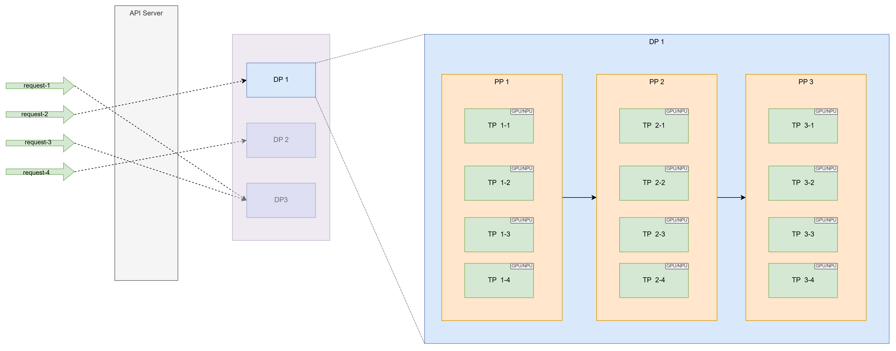

# 一张图理解vLLM中DP, PP, TP的概念

**DP、TP、PP** 是大模型分布式训练和推理中最常用的三种并行策略。它们解决的核心问题不同：**DP 解决吞吐和规模复制，TP 解决单层太大，PP 解决模型太深/层数太多**。三者可以组合使用。

---

## 1. DP：数据并行（Data Parallelism）

**核心思想：模型复制，数据切分。**

- 每个 GPU / 进程都保存一份**完整的模型副本**。
- 把训练数据或推理请求切成多份，每个副本处理不同数据。
- **训练时**：各副本独立计算梯度，然后通过 `all-reduce` 同步梯度，保证模型参数一致。
- **推理时**：多个副本各自服务不同请求，通常前面加负载均衡，用来提升整体吞吐量。

**优点：**
- 实现简单，扩展性好。
- 适合模型能单卡放下、但请求量很大的场景。
- 推理时能显著提高吞吐。

**缺点：**
- 每张卡都存完整模型，**显存冗余严重**。
- 训练时梯度同步通信量大。
- 单卡放不下的大模型无法直接用纯 DP。

**类比：** 多个厨师做不同的菜，但每个厨师都有一本完整菜谱。

**vLLM 中：** DP 就是启动多个独立推理引擎副本，用 `--data-parallel-size` 控制数量，主要提升并发吞吐。

---

## 2. TP：张量并行（Tensor Parallelism）

**核心思想：把单层内的张量运算切分到多个 GPU 上。**

- 不是复制模型，而是把**同一层的权重矩阵**切开。
- 例如 Transformer 中的注意力头、FFN 中间维度，可以按列或按行切分到不同 GPU。
- 每个 GPU 只计算一部分结果，然后通过 `all-reduce` / `all-gather` 合并。

**优点：**
- 能解决**单层参数太大、单卡放不下**的问题。
- 降低单个请求的计算延迟。
- 模型参数和激活显存被分摊。

**缺点：**
- 通信非常频繁，几乎每层都要通信。
- 对 GPU 间带宽要求极高，通常需要 NVLink，适合**同一节点内**。
- 扩展规模有限，超过一定数量后通信开销会吃掉收益。

**类比：** 一道菜切分成多道工序，多人同时做，但需要频繁沟通协调。

**vLLM 中：** `--tensor-parallel-size` 控制 TP 大小，常用于单请求延迟敏感、模型较大的推理场景。

---

## 3. PP：流水线并行（Pipeline Parallelism）

**核心思想：按层切分模型，不同 GPU 负责不同层。**

- 把模型按层分成多个阶段（stage），每个 GPU 或一组 GPU 负责一部分层。
- 前向传播时，激活值从第一个 stage 传到下一个 stage。
- 反向传播时，梯度从后往前回传。
- 为了减少空闲，通常会把一个 batch 切成多个 **micro-batch**，形成流水线。

**优点：**
- 能支持**非常深、层数很多**的模型。
- 可以跨节点扩展，显存分摊到不同机器。
- 相比 TP，通信量较小，主要是相邻 stage 之间的点对点通信。

**缺点：**
- 存在**流水线气泡**，即部分 GPU 会空闲等待。
- 延迟较高，不适合对单请求延迟极敏感的场景。
- 调度和负载均衡复杂。

**类比：** 工厂流水线，每人负责一道工序，但前后工序需要等待。

**vLLM 中：** `--pipeline-parallel-size` 可控制 PP，但推理中不如 TP 和 DP 常用；训练超大模型时 PP 更常见。

---

## 4. 三者对比

| 维度 | DP 数据并行 | TP 张量并行 | PP 流水线并行 |
|------|-------------|-------------|---------------|
| 切分对象 | 数据/请求 | 单层内的张量 | 模型层 |
| 模型副本 | 每个 GPU 完整副本 | 每卡部分权重 | 每卡部分层 |
| 通信 | 梯度 all-reduce | 每层 all-reduce/all-gather | stage 间点对点 |
| 通信频率 | 中 | 极高 | 低 |
| 主要目标 | 提升吞吐 | 降低单请求延迟、分摊单层显存 | 支持超深模型、跨节点 |
| 显存冗余 | 高 | 低 | 低 |
| 典型场景 | 推理多副本、训练小模型 | 单节点大模型 | 跨节点超大模型 |
| 缺点 | 显存冗余、梯度同步 | 带宽要求高 | 气泡、延迟高 |

---

## 5. 如何组合

实际大模型训练/推理中，三者经常一起用，称为 **3D 并行**：

\[
\text{总 GPU 数} = DP \times TP \times PP
\]

例如：
- 8 张 GPU，配置 `DP=2, TP=2, PP=2`
- 表示有 2 个数据并行副本；
- 每个副本内用 2 路张量并行；
- 再用 2 级流水线并行。

在 **vLLM 推理**中：
- **DP**：多个独立引擎副本，负载均衡，提升吞吐。
- **TP**：把单个模型切到多卡，降低延迟，支持大模型。
- **PP**：按层切分，跨节点支持超大模型，但会增加延迟。

在 **训练**中：
- DP 负责数据切分和梯度同步。
- TP 负责单层矩阵切分。
- PP 负责层间流水线。

---

## 一句话总结

- **DP**：复制模型，切分数据，主要提吞吐。
- **TP**：切分单层权重，多卡协同算一层，主要降延迟、分摊显存。
- **PP**：按层切分模型，流水线执行，主要支持超深模型和跨节点扩展。

选择时：模型能单卡放下、要吞吐 → 优先 DP；单层太大 → 加 TP；层数太多跨节点 → 加 PP。