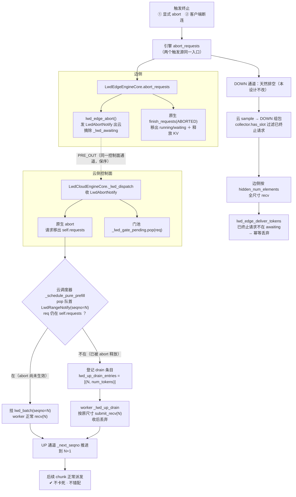
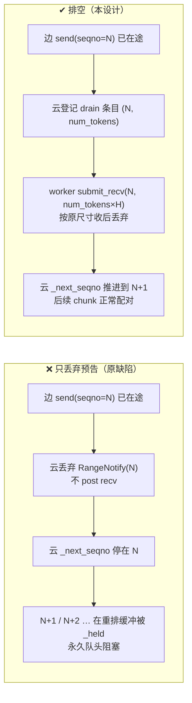
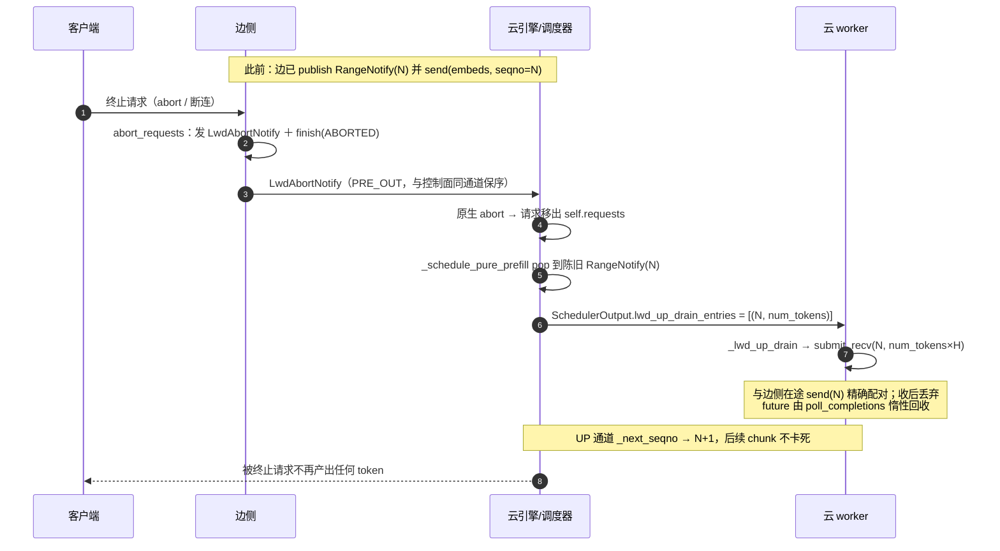
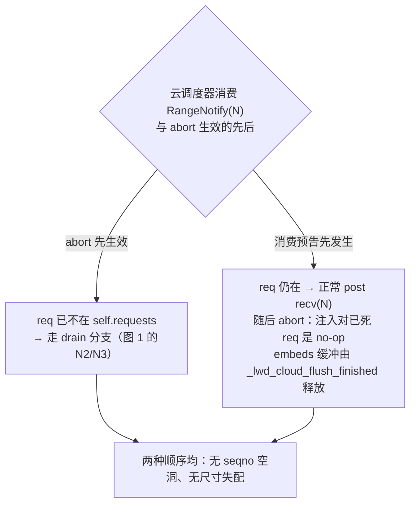

# 请求abort · 流程图

> 配套 `请求abort-需求.md` 与 `请求abort-设计.md`。每张图下方给出**代码走读索引**（文件 + 行号 + 作用）。
>
> 路径约定：`vllm/…` = vllm fork（分支 `prefill_only_v2`）；`vllm-ascend-po_abort/…` = ascend 插件（分支 `po_abort`）。行号为本次改动落地后的值（改动前 `lwd_cloud_phase_scheduler.py` 少 10 行、`lwd_cloud_worker.py` 少 38 行、`output.py` 少 5 行）。

## 图 1：端到端 abort 流程（含 UP 通道的配对决策）

**读图要点**：`D` 是唯一判断点（请求是否已被 abort 释放）；两个分支都汇入 `OK`，通道号都推进，所以后续 chunk 不卡死。DOWN 分支独立于 `D`。

### 代码走读索引（图 1）

| 图元 | 文件 | 行 | 作用 |
|---|---|---|---|
| 触发①：显式 abort 入口 | `vllm/vllm/entrypoints/serve/disagg/api_router.py` | 82-103 | `POST /abort_requests`：读 body `request_ids` → `engine_client(raw_request).abort(request_ids)`（**需 `tokens_only=True` 才注册**，见下） |
| 触发①→abort | `vllm/vllm/v1/engine/async_llm.py` | 709-718 | 同一个 `abort()`，此处 `internal=False`（外部显式调用） |
| 触发②：断连检测 | `vllm/vllm/entrypoints/serve/utils/api_utils.py` | 37-49 | `listen_for_disconnect`：收到 ASGI `http.disconnect` 即返回 |
| 触发②：断连取消 handler | `vllm/vllm/entrypoints/serve/utils/api_utils.py` | 52-94 | `with_cancellation`：断连时 cancel 业务 handler（流式由 `StreamingResponse` 接管） |
| 触发②→abort | `vllm/vllm/v1/engine/async_llm.py` | 588-596 | `generate()` 捕 `CancelledError`/`GeneratorExit` → `abort(internal=True)` |
| abort 入口（①②汇合点） | `vllm/vllm/v1/engine/async_llm.py` | 709-718 | `abort()`：`output_processor.abort_requests` + `engine_core.abort_requests_async` |
| EN：core 侧入口 | `vllm/vllm/v1/engine/core.py` | 379-384 | `EngineCore.abort_requests` → `scheduler.finish_requests(FINISHED_ABORTED)` |
| E1：边侧覆写 | `vllm/vllm/v1/lwd_control/control_edge_scheduler/lwd_edge_engine.py` | 187-190 | `lwd_edge_abort(request_ids)` 后 `super().abort_requests(...)` |
| E2：LwdAbortNotify | `vllm/vllm/v1/lwd_control/control_edge_scheduler/lwd_edge_scheduler.py` | 290-307 | `lwd_edge_abort`：摘 `_lwd_awaiting` + `publisher.publish(LwdAbortNotify)` |
| E3：原生清理 | `vllm/vllm/v1/core/sched/scheduler.py` | 1830-1886 / 1893-1902 | `finish_requests` 移出 running/waiting；`_free_request` 释放 KV 并写 `finished_req_ids` |
| 控制面消息定义 | `vllm/vllm/v1/lwd_control/control_communication/lwd_notify.py` | 54-57 | `class LwdAbortNotify`（仅 `request_id`） |
| C1：云侧收通知 | `vllm/vllm/v1/lwd_control/control_cloud_scheduler/lwd_cloud_engine.py` | 151-176 | `_lwd_dispatch`：`LwdRangeNotify` 入队 / `LwdAbortNotify` 触发 abort |
| C3：门池清除 | `vllm/vllm/v1/lwd_control/control_cloud_scheduler/lwd_cloud_engine.py` | 172 | `self._lwd_gate_pending.pop(msg.request_id, None)` |
| D：配对决策 | `vllm/vllm/v1/lwd_control/control_cloud_scheduler/lwd_cloud_phase_scheduler.py` | 92-139 | `_schedule_pure_prefill` 全体 |
| D：陈旧分支 + drain 登记 | `vllm/vllm/v1/lwd_control/control_cloud_scheduler/lwd_cloud_phase_scheduler.py` | 99-107 | `drain_entry = (notify.seqno, notify.num_tokens)` |
| D：drain 挂到 SO | `vllm/vllm/v1/lwd_control/control_cloud_scheduler/lwd_cloud_phase_scheduler.py` | 115-118 | `out.lwd_up_drain_entries = [drain_entry]` |
| D：空步来源 | `vllm/vllm/v1/lwd_control/control_scheduler/lwd_base_scheduler.py` | 25-54 | `_lwd_schedule_for_visible_reqs`（调原生 `schedule()`，产出空步 SO） |
| SO 字段 | `vllm/vllm/v1/core/sched/output.py` | 280-282 / 297 | `lwd_up_drain_entries: list[tuple[int, int]] \| None`；`make_empty` 补默认 |
| N1：正常 recv | `vllm-ascend-po_abort/vllm_ascend/worker/lwd_cloud/lwd_cloud_worker.py` | 156-195 | `_lwd_up_post_recvs`：按 `sum(len(token_ids)) × H` post recv |
| N3：排空 recv | `vllm-ascend-po_abort/vllm_ascend/worker/lwd_cloud/lwd_cloud_worker.py` | 197-230 | `_lwd_up_drain`：按 `num_tokens × H` post recv 并丢弃 |
| N3：调用点 | `vllm-ascend-po_abort/vllm_ascend/worker/lwd_cloud/lwd_cloud_worker.py` | 143-145 | `execute_model` 内紧随 `_lwd_up_post_recvs` |
| OK：通道推进 | `vllm-ascend-po_abort/vllm_ascend/distributed/lwd_comm/channel.py` | 125-171 | `_submit_sequenced`：重排缓冲 + `_next_seqno` 推进 |
| OK：提交入口 | `vllm-ascend-po_abort/vllm_ascend/distributed/lwd_comm/service.py` | 55-59 / 123-124 | `submit_recv`（recv 立即 post）+ `get_lwd_comm_service` |
| DD1：DOWN 组包 | `vllm-ascend-po_abort/vllm_ascend/worker/lwd_cloud/lwd_cloud_sample_collector.py` | 55-80 / 87-91 | `build_hidden_payload`（`has_slot` 过滤）/ `has_slot` |
| DD1：DOWN 发送 | `vllm-ascend-po_abort/vllm_ascend/worker/lwd_cloud/lwd_cloud_worker.py` | 256-308 | `sample_tokens`：`_lwd_next_down_seqno()` + `submit_send` |
| DD2：组 UNEMBED 批 | `vllm/vllm/v1/lwd_control/control_edge_scheduler/lwd_edge_scheduler.py` | 410-447 | `lwd_build_unembed_batch`：`recv_num_elements = hidden_num_elements`（全尺寸） |
| DD2：边侧执行 | `vllm-ascend-po_abort/vllm_ascend/worker/lwd_edge_worker.py` | 175-249 | `_execute_lwd_unembed`：全尺寸 recv → `compute_logits` → 还原 token |
| DD3：迟到丢弃 | `vllm/vllm/v1/lwd_control/control_edge_scheduler/lwd_edge_scheduler.py` | 340-365 | `lwd_edge_deliver_tokens`：不在 `_lwd_awaiting` → 返回 False 幂等丢弃 |
| DD3：完成码 ABORT | `vllm/vllm/v1/lwd_control/control_cloud_scheduler/lwd_cloud_engine.py` | 289-304 | `_lwd_c2e_finish_reasons`：`finished_requests` 兜底 `FinishReason.ABORT` |
| 云侧簿记清理 | `vllm-ascend-po_abort/vllm_ascend/worker/lwd_cloud/lwd_cloud_worker.py` | 314-335 | `_lwd_cloud_flush_finished`：`collector.drop` + 释放 prompt-embeds 缓冲 |

> **触发①的注册前提**：`/abort_requests` 仅在启动参数 `tokens_only=True`（`--tokens-only`，默认 `False`）时才注册（`vllm/vllm/entrypoints/serve/disagg/api_router.py:80`；参数定义见 `vllm/vllm/engine/arg_utils.py:708`、`vllm/vllm/entrypoints/openai/cli_args.py:154`）。若 LWD 部署未开该参数，HTTP 层没有显式 abort 入口，图 1 的触发①不成立，实际只有触发②（客户端断连）可用。
>
> **两条路径汇合前的唯一差异**：`internal` 标志——①为 `False`，②为 `True`；它传入 `output_processor.abort_requests(request_ids, internal)`，影响外部 req_id 与内部 req_id 的映射处理。

## 图 2：为什么要"排空"而不是"跳过"

### 代码走读索引（图 2）

| 图元 | 文件 | 行 | 作用 |
|---|---|---|---|
| 边侧"发布+派发"同步 | `vllm/vllm/v1/lwd_control/control_edge_scheduler/lwd_edge_scheduler.py` | 171-225 | `lwd_edge_notify`：`seqno = self._lwd_seqno` → publish 成功才 `+= 1`（peek-then-advance）→ 同方法内挂 `lwd_batch(seqno=N)` |
| 边侧 send | `vllm-ascend-po_abort/vllm_ascend/worker/lwd_edge_worker.py` | 147-173 | `_execute_lwd_embed`：`embed_input_ids` → `submit_send(seqno=N)`，`numel = total_N × H` |
| 洞：丢弃预告（修复点） | `vllm/vllm/v1/lwd_control/control_cloud_scheduler/lwd_cloud_phase_scheduler.py` | 99-107 | 修改前此处直接 `notify = None`（不排空）；现改为登记 `drain_entry` |
| 阻塞：held 扣留 | `vllm-ascend-po_abort/vllm_ascend/distributed/lwd_comm/channel.py` | 152-164 | `seqno > _next_seqno` → `LwdCommFuture.deferred` 放进 `self._held`，等前驱 |
| skip 只对未 post 号有效 | `vllm-ascend-po_abort/vllm_ascend/distributed/lwd_comm/channel.py` | 60-82 | `skip_seqno`：`if seqno < self._next_seqno: return`（已 post 直接 no-op） |
| skip 推进逻辑 | `vllm-ascend-po_abort/vllm_ascend/distributed/lwd_comm/channel.py` | 84-92 | `_advance_past_skipped`：越过被跳过的号并执行 held 条目 |
| skip 无调用方 | `vllm-ascend-po_abort/vllm_ascend/distributed/lwd_comm/service.py` | 76-86 | `LwdCommService.skip_seqno` 仅有定义，全仓库无调用点 |

**为什么不能用 `skip_seqno`**

| 事实 | 推论 |
|---|---|
| 边侧"发布 `RangeNotify(N)`"与"挂 `lwd_batch(N)` 派发"在**同一方法内**完成（`lwd_edge_notify` 195-224） | `RangeNotify(N)` 一发布，send(N) 必然已在途 |
| HCCL P2P **无 tag**，收发按投递顺序配对 | 一侧跳过、另一侧照常收发 → 后续 recv 与悬空 send 错配 |
| `skip_seqno` 只对**尚未 post** 的 seqno 生效（`channel.py:68-69`） | send(N) 已 post、边侧 `_next_seqno` 已到 N+1 → 边侧 skip(N) 是 no-op |
| 唯一同时满足"不收回已发数据"与"配对连续"的动作 | **按原尺寸 recv 后丢弃**（排空） |

## 图 3：跨节点时序（abort 命中 prefill）

### 代码走读索引（图 3）

| 步骤 | 文件 | 行 | 作用 |
|---|---|---|---|
| 此前：边发布 + 发张量 | `vllm/vllm/v1/lwd_control/control_edge_scheduler/lwd_edge_scheduler.py` `vllm-ascend-po_abort/vllm_ascend/worker/lwd_edge_worker.py` | 195-224 147-173 | seqno 分配 + `lwd_batch` 挂批；`submit_send` |
| ① 客户端终止 | `vllm/vllm/entrypoints/serve/utils/api_utils.py` `vllm/vllm/v1/engine/async_llm.py` | 37-94 588-596 / 709-718 | 断连检测 → `abort()` |
| ② 边侧 abort | `vllm/vllm/v1/lwd_control/control_edge_scheduler/lwd_edge_engine.py` `vllm/vllm/v1/lwd_control/control_edge_scheduler/lwd_edge_scheduler.py` | 187-190 290-307 | 覆写入口；发 `LwdAbortNotify` + 摘 awaiting |
| ③ 控制面（边→云） | `vllm/vllm/v1/lwd_control/control_communication/lwd_notify.py` | 15-22 / 54-57 | `LwdRangeNotify` / `LwdAbortNotify` 定义（`msgspec` tag 复用） |
| ④ 云侧 abort | `vllm/vllm/v1/lwd_control/control_cloud_scheduler/lwd_cloud_engine.py` | 151-176 | `_lwd_dispatch` → `aborts_queue` + `input_queue`(ABORT) |
| ⑤ 调度器 pop 预告 | `vllm/vllm/v1/lwd_control/control_cloud_scheduler/lwd_cloud_phase_scheduler.py` | 92-118 | `_schedule_pure_prefill` 队首 pop + 陈旧判定 |
| ⑥ 下发 worker | `vllm/vllm/v1/core/sched/output.py` `vllm-ascend-po_abort/vllm_ascend/worker/lwd_cloud/lwd_cloud_worker.py` | 280-282 130-145 | SO 字段定义；`execute_model` 读取并调用 |
| ⑦ 排空 recv | `vllm-ascend-po_abort/vllm_ascend/worker/lwd_cloud/lwd_cloud_worker.py` `vllm-ascend-po_abort/vllm_ascend/distributed/lwd_comm/service.py` | 197-230 55-59 | `_lwd_up_drain` → `submit_recv` |
| ⑧ 通道推进 | `vllm-ascend-po_abort/vllm_ascend/distributed/lwd_comm/channel.py` | 125-171 | `_submit_sequenced`：配对 + `_next_seqno += 1` |
| ⑨ 无 token 产出 | `vllm/vllm/v1/lwd_control/control_edge_scheduler/lwd_edge_scheduler.py` | 340-365 | `lwd_edge_deliver_tokens` 拒绝认领已 abort 请求 |

## 图 4：两种消费顺序都安全（完整性论证）

### 代码走读索引（图 4）

| 路径 | 文件 | 行 | 作用 |
|---|---|---|---|
| P1：abort 先生效 → drain | `vllm/vllm/v1/lwd_control/control_cloud_scheduler/lwd_cloud_phase_scheduler.py` | 99-118 | `notify.request_id not in self.requests` 判定 + drain 登记 |
| P2：预告先消费 → 正常 recv | `vllm/vllm/v1/lwd_control/control_cloud_scheduler/lwd_cloud_phase_scheduler.py` `vllm-ascend-po_abort/vllm_ascend/worker/lwd_cloud/lwd_cloud_worker.py` | 119-139 156-195 | 挂 `lwd_batch`；`_lwd_up_post_recvs` post recv |
| P2：注入对已死 req 为 no-op | `vllm-ascend-po_abort/vllm_ascend/worker/lwd_cloud/lwd_cloud_model_runner.py` | 109-164（判定在 142） | `idx = input_batch.req_id_to_index.get(req_id)`；`idx is None` 即跳过注入，仅 `row += n` 前移 |
| P2：embeds 缓冲释放 | `vllm-ascend-po_abort/vllm_ascend/worker/lwd_cloud/lwd_cloud_worker.py` | 314-335 | `_lwd_cloud_flush_finished`：`collector.drop` + `embeds_map.pop(idx)` |
| 云 worker 收 recv 结果 | `vllm-ascend-po_abort/vllm_ascend/worker/lwd_cloud/lwd_cloud_worker.py` | 232-254 | `take_lwd_up_embeds`：`future.wait()` 后 `view(-1, H)` |
| 云 runner 组装/注入 | `vllm-ascend-po_abort/vllm_ascend/worker/lwd_cloud/lwd_cloud_model_runner.py` | 55-71 / 109-164 | `_prepare_inputs` → `_lwd_inject_remote_embeds` |

## 附：本次改动落点（3 处）

| # | 文件 | 行 | 改动 |
|---|---|---|---|
| 1 | `vllm/vllm/v1/core/sched/output.py` | 280-282、297 | 新增 `lwd_up_drain_entries` 字段并补 `make_empty()` |
| 2 | `vllm/vllm/v1/lwd_control/control_cloud_scheduler/lwd_cloud_phase_scheduler.py` | 95-96、98、100-107、115-118 | 陈旧预告改登记 drain 条目（原来直接丢弃） |
| 3 | `vllm-ascend-po_abort/vllm_ascend/worker/lwd_cloud/lwd_cloud_worker.py` | 143-145、197-230 | 新增 `_lwd_up_drain` 并在 `execute_model` 接入 |
