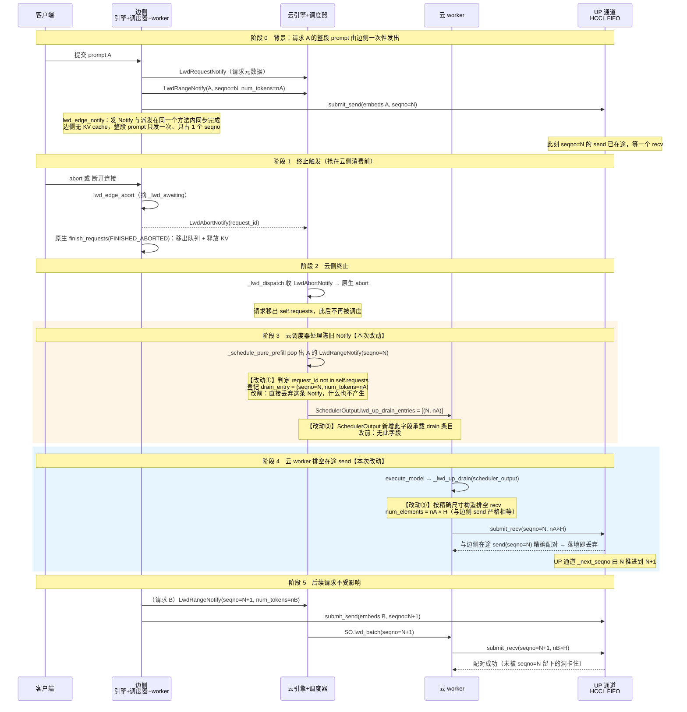

# 请求abort · 设计

## 1. 定位

本设计只补齐"请求终止"在边云 LWD prefill_only 数据面上**唯一缺失的一环**：UP 通道"边已发送、云未接收"的洞的排空。其余环节已由现有代码覆盖，本设计不改。

| 环节 | 状态 | 所在 |
|---|---|---|
| 终止触发（显式 abort / 客户端断连）→ `abort_requests` | 已有 | `vllm/v1/engine/async_llm.py` + `entrypoints/serve/utils/api_utils.py` |
| 边侧发 `LwdAbortNotify` 出云 + 原生清理 | 已有 | `vllm/v1/lwd_control/control_edge_scheduler/lwd_edge_engine.py` `abort_requests` |
| 云侧收 `LwdAbortNotify` → 原生 abort → 移出调度器 | 已有 | `vllm/v1/lwd_control/control_cloud_scheduler/lwd_cloud_engine.py` `_lwd_dispatch` |
| DOWN 方向排空（全尺寸 recv + 迟到幂等丢弃 + `finish_reasons` 传 ABORT） | 已有 | `lwd_build_unembed_batch` / `lwd_edge_deliver_tokens` / `_lwd_c2e_finish_reasons` |
| 云 worker 的 collector / embeds 缓冲清理 | 已有 | `vllm_ascend/worker/lwd_cloud/lwd_cloud_worker.py` `_lwd_cloud_flush_finished` |
| **UP 洞排空（recv-and-drop）** | **本设计新增** | 见 §4 |

三条硬约束（源自需求文档，本设计逐条满足）：

1. **每个已分配的 seqno 都必须在两侧有配对动作**——任一侧缺收发动作、或两侧尺寸不一致，都是无 tag 通道上的配对错误。
2. **在途载荷只能排空、不能跳过**——已发出的 send 无法收回，未派发的传输根本不分配 seqno。
3. **健康请求完全无感**——其 seqno 顺序、收发配对、数据内容不受任何请求终止的影响。

---

## 2. 问题定位（精确到代码）

### 2.1 UP 通道的 seqno 分配与发送

边侧 `lwd_edge_scheduler.lwd_edge_notify`（`vllm/v1/lwd_control/control_edge_scheduler/lwd_edge_scheduler.py`）在**同一方法内**完成三件事：

1. 发布 `LwdRangeNotify(request_id, offset, num_tokens, seqno=N)`（`publish` 成功后 `self._lwd_seqno = N + 1`）；
2. 把 `LwdBatch(LWD_EMBED, seqno=N, token_ids=[切片])` 挂到 `scheduler_output.lwd_batch`；
3. 该 SO 随后被边 worker `_execute_lwd_embed` 执行，`submit_send` 把 `N × H` 的 embeddings 发上 wire。

**结论**：`LwdRangeNotify(seqno=N)` 一发布，边侧该请求（整段 prompt）的 send 就**必然已在途**（发布与派发同步、`executed == num_scheduled_tokens`）。

**一个前提事实（本次评审补入）**：边侧**无法分块**——`LwdEdgeWorker.get_kv_cache_spec()` 返回 `{}`（边侧是 0 层拓扑，无 attention/KV），引擎初始化在 `kv_cache_groups` 为空时强制 `enable_chunked_prefill = False`（`vllm/v1/engine/core.py:138-143`）。因此**每个请求的整段 prompt 恰好占 1 个 UP seqno、只发一次**；`prompt > max_num_batched_tokens` 的请求不会被边侧接纳（原生调度器在 chunked prefill 关闭时直接 break）。洞的触发窗口因此只有"边侧发出载荷 → 云侧 pop 到该 Notify"这一个云侧调度步；窗口窄，但洞的成因与后果不变。

### 2.2 云侧消费 Notify 与丢弃陈旧 Notify

云侧 `lwd_cloud_phase_scheduler._schedule_pure_prefill`（`vllm/v1/lwd_control/control_cloud_scheduler/lwd_cloud_phase_scheduler.py`）：

```python
notify = q.popleft() if (q := self.prefill_notify_queue) else None
if notify is not None and notify.request_id not in self.requests:
    # 请求已被 abort 释放:丢弃陈旧 Notify,本步按空集走
    notify = None
...
if notify is None:
    return out        # 空步，无 lwd_batch，云 worker 不会 post recv
```

`notify.request_id not in self.requests` 表示请求已被 `LwdAbortNotify` 触发的原生 abort 移出调度器。此时 Notify 被**直接丢弃**，云 worker 拿不到 `lwd_batch`，于是**不为 seqno=N post recv**。

### 2.3 洞的形成

边侧 send(N) 已在途，云侧不 recv(N) → 云侧通道 `_next_seqno` 停在 N → 之后所有请求的传输（seqno N+1, N+2, …）在重排缓冲里被 `_held` 永久扣留 → **整条 UP 通道队头阻塞**。

这正是需求文档"洞一"描述的、也是本设计要消除的唯一缺陷。

### 2.4 为什么"跳过"（skip_seqno）救不了

`vllm_ascend/distributed/lwd_comm/channel.py` 已有 `skip_seqno`（abort holes）机制，但**全仓库无调用方**，且在本场景下语义不成立：

- `skip_seqno(seqno)` 标记"该 seqno 永不投递"并推进 `_next_seqno`，**只能作用于尚未 post 的 seqno**；
- 边侧的 send(N) 已经 post（send 通道 `_next_seqno` 已推进到 N+1），此时在边侧 `skip_seqno(N)` 命中 `seqno < _next_seqno` 分支直接 no-op；
- 云侧若 `skip_seqno(N)` 不 recv，则云侧下一个 recv(N+1) 会与边侧**悬空的 send(N)** 错配（HCCL 无 tag、按投递顺序配对），后续全部错位。

因此唯一正确修法是**按原尺寸 recv 后丢弃（drain）**，与 v0.23.0_lwd 的"dead chain 不丢弃、用 dummy 载荷排空"同一哲学。

---

## 3. 设计决策与理由

| # | 决策 | 理由 |
|---|---|---|
| D1 | **排空（recv-and-drop）而非跳过** | 见 §2.4：send 已在途不可收回，skip 只对未投递 seqno 有效，无 tag 通道上 skip 会全链错配。 |
| D2 | **drain 条目放 `SchedulerOutput.lwd_up_drain_entries`，不新增控制面消息、不复用 `lwd_batch`** | ① `lwd_batch` 的 `LwdEmbedBatch` 语义是"有活请求、注入 embeds"，排空是"无活请求、只收不注入"，复用会让 `_lwd_up_post_recvs` 把排空误当正常注入；② 需求边界明确"不引入新控制面消息"；③ `SchedulerOutput` 是调度器→worker 的既有单向通道，drain 条目随空步 SO 下发，零新增链路。 |
| D3 | **字段类型 `list[tuple[int, int]] \| None`，元素 `(seqno, num_tokens)`** | 每步至多一条（`_schedule_pure_prefill` 每步只 `popleft` 一条），用 list 是为与历史 `_lwd_up_drain` 一致并留扩展；`num_tokens` 是唯一能精确推出边侧发送尺寸的量（`num_elements = num_tokens × hidden_size`）。 |
| D4 | **worker 侧 `submit_recv` 精确尺寸、future 不消费** | HCCL P2P 要求两端 numel 匹配；future 由 `poll_completions` 惰性回收，与 `_lwd_up_post_recvs` 一致，不引入后台线程。 |
| D5 | **只在"陈旧 Notify 被丢弃"处产生 drain，KV 压力空步不产生** | KV 压力空步时请求仍存活、Notify 塞回队首、seqno 不消费；陈旧 Notify 的请求已死、KV 已释放，直接排空即可。 |
| D6 | **不接 `skip_seqno`** | 该机制无调用方、语义与本场景不匹配；留着无害，本设计不依赖它。 |

---

## 4. 改动清单（精确到文件与代码）

### 4.1 `vllm/vllm/v1/core/sched/output.py` — `SchedulerOutput` 增一个字段

在 `lwd_batch` 字段（当前 `lwd_batch: LwdBatch | None = None`）之后新增：

```python
    # LWD abort 排空:被 abort 请求的整段 prompt 已上 wire(边侧每请求仅
    # 1 块),云侧按原尺寸挂空收丢弃,保 UP 通道 FIFO 配对。元素 (seqno, num_tokens)。
    lwd_up_drain_entries: list[tuple[int, int]] | None = None
```

并在 `make_empty()` 的构造里补一行（紧随 `lwd_batch=None,` 之后）：

```python
            lwd_up_drain_entries=None,
```

> 字段带默认值 `None`，因此原生调度器及其他直接构造 `SchedulerOutput(...)` 的调用点**无需改动**；只有 `LwdCloudPhaseScheduler` 生产、`LwdCloudWorker` 消费。

### 4.2 `vllm/vllm/v1/lwd_control/control_cloud_scheduler/lwd_cloud_phase_scheduler.py` — `_schedule_pure_prefill` 登记 drain

将 `_schedule_pure_prefill` 整体替换为（关键差异：陈旧 Notify 不再静默丢弃，而是登记 `drain_entry`）：

```python
    def _schedule_pure_prefill(self) -> SchedulerOutput:
        """纯 prefill 步:prefill_notify_queue 有 Notify 则取队首 msg,单独
        调度其请求(按原队列归位,waiting/skipped 来源走原生准入);没有则
        空集进窗口,等价空步,三队列原样保留。被 abort 释放的陈旧 Notify
        登记为 drain 条目,由 worker 挂空收排空在途 UP send。"""
        notify = q.popleft() if (q := self.prefill_notify_queue) else None
        drain_entry: tuple[int, int] | None = None
        if notify is not None and notify.request_id not in self.requests:
            # 请求已被 abort 释放:边侧该请求(整段 prompt)的 send 已在途,
            # 须挂空收排空保 UP 通道 FIFO 配对;worker 层据此 recv-and-drop。
            drain_entry = (notify.seqno, notify.num_tokens)
            logger.info(
                "[Lwd][cloud-sched] abort drain seqno=%s num=%s (req gone)",
                notify.seqno, notify.num_tokens,
            )
            notify = None
        if notify is not None:
            logger.info(
                "[Lwd][cloud-sched] prefill notify req=%s seqno=%s num=%s",
                notify.request_id, notify.seqno, notify.num_tokens,
            )
        req_ids = [notify.request_id] if notify is not None else []
        out = self._lwd_schedule_for_visible_reqs(req_ids)
        if notify is None:
            if drain_entry is not None:
                out.lwd_up_drain_entries = [drain_entry]
            return out
        if not out.num_scheduled_tokens:
            self.prefill_notify_queue.appendleft(notify)
            return out
        out.lwd_batch = LwdBatch(
            batch_type=LwdBatchType.LWD_EMBED,
            seqno=notify.seqno,
            batch_meta=LwdEmbedBatch(
                req_ids=[notify.request_id],
                token_ids=[[0] * notify.num_tokens],
            ),
        )
        return out
```

要点：`drain_entry` 与正常 `lwd_batch` 在**同一分支互斥**（陈旧→drain、存活→batch），一步之内不会同时出现；`out` 是 `_lwd_schedule_for_visible_reqs([])` 产出的空步 SO（仍携带 `finished_req_ids` 等原生字段），drain 条目附着其上照常下发 worker。

### 4.3 `vllm-ascend-po_abort/vllm_ascend/worker/lwd_cloud/lwd_cloud_worker.py` — 恢复 `_lwd_up_drain`

在 `execute_model` 的 LWD 分支内，`_lwd_up_post_recvs` 之后插入一行调用：

```python
        if self.enable_lwd:
            collector = self.model_runner.lwd_cloud_collector
            if collector is not None:
                for req_data in scheduler_output.scheduled_new_reqs:
                    collector.open_request(req_data.req_id, 0)
            # cloud: post the exact-size UP irecv for every incoming
            # LWD_EMBED batch (control info rides scheduler_output.lwd_batch).
            self._lwd_up_post_recvs(scheduler_output)
            # abort drain: recv-and-drop UP chunks whose RangeNotify arrived
            # but whose request died before scheduling (pairing repair).
            self._lwd_up_drain(scheduler_output)
```

并在 `_lwd_up_post_recvs` 之后新增方法：

```python
    def _lwd_up_drain(self, scheduler_output) -> None:
        """Recv-and-drop UP chunks of aborted requests (pairing repair).

        ``scheduler_output.lwd_up_drain_entries`` carries ``(seqno,
        num_tokens)`` entries swept by the cloud scheduler when a stale
        RangeNotify is discarded (request aborted before the notify was
        consumed).  Every registered seqno has an in-flight UP send on
        the edge (the edge's RangeNotify publish and dispatch are
        synchronous), so the only safe repair is to receive the payload
        at exact size and discard it — skipping the seqno would misalign
        all later pairings on the tag-less wire.  The futures are never
        consumed; completion is reaped by ``poll_completions``.
        """
        entries = getattr(scheduler_output, "lwd_up_drain_entries", None)
        if not entries:
            return
        hidden_size = self.model_config.get_hidden_size()
        service = get_lwd_comm_service()
        for seqno, num_tokens in entries:
            if num_tokens <= 0:
                continue
            service.submit_recv(
                LwdCommRequest(
                    channel=LwdChannelType.UP,
                    op="recv",
                    num_elements=num_tokens * hidden_size,
                    seqno=seqno,
                )
            )
            logger.info(
                "[Lwd][cloud-worker] draining aborted UP chunk seqno=%d "
                "tokens=%d",
                seqno, num_tokens,
            )
```

> 该实现与历史上被移除的 `_lwd_up_drain`（commit `8dd015df47`）一致；历史版本被移除的原因是当时 vllm fork 未提供 `lwd_up_drain_entries`，drain 成了死代码。本设计补上了生产端（§4.2）与字段（§4.1），使该消费端重新生效。

---

## 5. 端到端数据流

### 5.1 正常 UP（无 abort，不触发 drain）

```
边调度器 lwd_edge_notify: 发布 RangeNotify(N) + 挂 lwd_batch(N)
        │  (同一方法)
边 worker _execute_lwd_embed: submit_send(embeds[N×H], seqno=N)
        │
云调度器 _schedule_pure_prefill: pop RangeNotify(N)，req 存活
        │  out.lwd_batch = LwdBatch(LWD_EMBED, seqno=N, token_ids=[[0]*N])
云 worker _lwd_up_post_recvs: submit_recv(num_elements=N×H, seqno=N)
        │  HCCL 配对
云 runner _lwd_inject_remote_embeds: 注入 embeds → 前向
```

### 5.2 abort 命中 prefill（触发 drain）

```
边: RangeNotify(N) + send(N) 已在途
边: LwdAbortNotify  → 云 abort → 请求移出 self.requests
云调度器 _schedule_pure_prefill: pop RangeNotify(N)，req 已死
        │  drain_entry = (N, num_tokens)，notify=None
        │  out.lwd_up_drain_entries = [(N, num_tokens)]，lwd_batch=None
云 worker _lwd_up_drain: submit_recv(num_elements=num_tokens×H, seqno=N)
        │  HCCL 配对（与边侧 send(N) 精确匹配）
        │  future 不消费，poll_completions 惰性回收
云通道 _next_seqno 推进到 N+1，后续请求的传输正常派发（不卡死）
```

### 5.3 两种消费顺序都安全（完整性论证）

- **abort 先于消费 Notify**：`_schedule_pure_prefill` 走 drain（§5.2），配对正确；
- **消费 Notify 先于 abort**：此时请求仍存活，走正常 `lwd_batch` → `_lwd_up_post_recvs` 正常 recv；随后 abort 才生效，被注入的 embeds 属于已死请求，`_lwd_inject_remote_embeds` 中 `req_id_to_index.get(req_id) is None` → 注入为 no-op，且 `_lwd_cloud_flush_finished` 随后清理 embeds 缓冲。

两条路径都不产生 seqno 空洞、不产生 size 失配。

### 5.4 DOWN 方向（本设计不改，仅确认闭环）

```
云: sample → DOWN 组包(collector.has_slot 过滤) → send(DOWN, seqno=M)
    → lwd_handle_model_output → _lwd_c2e_finish_reasons(ABORT 兜底) → _lwd_publish_c2e
边: 收 LwdC2eNotify(hidden_num_elements, req_ids, finish_reasons, down_seqno=M)
    → lwd_build_unembed_batch: recv_num_elements = hidden_num_elements（全尺寸）
边 worker: submit_recv(全尺寸, seqno=M) → unembed 全部 req_ids
边: lwd_edge_deliver_tokens(aborted req) → 不在 awaiting → 幂等丢弃
```

DOWN 无对称洞：边侧永远按云侧实发尺寸 recv，迟到结果幂等丢弃，终止码经 `finish_reasons`（ABORT）回传。

### 5.5 端到端时序图（标注本次改动）

下图覆盖一次完整的「UP 在途 abort」，`【改动①②③】` 标出本设计实际改动的三处；阶段 3、4 是仅有的两个改动阶段（浅色底框）。注意：**每个请求的整段 prompt 只占 1 个 UP seqno**（§2.1 前提事实），图中 `seqno=N` 是请求 A 的整段 prompt，`N+1` 是下一个请求 B 的。



**改动序号对照**（按时间顺序编号）

| 序号 | 改动内容 | 文件 | 行 | 详见 |
|---|---|---|---|---|
| ① | 云调度器把陈旧 Notify 登记为 drain 条目（改前：静默丢弃） | `vllm/vllm/v1/lwd_control/control_cloud_scheduler/lwd_cloud_phase_scheduler.py` | 98-118 | §4.2 |
| ② | `SchedulerOutput` 新增 `lwd_up_drain_entries` 字段（改前：无此字段） | `vllm/vllm/v1/core/sched/output.py` | 280-282、297 | §4.1 |
| ③ | 云 worker 按精确尺寸执行排空 recv（改前：无此方法） | `vllm-ascend-po_abort/vllm_ascend/worker/lwd_cloud/lwd_cloud_worker.py` | 143-145、197-230 | §4.3 |

**读图要点**

- **阶段 0 是前提**：`lwd_edge_notify` 把"发 Notify"与"挂 `lwd_batch` 派发"放在同一个方法里同步完成，所以阶段 3 出现陈旧 Notify 时，对应的 embeds **必然已在途**——这正是"不能只丢 Notify"的根因。
- **每个请求恰 1 个 UP seqno**：边侧无 KV cache ⇒ chunked prefill 被强制关闭（§2.1），`seqno=N` 就是请求 A 的整段 prompt，不存在"A 的第 2、3 块"。阶段 5 的 `N+1` 是**下一个请求**的。
- **阶段 3 的判定只有一行**：`notify.request_id not in self.requests`。它区分"陈旧"与"正常"：为真走 drain，为假走正常 `lwd_batch`。
- **阶段 4 的尺寸必须精确**：`num_elements = nA × H` 与边侧 `embeds.numel()` 同源（`num_tokens` 直接取自那条 `LwdRangeNotify`），HCCL 要求两端 numel 严格相等。
- **阶段 5 是验收点**：seqno=N+1 能正常配对，说明 abort 没有在通道上留下洞。
- **窗口很窄**：阶段 1 必须抢在云侧 pop（阶段 3 之前）发生；单请求、云侧空闲时通常抢不到（abort 会"迟到"，走 §5.3 的正常路径）。确定性复现见 §7.4 插桩。
- **DOWN 方向（云→边）不在此图内**：它天然排空、本次未改，见 §5.4。

---

## 6. 边界与不变量

| # | 不变量 / 边界 | 由谁保证 |
|---|---|---|
| 1 | drain recv 尺寸 == 边侧 send 尺寸（`num_tokens × hidden_size`） | drain 条目里的 `num_tokens` 直接取自 `RangeNotify.num_tokens`，与边侧 `embeds.numel()` 同源同值 |
| 2 | drain 与正常 batch 一步内互斥 | §4.2 的 `if notify is None` 分支二选一 |
| 3 | seqno 连续：drain 消费的 seqno 必须等于云侧 `_next_seqno` | Notify 按 FIFO（队首 popleft）、边侧 peek-then-advance 连续分配、KV 空步回插不消费号 |
| 4 | 每请求恰 1 块 ⇒ 一个请求最多产生 1 条陈旧 Notify | 多条陈旧 Notify 只能来自多个被终止的请求；每步 popleft 一条 → 分步排空，号连续不错位 |
| 5 | 空步 SO 仍下发 worker | 云引擎用原生 `EngineCoreProc.step()`，`execute_model` 恒被调用（空步也调），drain 条目不丢 |
| 6 | 幂等 / 不重复排空 | drain 只在 `popleft` 消费掉 Notify 时产生一次；被消费的 Notify 不再回插 |

---

## 7. 测试与验证

### 7.1 单元测试（无需 NPU 的逻辑层）

1. `_schedule_pure_prefill`：构造 `notify.request_id` 不在 `self.requests` 的场景，断言返回的 `SchedulerOutput.lwd_up_drain_entries == [(seqno, num_tokens)]` 且 `lwd_batch is None`；
2. 正常路径：请求存活时 `lwd_up_drain_entries is None` 且 `lwd_batch.seqno == notify.seqno`；
3. KV 压力空步：`num_scheduled_tokens` 为空时 Notify 回插、无 drain 无 batch；
4. `_lwd_up_drain`：给定带 `lwd_up_drain_entries` 的 SO，断言 `submit_recv` 被调用且 `num_elements == num_tokens * hidden_size`、`seqno` 正确（mock `get_lwd_comm_service`）。

> **UT 是主要验证手段**：e2e 的触发窗口只有一个云侧调度步（§2.1 前提事实），纯靠抢时序极难稳定复现；上面 4 条 UT 直接锁死改动①②③的行为，无需 NPU、无需竞态。e2e 用 §7.4 的插桩做确定性复现。

### 7.2 端到端测试（NPU，边云两节点）

| 场景 | 触发 | 断言 |
|---|---|---|
| A：UP 在途 abort（窄窗口） | 边侧发出该请求的 Notify+embeds 后、云侧消费前立刻 abort（确定性复现用 §7.4 插桩） | 日志出现 `[Lwd][cloud-worker] draining aborted UP chunk seqno=N`；同服务后续请求正常完成、无 `held out-of-order` 永久卡死 |
| B：decode 中途 abort | decode 若干步后 abort | 健康请求输出正常；被 abort 请求无输出；无 size 失配报错 |
| C：客户端断连 | 流式响应中断开 | 与 A/B 同断言（断连 = 同 abort 路径） |
| D：无 abort 回归 | 正常跑完 | 无 drain 日志；输出与单机基线逐 token 一致（用 `log_analyze_tools/lwd_token_diff.py` 对拍） |

### 7.3 对账锚点

沿用现有 DUMP/对账设施：`[Lwd][DUMP]` 张量摘要、`[Lwd][cloud-tokens]` / `[lwd-debug]`，健康请求的 hidden/token 与单机基线逐值一致，确认排空不污染任何健康请求。

### 7.4 确定性复现插桩（临时，仅用于 e2e 验证）

洞的触发窗口天然只有"边侧发出载荷 → 云侧 pop 到该 Notify"这一个云侧调度步（§2.1 前提事实），真实 abort 通常"迟到"（走 §5.3 的正常路径）。用 sleep 把窗口拉开时，**sleep 只能放在 PRE_OUT 接收线程，不能放在调度器（主循环线程）**：

- 云引擎主循环是单线程串行的：每轮先 `_process_input_queue()`（处理 ABORT，`core.py:1400-1401`）再 `_process_engine_step()`（`schedule()` → pop）。在 `_schedule_pure_prefill` 里 sleep 会把主循环整个堵住——abort 虽由 PRE_OUT 线程投递进 `input_queue`，但真正生效（`finish_requests`）要靠主循环，sleep 结束后**同一轮先 pop 后 abort**，abort 永远迟到，插桩失效。
- PRE_OUT 接收线程（`_lwd_pre_out_loop` → `_lwd_dispatch`）只负责投递：`LwdRangeNotify` 入 `prefill_notify_queue`（**不唤醒主循环**）、`LwdAbortNotify` 入 `aborts_queue` + `input_queue`（**唤醒主循环**）。在这里 sleep 只会推迟 Notify 的**入队**，主循环全程空闲、随时能处理 abort。

因此把 sleep 插在 **`_lwd_dispatch` 的 `LwdRangeNotify` 分支开头（入队之前）**：

```python
# vllm/v1/lwd_control/control_cloud_scheduler/lwd_cloud_engine.py
# LwdCloudEngineCore._lwd_dispatch 的 LwdRangeNotify 分支最开头（当前约 154 行）
    def _lwd_dispatch(self, msg) -> None:
        if isinstance(msg, LwdRangeNotify):
            # ===== 临时插桩：把目标请求的 Notify 入队延后 3s；验证完务必删除 =====
            if "abort-test01" in msg.request_id:
                import time
                time.sleep(3)
            # ======================================================================
            seqnos = self._lwd_seqno_registry.setdefault(msg.request_id, [])
            ...
```

时序：sleep 期间用户断连 → 边侧 `LwdAbortNotify` 到达云侧 ZMQ socket 里排队（PRE_OUT 线程还在 sleep）→ sleep 结束 → Notify 入队 → 紧接着 AbortNotify 被读出并投递进 `input_queue`（μs 级）→ 主循环下一轮**先处理 ABORT**（`finish_requests` → `del self.requests[req_id]`）**再 schedule 里 pop 到该 Notify** → 陈旧判定成立 → 走 drain。剩余竞态只有"Notify 入队 → AbortNotify 投递"之间的 μs 间隙，实践中可忽略；若要 100% 消除，可在 sleep 结束后先把 abort 读出来派发再入队（`self._lwd_subscriber.recv(timeout_ms=0)` 非阻塞探测，`lwd_control_subscriber.py:43-55`）。

> 注意：插桩会影响**所有** request_id 含该子串的 RangeNotify（每次 3s），只用于单请求测试；服务端会给 `request_id` **同时加前缀和后缀**（如 `chatcmpl-abort-test01-9979bdcd`），所以必须用 `in` 包含匹配，`startswith` 匹配不上。

使用步骤：

1. 带插桩重启云侧（边侧 `--max-num-batched-tokens` ≥ prompt 长度，保证请求能被边侧接纳）；
2. 提交一个 `request_id` 以 `abort-test01` 开头的请求，确认边侧日志出现 `[Lwd][edge-notify] ... seqno=K` 与 `[lwd-comm] SEND post channel=UP`；
3. **在 3 秒内**断连 abort（Ctrl-C / kill curl）；
4. 观察云侧：
   - **修复后**：先出现 `[Lwd][cloud-ctrl] AbortNotify req=...`，随后 `[Lwd][cloud-sched] abort drain seqno=K num=... (req gone)` + `[Lwd][cloud-worker] draining aborted UP chunk seqno=K`；
   - **修复前**（撤掉三处改动对照）：静默丢弃 Notify；紧接着提交的**第二个请求**卡死（云 worker 卡在 `future.wait()`，日志出现 `[lwd-comm] held out-of-order ... seqno=...`）；
   - **命中判据**：云侧该请求**没有** `[Lwd][cloud-sched] prefill notify req=...`（它还没被 pop 就被 abort 了），即 `AbortNotify` 在 `prefill notify` 之前；若出现了 `prefill notify`，说明 miss（μs 竞态或断连超过 3s），重跑即可；
5. 验证完**删除插桩**。

---

## 8. 明确不做

1. **不接 `skip_seqno`**：该机制对 prefill_only 双工场景无正确语义（见 §2.4），保留原样、不调用、不删除。
2. **不改 DOWN 方向**：DOWN 已天然排空（§5.4），无需改动。
3. **不改 abort 控制面**：`LwdAbortNotify` 的收发、边/云引擎的 abort 入口均已存在。
4. **不引入新控制面消息**：drain 复用既有 `SchedulerOutput` 通道。
5. **不处理正常 finish 的语义差异**：正常 finish 与 abort 复用同一 `finished_req_ids` 清理路径，本设计不区分。
